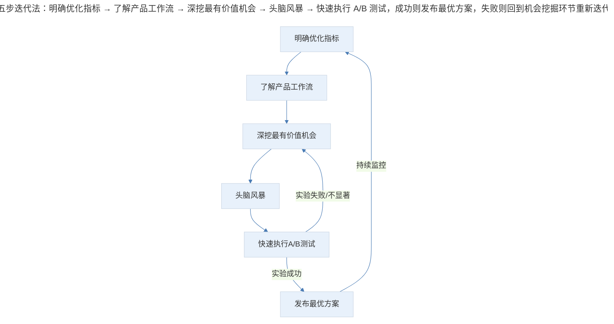
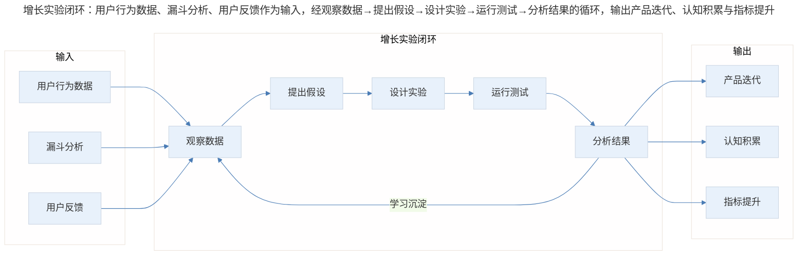
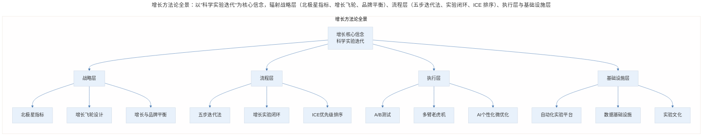
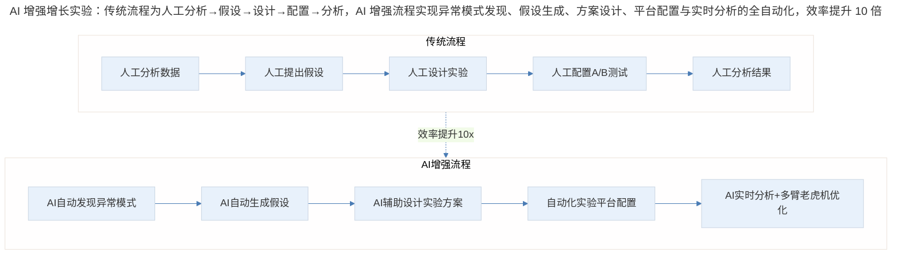

# 换个按钮颜色，就能增长百万用户

## 1. 导言

硅谷最神奇的产品经理是什么样子的？他们喜欢摆弄数据、喜欢把玩产品，然后随手指了一下，说："咱们需要优化这个地方的体验"。团队成员按照他的想法实施后，没几个星期，数据就直线上升了。

这样的产品经理每天都会思考已有的产品工作流和用户体验，考虑优化哪一步的工作流可以促进更多用户向好友分享产品，从而实现产品的病毒式传播；思考优化哪一步的用户体验可以让用户使用得更顺畅。这样的产品经理，又叫**增长黑客（Growth Hacker）**。

他们就好比奥运会上的金牌游泳教练，知道如何优化一个动作，就可以让金牌选手打破世界纪录。他们的工作看起来可能就是改改按钮的颜色、给用户发一个提醒消息、增大一个字体、改改对话框之类的琐事，但实际上这些微小的改动却有非常大的效果。

顾客就是上帝，但这种上帝是非常非常懒的。他们不愿意多做一件事情，不愿意多看一句话，不愿意多按一个按钮，所以做增长的产品经理需要思考：**如何让产品的体验简单简单再简单**。

## 2. 经典案例：微优化带来的巨大增长

### 2.1 世界上最值钱的按钮

世界上最值钱的按钮肯定是 Amazon 的"一键购买"（Buy now with 1-Click）按钮。只要你以前在 Amazon 下过单，它就会自动记下你的名字、邮寄地址和信用卡号，当你下次购买的时候，可以直接选择"一键购买"，就可以完成下单了。

这个发明，至少帮 Amazon 赚了 10 亿美元。想想有多少冲动消费的"单身党"，因为"手贱"点了一下，立马就完成了几百元的订单。而如果让用户先加入购物车，再下单、再填写或者确认邮寄地址和信用卡号，至少要多五步操作，而这时，Amazon 的用户都已经下完五单了。

### 2.2 一个锁图标 = 10% 点击增长

另外一个例子是美国的个人财政公司 NerdWallet 的信用卡推荐页面，它的盈利方式是靠向用户推荐信用卡来赚取佣金。本来"现在申请"（Apply Now）这个按钮并没有"锁"的图标，加上这个锁的图标后，点击量一下就增加了 10%。

为什么？它抓住的是用户希望有一个安全保密的信用卡申请体验，他们用一个锁的小图标"聪明"地满足了用户需求，申请人数自然就迅速地往上涨了。

## 3. 五步迭代法：科学实验的过程

上面的这两个例子看上去像是魔法，但实际上都是经过科学实验一步一步迭代过来的。想拥有这种化腐朽为神奇的能力，靠的绝不是凭主观臆断，而是科学实验的过程。

> 五步迭代法：明确优化指标 → 了解产品工作流 → 深挖最有价值机会 → 头脑风暴 → 快速执行 A/B 测试，成功则发布最优方案，失败则回到机会挖掘环节重新迭代。

### 3.1 第一步：明确优化指标

以 NerdWallet 的信用卡推荐页面为例，它要增加的指标就是通过网站提供的链接申请信用卡的次数。

指标选择是整个增长的起点，选错指标，后面所有努力都是南辕北辙。好的指标应该具备三个特征：**可量化、可归因、可行动**。

### 3.2 第二步：了解已有的产品工作流

首先，你要思考现在整个网站有多少种方式能够把用户引流到申请信用卡的页面。比如，有三个：一个是信用卡推荐页，一个是刚登录网站时的右侧广告，一个是在博客文章中嵌入的链接。

然后，了解通过哪一步申请信用卡的人数最多。你可能会发现，虽然信用卡推荐页占的篇幅很大、很显眼，但是还不如博客文章嵌入的链接点击量高，这让你感到很奇怪。

另外，还应该进一步细分，对比不同用户群在每一步的使用情况。比如，你可能会发现，用户终于点击了链接、填入了个人信息，在点击"申请"按钮时，女性用户的点击量远远低于男性，年长用户远远低于年轻用户。

这个过程，你不需要急着马上找出原因，而是要全面了解整个产品的体验信息，思考用户能够进行目标动作的所有途径。

### 3.3 第三步：深挖找出最有价值的机会

经历了对目标指标和已有产品工作流的思考，你已经发现了几个奇怪的点，下面就要开始权衡取舍，从而筛选出你认为最有价值的机会，提出合理的假设了。

比如，通过上面的发现，你的假设是信用卡申请安全性和保密性是关键，所以把信用卡申请链接放在一个随随便便的推荐页里的时候，用户可能会怀疑这个链接的安全性和可靠性。而在博客文章中嵌入链接的话，博客的作者已经取得了读者的信任，所以他们更有可能点击作者提供的链接。

在信用卡的推荐页面，女性用户点击"现在申请"的数量远远低于男性，年长用户远远低于年轻用户，你分析原因可能是女性对财政相关的问题更加谨慎，而年长用户更怕受骗，所以对于这两类用户来说，设计时的重点是获得他们的信任，给他们一种踏实的感觉。

与此同时，信用卡推荐页的浏览人数远远高于其他两个部分，所以你认为应该把重心放在怎样能把信用卡推荐页设计得更能取得用户信任上，这才是现在最应该抓住的机会。

### 3.4 第四步：头脑风暴

现在已经得出了信用卡申请的安全性和保密性是关键的假设，那怎么才能获得用户更多的信任呢？

你可以加一行字告诉用户，所有的信用卡推荐页都是官方的信用卡申请页面；或者，你可以在信用卡申请这个按钮上增加一些表示安全的图标；又或者，你可以在信用卡申请这个按钮旁边写上多少人已经通过这个链接完成了申请，从而增加用户的信任。

### 3.5 第五步：快速执行 A/B 测试

最后一步就是，你要激励团队快速动手，把第四步的三个想法尽可能快地设计开发出来，并发布给少量的用户进行 A/B 测试。对比这几组实验组和对照组的数据，如果实验组比对照组的数据更好，那起码说明你的假设是正确的。如果实验组 1 比实验组 2 强，那么就发布实验组 1。

事实上，亚马逊的"一键购买"按钮和 NerdWallet 的信用卡推荐页面，这么天才的想法，其实经过了非常多的测试，经历了无数次的失败后才有了现在的成功。

## 4. 增长实验闭环与三层视角

### 4.1 增长实验闭环

增长不是一次性的行为，而是一个持续循环的过程。每一次实验的结果——无论成功还是失败——都为下一轮假设提供输入，形成闭环。

> 增长实验闭环：用户行为数据、漏斗分析、用户反馈作为输入，经观察数据→提出假设→设计实验→运行测试→分析结果的循环，输出产品迭代、认知积累与指标提升。

### 4.2 三层深度视角

**🟢 进阶视角（1-3 年经验）——核心关注：学会用数据驱动决策，而非直觉驱动**

刚入行的产品经理最容易犯的错误就是"我觉得用户需要这个"。增长思维的第一课是：**用数据说话**。

- **从漏斗分析开始**：画出用户从进入到完成目标动作的每一步，计算每一步的转化率，找到流失最严重的环节
- **学会提假设**：每一个改动都应该有明确的假设——"我认为做 X 改动，会因为 Y 原因，导致 Z 指标提升"
- **A/B 测试基本功**：确保样本量足够、实验周期合理、只改变一个变量
- **小步快跑**：不要追求一次改到位，先验证方向对不对，再逐步优化

**🔵 资深视角（3-5 年经验）——核心关注：建立系统化的增长实验体系，从单点优化到全局增长**

资深产品经理不再满足于"改个按钮颜色"这种单点优化，而是要建立一套可持续运转的增长引擎。

- **指标体系设计**：北极星指标→辅助指标→护栏指标，确保增长不偏航。比如电商的北极星是 GMV，但护栏指标要包含退货率和客诉率
- **实验优先级框架**：用 ICE 评分（Impact × Confidence × Ease）给所有实验想法排序，把有限的工程资源投入到最有价值的实验上
- **跨功能协作**：增长实验需要产品、设计、工程、数据科学紧密配合，资深 PM 要能搭建这个协作机制
- **实验文化建设**：让团队接受"大部分实验会失败"这个事实，建立安全失败的实验文化

**🟣 专家视角（5 年+经验）——核心关注：增长的战略设计、组织能力建设与前沿方法探索**

专家级产品经理思考的不是"怎么改按钮"，而是"增长飞轮怎么设计"和"组织怎么支撑持续增长"。

- **增长飞轮设计**：像 Amazon 那样设计自增强的增长飞轮——更多选择→更多顾客→更多卖家→更多选择，形成正反馈循环
- **实验规模化管理**：大型产品同时运行数百个实验，需要解决实验之间的干扰（交叉污染）、长期效应评估、多指标权衡等复杂问题
- **增长与品牌的平衡**：短期增长手段（如弹窗、推送）可能损害品牌长期价值，专家需要找到增长与体验的平衡点
- **组织设计**：建立增长团队还是嵌入式增长？集中式实验平台还是分散式？这些组织决策直接影响增长效率

## 5. 实践指南：增长方法论全景

> 增长方法论全景：以"科学实验迭代"为核心信念，辐射战略层（北极星指标、增长飞轮、品牌平衡）、流程层（五步迭代法、实验闭环、ICE 排序）、执行层（A/B 测试、多臂老虎机、AI 微优化）与基础设施层（实验平台、数据设施、实验文化）。

### 5.1 AI 辅助增长实验

2024 年以来，AI 正在深刻改变增长实验的方式。过去需要数周完成的假设生成、实验设计、结果分析，现在可以在数小时内完成。

> AI 增强增长实验：传统流程为人工分析→假设→设计→配置→分析，AI 增强流程实现异常模式发现、假设生成、方案设计、平台配置与实时分析的全自动化，效率提升 10 倍。

**自动生成假设**：AI 可以分析海量用户行为数据，自动发现异常模式和潜在优化点。比如，AI 发现某类用户在特定步骤的流失率异常升高，自动生成"该步骤的信任感不足可能导致流失"的假设，并给出置信度评分。

**自动设计实验**：给定假设后，AI 可以自动生成多个实验方案，包括 UI 变体设计建议、文案变体、布局调整等。2025 年，多家增长工具平台已支持 AI 一键生成实验变体，大幅缩短从假设到实验上线的周期。

**多臂老虎机优化**：传统 A/B 测试需要等待实验结束才能判断胜负，而多臂老虎机（Multi-Armed Bandit）算法可以在实验运行过程中动态调整流量分配，将更多流量导向表现更好的变体，减少实验期间的"遗憾损失"。AI 让这种动态优化变得更加智能和高效。

### 5.2 AI 个性化微优化

AI 时代的增长不再只是"找一个最优方案给所有人"，而是**为每个用户找到最优方案**。

- **动态个性化**：AI 可以根据用户的实时行为、历史偏好、设备类型等维度，动态决定展示哪个版本的页面。同一个按钮，对新用户显示"免费试用"，对老用户显示"立即升级"，对价格敏感用户显示"限时优惠"
- **实时微优化**：AI 可以持续监控数百个微小的体验变量（按钮位置、字体大小、颜色、间距等），自动发现最优组合，实现"永远在优化"的状态
- **预测性增长**：AI 可以预测哪些用户即将流失、哪些用户有高转化潜力，提前触发个性化的干预策略

> 注意：AI 驱动的个性化优化需要特别注意"过滤气泡"和"算法偏见"问题，确保不同用户群体都能获得公平的体验。

## 6. 进阶延展：最新实践与核心要点回顾

### 6.1 最新实践（2024-2026）

**AI 驱动增长实验**：2024 年以来，领先的增长团队已经开始将 AI 深度集成到实验流程中：

- **假设引擎**：基于大语言模型，自动分析用户反馈、客服记录、行为数据，生成结构化的增长假设，并按预期影响排序
- **智能实验设计**：AI 自动计算所需样本量和实验周期，推荐最优的流量分配策略，避免欠功率或过功率的实验
- **自动化结果解读**：实验结束后，AI 自动生成包含统计显著性、效应量、细分分析的结果报告，并给出"发布/继续/放弃"的决策建议

**自动化实验平台**：现代实验平台已经从简单的 A/B 测试工具进化为完整的增长操作系统：

| 能力维度 | 传统 A/B 测试 | 自动化实验平台 |
|---------|-----------|-------------|
| 实验配置 | 手动编码部署 | 可视化编辑器+API |
| 流量分配 | 固定比例 | 动态多臂老虎机 |
| 实验数量 | 每月几个 | 同时数百个 |
| 结果分析 | 手动跑 SQL | 自动统计+AI 解读 |
| 个性化 | 统一方案 | 千人千面 |
| 实验速度 | 周级别 | 小时级别 |

**微优化的工程化**：微优化不再是"灵光一现"的偶然，而是可工程化、可规模化的系统：

- **实验队列管理**：所有优化想法进入统一的实验队列，按 ICE 评分排序，自动调度执行
- **实验互斥检测**：自动检测同时运行的实验之间是否存在流量交叉污染，确保实验结果的可靠性
- **长期效应追踪**：不只看短期指标提升，还追踪实验上线后 1 周、1 月、3 月的长期效应，避免"短期涨、长期跌"的陷阱
- **知识沉淀**：每个实验的假设、结果、学习都沉淀到团队的知识库中，避免重复实验，加速认知积累

### 6.2 核心要点回顾

类似亚马逊"一键下单"按钮的天才想法，并不是产品经理偶然凭主观臆断想出来的，而是通过不断的思考、科学的迭代，才能找到这种机会，实现化腐朽为神奇。

科学的测试迭代流程：第一步，明确优化指标；第二步，了解产品工作流；第三步，深挖最有价值机会；第四步，头脑风暴；第五步，快速执行 A/B 测试。

在进行科学的测试迭代时，有两点需要特别注意：第一，你一定要系统地过一遍整个产品的工作流，弄清楚用户可能会在哪一步流失，什么用户在这一步更容易流失，而不是一上来就提出假设；第二，迭代的过程重在试错，所以可以多做几次实验，每次试验设置多个对照组，从而找到最正确的方式，而不是指望一次就可以成功。

---

## 参考资料

- Sean Ellis & Morgan Brown. *Hacking Growth*. 增长黑客方法论的开山之作
- Stefan H. Thomke. *Experimentation Works*. 深入探讨实验文化如何驱动创新
- Kohavi, Tang & Xu. *Trustworthy Online Controlled Experiments*. A/B 测试的权威指南
- "The Amazon Flywheel" — Amazon 增长飞轮的经典案例
- Google Ventures "Design Sprint" — 将五天设计冲刺与增长实验结合