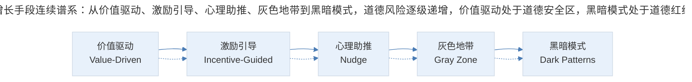
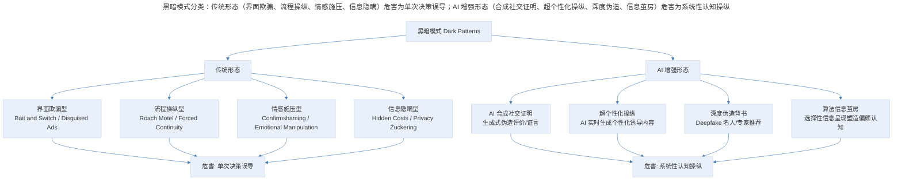
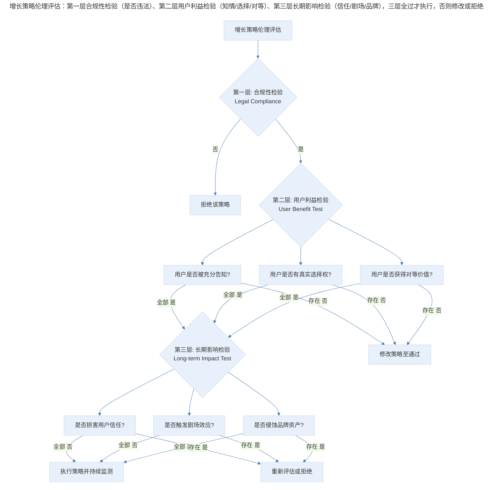
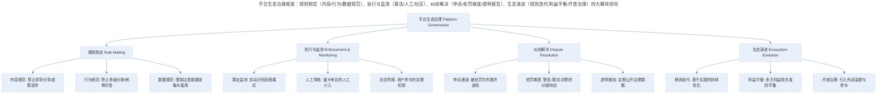

# 增长策略的伦理边界与生态治理

## 1. 导言

增长黑客（Growth Hacking）的本质是对产品自然增长规律的突破性干预，当这种干预失去约束时，将导致用户利益受损、生态退化与系统性崩溃。本文系统构建增长策略的伦理分析框架，涵盖黑暗模式（Dark Patterns）的分类体系、剧场效应（Theater Effect）在竞争动态中的博弈论分析、平台治理（Platform Governance）的框架设计，以及增长伦理决策模型。结合 2024–2026 年全球监管环境演进（EU Digital Services Act、中国《反不正当竞争法》修订）、AI 伦理在增长领域的挑战与可持续增长模型（Sustainable Growth Model），提出面向产品管理者的伦理决策与生态治理实践框架。

## 2. 伦理基础：增长黑客的本质与黑暗模式

### 2.1 增长黑客的伦理张力

**增长黑客（Growth Hacking）** 最初由 Sean Ellis 于 2010 年提出，指通过创造性、低成本的手段实现产品快速增长的方法论。然而，"黑客"一词隐含的精神内核——不拘泥于规则、突破客观束缚——与增长的结合产生了本质的伦理张力：

| 维度 | 自然增长（Natural Growth） | 增长黑客（Growth Hacking） |
|------|--------------------------|---------------------------|
| 驱动力 | 产品核心价值驱动 | 手段与机制驱动 |
| 规律性 | 遵循用户决策的自然节奏 | 突破用户决策的自然节奏 |
| 可持续性 | 价值支撑下的长期增长 | 手段有效期的脉冲式增长 |
| 用户关系 | 用户作为价值受益者 | 用户可能成为增长工具 |
| 典型模式 | 口碑推荐、有机传播 | 诱导分享、强制裂变、信息操纵 |

增长黑客的核心矛盾在于：**当利用人性弱点的手段能够快速见效时，就会产生系统性滥用的倾向**（Brignull, 2023）。这种倾向在竞争压力下被进一步放大——一旦某种增长策略被证明有效，竞争对手要么跟进效仿，要么承受流量流失，从而形成囚徒困境。

### 2.2 增长手段的连续谱系

增长手段并非简单的"善"与"恶"二分，而是存在一个从价值驱动到操纵驱动的连续谱系：

> 增长手段连续谱系：从价值驱动、激励引导、心理助推、灰色地带到黑暗模式，道德风险逐级递增，价值驱动处于道德安全区，黑暗模式处于道德红线。

**价值驱动型增长**：以产品核心价值为基础，通过优化发现与体验流程，使更多用户触达价值。如优化搜索引擎可发现性、改善 Onboarding 流程。

**激励引导型增长**：在产品价值基础上叠加合理激励，加速用户决策。如新用户优惠、推荐奖励。关键判断标准：激励是否与产品价值正相关。

**心理助推型增长**：利用行为经济学原理（稀缺性、社会证明、锚定效应）影响用户决策。如限时优惠、用户数量展示。需评估助推是否损害用户自主决策权。

**灰色地带**：手段在法律与道德边界游走，用户利益与产品利益存在明显冲突。如"9.9 元衣柜"限量 2 件的引流策略——技术层面未构成欺诈，但实质上制造了不合理的预期。

**黑暗模式**：系统性利用认知偏差与心理弱点，使用户做出违背自身利益的决策。如强制捆绑、虚假倒计时、隐蔽订阅。

### 2.3 黑暗模式的分类体系

**黑暗模式（Dark Patterns）** 由 Harry Brignull 于 2010 年首次定义，指用户界面中经过精心设计、系统性地诱导用户做出非预期决策的设计手法。基于 Brignull 的分类体系与 2024–2026 年的新形态，构建以下分类：

| 类别 | 英文 | 定义 | 典型手法 | 增长领域的表现 |
|------|------|------|----------|---------------|
| 诱饵替换 | Bait and Switch | 用户预期某操作产生结果 A，实际产生结果 B | "关闭"按钮实际触发订阅 | 诱导分享伪装为功能操作 |
| 隐蔽成本 | Hidden Costs | 流程末端才揭示额外费用 | 结账时加收服务费 | 传播链路中隐藏的隐私让渡 |
| 强制续订 | Roach Motel | 容易进入但难以退出 | 极简注册 vs 极繁注销 | 传播授权后无法撤回 |
| 确认羞辱 | Confirmshaming | 用羞耻性语言迫使用户顺从 | "不，我不想变得更好" | "你的朋友都在用，你确定不要？" |
| 伪装广告 | Disguised Ads | 将广告伪装为内容或导航 | 伪装为下载按钮的广告 | 伪装为消息通知的推广弹窗 |
| 隐私劫持 | Privacy Zuckering | 诱导用户分享超出预期的个人信息 | 默认全选隐私授权 | 传播时过度获取社交关系链 |
| 强制捆绑 | Forced Continuity | 免费试用后自动扣费且无提醒 | 需信用卡的免费试用 | 传播功能与核心功能捆绑 |
| 情感操纵 | Emotional Manipulation | 利用恐惧、焦虑、内疚驱动行为 | "你的账户不安全" | "你已落后 99% 的朋友" |
| AI 生成欺骗 | AI-Generated Deception | 利用 AI 生成虚假社交证明 | AI 生成虚假评论/用户 | AI 伪造推荐信、合成用户证言 |

### 2.4 AI 时代的新黑暗模式

2024–2026 年，AI 技术的普及催生了新一代黑暗模式，其危害性远超传统形态：

> 黑暗模式分类：传统形态（界面欺骗、流程操纵、情感施压、信息隐瞒）危害为单次决策误导；AI 增强形态（合成社交证明、超个性化操纵、深度伪造、信息茧房）危害为系统性认知操纵。

1. **AI 合成社交证明**：利用生成式 AI 批量生产虚假用户评价、推荐视频与使用证言，以假乱真。FTC 2024 年已对多家企业发出警告（FTC, 2024）；
2. **超个性化操纵**：AI 基于用户画像实时生成最具说服力的个性化文案与界面，针对个体心理弱点精准打击；
3. **深度伪造背书**：利用 Deepfake 技术伪造名人或专家的产品推荐；
4. **算法信息茧房**：推荐算法选择性呈现信息，使用户在不知情的情况下形成偏颇认知，从而做出特定决策。

## 3. 竞争动态：剧场效应与博弈分析

### 3.1 剧场效应的机制

**剧场效应（Theater Effect）** 借用电影院场景的隐喻：当前排观众站起来时，后排观众为保持视野也被迫站立，最终全场观众均站立观影——原本所有人可以坐着享受的体验，因少数人的违规行为而集体恶化。

拼多多创始人黄峥在其笔记中引用了这一概念，用以描述竞争环境中的底线下沉现象（黄峥, 2018）。剧场效应的本质是一个**多轮囚徒困境（Iterated Prisoner's Dilemma）**：

| 参与者策略 | 对手保持克制 | 对手突破底线 |
|-----------|-------------|-------------|
| 自身保持克制 | 双方良性竞争，用户受益 | 对手获得短期增长优势，自身流量流失 |
| 自身突破底线 | 自身获得短期增长优势，对手流量流失 | 双方底线持续下沉，用户与生态共同受损 |

当缺乏外部约束时，"突破底线"成为占优策略（Dominant Strategy），纳什均衡（Nash Equilibrium）指向双方均突破底线——即"剧场效应"的集体站立状态。

### 3.2 剧场效应在增长领域的表现

| 行业 | 剧场效应表现 | 底线下沉过程 | 后果 |
|------|-------------|-------------|------|
| 社交产品 | "来往"式爆发增长 | 病毒传播 → 内容灌水 → 价值稀释 → 用户逃离 | 产品迅速衰落沉寂 |
| 电商行业 | 低价引流与虚假促销 | 限量噱头 → 刷单造假 → 价格战 → 品质劣化 | 信任崩塌，平台退化 |
| 内容平台 | 标题党与低质内容 | 吸引眼球 → 内容降级 → 劣币驱逐良币 | 优质创作者流失 |
| 社交电商 | 无底线分享诱导 | 适度分享 → 强制分享 → 信息轰炸 → 社交关系受损 | 微信封禁，获客渠道断崖 |
| 短视频 | 成瘾机制设计 | 适度推荐 → 极致优化停留时长 → 信息茧房 | 监管介入，年龄限制 |

### 3.3 熵增与反熵增

剧场效应的终点是系统的熵增——孤立系统趋向无序，最终失去活力归于死亡。热力学第二定律的这一洞见同样适用于产品生态：无约束的增长手段持续输入，将使产品生态从有序走向无序。

**反熵增的路径**是向系统输入负熵——即外部力量对无序趋势施加反作用力。在产品增长中，反熵增的机制包括：

1. **平台治理**：平台方制定规则并强制执行，如微信查禁多级分销、截断诱导分享、限制高危源；
2. **法律监管**：政府立法禁止特定增长手段，如 EU DSA 对黑暗模式的禁止、中国《反不正当竞争法》对虚假交易的规制；
3. **行业自律**：行业协会制定标准与最佳实践，如 IAB 的数字广告伦理准则；
4. **用户觉醒**：用户识别并抵制操纵性手段，通过口碑与选择对产品形成市场约束。

微信与"来往"的对比是反熵增的经典案例。微信通过相对强硬的内容管制措施——尽管执行中存在不完善——有效维护了生态的稳定性，减缓了产品向无序发展的速度。而"来往"缺乏治理，短期爆量后迅速衰落。

## 4. 伦理决策：增长伦理决策框架

### 4.1 伦理决策模型

产品经理在面对增长策略的伦理选择时，需要系统化的决策框架而非模糊的道德直觉。以下构建三层递进的伦理决策模型：

> 增长策略伦理评估：第一层合规性检验（是否违法）、第二层用户利益检验（知情/选择/对等）、第三层长期影响检验（信任/剧场/品牌），三层全过才执行，否则修改或拒绝。

**第一层：合规性检验（Legal Compliance）**

策略是否违反现行法律法规？这是最低门槛，包括但不限于：

- 是否违反消费者保护法中的知情权与选择权？
- 是否违反个人信息保护法中的同意与最小必要原则？
- 是否构成虚假宣传或不正当竞争？

**第二层：用户利益检验（User Benefit Test）**

- **知情原则**：用户是否充分了解策略的真实目的与后果？如"9.9 元衣柜"虽未构成法律欺诈，但用户未被告知限量 2 件的关键信息；
- **选择原则**：用户是否有真实的替代选择？如"分享后才能使用"的设计实质上剥夺了选择权；
- **对等原则**：用户获取的价值是否与付出的代价对等？如过度获取社交关系链以换取微小功能便利。

**第三层：长期影响检验（Long-term Impact Test）**

- **信任检验**：如果该策略被媒体曝光，是否会损害用户信任？此即"媒体审视测试"（Press Test）；
- **剧场检验**：如果所有竞争对手都采用相同策略，行业生态是否恶化？此即"普遍化测试"（Universalization Test）；
- **品牌检验**：该策略是否与品牌长期定位一致？短期增长是否以品牌资产稀释为代价？

### 4.2 实用伦理检验工具

除上述系统化框架外，以下实践工具可辅助日常伦理决策：

| 检验工具 | 方法 | 应用示例 |
|----------|------|----------|
| 家人测试（Family Test） | 设想家人看到该策略后的反应 | 利用色情/暴力素材引流——家人会感到羞愧 → 拒绝 |
| 媒体审视测试（Press Test） | 设想该策略被苛刻媒体报道后的评价 | "9.9 元限量 2 件"——媒体会形容为欺骗 → 修改 |
| 角色互换测试（Role Reversal Test） | 设想自身作为用户接受该策略的感受 | 强制分享才能使用——作为用户会反感 → 重新设计 |
| 时间尺度测试（Time Test） | 6 个月后该策略对产品的影响 | 诱导分享获客——6 个月后用户信任流失 → 拒绝 |
| 竞争普遍化测试（Universalization Test） | 所有竞品都使用该策略的后果 | 全行业诱导分享——信息轰炸 → 社交渠道封禁 → 拒绝 |

## 5. 生态治理：平台治理框架与监管环境

### 5.1 平台生态治理模型

> 平台生态治理框架：规则制定（内容/行为/数据规范）、执行与监测（算法/人工/社区）、纠纷解决（申诉/处罚梯度/透明报告）、生态演进（规则迭代/利益平衡/开放治理）四大模块协同。

平台治理的核心挑战在于平衡多方利益：平台自身增长诉求、生态参与者的商业利益、用户的内容体验与社交质量、社会公共利益。微信的治理实践提供了有价值的参考：

| 治理维度 | 微信治理措施 | 效果与局限 |
|----------|-------------|-----------|
| 诱导分享 | 检测并限制诱导分享链接 | 有效遏制信息轰炸，但判定标准偶有争议 |
| 多级分销 | 查禁多级分销体系 | 维护生态健康，但执行存在滞后 |
| 高危源限制 | 限制高频违规账号/主体的传播能力 | 降低了劣质内容传播，但可能误伤正常用户 |
| 内容审核 | 机器审核 + 人工审核 | 规模化审核效率高，但标准一致性待提升 |

平台治理面临的核心经济学困境是**外部性内部化**。增长黑客的负面效应（信息污染、信任侵蚀、生态退化）主要由用户与生态承担，而收益由实施者独享——这是典型的负外部性（Negative Externality）。

治理的本质是将外部性内部化，使实施者承担其行为的全部社会成本。具体机制包括：

1. **惩罚机制**：对违规行为施加成本（封禁、限流、罚款），使违规的预期成本超过预期收益；
2. **信用机制**：建立生态参与者的信用体系，信用分影响流量分配与功能权限；
3. **激励相容**：设计使遵守规则比违反规则更有利可图的机制，如对优质内容的流量倾斜。

### 5.2 全球监管环境演进（2024–2026）

2024–2026 年，全球范围内针对增长策略中不当行为的立法与执法显著加强：

| 监管框架 | 管辖区域 | 核心条款 | 对增长策略的影响 |
|----------|----------|----------|-----------------|
| EU Digital Services Act (DSA) | 欧盟 | 禁止黑暗模式；要求平台透明度；限制定向广告 | 禁止确认羞辱、隐蔽成本等黑暗模式；要求算法推荐可解释 |
| EU AI Act | 欧盟 | 禁止 AI 操纵人类行为；高风险 AI 系统需合规评估 | 禁止 AI 超个性化操纵；AI 生成内容需标注 |
| 中国《反不正当竞争法》修订 | 中国 | 禁止虚假交易、刷单炒信；禁止误导性营销 | 刷单、虚假评价面临行政处罚；"9.9 元限量"类营销需明确标注 |
| 中国《个人信息保护法》 | 中国 | 最小必要原则；单独同意；撤回权 | 传播功能获取社交关系链需单独同意；用户可撤回授权 |
| FTC Endorsement Guides 更新 | 美国 | AI 生成评价需披露；名人背书需真实使用 | AI 合成社交证明需明确标注；虚假证言面临处罚 |
| California CCPA/CPRA | 美国加州 | 消费者知情权、删除权、拒绝出售权 | 用户数据驱动的增长策略需提供退出机制 |

## 6. 进阶延展：AI 伦理、可持续增长与核心要点回顾

### 6.1 AI 伦理在增长领域的挑战

AI 在增长领域的应用带来了独特的伦理挑战：

| 挑战领域 | 具体问题 | 伦理原则 | 实践建议 |
|----------|----------|----------|----------|
| AI 生成内容 | 伪造用户评价、推荐视频 | 真实性原则 | AI 生成内容必须标注；禁止伪造社交证明 |
| 超个性化 | 针对个体心理弱点精准诱导 | 自主性原则 | 个性化不得针对已知心理弱点；提供标准化体验选项 |
| 算法偏见 | 推荐算法系统性偏袒特定群体 | 公平性原则 | 定期审计算法偏见；确保推荐多样性 |
| 透明度 | 算法推荐逻辑不可解释 | 可解释性原则 | 提供推荐理由说明；允许用户调节推荐参数 |
| 成瘾设计 | AI 极致优化用户停留时长 | 福祉原则 | 设置使用时长提醒；提供非成瘾模式 |

面向增长领域的 AI 治理框架正在形成共识：

1. **AI 影响评估（AI Impact Assessment）**：在部署 AI 驱动的增长策略前，评估其对用户自主性、福祉与公平性的潜在影响；
2. **人机协同决策（Human-in-the-Loop）**：高风险增长策略（如大范围 A/B 测试涉及心理操纵元素）需人工审批；
3. **可审计性（Auditability）**：AI 增长策略的决策逻辑与结果需可追溯、可审计；
4. **退出权（Right to Opt-Out）**：用户有权选择不参与 AI 驱动的个性化增长体验。

### 6.2 可持续增长模型

剧场效应与黑暗模式的根本问题在于：它们将增长视为零和博弈——产品增长以用户利益受损为代价。**可持续增长模型（Sustainable Growth Model）** 的核心主张是：增长应与用户利益正相关，而非负相关。

| 维度 | 增长黑客模式 | 可持续增长模式 |
|------|-------------|---------------|
| 时间视野 | 短期（周/月） | 长期（季度/年） |
| 增长来源 | 手段驱动 | 价值驱动 |
| 用户关系 | 用户作为增长工具 | 用户作为价值共创者 |
| 竞争逻辑 | 零和博弈 | 正和博弈 |
| 生态影响 | 熵增（无序化） | 反熵增（有序化） |
| 核心指标 | 日活、裂变系数 | 用户生命周期价值（LTV）、NPS |
| 典型路径 | 诱导分享 → 爆量 → 流失 → 衰退 | 价值积累 → 口碑传播 → 有机增长 |

实现可持续增长需在以下四个层面建立系统性能力：

1. **价值层**：持续强化产品核心价值，确保增长建立在真实需求满足的基础上。增长的优先级应为：留存 > 激活 > 传播 > 获客；
2. **信任层**：将用户信任视为核心资产，所有增长策略需通过伦理决策框架的检验。信任是增长最持久的复利——高信任度产品的获客成本随时间递减，而低信任度产品的获客成本随时间递增；
3. **治理层**：建立内部增长伦理审查机制，定期审视增长策略的伦理合规性。设立"增长伦理官"或引入外部伦理顾问；
4. **生态层**：在竞争中选择建设性行为，拒绝参与底线竞争。通过行业协作与标准制定，共同提升行业伦理水位。

### 6.3 核心要点回顾

随着用户群体财富与品味的持续提升，用户将越来越倾向于选择真正优质的产品与服务，识别增长策略设计背后的善意，并支持值得信赖的品牌。短期增长的诱惑永远存在，但长期竞争的终局是信任与价值的竞争。产品管理者应通过三层伦理决策模型（合规性、用户利益、长期影响）系统评估增长策略，以平台治理与反熵增机制维护生态健康，最终走向可持续增长——让增长与用户利益正相关，而非负相关。

---

## 参考资料

- Brignull, H. (2023). *Deceptive design patterns: Crafting interfaces that trick people*. A Book Apart.
- European Commission. (2024). *Digital Services Act: Application guidelines for dark patterns*. Official Journal of the European Union.
- Federal Trade Commission. (2024). *FTC guides concerning endorsements and testimonials: Updated guidance on AI-generated reviews*. Federal Register.
- Gillespie, T. (2018). *Custodians of the Internet: Platforms, content moderation, and the hidden decisions that shape social media*. Yale University Press.
- Nissenbaum, H. (2010). *Privacy in context: Technology, policy, and the integrity of social life*. Stanford University Press.
- Plantin, J. C., Lagoze, C., Edwards, P. N., & Sandvig, C. (2018). Infrastructure studies meet platform studies in the age of Google and Facebook. *New Media & Society*, 20(1), 293–310.
- Sunstein, C. R. (2014). *Why nudge? The politics of libertarian paternalism*. Yale University Press.
- Thaler, R. H., & Sunstein, C. R. (2021). *Nudge: The final edition*. Penguin Books.
- 中国全国人大常委会. (2024). 《中华人民共和国反不正当竞争法》（修订版）. 中国法律出版社.
- 中国全国人大常委会. (2021). 《中华人民共和国个人信息保护法》. 中国法律出版社.
- Zuboff, S. (2019). *The age of surveillance capitalism: The fight for a human future at the new frontier of power*. PublicAffairs.