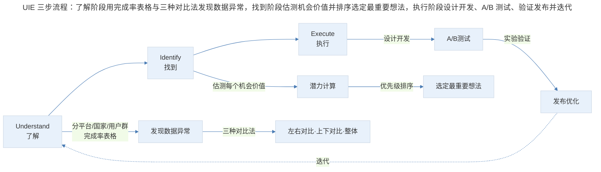
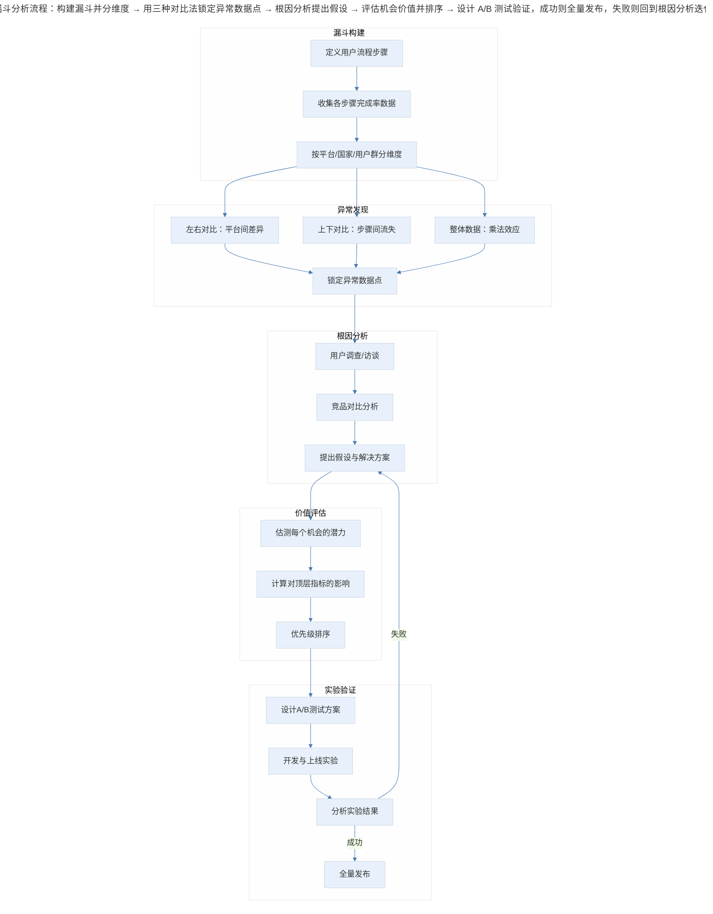
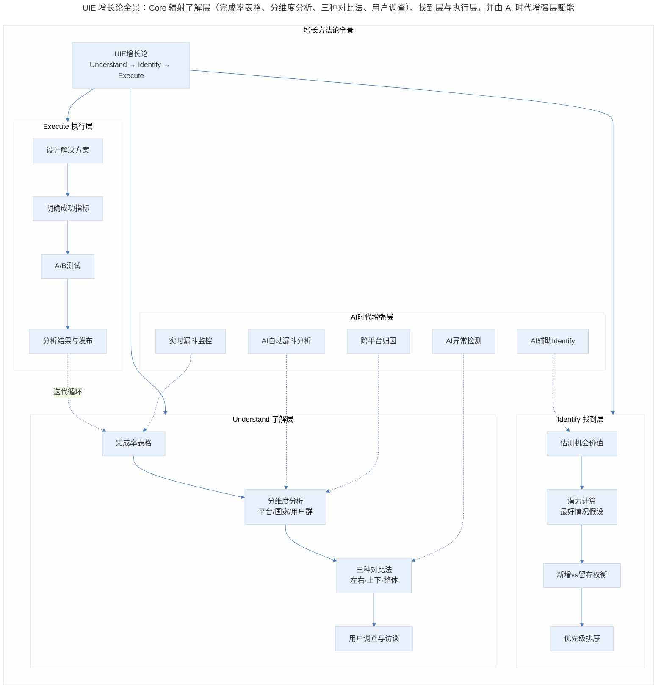

# 硅谷高管的 UIE（Understand, Identify, Execute）增长论

## 1. 导言

在刚进入 Facebook 做产品经理时，干劲儿很足，经常会跟导师（现在已经是 Facebook 的高管了）说："我想到一个方法，我觉得非常靠谱，肯定可以帮助咱们的产品实现增长，我们试试吧"。

这样说了几次后，导师说："我发现你经常会有一个新想法，然后找证据证明这个想法是对的。但是，你并没有全盘考虑所有可能的机会，而是直接跳到了这一个想法上。"

接着，他介绍了"了解，找到，执行"（Understand, Identify, Execute）这个增长理论：

- **了解**：就是要综合理解用户体验的每一步，然后深挖每一步中每一类用户群体的数据。
- **找到**：就是在了解之后，找到有意思的数据点，挖掘出具体的想法，并且选定最重要的想法。
- **执行**：就是设计开发，然后进行实验验证，如果实验结果靠谱就发布。

用导师的话说就是，我的问题是只做了"找到"和"执行"，但是没有"了解"。**如果没有充分了解产品每一步用户流的表现情况，就不能找到最具价值的想法。结果是，这样做可能会对产品指标有积极影响，但却忽略了更好的主意。**

这个增长理论点醒了我，使我受益匪浅，到现在我都以此为警钟。

## 2. UIE 三步流程与完成率表格

### 2.1 UIE 三步流程

> UIE 三步流程：了解阶段用完成率表格与三种对比法发现数据异常，找到阶段估测机会价值并排序选定最重要想法，执行阶段设计开发、A/B 测试、验证发布并迭代。

### 2.2 完成率表格

接下来通过一个具体的案例，讲解如何把"了解、找到、执行"这个增长理论应用到实际的产品增长中。

最好的"了解"方法是产品流程的每一步完成率的表格。下面的表格描述的是刚刚下载了 APP 的新用户如何开启使用 APP 的体验，包括注册账号、设定密码、关注朋友等——当用户完成了最后一步，他们就完成了新用户的设定，可以开始使用 APP 啦。

| 步骤 | iOS | Android | Web |
|------|-----|---------|-----|
| 下载后点击注册 | 80% | 75% | 60% |
| Facebook 登录 | 30% | 60% | 40% |
| 新建用户名 | 55% | 30% | 45% |
| 绑定手机 | 85% | 80% | 30% |
| 开启消息提醒 | 40% | 70% | — |
| 关注好友 | 75% | 72% | 65% |

如果用户没能坚持到最后一步，那么每一步都会降低用户的活跃度。比如，如果用户没有注册成功，后面的体验就无法开始；再比如，如果用户没有开启消息提醒功能，就没有通知用户新消息的途径；再比如，如果用户没有得到其他好友的关注，他就无法真正体会到这个 APP 的价值。

表中的每一列代表不同的平台（iOS、安卓和网页版的设计界面不同）；表中的每一行代表进行到这一步的用户中，百分之多少完成了相关操作。比如，80% 的 iOS 用户下载之后点击了"注册"按钮，在点击了"注册"之后，30% 的人使用 Facebook 登录，55% 新建用户名，剩下的 15% 流失了。假设在所有用户中，iOS 端用户占 50%，安卓端用户占 45%，网页端用户占 5%。

有了这个完成率的表格，接下来就可以分析表中的数据，利用"了解、找到、执行"理论实现产品增长了。

## 3. UIE 实战：漏斗分析流程

> 漏斗分析流程：构建漏斗并分维度 → 用三种对比法锁定异常数据点 → 根因分析提出假设 → 评估机会价值并排序 → 设计 A/B 测试验证，成功则全量发布，失败则回到根因分析迭代。

### 3.1 第一步：了解

**了解的意思是要把整体的产品流程按一定的逻辑结构划分，分别看各个步骤的数据，从而了解产品的哪个部分有进一步增长的机会。**

通过上面表格中的数据，发现了三点：

1. 用户在网页版"绑定手机"这一步流失极其严重；
2. 用户在 iOS 版开启提醒消息的比例非常低；
3. 用户在 iOS 版点击注册以后，使用 Facebook 登录的比例非常低。

接下来分析出现这三种现象的原因，并试着提出解决方案：

1. 通过用户调查，发现使用网页版的用户一般都是使用电脑或者 iPad 登录，这个时候手机不一定在身边，"绑定手机"这一步需要他们找到手机进行验证，比较麻烦。针对这一项，尝试增加"邮件验证"的功能，方便他们在同一台设备上完成验证。
2. 通过调查分析，发现 iOS 版用户开启消息提醒比例较低的原因是 iOS 系统在开启时会询问用户是否愿意开启，而大部分用户并不了解产品，产品也没有介绍功能，所以大多数选择不开启。针对这一项，要么在用户刚开始使用时就介绍产品功能，要么等到用户体会到 APP 的价值、建立信任后再询问。
3. 对于 iOS 用户使用 Facebook 登录比例较低，发现 iOS 使用 Facebook 登录时会跳转到 Safari 浏览器打开网页版 Facebook，很多用户还没登录网页版 Facebook 需要重新登录，而安卓用户可直接跳转到 Facebook 的 APP 无需重新登录。针对这个问题，要么修改 iOS 逻辑跳转到 Facebook 的 APP，要么在网页版增加根据 APP 自动同步用户名、密码的功能实现自动登录。

### 3.2 第二步：找到

首先要知道你们在乎的最高层指标是什么，找到最重要的问题，然后设定相关的产品功能，这就需要先估测每一个新功能可能带来的价值有多大。

1. 网页版用户在所有用户中的比例非常低，只有 5% 左右，大部分用户直接使用安卓或者 iOS 平台的 APP。所以，网页版的功能优化的价值一般。
2. 打开消息提醒和新增用户无关，更多的是留存。假设发现，开启消息提醒功能的用户比例提高 20%，可以让用户的 7 日留存率提升 5%。现在只有 50% 的用户开启了消息提醒，所以这一步的优化可以提升的极限是 50%。
3. "使用 Facebook 登录/新建用户"这一步，目的是让用户创建用户名。如果用户点击"使用 Facebook 登录"这个按钮可以直接创建新账户，那就比让用户想一个别人没有注册过的用户名体验好得多。现在 85% 的用户能够完成新增用户名这一步，所以需要让剩余的 15% 流失用户完成这一步，这是这一个功能的最大潜在价值。当然因为这个功能只有 iOS 才适用，而 iOS 端用户占用户总量的 50%，需要综合考虑这个数量的提升对总指标的贡献是多少。

完成分析后，需要找出哪个最重要。第一项没有那么重要，因为 5% 的比例实在太低了。接下来着重分析第二项和第三项，对比优化哪个功能的价值更高：一个是通过留存帮助增长，一个是通过新增帮助增长。

注意这里用的是"潜力"，因为没人能在这一步确定新的产品设计对总指标的影响到底是多少，这一部分需要在做好潜力计算之后再做出产品决定。比如，现在无法确定优化"使用 Facebook 登录/新建用户"这一步后完成率可以从 85% 提升到多少，那最好的情况就是假设可以让所有用户都不流失，来判断到底能够增加多少，这也就是"潜力"的一个估计方式。

### 3.3 第三步：执行

假设这个产品的薄弱环节是新增用户量，所以通过上面的判断，决定先优化"使用 Facebook 登录/新建用户"这一步，因为它可以直接提升产品的新增用户。

设计的解决方案是，在用户点击"使用 Facebook 登录"后，新增了一个功能：用户可以直接跳转到 Facebook 的 APP 中，而不用再去 Facebook 网页版重新登录 Facebook 账号。

这时，需要明确这个新功能的成功指标是什么——就是用户在这一步的完成率，以及新增用户数量。明确了这些问题后，就可以针对这个新功能，进行设计和开发了。

接下来，就可以按照增长黑客和优化产品团队工作流程的方式，来实现产品增长了。

## 4. 三种对比法与三层视角

### 4.1 三种对比法

通过了解到的数据进行"找到"的时候，要注意怎么看的问题：

**第一，左右对比，是要看不同平台的用户流失的情况。** 如果知道了 iOS 在某一步的流失率高于安卓，那就可以仔细研究两者之间在这一步体验有何不同，包括设计、产品运行速度、语言、产品流程的系统区别等等。

**第二，上下对比，看的是产品流中每一步的用户流失情况。** 如果某一步的流失率非常高，一方面考虑是不是可以想办法提升，比如上文说的增加提醒消息的开启率，一方面可以考虑这一步到底值不值得，或者是不是可以换顺序。比如，如果增加好友更重要，开启提醒消息流失得最多，那是不是可以让用户先加好友，再让他们开启消息提醒功能？或者去掉提醒消息这一步，对用户体验会有什么损害？

**第三，要看整体的数据。** 写了从这一步到下一步的完成率，但是整个产品体验的完成率是要把每一步的完成率做乘法，那么最终的完成率就会是一个非常小的数字，说明大部分用户都在一步一步中流失了。所以，是不是应该把某几个步骤整合成一个，或者直接让用户选择"默认"，然后把该做的都做好。整体看可以让你不拘泥于每一步的优化，而是整个产品体验的优化。

### 4.2 三层深度视角

**🟢 进阶视角（1-3 年产品经理）——核心任务：学会"看数据"，建立完成率表格的意识**

- 从"凭直觉想方案"转向"用数据说话"，这是 UIE 最基础也最重要的转变
- 练习画出你负责功能的完成率表格，至少分两个维度（如 iOS vs Android）
- 掌握三种对比法：左右对比找平台差异，上下对比找流失步骤，整体数据看乘法效应
- 在 Identify 阶段，学会用"最好情况假设"来估测潜力——假设流失用户全部转化，最大价值是多少
- 执行时务必明确成功指标，不要做完实验才发现不知道衡量什么

**常见误区**：跳过 Understand 直接 Identify——这正是导师批评我的核心问题。没有全面了解就锁定一个想法，可能错过价值更大的机会。

**🔵 资深视角（3-5 年产品经理）——核心任务：建立系统化的增长分析框架，提升 Identify 的准确性**

- Understand 不只是看表格，要主动设计分维度方案：国家、年龄、付费/免费、新老用户、渠道来源
- 在 Identify 阶段引入 ICE/RICE 评分框架，将影响力（Impact）、信心度（Confidence）、实现难度（Ease）量化
- 理解新增与留存的权衡不是简单的二选一，而是要计算对顶层指标（如 DAU）的边际贡献
- 执行时设计严谨的 A/B 测试：确定样本量、显著性水平、实验时长，避免假阳性
- 建立增长实验看板，追踪每个实验的假设、结果和学到的经验

**关键能力**：从"发现一个机会"到"系统性地扫描所有机会并排序"，这是资深 PM 与进阶 PM 的分水岭。

**🟣 专家视角（5 年+产品 leader）——核心任务：构建组织级的增长体系，推动 UIE 方法论在团队中落地**

- 设计增长团队的 UIE 工作流：Understand 阶段由数据分析师驱动，Identify 阶段由产品经理主导，Execute 阶段跨职能协作
- 建立漏斗监控的自动化体系：实时看板、异常告警、归因分析，让 Understand 从"项目制"变成"持续制"
- 在 Identify 阶段引入决策框架：不只是 ICE 评分，还要考虑战略对齐度、资源机会成本、技术债务
- 推动实验文化的建设：鼓励"快速失败"，建立实验结果的知识库，避免重复实验
- 关注跨产品线的增长协同：一个产品的增长实验可能影响另一个产品的指标，需要全局视角

**战略高度**：UIE 不只是方法论，更是一种思维模式——"先理解全貌，再精准出击"。在组织层面，这种思维模式需要通过流程、工具和文化三管齐下才能落地。

## 5. 实践指南：方法论全景

> UIE 增长论全景：Core 辐射了解层（完成率表格、分维度分析、三种对比法、用户调查）、找到层（估测价值、潜力计算、新增/留存权衡、排序）与执行层（设计、指标、A/B 测试、发布），并由 AI 时代增强层赋能。

### 5.1 了解的可能性要更全面

尽可能多地了解要优化的用户体验的一步步过程，不只是分成安卓、iOS 和网页版，实际上还可以分为不同的国家、不同年龄层、付费或免费等。

比如，在印度，女性对隐私的保护比较重视，一开始就让她们通过通讯录加好友，她们可能会有所顾虑，不如先给她们推荐比较火的印度账号，先提起她们的兴趣，让她们了解产品是怎么用的。

在自己的一个产品中也按照国家划分过一次，虽然当时这样划分的结果不是特别理想。但重点是了解的这个过程，要把可能性想的更全面一些，一点点地分析机会在哪里。

## 6. 进阶延展：AI 时代新变化与核心要点回顾

### 6.1 AI 自动生成漏斗分析

传统方式下，构建完成率表格需要手动定义步骤、写 SQL 查询、制作报表。2024 年以来，AI 驱动的漏斗分析工具已经可以：

- **自动识别用户流程**：基于用户行为日志，AI 自动聚类出最常见的转化路径，无需手动定义步骤
- **自然语言查询**：产品经理用自然语言提问（如"iOS 新用户注册流程的流失率是多少"），AI 自动生成查询并返回结果
- **多维度自动切片**：AI 自动按平台、国家、设备、渠道等维度拆分漏斗，发现人工可能忽略的异常

### 6.2 AI 异常检测

传统方式下，发现数据异常依赖产品经理的经验和直觉。AI 异常检测可以：

- **实时监控**：对漏斗每一步的完成率进行实时监控，当某一步骤的完成率出现统计显著的偏移时自动告警
- **多维归因**：当异常发生时，AI 自动在多个维度（平台、国家、版本、渠道）中定位异常的根因
- **预测性告警**：基于历史趋势，AI 可以预测某一步骤的完成率即将下降，提前预警

### 6.3 AI 辅助 Identify（自动估测机会价值）

Identify 阶段最耗时的部分是估测每个机会的价值。AI 可以：

- **自动计算潜力上限**：基于当前完成率和用户量，AI 自动计算每个优化机会的理论最大价值
- **历史实验参考**：AI 检索历史实验库，找到类似优化的实际效果，为潜力估测提供更现实的参考
- **优先级自动排序**：结合潜力、实现难度、历史实验成功率，AI 自动生成优化机会的优先级列表

### 6.4 最新实践（2024-2026）

**AI 漏斗分析工具**：

| 工具 | 核心能力 | 适用场景 |
|------|---------|---------|
| Amplitude AI | 自然语言查询、自动洞察、预测 | 中大型产品团队 |
| Mixpanel AI | 智能漏斗、自动异常检测 | 增长团队日常分析 |
| Heap AI | 自动捕获事件、AI 驱动分析 | 无埋点需求团队 |
| PostHog | 开源、AI 洞察、实验平台 | 注重数据自主权团队 |

**实时漏斗监控**：传统漏斗分析是"项目制"的——需要时才拉数据。2024 年后的最佳实践是"持续制"：

- 建立核心漏斗的实时看板，完成率偏离基线时自动触发 Slack/飞书告警
- 将漏斗监控纳入 On-call 体系，数据异常与系统故障同等对待
- 结合 Feature Flag，新功能灰度发布时自动对比漏斗变化

**跨平台归因**：用户不再只在单一平台完成转化。2024-2026 年的关键进展：

- **跨设备漏斗**：用户可能在 Web 端注册、iOS 端激活、Android 端付费，传统漏斗只看单平台会严重低估转化率
- **统一用户标识**：通过隐私合规的方式（如 First-Party Cookie、设备指纹、登录态）建立跨平台用户图谱
- **归因模型升级**：从 Last-Click 归因转向数据驱动归因（Data-Driven Attribution），更准确地评估每个触点的贡献

### 6.5 核心要点回顾

"了解，找到，执行"增长论是硅谷顶级科技公司的增长方法论，屡试不爽，其核心在于先"了解"。

"了解"可以建立一张用户流程步骤图，一步步列出用户的完成率和流失率，再通过分析不同平台、国家、用户群体之间的关系，了解尽可能多的潜在机会。

"找到"就是要通过估测我们上一步了解到的机会到底有多大，制定应该做的产品功能，判断哪个产品功能作用最大，优先处理。

最后是"执行"，是指通过上面的分析，进行设计和开发，做 A/B 实验看结果，不断优化功能，从而发布新功能促进增长的过程。

AI 时代，UIE 方法论的核心逻辑不变，但每个阶段的效率都在被 AI 大幅提升——Understand 从手动制表到自动漏斗，Identify 从经验估测到 AI 辅助排序，Execute 从人工监控到实时告警。掌握 UIE 思维，善用 AI 工具，才能在增长竞争中持续领先。

---

## 参考资料

- Sean Ellis & Morgan Brown. *Hacking Growth*. 增长黑客方法论经典
- John Doerr. *Measure What Matters*. OKR 与目标对齐
- Amplitude Blog: "The Guide to Funnel Analysis"（2024 更新版）
- Reforge: "Growth Series" — Brian Balfour 的增长系列课程
- "Data-Driven Attribution in Digital Analytics" — Google Analytics 4 文档
- "Experimentation at Scale" — Netflix TechBlog，大规模实验实践