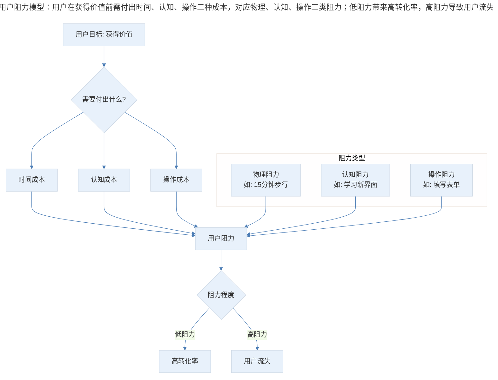
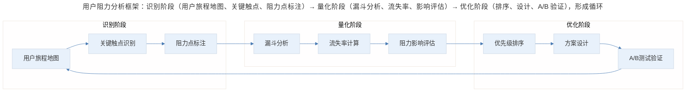
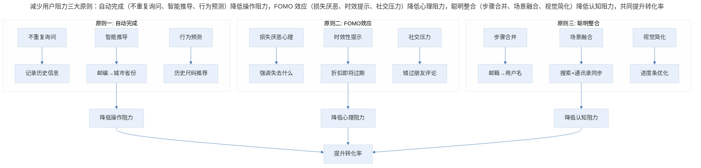
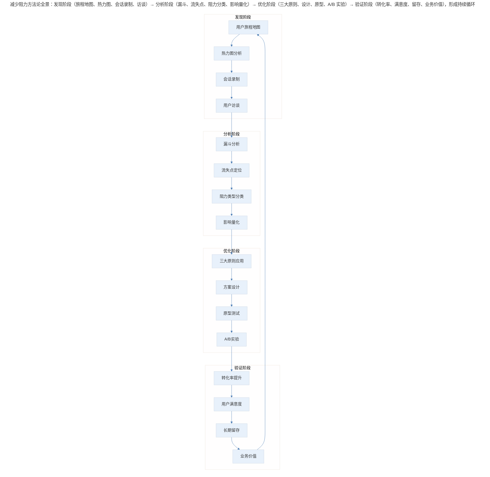
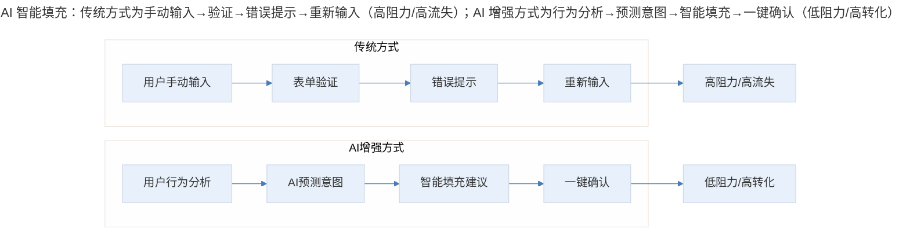
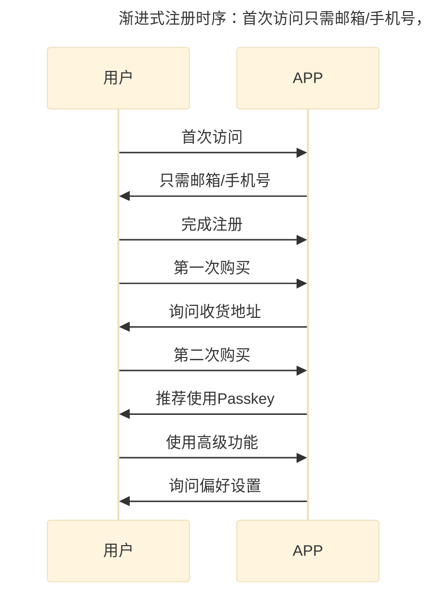

# 增长的核心在于减少用户阻力

## 1. 导言

相信通过前面的几篇文章，你已经掌握了"了解、找到、执行"增长理论，也优化了你团队的增长工作流，你甚至知道现在的数据哪步不好看，但是却还不知道如何解决。

一个产品的用户数量，往往取决于以下三个方面：

1. 产品的质量是不是满足用户的需求
2. 用户是不是知道如何使用
3. 用户为了使用产品所花费的时间和他们得到的价值是不是匹配

**重要前提**：如果一个产品没有证明满足了用户需求，用户对产品没有忠实度，我们一般不推荐增长团队进行产品增长。一般我们会先组织一个非常小的团队试水，重点看产品的留存率怎么样，也就是看产品的质量是不是满足了用户的需求。如果留存率非常高，就可以证明这个产品能满足用户的需求，我们才会进行专门的增长工作。

## 2. 用户阻力的本质

### 2.1 什么是用户阻力？

**所有在用户享受到价值的同时，需要用户做但他们不想做的行为都是用户阻力。**

> 用户阻力模型：用户在获得价值前需付出时间、认知、操作三种成本，对应物理、认知、操作三类阻力；低阻力带来高转化率，高阻力导致用户流失。

### 2.2 经典案例：便利店的崛起

举个简单的例子，便利店之所以火爆就是因为用户以前需要走 15 分钟才能到超市买一瓶橙汁，但现在家门口就可以买到了。这 15 分钟的步行对用户来说就是阻力，现在家门口的便利店就可以买到这个橙汁，那为什么还要付出步行 15 分钟的代价去超市呢？

### 2.3 用户阻力分析框架

> 用户阻力分析框架：识别阶段（用户旅程地图、关键触点、阻力点标注）→ 量化阶段（漏斗分析、流失率、影响评估）→ 优化阶段（排序、设计、A/B 验证），形成循环。

## 3. 关键场景优化：注册登录与购物流

### 3.1 新用户体验优化：减少注册登录阻力

对于互联网产品来说，也是同样的道理。**一个产品的登录和注册流，是痛点最多，用户最讨厌的，也是用户最容易流失的部分，这部分的用户阻力对产品增长的伤害也是最大的。**

**典型问题场景**：你刚刚下载了一个 APP，不记得自己是否注册过，所以当 APP 让你选择是"注册"还是"登录"时，你抱着试试的心态选择了"登录"。接着，你输入了一个常用邮箱，APP 却提示你"查不到此邮箱"，这时你需要先退出登录界面，重新找到选择"注册"还是"登录"界面，然后选择"注册"，才能创建账户。那么此时，这个 APP 在你心中的分数还能剩下多少？

**优化方案**：当系统找不到用户输入的邮箱时，询问用户"是不是想注册"，用户点击"注册"，这个邮箱会自动填入注册申请表，这样就把本来需要三四步才能完成的动作一步完成，也就减小了用户阻力。

**三个关键优化方法**：

**方法一：自动推荐用户名**

有些 APP 要求用户名是独一无二的，如果用户尝试的好几个用户名都被注册过了，这就是一个非常糟糕的体验。这个时候，你可以根据用户输入的用户名，自动推荐没有被注册过的用户名，目的是减轻用户的注册成本，方便他们进行到下一步。比如，我的用户名"xiaoyin"被注册了，那么"xiao_yin""xiaoyin111""xiao.yin"都可以推荐给我。

**方法二：把必填项放到前面**

很多产品的用户注册流有很多项，但必填项也就是邮箱、密码、用户名。所以如果把必填项设计到前面的话，用户更有可能完成注册。这样，即使用户在填写选填项想要放弃时，你也可以告诉他们："你的必填资料已经完整了，你可以完成注册了，你真的要放弃么？"用户可以选择"退出注册"或者"完成注册"，这样你很可能就成功挽回了一个马上就要流失的用户。

**方法三：告诉用户你会发什么样的提醒消息**

对很多产品经理来说，让用户开启消息提醒是个巨大的挑战。做得比较好的 APP，会清晰的告诉用户会发什么样的提醒消息，以及为什么这些提醒消息对用户有帮助。有一个好办法是告诉用户"打开提醒消息以后，你随时都可以在 APP 上设置关闭消息提醒"，加上这句话会让用户更容易开启消息提醒。还有一个比较好的方式是，告诉用户如果他们没有开启消息提醒，会错过什么样的消息。比如，Instagram 告诉用户，你将错过朋友们的回复，Uber 告诉用户，你将错过司机到了的提醒，而这些都是足够的痛点。

### 3.2 电商购物流优化：减少购买阻力

**另一个用户阻力造成巨大危害的部分是电商的购买流，也就是用户下单购物的部分。购买流部分的用户阻力，直接伤害的就是电商的收入，那可是真金白银啊。**

**自动纠正邮寄地址**：如果我以前下过单，系统应该自动显示我上次的邮寄地址，让我确认即可；如果我新输入的地址格式不对，系统应该自动推荐一个合理的地址，让我一键修改；或者我曾经输入过多个地址，那么系统可以让我选择一个地址，还可以考虑分别显示每个地址对应的邮费，这样我就可以轻松地做出选择。

**购物车未转化优化**：Facebook 推出了一个智能广告，可以在用户信息流上显示他们还没有下单购买的产品图片，然后用户可以点击图片直接进入购物车完成购买。后来的数据证实，这个广告的转化率非常高。同样的道理，如果用户把商品放到了购物车而没有买，过了两天他回到了网站，你是不是可以考虑用一个小窗口显示他上次没买的东西，然后给他一个折扣券，让他们直接转化？或者，告诉用户在过去的两天，多少人买了这件商品，或者这件商品的库存还剩几件，通过这样的方式刺激用户购买的欲望。

**首次购买自动创建账户**：如果用户是第一次购买，在下单的过程中用户已经提供了邮箱，那么是不是可以直接存储邮箱信息，帮助用户自动创建一个新账户，这样用户只要加个密码，点下"确认"就完成了账户的创建工作。这样做的好处是，你不仅得到了一个新订单，还多了一个以后可以发邮件，宣传打折新品的回头客。

## 4. 减少用户阻力的三大原则

> 减少用户阻力三大原则：自动完成（不重复询问、智能推导、行为预测）降低操作阻力，FOMO 效应（损失厌恶、时效提示、社交压力）降低心理阻力，聪明整合（步骤合并、场景融合、视觉简化）降低认知阻力，共同提升转化率。

### 4.1 原则一：自动完成

这一原则主要包含两个方面：

- 同样的信息一定不要问用户第二遍，比如用户输入过邮箱，那么自动记录，不要让用户填写两次
- 可以推导出来的信息要自动完成，让用户修改即可，比如用户输入了邮政编码，那你就应该自动完成城市和省份的填写；比如用户以前买的是 38 码的皮鞋，那么你就可以自动给用户推荐这个号码的鞋

### 4.2 原则二：告诉用户他们会失去什么

有意思的是，告诉用户他们会得到什么，他们可能不在乎。比如，当你说"今天有 15% 的折扣，点击这里购买"时，用户可能不为所动。但如果你说"明天 15% 的折扣就过期了"，用户的欲望就会变强。

所以，作为产品经理，不仅要考虑产品应该怎么设计，更要考虑什么样的文字更能打动用户。

比如，"如果不打开消息提醒，你可能会错过朋友的评论""如果你今天没有发抖音，朋友们就会看不到你今天的新鲜事"，这样的方式对用户的活跃度的积极影响会更大，因为遗憾相比惊喜，总是更加厚重。

在美国，有一个专门的词语描述这样的情况：**FOMO（fear of missing out）**，也就是害怕错过。所以，如果你能帮用户减少 FOMO，那你就赢了。

### 4.3 原则三：聪明的整合

能三步完成的，一定不要做成五步。所谓整合，就是把相关的步骤用逻辑清晰的方式整合起来，即使只是视觉上没有那么多步骤了，对于转化率的增长也是惊人的。

比如，如果第一步让用户输入邮箱，第二步输入用户名，那完全可以合并为一步，用户输入邮箱后，你可以直接自动完成用户名；或者，如果有一步要用户通过搜索添加好友，还有一步需要用户同步通讯录添加好友，那你完全可以在用户刚刚进入搜索框还没搜索的时候，加一个小按钮让用户一键同步通讯录。

这样的方式，都是把逻辑相关的步骤整合，在产品设计上让用户觉得眼前的工作很容易，不用花多少时间，从而提升产品的转化率。

## 5. 实践指南：方法论全景与三层视角

### 5.1 方法论全景图

> 减少阻力方法论全景：发现阶段（旅程地图、热力图、会话录制、访谈）→ 分析阶段（漏斗、流失点、阻力分类、影响量化）→ 优化阶段（三大原则、设计、原型、A/B 实验）→ 验证阶段（转化率、满意度、留存、业务价值），形成持续循环。

### 5.2 三层深度视角

**🟢 进阶视角（1-3 年产品经理）**

核心关注点：

- 掌握基本的漏斗分析方法
- 能够识别明显的用户阻力点
- 应用三大原则进行优化

实践建议：

1. 建立数据监控体系，关注关键转化率
2. 定期进行用户测试，观察用户操作困难
3. 从小处着手，优先优化高流量页面

常见误区：

- 过度追求创新，忽视基础体验
- 只关注数据，忽视用户真实感受
- 一次性大改，而非小步迭代

**🔵 资深视角（3-5 年产品经理）**

核心关注点：

- 建立系统化的阻力识别机制
- 平衡商业目标与用户体验
- 跨团队协作推动优化落地

实践建议：

1. 建立用户阻力评估框架，量化每个阻力点的影响
2. 与增长团队、设计团队、工程团队建立协作机制
3. 关注长期价值，避免短期优化损害长期体验

进阶技巧：

- 使用预测模型评估优化潜在收益
- 建立阻力优化优先级矩阵
- 设计可复用的优化组件库

**🟣 专家视角（5 年+产品经理）**

核心关注点：

- 从战略层面理解阻力与增长的关系
- 构建组织级的体验优化能力
- 探索 AI 时代的新范式

实践建议：

1. 将阻力优化纳入产品战略规划
2. 建立体验度量体系（如 HEART 框架）
3. 探索 AI、无密码等新技术在减少阻力中的应用

战略思考：

- 阻力优化与品牌定位的关系
- 如何在减少阻力的同时保持用户粘性
- 平衡"无摩擦"与"有意义的选择"

## 6. 进阶延展：AI 时代的新变化与核心要点回顾

### 6.1 AI 智能填充与预测

> AI 智能填充：传统方式为手动输入→验证→错误提示→重新输入（高阻力/高流失）；AI 增强方式为行为分析→预测意图→智能填充→一键确认（低阻力/高转化）。

**AI 自动填充**：基于用户历史行为和上下文，AI 可以预测并自动填充表单字段。例如，Google 的 Smart Compose 不仅预测文字，还能根据用户习惯预测地址、支付信息等。

**AI 预测用户意图**：通过分析用户的点击流、停留时间、滚动行为，AI 可以预测用户下一步想做什么，提前加载相关内容或预填表单。

**AI 个性化引导**：不同于传统的统一 onboarding 流程，AI 可以根据用户画像、设备类型、使用场景动态生成个性化的引导路径。

### 6.2 无密码登录（Passkey）

**Passkey** 是 2024-2026 年最重要的登录方式革新：

- 使用生物识别（Face ID、指纹）替代密码
- 基于公钥加密，更安全
- 无需记忆密码，无密码泄露风险
- 跨设备同步（iCloud 钥匙串、Google 密码管理器）

Apple、Google、Microsoft 已联合支持 Passkey 标准，预计到 2026 年将成为主流登录方式。

### 6.3 AI 减少认知阻力与渐进式注册

**AI 减少认知阻力**：

- **智能表单设计**：AI 可以实时分析表单的复杂度，动态调整字段顺序、分组，甚至跳过非必要字段
- **自然语言交互**：用户可以用自然语言描述需求，AI 自动转换为结构化数据。例如，"我要寄到北京朝阳区"自动解析为地址字段
- **智能错误提示**：不再是冷冰冰的"格式错误"，AI 可以解释为什么出错，并提供具体的修改建议

**渐进式注册（Progressive Profiling）** 的核心理念是：不在一开始就要求用户填写所有信息，而是在用户使用过程中逐步收集。

> 渐进式注册时序：首次访问只需邮箱/手机号，第一次购买询问收货地址，第二次购买推荐 Passkey，使用高级功能时询问偏好设置，逐步收集信息。

**AI 个性化 Onboarding 对比**：

| 传统 Onboarding | AI 个性化 Onboarding |
|---------------|-------------------|
| 统一的引导流程 | 根据用户画像定制 |
| 固定的步骤顺序 | 动态调整顺序 |
| 静态的提示文案 | 个性化的语言风格 |
| 全量功能介绍 | 只介绍相关功能 |
| 一次性完成 | 分阶段渐进引导 |

### 6.4 核心要点回顾

减少用户阻力的核心要点：

1. **用户阻力的本质**：用户需要做但不想做的行为，包括物理阻力、认知阻力和操作阻力
2. **两大关键场景**：新用户体验（注册登录流）和电商购物流
3. **三大原则**：自动完成、FOMO 效应、聪明整合
4. **AI 时代新变化**：智能填充、无密码登录、个性化引导、渐进式注册

减少用户阻力不是一蹴而就的工作，而是需要持续发现、分析、优化、验证的循环过程。在 AI 时代，我们有更多工具和方法来理解用户、预测需求、自动化流程，但核心原则不变：让用户用最少的付出，获得最大的价值。

---

## 参考资料

- Steve Krug. *Don't Make Me Think*. 经典可用性著作
- Don Norman. *The Design of Everyday Things*. 设计心理学经典
- Nir Eyal. *Hooked*. 习惯养成机制
- Google 的 HEART 用户体验框架
- Passkey 技术白皮书（Apple/Google/Microsoft 联合发布）
- AI 在用户体验优化中的应用研究