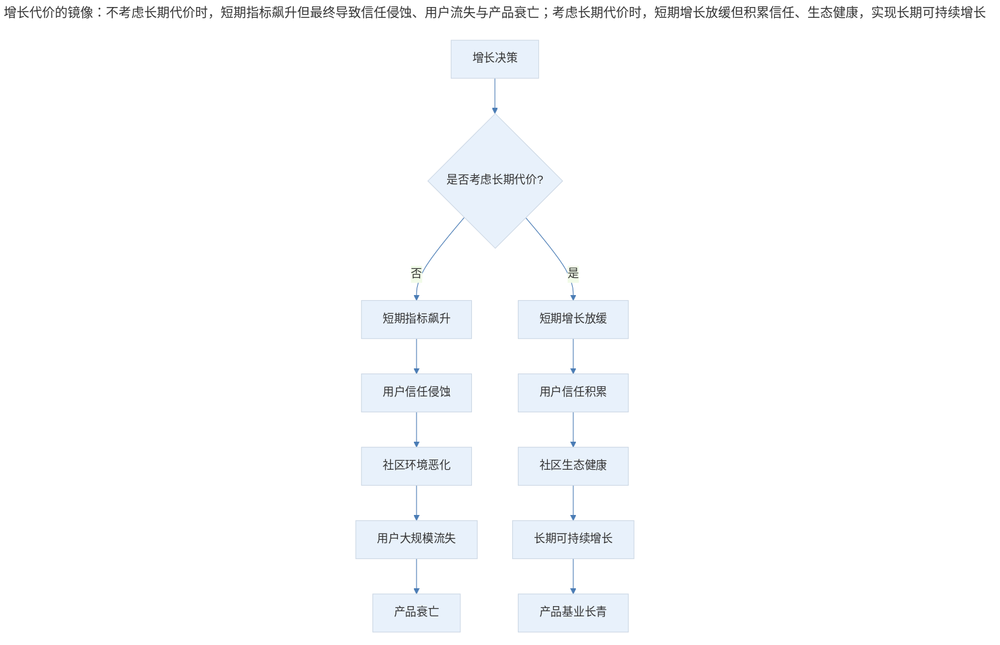
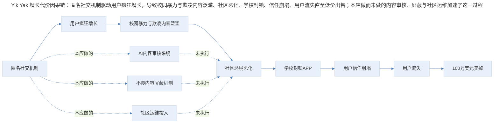
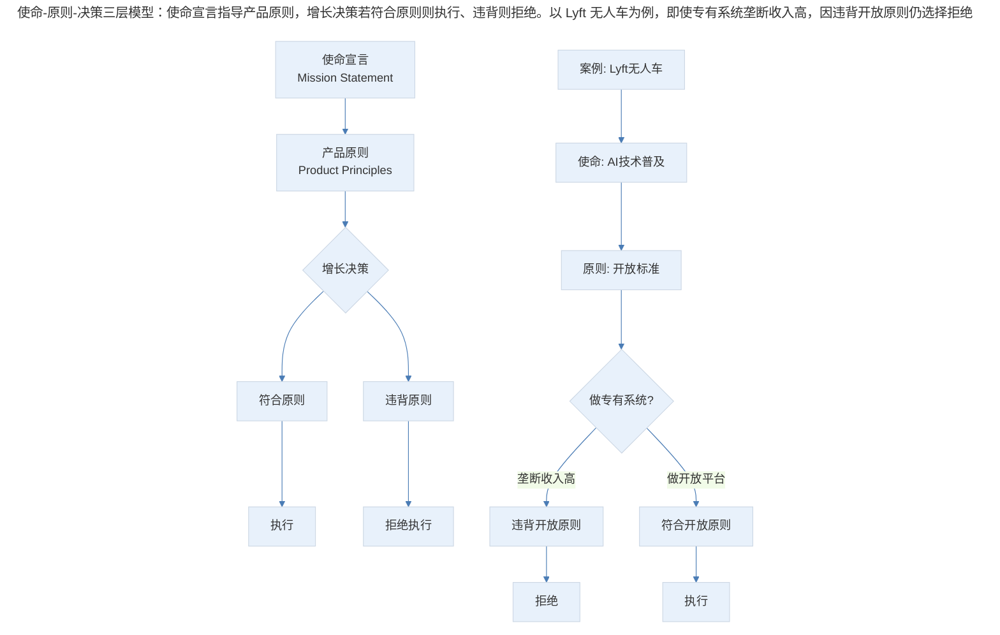
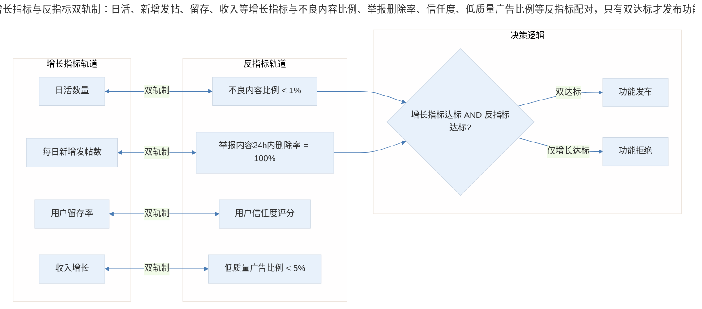
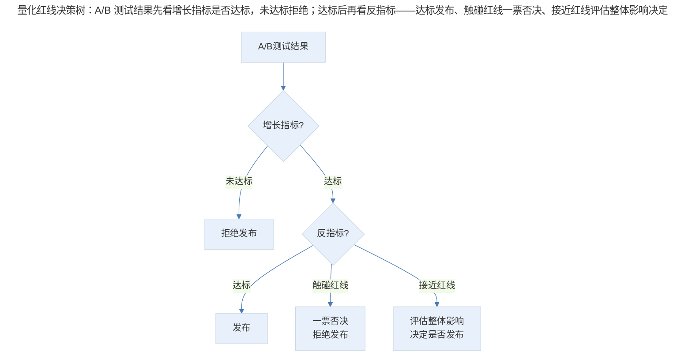
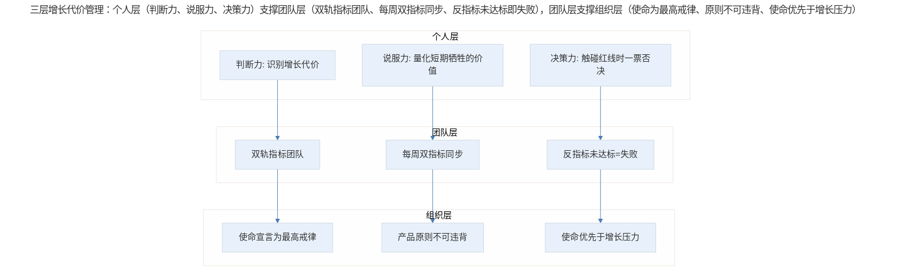
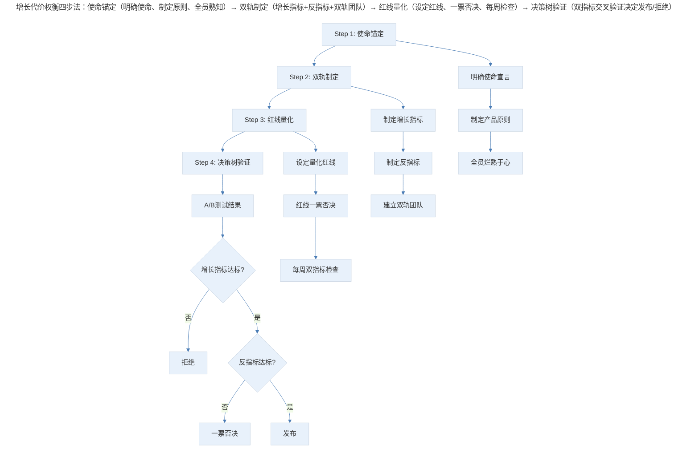

# 产品增长的代价，如何权衡取舍

## 1. 导言

产品增长系列至此，你已经掌握了增长黑客的核心公式、团队工作流优化、科学迭代方法论，以及减少用户阻力的核心策略。但所有增长手段都有一个被忽视的暗面——**增长的代价**。

所谓增长代价，是指为了实现短期增长目标采取的措施，对产品长期发展造成的不利影响。它不是增长的副作用，而是增长的镜像——你追求什么，就会牺牲什么。

> 增长代价的镜像：不考虑长期代价时，短期指标飙升但最终导致信任侵蚀、用户流失与产品衰亡；考虑长期代价时，短期增长放缓但积累信任、生态健康，实现长期可持续增长。

## 2. 增长代价的本质：Yik Yak 的兴衰

### 2.1 匿名社交的火箭与坠落

Yik Yak 曾是匿名社交领域的明星产品。2013 年发布，2014 年估值达到 4 亿美元，一度是美国校园最受欢迎的 APP。它提供了一个匿名社区，用户可以匿名发帖、查看附近人的帖子，增长曲线如同火箭升空。

然而 2017 年，Yik Yak 以 100 万美元卖给了 Square，关门谢客——从 4 亿估值到 100 万出售，价值缩水了 99.75%。

### 2.2 增长代价的因果链

> Yik Yak 增长代价因果链：匿名社交机制驱动用户疯狂增长，导致校园暴力与欺凌内容泛滥、社区恶化、学校封锁、信任崩塌、用户流失直至低价出售；本应做而未做的内容审核、屏蔽与社区运维加速了这一过程。

Yik Yak 本可以在初期就做社区净化工作——部署捕捉暴力和欺凌内容的 AI 系统、屏蔽发布不良内容的用户、投入更多人力做社区运维。但它选择了把时间和精力全部投入下载量和用户活跃度的增长，以及加速下一轮融资。

这是很多产品团队的通病：**迫于增长指标的压力，不愿把时间花在长期有益但短期无感的事情上**。结果就是今年数据好看了，几年后产品变味了，用户信任消失了。

## 3. 权衡框架：使命宣言、产品原则与反指标

### 3.1 使命宣言与产品原则

**使命宣言用一句话概括：产品为用户提供了什么价值。** 好的产品经理会让团队所有成员不断重复使命宣言，让所有人烂熟于心。使命宣言是增长的锚点——当增长策略偏离使命时，它就是纠偏的北极星。

| 公司 | 使命宣言 | 增长决策的约束 |
|------|---------|--------------|
| Waymo | 让人和东西安全便捷地移动 | 安全性是第一优先级，不可为速度牺牲安全 |
| Lyft 无人车 | 为无人驾驶软件系统设定标准，让 AI 技术尽可能普及 | 即使专有系统能垄断收入，也选择开放标准 |
| Facebook | 让人与人之间的距离更加紧密 | 广告不能破坏用户与朋友的互动体验 |

**产品原则是根据使命宣言制定的核心指导思想，不管增长指标多么激进，都要确保符合这个原则。**

以 Facebook 广告为例：Facebook 投放广告的原则是只做高质量的、对用户真正有帮助的、与用户需求相关的广告。Facebook 有专门的产品团队把控广告质量——坚决不做黄赌毒、成人内容等低质量广告；如果某类用户不愿意点击某类广告，系统和专门团队会控制该广告向该类用户的推送。

这种严格的广告质量审查意味着 Facebook 会损失推送低质量广告的收入，但它绝不会为了短期增长忽视长期使命。Facebook 推出广告产品以来一直屹立不倒，并成就了万亿美元市值。

使命-原则-决策三层模型：

> 使命-原则-决策三层模型：使命宣言指导产品原则，增长决策若符合原则则执行、违背则拒绝。以 Lyft 无人车为例，即使专有系统垄断收入高，因违背开放原则仍选择拒绝。

### 3.2 反指标（Counter Metrics）：增长的双轨制

在制定产品成功指标时，**反指标是指产品带来的负面影响**，是一个与增长指标同等重要的指标。当你确定了产品长期的使命和原则后，在制定增长指标的同时，应当同时制定反指标。

> 增长指标与反指标双轨制：日活、新增发帖、留存、收入等增长指标与不良内容比例、举报删除率、信任度、低质量广告比例等反指标配对，只有双达标才发布功能，仅增长达标则拒绝。

以 Yik Yak 为例，增长指标可能是日活数量和每日新增发帖数，反指标可以是"用户举报的不良内容 100% 在 24 小时内删除"，或者"通过抽样调查确定不良内容比例低于 1%"。即使某些增长策略达到了增长指标，但没达到反指标，也视为失败。

**双团队结构**：对于较大的产品团队，可以设立两个具体的增长团队：一个负责增长指标，一个负责反指标。这样可以确保团队不会因为一味追求增长数据好看而丧失对反指标的关注。

这种团队结构可能导致增长团队和反指标团队经常意见不和，但总体来看确实对产品的长期质量有非常大的帮助。团队之间的小争论，远比用户流失的代价小得多。

### 3.3 量化红线：A/B 测试的决策标准

**反指标不能只是嘴上说说，必须落实为产品最核心的数据之一。** 产品负责人一定要在每周检查增长指标的同时检查反指标。

这里涉及一个权衡取舍的问题：如果 A/B 测试结果显示某个新功能可以增加 X% 的日活数，但也会增加 Y% 的不良内容比例，这时就需要一个量化标准来决定是否发布。

**量化红线法**：设定反指标的硬性阈值，一旦触碰即一票否决。

例如，之前负责过的一个产品，反指标是"低质量广告比例不能高于 5%"。如果发现某个新功能让低质量广告比例增加到了 6%，不管这个功能多么给力，也不能发布。

> 量化红线决策树：A/B 测试结果先看增长指标是否达标，未达标拒绝；达标后再看反指标——达标发布、触碰红线一票否决、接近红线评估整体影响决定。

## 4. 权衡落地：从个人到组织的增长代价管理

> 三层增长代价管理：个人层（判断力、说服力、决策力）支撑团队层（双轨指标团队、每周同步、反指标即失败），团队层支撑组织层（使命为最高戒律、原则不可违背、使命优先于增长压力）。

**个人层：产品经理的判断力**

作为产品经理，你必须能够说服老板和团队：短期利益的牺牲是值得的。你需要清晰表达短期代价对长期发展的影响，并制定具体的量化标准。**没有具体数字来量化，反指标就会流于表面，增长代价就成了说说而已的假把式。**

**团队层：双轨指标团队结构**

在团队层面，建立增长指标团队和反指标团队的双轨制，确保两种力量始终在博弈中平衡。每周同步检查两类指标，当反指标未达标时，让所有团队成员意识到这是失败，并不惜一切代价降低反指标对产品的影响。

**组织层：使命驱动的文化**

在组织层面，使命宣言和产品原则必须成为不可违背的最高戒律。从 CEO 到一线工程师，所有人都必须理解并遵守这些原则。当增长压力与使命冲突时，使命优先——这不是理想主义，而是长期主义的理性选择。

## 5. 实践指南：增长代价权衡四步法

> 增长代价权衡四步法：使命锚定（明确使命、制定原则、全员熟知）→ 双轨制定（增长指标+反指标+双轨团队）→ 红线量化（设定红线、一票否决、每周检查）→ 决策树验证（双指标交叉验证决定发布/拒绝）。

| 步骤 | 方法 | 关键动作 | 产出 |
|------|------|---------|------|
| 使命锚定 | 使命宣言+产品原则 | 明确不可违背的底线 | 使命宣言文档、原则清单 |
| 双轨制定 | 增长指标+反指标 | 为每个增长指标配对反指标 | 双轨指标体系 |
| 红线量化 | 量化阈值法 | 设定反指标的硬性红线 | 量化红线标准 |
| 决策树验证 | A/B 测试决策树 | 双指标交叉验证 | 发布/拒绝决策 |

## 6. 进阶延展：AI 时代的增长代价管理与核心要点回顾

### 6.1 AI 时代的增长代价新挑战

**AI 内容审核：从人工到智能**

Yik Yak 时代的社区净化依赖人工审核，成本高、效率低。今天的 AI 内容审核系统可以在毫秒级识别暴力、欺凌、仇恨言论等内容，大幅降低了"增长与安全"的权衡成本。但 AI 审核本身也有代价——误判可能导致合法内容被删除，影响用户体验和言论自由。

**预测性反指标监控**

传统反指标是事后监控——问题发生了才去修复。AI 时代可以实现预测性监控：通过机器学习模型预测某个增长策略可能带来的负面影响，在发布前就评估增长代价，从"事后补救"升级为"事前预防"。

**动态阈值调整**

固定的量化红线（如 5%）在不同阶段可能不适用。AI 可以根据产品发展阶段、市场竞争态势、用户构成变化等因素，动态调整反指标的阈值，实现更精细的权衡取舍。

**增长-安全平衡算法**

最前沿的实践是将增长指标和反指标纳入同一个优化函数，通过算法自动寻找帕累托最优解——在不触碰反指标红线的前提下，最大化增长指标。这比人工权衡更高效、更客观。

### 6.2 核心要点回顾

产品增长的代价管理与增长本身同等重要。Yik Yak 从 4 亿估值到 100 万美元出售的兴衰案例警示：迫于增长指标压力而不愿投入长期有益的社区治理，最终会导致信任崩塌与产品衰亡。

应对之道是建立系统的权衡框架：以使命宣言和产品原则作为增长的锚点（使命-原则-决策三层模型），通过反指标构建增长的双轨制（增长指标与反指标配对、双团队结构、量化红线一票否决），并在个人、团队、组织三个层面落地实施。在 AI 时代，AI 内容审核、预测性反指标监控、动态阈值调整与增长-安全平衡算法为增长代价管理提供了更高效的工具，但使命优先的长期主义始终是不变的判断准则。

---

## 参考资料

- John Doerr. *Measure What Matters*. OKR 之父的经典著作，其中对 Counter Metrics 的讨论与本文一脉相承
- Eric Ries. *The Lean Startup*. "创新会计"章节，讨论如何用正确的指标衡量产品进展，避免虚荣指标
- Reid Hoffman. *Blitzscaling*. 闪电扩张策略中关于增长代价的讨论
- Northstar Metric 框架 — Amplitude 的北极星指标方法论
- Trust & Safety 工程实践 — Google/Meta 的信任与安全团队公开文档