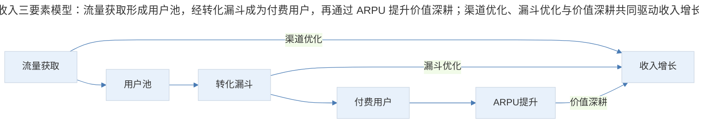
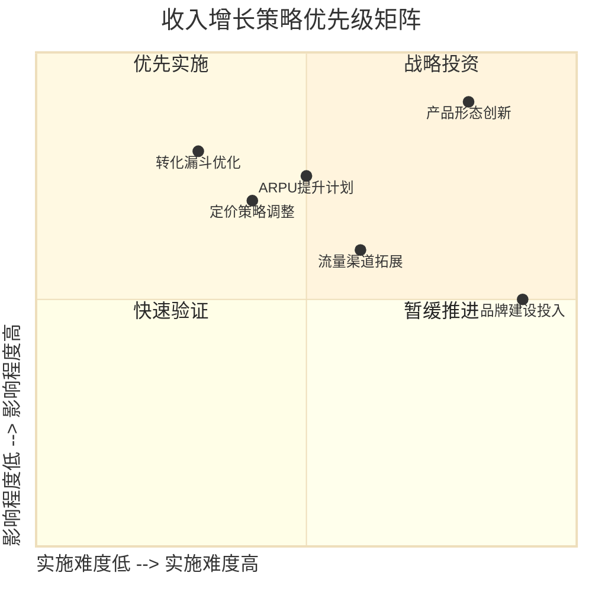
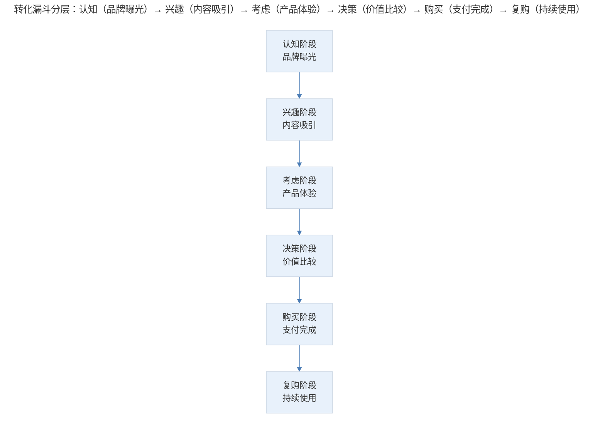
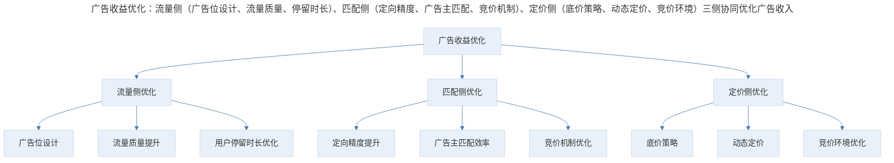
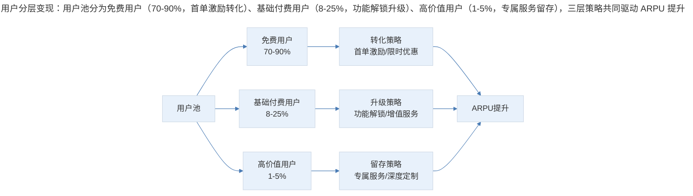
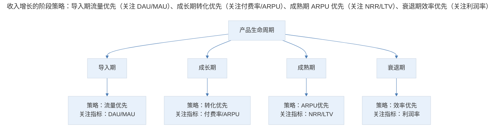

# 商业产品收入增长策略：流量与转化

## 1. 导言

本文聚焦商业产品收入增长的核心驱动因素，围绕"收入=流量 × 转化率 × ARPU"这一基本公式，系统分析流量获取、转化优化与收益管理的策略框架。结合 2024-2026 年程序化广告（Programmatic Advertising）、AI 优化收益管理（Yield Management）与隐私安全定向（Privacy-Safe Targeting）的最新实践，为资深产品经理提供收入增长的系统性方法论。

## 2. 收入增长的驱动框架

### 2.1 收入驱动的三要素模型

商业产品的收入增长可拆解为三个核心驱动因子：

$$Revenue = Traffic \times ConversionRate \times ARPU$$

其中：

- **Traffic（流量）**：进入产品漏斗的潜在用户数量
- **Conversion Rate（转化率）**：从潜在用户转化为付费用户的比例
- **ARPU（Average Revenue Per User）**：单个付费用户的平均收入

> 收入三要素模型：流量获取形成用户池，经转化漏斗成为付费用户，再通过 ARPU 提升价值深耕；渠道优化、漏斗优化与价值深耕共同驱动收入增长。

这一公式看似简单，但每一项因子的优化都涉及复杂的策略设计与资源投入。产品经理需要根据产品所处的生命周期阶段与竞争环境，确定优先优化的因子。

### 2.2 不同业务模式的增长重心

| 业务模式 | 流量特征 | 转化特征 | ARPU 特征 | 增长重心 |
|---------|---------|---------|---------|---------|
| 广告变现型 | 高流量门槛 | 低转化率 | 低 ARPU，高规模 | 流量规模与留存 |
| SaaS 订阅型 | 精准流量 | 中高转化率 | 高 ARPU，低流失 | 转化率与 NRR |
| 电商交易型 | 中高流量 | 中转化率 | 中 ARPU | 转化率与复购 |
| 内容付费型 | 中等流量 | 低中转化率 | 中高 ARPU | 内容质量与转化 |
| 平台撮合型 | 双边流量 | 多层转化 | 佣金模型 | 双边匹配效率 |

### 2.3 增长策略的优先级矩阵

> 收入增长策略优先级矩阵：按实施难度与影响程度分四象限——优先实施（转化漏斗优化、定价调整）、战略投资（ARPU 提升、产品创新）、快速验证（渠道拓展）、暂缓推进（品牌建设）。

## 3. 策略解析：流量获取与转化优化

### 3.1 流量获取策略与成本优化

**CAC（Customer Acquisition Cost，用户获取成本）** 与 **TAC（Traffic Acquisition Cost，流量获取成本）** 是衡量获客效率的关键指标：

$$CAC = \frac{总获客支出}{新增付费用户数}$$

$$TAC = \frac{总流量支出}{新增流量单位数}$$

健康的 CAC/TAC 标准因业务模式而异：

| 行业 | 合理 CAC 范围 | CAC 回收周期 | LTV/CAC 健康比值 |
|------|-----------|------------|----------------|
| SaaS 企业服务 | $500-$5,000 | 12-18 个月 | >3:1 |
| SaaS 中小企业 | $100-$500 | 6-12 个月 | >3:1 |
| 消费互联网 | $5-$50 | 3-6 个月 | >3:1 |
| 电商 | $10-$100 | 首次购买即可 | >4:1 |
| 内容付费 | $5-$30 | 1-3 个月 | >5:1 |

有效的流量获取需要构建多元化的渠道组合：

- **自然流量（Organic Traffic）**：SEO/ASO 优化、内容营销与品牌建设、用户口碑与裂变传播。特征：长期价值高，但见效周期长。
- **付费流量（Paid Traffic）**：搜索引擎营销（SEM）、社交媒体广告、程序化广告投放。特征：见效快，但成本持续上升。
- **社交裂变（Viral Traffic）**：邀请奖励机制、社交分享激励、团购/拼团模式。特征：低成本高增长，但可控性低。
- **渠道合作（Partnership Traffic）**：API 集成与生态合作、渠道分销与联合营销、跨界合作与品牌联动。特征：质量高，但拓展速度有限。

**2024-2026 年流量获取的新范式**：

**隐私安全定向（Privacy-Safe Targeting）**：随着全球隐私法规趋严，传统基于 Cookie 和设备 ID 的定向方式面临挑战：

- **上下文定向（Contextual Targeting）**：基于内容场景而非用户行为进行广告投放
- **群体隐私计算（Privacy-Preserving Computation）**：差分隐私、联邦学习等技术
- **第一方数据策略（First-Party Data Strategy）**：构建自有数据资产
- **Clean Room 技术**：在不共享原始数据的前提下进行联合分析

| 定向方式 | 隐私合规性 | 定向精度 | 规模覆盖 | 技术门槛 |
|---------|-----------|---------|---------|---------|
| 第三方 Cookie | 低（逐步淘汰） | 高 | 广 | 低 |
| 上下文定向 | 高 | 中 | 广 | 中 |
| 第一方数据+建模 | 高 | 中高 | 有限 | 中高 |
| 隐私计算 | 高 | 中 | 中 | 高 |
| 通用 AI 定向 | 高 | 中高 | 广 | 高 |

**AI 优化的获客效率**：

- 智能出价（Smart Bidding）：AI 实时调整广告出价策略
- 创意自动化（Creative Automation）：AI 生成与优化广告素材
- 受众发现（Audience Discovery）：AI 识别高价值用户特征
- 渠道归因（Attribution）：AI 驱动的多触点归因分析

### 3.2 转化率优化方法论

转化漏斗的分层优化：

> 转化漏斗分层：认知（品牌曝光）→ 兴趣（内容吸引）→ 考虑（产品体验）→ 决策（价值比较）→ 购买（支付完成）→ 复购（持续使用）。

每个阶段的转化率优化策略各异：

| 漏斗阶段 | 核心目标 | 关键指标 | 优化策略 |
|---------|---------|---------|---------|
| 认知→兴趣 | 吸引注意力 | 点击率 CTR | 内容营销、广告素材优化 |
| 兴趣→考虑 | 激发需求 | 注册率 | 价值主张清晰化、降低注册门槛 |
| 考虑→决策 | 消除疑虑 | 试用率 | 免费试用、案例展示、安全保障 |
| 决策→购买 | 促成交易 | 付费转化率 | 首单优惠、支付便捷化、限时激励 |
| 购买→复购 | 建立忠诚 | 复购率/NRR | 持续价值交付、会员体系、续费激励 |

首次付费是用户从免费到付费的关键跨越，需要精心设计：

**建立付费安全感**：展示社会认同（Social Proof）、提供退款保障（Money-Back Guarantee）、支持免费试用（Free Trial）。

**降低决策阻力**：新用户专享优惠、渐进式功能解锁、透明化的定价与功能对比。

**优化支付流程**：最少步骤完成支付、支持主流支付方式、支付与使用场景无缝衔接。

**打通持续付费路径**：首次支付即绑定支付方式、自动续费选项、后续增值服务入口。

转化率优化应遵循科学的实验方法论：

1. **假设形成**：基于数据分析与用户研究，形成可验证的假设
2. **实验设计**：确定实验变量、样本量与统计显著性标准
3. **数据收集**：确保数据采集的准确性与完整性
4. **结果分析**：采用严格的统计方法分析实验结果
5. **决策与迭代**：基于实验结果做出决策，并持续迭代

## 4. 价值深耕：收益管理与 ARPU 提升

### 4.1 收益管理（Yield Management）策略

收益管理（Yield Management）源于航空与酒店行业，其核心思想是：在有限的资源约束下，通过动态定价与库存管理，实现收益最大化。

在互联网商业产品中，收益管理的应用场景包括：

- **广告库存管理**：优化广告位分配与定价
- **SaaS 席位管理**：优化不同套餐的定价与功能分配
- **内容分发管理**：优化内容曝光与变现效率
- **平台撮合管理**：优化双边匹配与佣金策略

广告产品的收益优化是收益管理最典型的应用场景：

$$广告收入 = 广告请求量 \times 填充率 \times eCPM / 1000$$

其中：

- **广告请求量**：取决于流量规模与广告位数量
- **填充率（Fill Rate）**：成功展示广告的请求占比
- **eCPM（Effective Cost Per Mille）**：千次展示有效收入

> 广告收益优化：流量侧（广告位设计、流量质量、停留时长）、匹配侧（定向精度、广告主匹配、竞价机制）、定价侧（底价策略、动态定价、竞价环境）三侧协同优化广告收入。

| 优化维度 | 策略 | 预期效果 | 实施难度 |
|---------|------|---------|---------|
| 广告位增加 | 新增信息流/开屏/激励广告位 | 提升请求量 | 低 |
| 填充率提升 | 扩大广告主池、设置底价 | 提升展示率 | 中 |
| eCPM 提升 | 精准定向、优化竞价机制 | 提升单次展示收入 | 高 |
| 用户体验平衡 | 广告频控、质量审核 | 保护长期流量价值 | 中 |

2024-2026 年程序化广告（Programmatic Advertising）呈现以下趋势：

**RTB（Real-Time Bidding）的演进**：从传统 RTB 向 Header Bidding 演进，服务端竞价（Server-Side Bidding）成为主流，统一竞价（Unified Auction）提升效率。

**AI 驱动的广告优化**：智能出价策略（基于用户价值预测的实时出价）、创意动态生成（AI 根据用户特征生成个性化广告素材）、受众自动发现（AI 识别高转化用户群体）。

**隐私合规的程序化广告**：Google Privacy Sandbox 的 Topics API、Apple 的 SKAdNetwork 与 ATT 框架、第一方数据驱动的程序化投放。

### 4.2 ARPU 提升策略

$$ARPU = \frac{总收入}{付费用户数} = 单次交易价值 \times 交易频次$$

ARPU 提升可从两个维度展开：

**提升单次交易价值**：产品升级与增值服务、高价值功能解锁、个性化推荐与交叉销售。

**提升交易频次**：使用场景扩展、习惯养成机制、会员权益持续交付。

用户分层与差异化变现：

> 用户分层变现：用户池分为免费用户（70-90%，首单激励转化）、基础付费用户（8-25%，功能解锁升级）、高价值用户（1-5%，专属服务留存），三层策略共同驱动 ARPU 提升。

| 用户层级 | 占比 | ARPU 贡献 | 提升策略 | 关注指标 |
|---------|------|---------|---------|---------|
| 免费用户 | 70-90% | 0 | 首次转化 | 免费转付费率 |
| 基础付费 | 8-25% | 30-50% | 套餐升级 | 升级率、NRR |
| 高价值用户 | 1-5% | 40-60% | 深度服务 | 流失率、客单价 |

2024-2026 年订阅制产品的 ARPU 优化实践：

**定价阶梯设计**：基础版（覆盖核心场景，建立使用习惯）、专业版（解锁高价值功能，提升使用深度）、企业版（提供定制化服务，匹配高付费意愿）。

**使用量驱动定价（Usage-Based Pricing）**：按用量阶梯收费，与用户增长同步；避免"天花板效应"，实现收入与价值同步增长。代表案例：Snowflake、AWS、OpenAI API。

**附加模块与增值服务**：在订阅基础上的增量变现、针对特定场景的解决方案、AI 功能作为增值模块独立收费。

## 5. 实践指南：收入增长的综合策略框架

### 5.1 收入增长的阶段策略

> 收入增长的阶段策略：导入期流量优先（关注 DAU/MAU）、成长期转化优先（关注付费率/ARPU）、成熟期 ARPU 优先（关注 NRR/LTV）、衰退期效率优先（关注利润率）。

### 5.2 收入增长的量化管理

| 管理维度 | 核心指标 | 预警阈值 | 干预措施 |
|---------|---------|---------|---------|
| 流量健康 | DAU 增长率 | 连续 2 周下降 | 渠道审查、内容策略调整 |
| 转化健康 | 付费转化率 | 低于历史均值 20% | 漏斗分析、体验优化 |
| 收入健康 | MRR/ARR 增长率 | 连续 3 个月下降 | 产品价值审查、竞品分析 |
| 效率健康 | LTV/CAC | 低于 3:1 | 获客成本优化、留存提升 |

### 5.3 收入增长团队的组织设计

高效的收入增长需要跨职能协作：

- **增长产品经理**：负责漏斗优化与实验设计
- **数据分析师**：负责指标体系与归因分析
- **商业产品经理**：负责变现策略与定价设计
- **营销运营**：负责渠道管理与用户运营

## 6. 进阶延展：未来趋势与核心要点回顾

### 6.1 未来收入增长的关键趋势

本文系统阐述了商业产品收入增长的三要素模型——流量、转化与 ARPU，并深入分析了每个维度的优化策略。在 2024-2026 年的市场环境下，流量获取面临隐私合规挑战，AI 驱动的程序化广告与收益管理正在重塑广告变现逻辑，订阅制产品的定价与 ARPU 优化也在持续演进。

未来收入增长的关键趋势：

- **AI 原生变现**：AI 能力本身成为变现产品
- **隐私优先增长**：在合规框架下实现精准营销
- **混合定价模型**：订阅+使用量+价值定价的融合
- **自动化收益管理**：AI 实时优化定价与分配策略

### 6.2 核心要点回顾

商业产品收入增长围绕"收入=流量 × 转化率 × ARPU"三要素模型展开，产品经理应根据业务模式与生命周期阶段确定优先优化的因子。流量获取需构建多元化渠道组合，并拥抱隐私安全定向与 AI 优化获客的新范式；转化优化需分层设计转化漏斗与首次付费体验；收益管理与 ARPU 提升通过动态定价、用户分层差异化变现与订阅定价阶梯实现。最终通过量化管理（流量、转化、收入、效率四维健康指标）与跨职能团队协作，实现可持续的收入增长。

---

## 参考资料

- Edelman, B., & Ostrovsky, M. (2007). Strategic bidder behavior in sponsored search auctions. *Decision Support Systems*, 43(1), 192-208.
- Goldfarb, A., & Tucker, C. (2019). Digital economics. *Journal of Economic Literature*, 57(1), 3-43.
- Google. (2025). *Privacy Sandbox: Building a more private web*. https://privacysandbox.com/
- IAB. (2025). *Programmatic in-housing: Trends and best practices*. Interactive Advertising Bureau.
- Kannan, P. K., Reinartz, W., & Verhoef, P. C. (2024). The path to digital customer engagement. *Journal of Service Research*, 27(1), 3-23.
- Lambrecht, A., & Tucker, C. (2019). Algorithmic bias? An empirical study of apparent gender-based discrimination in the display of STEM career ads. *Management Science*, 65(7), 2966-2981.
- Perreault, W. D., Cannon, J. P., & McCarthy, E. J. (2024). *Basic marketing: A marketing strategy planning approach* (21st ed.). McGraw-Hill.
- Rogers, R. (2024). *Financial modelling for subscription businesses: The ultimate guide to SaaS finance*. Harriman House.
- Talluri, K. T., & van Ryzin, G. J. (2004). *The theory and practice of revenue management*. Springer.
- Zhao, Q., et al. (2025). Deep learning for real-time bidding in display advertising. *ACM Transactions on Intelligent Systems and Technology*, 16(2), 1-25.