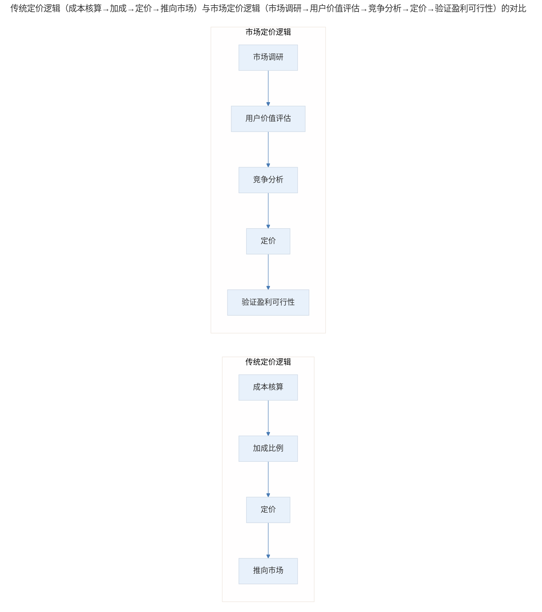
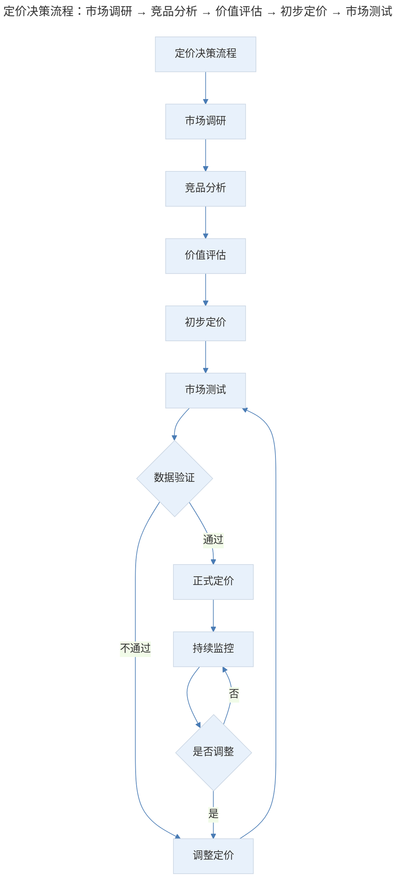
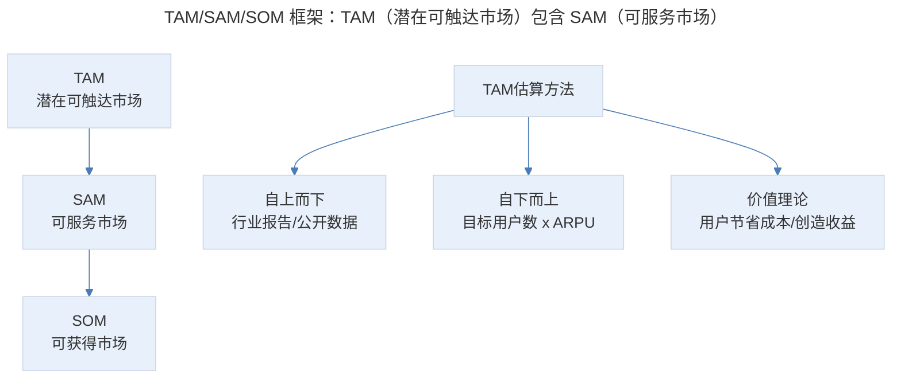
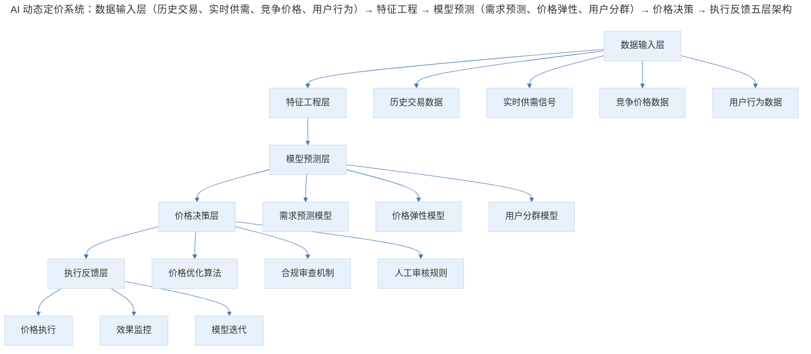
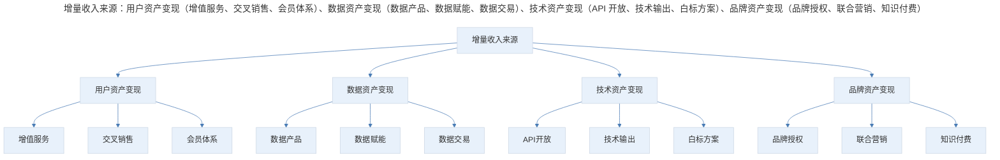

# 商业产品收入增长策略：定价与增量

## 1. 导言

本文系统阐述商业产品收入增长中的定价策略与增量收入拓展方法论。从定价的经济学原理出发，深入分析价值定价（Value-Based Pricing）、动态定价（Dynamic Pricing）、使用量定价（Usage-Based Pricing）等前沿策略，并结合市场规模评估框架（TAM/SAM/SOM），探讨增量收入流的构建与市场扩张逻辑。融入 2024-2026 年 AI 驱动动态定价、使用量计费模型与平台经济学最新实践，为资深产品经理提供定价决策与增量增长的理论支撑与操作指南。

## 2. 定价基础：经济学原理与价值定价

### 2.1 定价的本质：成本无关论

定价的核心原则在于：**价格由市场供需与用户价值认知决定，而非成本加成。**

传统成本加成定价（Cost-Plus Pricing）的逻辑为：

$$Price = Cost \times (1 + Markup\%)$$

这一方法在完全竞争市场中存在根本性缺陷——它假设企业可以自主定价，而实际上定价权属于市场。互联网行业的定价逻辑是逆向的：

$$可行性 = MarketPrice - Cost > 0$$

即先从市场获取价格信号，再向内部成本控制能力追问盈利空间。这一逻辑要求产品经理具备市场洞察力与成本管理能力的双重素养。

> 传统定价逻辑（成本核算→加成→定价→推向市场）与市场定价逻辑（市场调研→用户价值评估→竞争分析→定价→验证盈利可行性）的对比：互联网定价遵循逆向逻辑，先获取市场价格信号再追问成本空间。

### 2.2 价值定价的框架

**价值定价（Value-Based Pricing）** 的核心是量化产品为用户创造的经济价值：

$$WTP（Willingness to Pay）= 基准价值 + 差异化价值 + 转换成本$$

其中：

- **基准价值**：市场上替代方案的定价
- **差异化价值**：产品独有价值带来的增量收益
- **转换成本**：用户从现有方案迁移的成本

价值定价的实施步骤：

1. **识别用户的价值度量**：用户用什么标准衡量产品价值？
2. **量化差异化价值**：产品的独特功能为用户节省了多少成本或创造了多少收益？
3. **确定支付意愿区间**：通过调研与实验确定用户可接受的价格范围
4. **分层定价设计**：基于不同用户群体的价值感知设计差异化价格

### 2.3 定价策略的比较分析

| 定价策略 | 核心逻辑 | 适用场景 | 优势 | 劣势 |
|---------|---------|---------|------|------|
| 成本加成定价 | 成本+利润率 | 垄断市场、政府采购 | 简单可计算 | 忽视市场需求 |
| 竞争导向定价 | 参照竞品定价 | 同质化市场 | 市场适应性强 | 利润空间受限 |
| 价值定价 | 用户价值感知 | 差异化产品 | 利润空间大 | 价值量化困难 |
| 动态定价 | 实时供需匹配 | 航旅、电商、出行 | 收益最大化 | 算法复杂度高 |
| 使用量定价 | 按实际使用计费 | 云服务、API | 与用户价值对齐 | 收入可预测性低 |
| 混合定价 | 订阅+使用量 | SaaS、平台产品 | 兼顾稳定与弹性 | 模型设计复杂 |

## 3. 定价管理：定价空间与市场规模评估

### 3.1 定价空间的概念与构建

定价空间（Pricing Space）是指产品在市场约束下可调价的范围。维持充足的定价空间对商业产品至关重要：

**定价空间的作用**：为促销活动提供操作余地（满减、满赠、满返）、应对竞争压力的降价空间、为渠道分成预留利润、为产品升级提供价格阶梯。

定价空间的大小直接取决于毛利厚度：

$$定价空间 = 实际售价 - 可变成本 - 最低利润要求$$

毛利薄弱的产品在运营上捉襟见肘，无法支撑任何促销与渠道策略。因此，在产品设计阶段就应将"保持毛利厚度"作为核心约束条件。

**价格弹性（Price Elasticity）** 衡量需求对价格变化的敏感程度：

$$E_p = \frac{\% \Delta Q}{\% \Delta P}$$

| 弹性类型 | 弹性值 | 含义 | 典型案例 | 定价策略 |
|---------|-------|------|---------|---------|
| 完全弹性 | $E_p = \infty$ | 价格微变，需求巨变 | 同质化商品 | 保持价格竞争力 |
| 富有弹性 | $\|E_p\| > 1$ | 需求变化大于价格变化 | 非必需消费品 | 降价可增收 |
| 单位弹性 | $\|E_p\| = 1$ | 需求变化等于价格变化 | 部分 SaaS 产品 | 价格中性 |
| 缺乏弹性 | $\|E_p\| < 1$ | 需求变化小于价格变化 | 必需品、垄断产品 | 提价可增收 |
| 完全无弹性 | $E_p = 0$ | 价格变化不影响需求 | 不可替代品 | 价值定价 |

定价的实践原则：

**原则一：定价留有余量**——初始定价略高于心理预期，通过折扣与优惠实现实际价格调整，避免定价过低导致的"心理锚定"效应。

**原则二：调价谨慎而果断**——避免频繁波动引发用户不信任，调价前充分沟通与铺垫，调价后持续监控用户反馈与行为变化。

**原则三：经验与数据并重**——定价决策往往始于直觉判断，在经验判断的基础上，用数据验证与修正，行业经验与量化分析相辅相成。

> 定价决策流程：市场调研 → 竞品分析 → 价值评估 → 初步定价 → 市场测试，数据验证通过则正式定价并持续监控，不通过则调整定价重新测试。

### 3.2 市场规模评估与扩张策略

市场规模评估是收入增长规划的基础：

**TAM（Total Addressable Market，潜在可触达市场）**：产品理论上可覆盖的全部用户群体，代表市场天花板。计算方式：目标用户数 × 单用户年收入。

**SAM（Serviceable Available Market，可服务市场）**：产品当前能力可触达的用户群体，受地理、渠道、技术能力等约束。

**SOM（Serviceable Obtainable Market，可获得市场）**：在当前竞争环境下，产品实际可获取的市场份额，代表短期可实现的收入目标。

> TAM/SAM/SOM 框架：TAM（潜在可触达市场）包含 SAM（可服务市场），SAM 包含 SOM（可获得市场）；TAM 估算方法有自上而下（行业报告）、自下而上（用户数×ARPU）、价值理论（节省成本/创造收益）。

TAM 决定了产品的天花板，直接影响商业决策方向：

| TAM 规模 | 典型行业 | 商业策略 | 投资价值 | 竞争格局 |
|---------|---------|---------|---------|---------|
| 千亿级 | 电商、社交 | 规模优先、生态构建 | 高 | 寡头竞争 |
| 百亿级 | SaaS、内容 | 垂直深耕、效率优先 | 中高 | 差异化竞争 |
| 十亿级 | 垂直工具、细分行业 | 精细化运营、高利润率 | 中 | 利基市场 |
| 亿级以下 | 极度细分市场 | 小而美、高毛利 | 低 | 寡占或垄断 |

**关键决策逻辑**：TAM 较小的领域不适合烧钱扩张，而应追求高利润率与精细化运营。TAM 较大的领域则可投入资源换取规模，通过临界质量（Critical Mass）实现赢者通吃。

除了横向扩展用户规模，纵向提升交易频次同样是扩大市场规模的有效路径：

**频次提升策略**：场景延伸（从核心场景向关联场景扩展）、时间覆盖（从特定时段向全天候覆盖）、需求挖掘（发现并满足用户隐性需求）、习惯养成（通过产品设计培养使用习惯）。

| 产品类型 | 原始频次 | 扩展策略 | 提升后频次 | 收入增幅 |
|---------|---------|---------|-----------|---------|
| 外卖平台 | 2-3 次/天 | 增加下午茶、夜宵 | 4-5 次/天 | 60-100% |
| SaaS 工具 | 1 次/月 | 增加协作场景 | 每日使用 | 300%+ |
| 内容平台 | 2-3 次/周 | 个性化推荐+Push | 每日使用 | 100-200% |
| 出行服务 | 1-2 次/天 | 增加企业用车、接送机 | 2-3 次/天 | 50-100% |

## 4. 动态定价：AI 驱动的价格优化

### 4.1 动态定价的理论基础

动态定价（Dynamic Pricing）是指根据实时供需关系、用户特征与市场环境，动态调整价格的策略。其理论基础源于收益管理（Revenue Management）理论：

$$Maximize\ R = \sum_{i=1}^{n} P_i(t, s) \times Q_i(t, s)$$

其中 $P_i(t,s)$ 为产品 $i$ 在时间 $t$、供需状态 $s$ 下的最优价格，$Q_i(t,s)$ 为对应的需求量。

### 4.2 AI 驱动的动态定价系统

2024-2026 年，AI 技术正在重塑动态定价的实践：

**需求预测模型**：基于深度学习的需求预测、多因子融合（时间序列、天气、事件、竞争）、预测精度提升 30-50%。

**价格优化引擎**：实时计算最优价格、多目标优化（收入最大化 vs 用户满意度）、强化学习驱动的策略迭代。

**个性化定价**：基于用户画像的差异化定价、合规框架下的价格歧视、A/B 测试驱动的定价实验。

> AI 动态定价系统：数据输入层（历史交易、实时供需、竞争价格、用户行为）→ 特征工程 → 模型预测（需求预测、价格弹性、用户分群）→ 价格决策（优化算法、合规审查、人工审核）→ 执行反馈（价格执行、效果监控、模型迭代）。

### 4.3 动态定价的行业应用

| 行业 | 定价维度 | 调价频率 | AI 应用程度 | 典型案例 |
|------|---------|---------|-----------|---------|
| 航旅 | 时间、舱位、需求 | 分钟级 | 高 | 航空公司收益系统 |
| 出行 | 时间、距离、供需 | 分钟级 | 高 | Uber Surge、滴滴动态加价 |
| 电商 | 库存、竞争、用户 | 小时级 | 中高 | Amazon 动态调价 |
| SaaS | 用量、功能、企业规模 | 月级 | 中 | 按用量阶梯定价 |
| 内容 | 时效性、热度、用户 | 日级 | 中 | 限时优惠、早鸟价 |

## 5. 增量增长：增量收入流与规模扩张

### 5.1 增量收入流的构建

增量收入（Incremental Revenue）是在核心收入之外拓展的新收入来源。其设计逻辑遵循：

$$增量收入 = 现有资产 \times 新变现方式$$

增量收入构建的关键在于识别"沉睡资产"——已有但未充分变现的资源。

> 增量收入来源：用户资产变现（增值服务、交叉销售、会员体系）、数据资产变现（数据产品、数据赋能、数据交易）、技术资产变现（API 开放、技术输出、白标方案）、品牌资产变现（品牌授权、联合营销、知识付费）。

市场平台（Marketplace）具有独特的增量收入机制：

**网络效应驱动的收入增长**：双边网络效应（买方越多，卖方越多）、规模效应（交易量增加带来成本边际递减）、数据效应（交易数据反哺匹配效率）。

Marketplace 的收入构成：

| 收入类型 | 计费方式 | 占比区间 | 增长驱动 |
|---------|---------|---------|---------|
| 交易佣金 | 按 GMV 比例 | 60-80% | GMV 增长与费率优化 |
| 广告收入 | 按曝光/点击 | 10-25% | 流量价值与广告主竞争 |
| 增值服务 | 按功能/服务 | 5-15% | 卖家付费意愿与产品价值 |
| 金融服务 | 按利差/手续费 | 5-10% | 交易规模与金融渗透率 |

2024-2026 年增量收入新范式：

**AI 产品作为增量收入**：在现有产品中嵌入 AI 功能作为增值模块、AI 能力独立变现（API/SDK）、AI 驱动的效率提升转化为定价权。

**使用量定价模型（Usage-Based Pricing）**：从固定订阅转向按使用量计费，代表案例 Snowflake、OpenAI、Stripe。优势：收入随用户成功同步增长；挑战：收入可预测性降低。

**平台生态收入**：开放平台收取技术服务费、开发者生态的抽成收入、数据接口的调用收费。

| 增量模式 | 启动门槛 | 收入天花板 | 与核心业务协同 | 代表案例 |
|---------|---------|-----------|-------------|---------|
| AI 增值模块 | 中 | 中高 | 高 | Microsoft Copilot |
| 使用量计费 | 高 | 高 | 高 | AWS、Snowflake |
| 平台生态 | 高 | 极高 | 中 | Apple App Store |
| 数据产品 | 中 | 中 | 中 | Palantir、Snowflake Data Cloud |
| 品牌授权 | 低 | 低 | 低 | 各种 IP 授权 |

### 5.2 规模扩张中的成本管理

规模扩张过程中，成本增长并非总是线性的，识别非线性拐点是扩张决策的关键：

**成本非线性的三种类型**：

1. **正向非线性（规模经济）**：成本增长慢于规模增长——供应链议价权增强、技术基础设施的边际成本递减、品牌效应降低获客成本。
2. **负向非线性（规模不经济）**：成本增长快于规模增长——管理复杂度超线性增长、客服需求指数级增长、优质流量枯竭导致获客成本陡增。
3. **阶梯式非线性**：在特定阈值处成本跳升——团队扩张需要管理层级增加、技术架构需要重构、合规成本在特定规模点激增。

在规模扩张中构建边际效应是互联网产品的核心竞争优势：

| 策略 | 原理 | 实施路径 | 预期效果 |
|------|------|---------|---------|
| 产品自动化 | 将人工环节转化为自动化流程 | AI 客服、自助服务、智能引导 | 客服成本降低 50-80% |
| 技术杠杆 | 投资可规模化复用的技术架构 | 微服务、云原生、弹性伸缩 | 技术成本边际递减 |
| 数据飞轮 | 数据积累反哺产品体验 | 个性化推荐、智能匹配 | 用户价值随规模增长 |
| 平台模式 | 从自营转向撮合，降低运营成本 | 开放平台、UGC、第三方生态 | 运营成本转为可变成本 |

在扩张过程中，产品经理需要在三个维度间做出权衡：

$$扩张决策 = f(速度, 成本, 质量)$$

**核心法则**：在速度、扩张成本与获客质量三者之间，最多同时追求两个。

| 策略选择 | 追求维度 | 牺牲维度 | 适用场景 | 风险 |
|---------|---------|---------|---------|------|
| 快速低成本扩张 | 速度+成本 | 质量 | 早期抢市场 | 用户质量差、流失高 |
| 快速高质量扩张 | 速度+质量 | 成本 | 资本充裕期 | 烧钱速度快 |
| 低成本高质量扩张 | 成本+质量 | 速度 | 稳健增长期 | 错失窗口期 |

## 6. 进阶延展：趋势展望与核心要点回顾

### 6.1 关键趋势展望

本文系统阐述了商业产品收入增长中的定价策略与增量收入构建方法论。定价的本质不在于成本加成，而在于市场供需与用户价值感知；定价空间的维持为运营策略提供弹性；TAM/SAM/SOM 框架为市场规模评估提供系统方法。在 2024-2026 年，AI 驱动的动态定价、使用量计费模型与平台生态收入正在重塑收入增长的范式。

关键趋势展望：

- **AI 定价智能化**：从规则驱动向模型驱动演进
- **混合计费常态化**：订阅+使用量+价值的融合定价
- **增量收入多元化**：AI 能力、数据资产、平台生态成为新增长极
- **合规定价框架**：在监管趋严环境下设计可持续的定价策略

### 6.2 核心要点回顾

商业产品的定价与增量增长围绕两条主线展开：定价策略（价值定价、动态定价、使用量定价）决定单位价值变现能力，增量收入（用户/数据/技术/品牌资产变现）拓展新的收入来源。产品经理应遵循市场定价逻辑（先市场价格信号再成本追问）、维持充足定价空间、以 TAM/SAM/SOM 框架评估市场，并在规模扩张中识别成本非线性拐点、构建边际效应、在速度/成本/质量三维度间审慎权衡。

---

## 参考资料

- Brynjolfsson, E., & McAfee, A. (2024). *The business of artificial intelligence: What it can and cannot do for your organization*. MIT Press.
- Dolan, R. J., & Simon, H. (2023). *Power pricing: How managing price transforms the bottom line* (2nd ed.). Free Press.
- Gabor, A. (2025). *The pricing paradox: How AI is revolutionizing pricing strategy*. Harvard Business Review Press.
- Hinterhuber, A., & Liozu, S. (2024). Is innovation in pricing your next source of competitive advantage? *Business Horizons*, 67(1), 11-24.
- Monroe, K. B. (2023). *Pricing: Making profitable decisions* (5th ed.). McGraw-Hill.
- Nagle, T. T., Hogan, J., & Zale, J. (2024). *The strategy and tactics of pricing: A guide to growing more profitably* (7th ed.). Routledge.
- Osterwalder, A., Pigneur, Y., Bernarda, G., & Smith, A. (2024). *Value proposition design: How to create products and services customers want* (2nd ed.). Wiley.
- Perakis, G., & Sood, A. (2025). Competitive multi-period pricing with fixed inventories. *Management Science*, 71(3), 1456-1475.
- Simon, H. (2015). *Confessions of the pricing man: How price affects everything*. Springer.
- Williamson, O. E. (1979). Transaction-cost economics: The governance of contractual relations. *Journal of Law and Economics*, 22(2), 233-261.