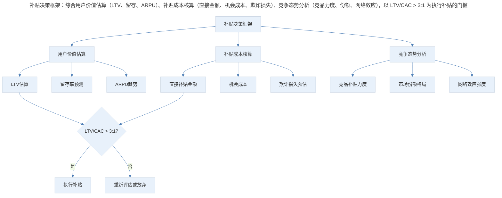
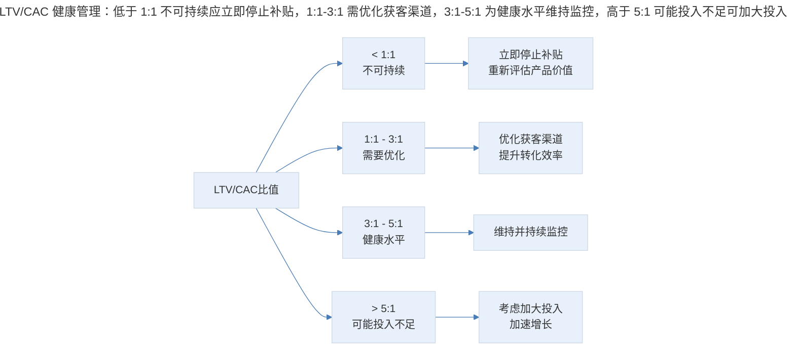
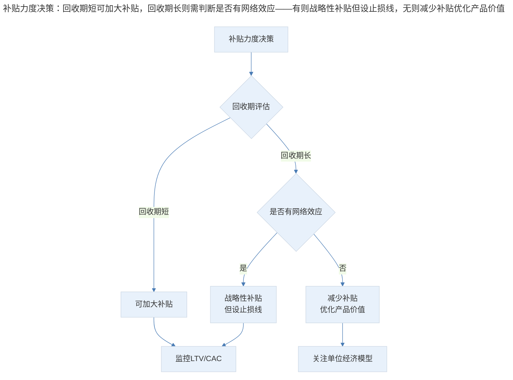
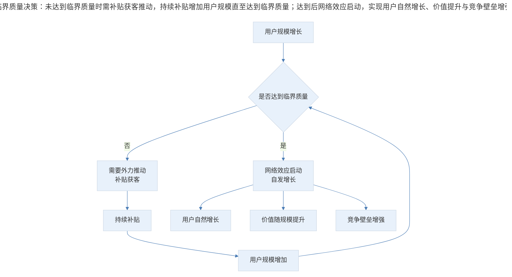
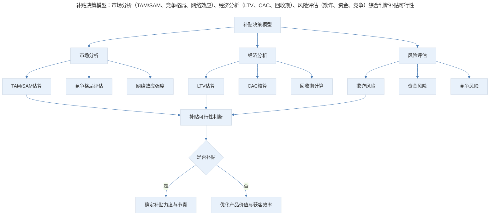

# 补贴获客的商业逻辑与经济学分析

## 1. 导言

本文从经济学视角系统分析补贴获客（Subsidy-Driven Acquisition）的商业逻辑，深入阐述 LTV/CAC 经济学模型、投资回收期（Payback Period）计算框架、临界质量（Critical Mass）与网络效应补贴策略。结合 2024-2026 年单位经济模型（Unit Economics）的纪律性回归、AI 优化的获客成本管理与反欺诈技术，为资深产品经理提供补贴决策的理论依据与实操框架。

## 2. 补贴逻辑：投资而非支出

### 2.1 补贴的本质

补贴获客的商业本质是将当期利润转化为用户资产投资。其核心逻辑为：

$$补贴价值 = \sum_{t=1}^{T} \frac{R_t - C_t}{(1+r)^t} - Subsidy > 0$$

其中 $R_t$ 为用户在第 $t$ 期贡献的收入，$C_t$ 为服务该用户的边际成本，$r$ 为折现率，$Subsidy$ 为获客补贴金额。

当用户的生命周期净现值（NPV）大于获客补贴时，补贴行为在经济学上是合理的。关键在于准确估算各项参数，而非凭直觉判断。

> 补贴决策框架：综合用户价值估算（LTV、留存、ARPU）、补贴成本核算（直接金额、机会成本、欺诈损失）、竞争态势分析（竞品力度、份额、网络效应），以 LTV/CAC > 3:1 为执行补贴的门槛。

### 2.2 补贴的合理性边界

补贴并非所有场景下的最优策略，其合理性取决于以下条件：

**必要条件**：补贴换取的资源具有稀缺性且可被耗尽——市场资源有限，先到先得；网络效应存在，规模带来正反馈；用户迁移成本高，先发优势显著。

**充分条件**：补贴换来的用户资产价值超过投入——LTV 显著高于 CAC；投资回收期在可接受范围内；具备持续服务与变现能力。

| 补贴场景 | 合理性判断 | 关键风险 | 典型案例 |
|---------|-----------|---------|---------|
| 网络效应驱动 | 高合理性 | 补贴未能触发临界质量 | 滴滴、美团 |
| 习惯养成驱动 | 中合理性 | 补贴停止后用户流失 | 外卖平台、出行 |
| 市场份额竞争 | 中合理性 | 陷入价格战，利润归零 | 电商促销 |
| 无壁垒产品 | 低合理性 | 无法建立可持续竞争优势 | 同质化工具产品 |

### 2.3 补贴失败的典型模式

| 失败模式 | 特征 | 根因 | 预防措施 |
|---------|------|------|---------|
| 无底洞补贴 | 补贴无法停止，停止即崩溃 | 未建立用户粘性 | 同步构建产品壁垒 |
| 欺诈性消耗 | 大量补贴被刷单/套利消耗 | 风控体系缺失 | 反欺诈机制先行 |
| 估值泡沫 | 补贴驱动增长不可持续 | 忽视单位经济模型 | 严格 LTV/CAC 约束 |
| 价格锚定 | 补贴价格成为用户心理价位 | 长期低价破坏价值认知 | 限时补贴+价值传递 |

## 3. 经济模型：LTV/CAC 与投资回收期

### 3.1 LTV 的精确计算

**生命周期价值（Lifetime Value, LTV）** 是补贴决策的核心输入参数，其精确计算至关重要：

**简单模型**：

$$LTV = ARPU \times \frac{1}{ChurnRate} = ARPU \times ARL$$

其中 $ARL$（Average Retention Length）为用户平均留存时长。

**折现模型**：

$$LTV = \sum_{t=1}^{\infty} \frac{MRR_t \times S(t)}{(1+d)^t}$$

其中 $MRR_t$ 为第 $t$ 月的经常性收入，$S(t)$ 为留存率函数，$d$ 为月折现率。

**含毛利的模型**：

$$LTV = \sum_{t=1}^{\infty} \frac{(ARPU_t - VariableCost_t) \times S(t)}{(1+d)^t}$$

| 参数 | 定义 | 计算方法 | 常见错误 |
|------|------|---------|---------|
| ARPU | 单用户平均收入 | 总收入/活跃用户数 | 混淆付费与活跃用户 |
| 留存率 | 用户持续使用比例 | 队列分析（Cohort Analysis） | 忽略用户异质性 |
| 毛利率 | 收入减去可变成本的比率 | 毛利/收入 | 错误分类固定与可变成本 |
| 折现率 | 资金时间价值 | WACC 或行业平均 | 使用过高或过低折现率 |

### 3.2 CAC 的全面核算

**用户获取成本（Customer Acquisition Cost, CAC）** 的核算需要包含所有直接与间接成本：

$$CAC = \frac{总获客支出}{新增付费用户数}$$

$$CAC_{Fully Loaded} = \frac{营销支出 + 销售支出 + 获客相关人力成本}{新增付费用户数}$$

| 成本类别 | 包含项目 | 常见遗漏 |
|---------|---------|---------|
| 营销支出 | 广告费、活动费、内容制作费 | 品牌建设的长期投入 |
| 销售支出 | 销售团队薪酬、提成、差旅 | 销售管理成本 |
| 技术支持 | 获客相关工具、数据平台 | A/B 测试基础设施 |
| 渠道成本 | 分销佣金、渠道返点 | 渠道维护人力 |
| 欺诈损失 | 刷单、套利、虚假用户 | 间接的品牌损害 |

### 3.3 LTV/CAC 比值的健康管理

LTV/CAC 比值是评估补贴效率的核心指标：

> LTV/CAC 健康管理：低于 1:1 不可持续应立即停止补贴，1:1-3:1 需优化获客渠道，3:1-5:1 为健康水平维持监控，高于 5:1 可能投入不足可加大投入。

| LTV/CAC | 判断 | 行动建议 | 适用阶段 |
|---------|------|---------|---------|
| < 1:1 | 严重亏损 | 停止补贴，重新评估商业模式 | 任何阶段 |
| 1:1 - 2:1 | 模型不健康 | 优化转化率或 ARPU | 早期验证阶段 |
| 2:1 - 3:1 | 基本可行 | 持续优化，关注回收周期 | 成长阶段 |
| 3:1 - 5:1 | 健康 | 维持投入，关注规模 | 扩张阶段 |
| > 5:1 | 可能保守 | 考虑加大获客投入 | 成熟阶段 |

### 3.4 投资回收期分析

**投资回收期（Payback Period）** 衡量获客投入从用户收入中回收所需的时间：

**简单回收期**：

$$Payback Period = \frac{CAC}{Monthly ARPU \times Gross Margin}$$

**折现回收期**：

$$\min T : \sum_{t=1}^{T} \frac{R_t - VC_t}{(1+r)^t} \geq CAC$$

| 行业 | 健康回收期 | 可接受回收期 | 预警阈值 |
|------|-----------|------------|---------|
| SMB SaaS | 3-6 个月 | 6-12 个月 | >18 个月 |
| Enterprise SaaS | 12-18 个月 | 18-24 个月 | >36 个月 |
| 消费互联网 | 首次交易即可 | 1-3 个月 | >6 个月 |
| 电商 | 首次交易即可 | 1-2 个月 | >3 个月 |
| 内容付费 | 1-3 个月 | 3-6 个月 | >12 个月 |

回收期与补贴策略的关联：

> 补贴力度决策：回收期短可加大补贴，回收期长则需判断是否有网络效应——有则战略性补贴但设止损线，无则减少补贴优化产品价值。

回收期的影响因素：

| 影响因素 | 对回收期的影响 | 优化方向 |
|---------|-------------|---------|
| ARPU 水平 | ARPU 越高，回收越快 | 定价优化、增值服务 |
| 毛利率 | 毛利率越高，回收越快 | 成本结构优化 |
| 留存率 | 留存越高，LTV 越大 | 产品体验、用户运营 |
| 付费转化率 | 转化越高，有效 CAC 越低 | 漏斗优化 |
| 补贴力度 | 补贴越大，CAC 越高 | 精准补贴、反欺诈 |
| 季节性 | 旺季回收快，淡季回收慢 | 预算动态调整 |

## 4. 补贴策略：临界质量与网络效应

### 4.1 临界质量（Critical Mass）的概念

**临界质量（Critical Mass）** 源自核物理学，指维持核链式反应所需的裂变材料最低质量。在商业语境中，临界质量指使商业模式实现自我增强式增长所需的最低用户规模。

临界质量的商业意义：

- 达到临界质量后，网络效应驱动自发增长
- 未达到临界质量，增长需要持续外力推动
- 临界质量的存在是补贴策略的理论基础

$$网络效应强度 = f(用户规模, 连接密度, 互动频率)$$

> 临界质量决策：未达到临界质量时需补贴获客推动，持续补贴增加用户规模直至达到临界质量；达到后网络效应启动，实现用户自然增长、价值提升与竞争壁垒增强。

### 4.2 临界质量的决定因素

临界质量的大小取决于市场资源的稀缺程度：

- 市场越大，临界质量越高，赢者通吃的难度越大
- 市场越小，临界质量越低，垄断越容易实现

| 市场特征 | 临界质量 | 补贴策略 | 典型案例 |
|---------|---------|---------|---------|
| 大众消费市场 | 高（百万-千万级） | 需巨额资本 | 滴滴、美团 |
| 垂直专业市场 | 中（万-十万级） | 适度补贴 | 医疗、法律 SaaS |
| 双边市场 | 双侧临界质量 | 交叉补贴 | 招聘平台、房产平台 |
| 内容市场 | 创作者侧临界质量 | 补贴创作者 | 短视频、知识付费 |

### 4.3 临界质量与补贴目标设定

补贴策略的终极目标是快速达到临界质量。设定补贴目标时需要：

1. **识别关键资源**：哪侧资源更稀缺、更可能被耗尽？
2. **估算临界规模**：达到临界质量需要多少用户/内容/供给？
3. **计算补贴预算**：达到临界规模需要的总补贴投入
4. **设定时间窗口**：补贴必须在多长时间内完成目标

**关键原则**：补贴必须为可耗尽的稀缺资源而进行。若市场资源近乎无限，则补贴无法催生临界质量，补贴策略本身不可行。

### 4.4 盈亏平衡点与补贴的关系

**盈亏平衡点（Break-Even Point, BEP）** 是总收入等于总成本时的业务规模：

$$BEP = \frac{固定成本}{单位毛利}$$

补贴策略的本质是将盈亏平衡点后移：通过低毛利甚至负毛利换取规模增长，在达到临界质量后重新实现盈利。

| 阶段 | 毛利状态 | 关键目标 | 风险管理 |
|------|---------|---------|---------|
| 补贴期 | 负毛利 | 快速达到临界质量 | 资金消耗速度监控 |
| 临界质量达成 | 接近零毛利 | 验证网络效应 | 用户留存与活跃度 |
| 过渡期 | 逐步转正 | 减少补贴不流失用户 | 补贴退出节奏控制 |
| 盈利期 | 正常毛利 | 持续盈利增长 | 竞争防御与生态建设 |

## 5. 实践指南：补贴决策的量化框架

### 5.1 补贴决策模型

> 补贴决策模型：市场分析（TAM/SAM、竞争格局、网络效应）、经济分析（LTV、CAC、回收期）、风险评估（欺诈、资金、竞争）综合判断补贴可行性，决定是否补贴及力度与节奏。

### 5.2 补贴预算的动态管理

补贴预算不应是固定值，而应根据实时数据动态调整：

| 监控指标 | 预警阈值 | 响应动作 |
|---------|---------|---------|
| 实际 CAC | > 预期 CAC 30% | 暂停补贴，分析原因 |
| LTV/CAC | < 2:1 | 减少补贴力度 50% |
| 欺诈率 | > 5% | 启动反欺诈紧急响应 |
| 回收期 | > 2 倍预期 | 重新评估补贴策略 |
| 用户 7 日留存 | < 20% | 优化产品体验后再补贴 |

### 5.3 补贴退出的策略设计

补贴的退出与进入同样重要：

**渐进式退出**：逐步降低补贴力度、从价格补贴转向价值补贴、用服务替代金钱补贴。

**条件式退出**：设定补贴退出的触发条件、达到临界质量后自动减少补贴、基于用户行为数据的动态退出。

**替代式退出**：用社交裂变替代付费获客、用品牌效应替代渠道投放、用产品驱动增长（PLG）替代补贴驱动增长。

## 6. 进阶延展：2024-2026 新范式与核心要点回顾

### 6.1 单位经济模型的纪律性回归

2024-2026 年，资本市场对补贴获客的态度发生根本性转变：从"增长优先"到"单位经济优先"。投资人要求 LTV/CAC > 3:1 的验证，回收期从 24 个月缩短至 12 个月，现金流健康度成为融资核心指标。

| 指标 | 2019-2021 标准 | 2024-2026 标准 | 变化趋势 |
|------|-------------|-------------|---------|
| LTV/CAC | > 1.5:1 | > 3:1 | 趋严 |
| 回收期 | < 24 个月 | < 12 个月 | 趋严 |
| 毛利率 | > 50% | > 65% | 趋严 |
| NRR | > 100% | > 115% | 趋严 |
| 现金流 | 可亏损 | 接近盈亏平衡 | 趋严 |

### 6.2 AI 优化的获客成本管理

AI 技术正在重塑获客成本管理的各个环节：

**智能获客渠道优化**：AI 预测各渠道用户质量与 LTV、实时调整渠道预算分配、自动识别低效渠道并止损。

**AI 驱动的用户质量预测**：基于早期行为预测用户 LTV、实时识别高价值用户并加大投入、自动过滤低质量与欺诈流量。

**自动化补贴优化**：AI 实时计算最优补贴金额、个性化补贴策略（不同用户给予不同补贴）、动态调整补贴力度以最大化 ROI。

| AI 应用场景 | 技术方案 | 效果提升 | 实施难度 |
|-----------|---------|---------|---------|
| 渠道质量预测 | 机器学习+多触点归因 | CAC 降低 15-30% | 中 |
| 用户 LTV 预测 | 深度学习+行为建模 | 补贴 ROI 提升 20-40% | 中高 |
| 欺诈检测 | 异常检测+图神经网络 | 欺诈损失减少 50-80% | 高 |
| 个性化补贴 | 强化学习+用户分群 | 转化率提升 10-25% | 高 |
| 动态出价 | 实时竞价+预测模型 | 获客成本降低 10-20% | 中 |

### 6.3 反欺诈技术的演进

补贴获客面临的最大风险之一是欺诈性消耗：

**常见欺诈类型**：刷单（伪造交易获取补贴）、羊毛党（批量注册获取新用户补贴）、套利（利用价格差进行套利）、机器人（自动化脚本消耗补贴）。

**2024-2026 年反欺诈技术栈**：

| 技术层级 | 技术方案 | 防护范围 | 漏检率 |
|---------|---------|---------|-------|
| 规则引擎 | 频率限制、黑名单、异常规则 | 已知欺诈模式 | 中 |
| 机器学习 | 异常检测、行为分析 | 新型欺诈模式 | 低 |
| 图分析 | 关系网络、团伙识别 | 组织化欺诈 | 极低 |
| 设备指纹 | 设备识别、环境检测 | 设备级欺诈 | 低 |
| 生物特征 | 人脸识别、行为生物特征 | 身份冒用 | 极低 |

### 6.4 核心要点回顾

补贴获客是一把双刃剑。补贴的本质是投资而非支出——当用户生命周期净现值大于获客补贴时，补贴在经济学上才合理。LTV/CAC 经济学模型与投资回收期分析框架是补贴决策的核心工具，临界质量与网络效应是补贴策略的逻辑基础（补贴必须为可耗尽的稀缺资源而进行）。2024-2026 年的市场环境要求产品经理以更严格的单位经济模型纪律审视补贴策略，同时利用 AI 技术优化获客效率与反欺诈能力。关键趋势：单位经济优先、AI 驱动精准补贴、反欺诈智能化、PLG 替代补贴。

---

## 参考资料

- Besen, S. M., & Farrell, J. (1994). Choosing how to compete: Strategies and tactics for standardization. *Journal of Economic Perspectives*, 8(2), 117-131.
- Cabral, L. (2025). Towards a theory of platform dynamics. *Journal of Economics & Management Strategy*, 34(1), 1-22.
- Eisenmann, T., Parker, G., & Van Alstyne, M. (2016). *Platform revolution: How networked markets are transforming the economy—and how to make them work for you*. W. W. Norton & Company.
- Katz, M. L., & Shapiro, C. (1985). Network externalities, competition, and compatibility. *The American Economic Review*, 75(3), 424-440.
- Metrick, A., & Yasuda, A. (2025). *Venture capital and the finance of innovation* (3rd ed.). Wiley.
- Rochet, J. C., & Tirole, J. (2003). Platform competition in two-sided markets. *Journal of the European Economic Association*, 1(4), 990-1029.
- Stern, I., & Henderson, A. D. (2024). Within-business diversification in technology-intensive industries. *Strategic Management Journal*, 45(3), 457-487.
- Thiel, P., & Masters, B. (2014). *Zero to one: Notes on startups, or how to build the future*. Crown Business.
- Varian, H. R. (2025). *Intermediate microeconomics: A modern approach* (10th ed.). W.W. Norton & Company.
- Zott, C., & Amit, R. (2010). Business model design: An activity system perspective. *Long Range Planning*, 43(2-3), 216-226.