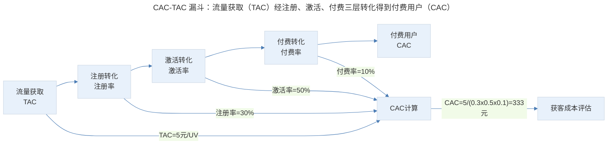
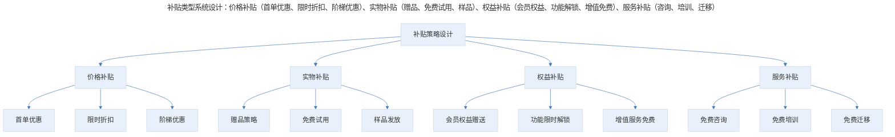
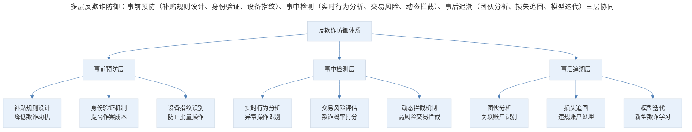
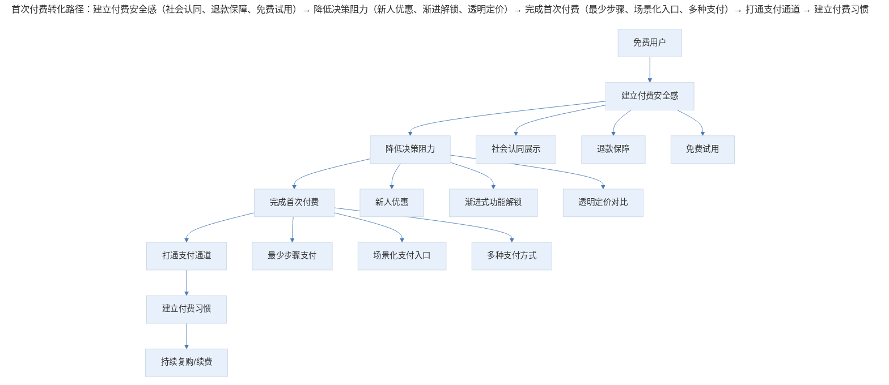
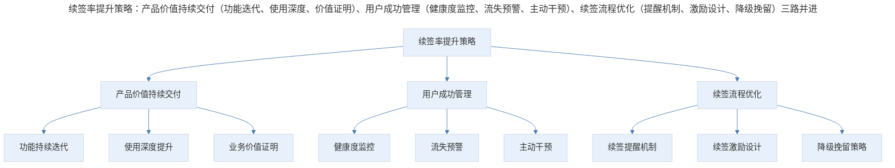
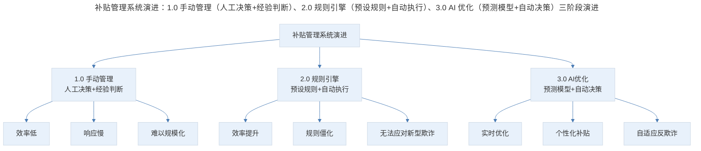
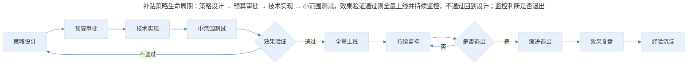

# 补贴策略的设计原则与实施框架

## 1. 导言

本文系统阐述补贴策略的设计原则与实施框架，涵盖 CAC/TAC 管理、LTV 驱动策略、首次付费体验设计、用户续签机制与欺诈防御体系。结合 2024-2026 年 AI 反欺诈技术、自动化补贴优化与产品驱动增长（PLG）的最新实践，为资深产品经理提供补贴策略从设计到执行、从监控到退出的全周期管理方法论。

## 2. 基础度量：获客成本的精细化管理

### 2.1 CAC 与 TAC 的系统性管理

**用户获取成本（Customer Acquisition Cost, CAC）** 与 **流量获取成本（Traffic Acquisition Cost, TAC）** 是补贴策略的基础度量指标：

$$CAC = \frac{营销支出 + 销售支出 + 补贴支出}{新增付费用户数}$$

$$TAC = \frac{流量获取总支出}{新增流量单位（UV/下载/注册）}$$

CAC 与 TAC 的差异在于：TAC 衡量获取流量的成本，CAC 衡量获取付费用户的成本。两者之间的转化效率反映了产品的变现能力。

$$CAC = \frac{TAC}{ConversionRate}$$

> CAC-TAC 漏斗：流量获取（TAC）经注册、激活、付费三层转化得到付费用户（CAC），CAC = TAC / 转化率，示例中 CAC = 5/(0.3×0.5×0.1) = 333 元。

### 2.2 获客成本的行业基准

不同行业与产品类型的 CAC 差异显著，产品经理需要建立行业对标意识：

| 行业/产品 | CAC 范围 | 客单价 | LTV/CAC | 回收期 | 获客方式 |
|----------|--------|-------|---------|-------|---------|
| SMB SaaS | $100-$500 | $50-$200/月 | 3-5:1 | 3-6 月 | 数字营销+PLG |
| Enterprise SaaS | $5,000-$30,000 | $5,000-$50,000/月 | 3-5:1 | 12-24 月 | 销售驱动 |
| 消费 App | $1-$10 | $5-$50/次 | 3-10:1 | 首次交易 | 效果广告+裂变 |
| 电商平台 | $10-$50 | $100-$500/年 | 4-8:1 | 1-3 月 | 效果广告+SEO |
| 内容订阅 | $5-$30 | $10-$30/月 | 5-15:1 | 1-3 月 | 内容营销+裂变 |

### 2.3 构建低 CAC 的竞争壁垒

持续低于行业平均的 CAC 是最核心的竞争优势之一，其构建路径包括：

**自然流量体系**：SEO/ASO 优化构建长期流量基础、内容营销建立品牌认知与信任、口碑传播实现零成本获客。

**产品驱动增长（PLG, Product-Led Growth）**：产品体验本身驱动用户获取与转化、免费版/试用版降低获客门槛、病毒式传播机制嵌入产品设计。

**社交裂变机制**：邀请奖励激发用户传播、团购/拼团实现社交获客、分享激励设计降低传播摩擦。

| 低 CAC 策略 | 实施难度 | 见效周期 | 长期价值 | 适用阶段 |
|----------|---------|---------|---------|---------|
| SEO/ASO | 中 | 3-12 个月 | 极高 | 全阶段 |
| 内容营销 | 中 | 6-18 个月 | 高 | 成长与成熟期 |
| PLG | 高 | 3-6 个月 | 极高 | 产品验证后 |
| 社交裂变 | 中 | 1-3 个月 | 中 | 增长期 |
| 品牌建设 | 高 | 12-36 个月 | 极高 | 成熟期 |

## 3. 设计原则：补贴策略的核心框架

### 3.1 补贴设计的五大原则

**原则一：目标导向原则**——每一笔补贴必须有明确的商业目标，目标可量化（获客数量、转化率提升、GMV 增长），补贴结束后目标行为应具有持续性。

**原则二：精准投放原则**——补贴应投向高价值用户群体，利用用户画像与行为数据进行精准投放，避免大面积撒网式的低效补贴。

**原则三：预算约束原则**——设定明确的补贴预算上限，建立实时监控机制，超预算自动熔断，补贴 ROI 实时计算与阈值预警。

**原则四：反欺诈优先原则**——补贴上线前必须完成反欺诈机制建设，补贴设计应从源头降低欺诈风险，实时监控异常行为，快速响应。

**原则五：退出机制预设原则**——补贴策略上线前即设计退出方案，设定补贴退出的触发条件与时间表，确保补贴退出后用户行为可持续。

### 3.2 补贴类型的系统设计

> 补贴类型系统设计：价格补贴（首单优惠、限时折扣、阶梯优惠）、实物补贴（赠品、免费试用、样品）、权益补贴（会员权益、功能解锁、增值免费）、服务补贴（咨询、培训、迁移）。

| 补贴类型 | 适用场景 | 用户感知 | 欺诈风险 | 退出难度 |
|---------|---------|---------|---------|---------|
| 直接降价 | 促销活动、竞争应对 | 价值感知强 | 高（套利风险） | 难（价格锚定） |
| 满减/满返 | 提升客单价 | 刺激性强 | 中 | 中 |
| 新人专享 | 首次获客 | 归属感强 | 中（注册欺诈） | 易 |
| 免费试用 | SaaS/工具产品 | 体验驱动 | 低 | 易 |
| 邀请奖励 | 社交裂变 | 双边激励 | 高（刷邀请） | 中 |
| 充值赠送 | 提升用户粘性 | 锁定效应强 | 低 | 难（存量用户） |

### 3.3 补贴力度的量化决策

补贴力度的确定需要系统化的量化分析：

$$最优补贴 = \arg\max_{S} [f(S) \times LTV_{predicted}(S) - S]$$

其中 $f(S)$ 为补贴力度 $S$ 下的获客数量函数，$LTV_{predicted}(S)$ 为该补贴力度下获取用户的预测 LTV。

补贴力度的决策矩阵：

| 市场阶段 | 竞争强度 | 网络效应 | 建议补贴力度 | 补贴方向 |
|---------|---------|---------|------------|---------|
| 早期探索 | 低 | 弱 | 低（5-15% 折扣） | 体验优化为主 |
| 快速增长 | 高 | 强 | 高（50-100% 补贴） | 规模优先 |
| 竞争胶着 | 极高 | 强 | 极高（可能负毛利） | 临界质量冲刺 |
| 格局确定 | 低 | 强 | 低（维护性补贴） | 留存与复购 |
| 成熟稳定 | 中 | 稳定 | 极低或无 | 效率优先 |

## 4. 执行机制：欺诈防御与首次付费体验

### 4.1 欺诈防御体系

补贴策略面临的最大执行风险是欺诈性消耗，需要系统性的防御体系：

| 欺诈类型 | 作案手法 | 损失特征 | 检测难度 |
|---------|---------|---------|---------|
| 虚假注册 | 批量注册新账户获取新人优惠 | 单账户损失小，总量大 | 中 |
| 刷单套利 | 伪造交易获取补贴与返现 | 补贴+商品双重损失 | 高 |
| 邀请作弊 | 自邀请或组织化互邀 | 邀请奖励成本激增 | 中 |
| 设备欺诈 | 模拟器/改机绕过设备限制 | 新人优惠被批量获取 | 中高 |
| 代理套利 | 低价购入高价转卖 | 破坏价格体系 | 高 |

多层反欺诈防御体系：

> 多层反欺诈防御：事前预防（补贴规则设计、身份验证、设备指纹）、事中检测（实时行为分析、交易风险、动态拦截）、事后追溯（团伙分析、损失追回、模型迭代）三层协同。

**事前预防：补贴规则设计**——延迟发放（补贴分批发放，降低即时套利动机）、条件绑定（补贴与真实行为绑定，如完成首单后发放）、额度限制（单用户/单设备补贴上限）、实名要求（关键补贴环节要求实名认证）。

**事中检测：实时风险评估**——行为异常检测（操作频率、时间模式、设备切换）、交易风险评估（金额、频次、商品组合异常）、关联分析（IP、设备、收货地址关联性）、AI 评分模型（综合多维度实时欺诈概率评分）。

**事后追溯：损失控制**——团伙识别（图分析识别欺诈网络）、资金追踪（追踪异常资金流向）、规则迭代（基于新发现更新检测规则）、损失追回（冻结账户、追回补贴）。

2024-2026 年 AI 反欺诈技术：

| 技术方案 | 核心能力 | 防护效果 | 实施成本 |
|---------|---------|---------|---------|
| 图神经网络（GNN） | 欺诈团伙识别 | 高级团伙检出率>90% | 高 |
| 联邦学习 | 跨平台欺诈情报 | 跨平台欺诈识别提升 40% | 高 |
| 行为生物特征 | 设备与操作者识别 | 账户盗用检出率>95% | 中 |
| 实时流处理 | 毫秒级欺诈判断 | 实时拦截率>85% | 中高 |
| 大语言模型 | 欺诈文本/话术识别 | 社工攻击识别率>80% | 中 |

### 4.2 首次付费体验设计

首次付费是用户生命周期中最关键的转化节点，其战略意义体现在：

1. **心理突破**：付费行为打破免费使用的心理屏障
2. **支付通道**：首次付费建立支付方式绑定
3. **价值验证**：付费行为验证用户对产品价值的认可
4. **数据积累**：付费用户行为数据更丰富，便于个性化运营

> 首次付费转化路径：建立付费安全感（社会认同、退款保障、免费试用）→ 降低决策阻力（新人优惠、渐进解锁、透明定价）→ 完成首次付费（最少步骤、场景化入口、多种支付）→ 打通支付通道 → 建立付费习惯 → 持续复购/续费。

首次付费体验的设计要素：

**建立付费安全感**：

| 策略 | 实施方式 | 心理学原理 | 效果评估 |
|------|---------|-----------|---------|
| 社会认同 | 用户评价、权威背书、使用数据 | 从众效应 | 转化率提升 15-25% |
| 退款保障 | 7 天无理由退款、价格保护 | 损失厌恶缓解 | 转化率提升 20-30% |
| 免费试用 | 14 天/30 天免费试用 | 禀赋效应 | 试用转付费率 20-40% |
| 安全认证 | 支付安全标识、隐私政策 | 信任建立 | 转化率提升 5-10% |

**降低决策阻力**：新用户专享优惠（首单折扣、首月特价）、渐进式功能解锁（先体验核心功能，再解锁高价值功能）、透明的定价与功能对比表、清晰的价值主张与场景化展示。

**优化支付流程**：支付入口与使用场景无缝衔接、支持主流支付方式（微信、支付宝、信用卡、Apple Pay）、自动填充已保存的支付信息、支付成功后即时开通服务。

**首次付费后的持续运营**：打通持续付费路径（绑定自动续费选项、增值服务推荐与交叉销售、会员升级路径设计）；强化付费价值感知（付费功能使用引导、付费权益定期提醒、付费用户专属服务）。

## 5. 长期运营：用户续签与 LTV 提升

### 5.1 续签率的核心地位

**续签率（Renewal Rate）** 或 **净收入留存率（Net Revenue Retention, NRR）** 是评估商业产品价值的黄金指标：

$$NRR = \frac{期初MRR + 增购MRR - 降级MRR - 流失MRR}{期初MRR} \times 100\%$$

| NRR 水平 | 含义 | 行业评价 | 典型企业 |
|---------|------|---------|---------|
| > 130% | 极强扩展能力 | 顶级 | Snowflake, Datadog |
| 120-130% | 强扩展能力 | 优秀 | Salesforce, ServiceNow |
| 110-120% | 良好扩展能力 | 良好 | 多数优秀 SaaS |
| 100-110% | 基本持平 | 及格 | 一般 SaaS |
| < 100% | 收入流失 | 不及格 | 需要改进 |

### 5.2 续签率提升的系统策略

> 续签率提升策略：产品价值持续交付（功能迭代、使用深度、价值证明）、用户成功管理（健康度监控、流失预警、主动干预）、续签流程优化（提醒机制、激励设计、降级挽留）三路并进。

**产品价值持续交付**：定期发布功能更新与改进、提供使用数据报告量化产品价值、主动引导用户探索新功能。

**用户成功管理（Customer Success）**：建立用户健康度评分体系、设置流失预警指标与阈值、主动干预高风险用户。

**续签流程优化**：提前 30-60 天启动续签沟通、长期合约给予价格优惠、降级挽留策略（了解降级原因，提供替代方案）。

### 5.3 LTV 提升与收费模式匹配

LTV 的提升依赖两个核心过程：**让更多人付费** 与 **让付费的人持续付费**。

| 提升路径 | 策略 | 关键指标 | 实施要点 |
|---------|------|---------|---------|
| 扩大付费面 | 降低付费门槛、优化转化漏斗 | 付费转化率 | 首次付费体验设计 |
| 提升客单价 | 增值服务、套餐升级、交叉销售 | ARPU | 价值阶梯设计 |
| 延长付费周期 | 留存优化、续签激励、自动续费 | 留存率/续签率 | 用户成功管理 |
| 降低流失 | 流失预警、主动挽留、降级替代 | 流失率 | 数据驱动干预 |

在 ToB 产品中，产品经理需要站在用户角度重新分析商业模型：

**用户的成本视角**：产品的收费是用户的成本，收费方式影响用户的成本结构，用户更接受与自身收入结构匹配的收费方式。

| 收费方式 | 用户成本类型 | 适用用户 | 用户接受度 | 收入可预测性 |
|---------|-----------|---------|-----------|------------|
| 固定订阅 | 固定成本 | 需求稳定的企业 | 高 | 高 |
| 按用量计费 | 可变成本 | 需求波动的企业 | 高 | 低 |
| 交易抽成 | 可变成本 | 交易型业务 | 中 | 中 |
| 按席位收费 | 固定成本 | 团队型用户 | 高 | 中高 |
| 混合模式 | 固定+可变 | 多样化需求 | 高 | 中 |

## 6. 进阶延展：自动化优化、全周期管理与核心要点回顾

### 6.1 自动化补贴优化系统

传统的补贴管理依赖人工决策与经验判断，2024-2026 年正转向 AI 驱动的自动化优化系统：

> 补贴管理系统演进：1.0 手动管理（人工决策，效率低、响应慢）、2.0 规则引擎（预设规则自动执行，效率提升但规则僵化）、3.0 AI 优化（预测模型自动决策，实现实时优化、个性化补贴、自适应反欺诈）。

AI 驱动的补贴优化架构：

| 系统模块 | 功能 | AI 技术 | 输出 |
|---------|------|--------|------|
| 用户价值预测 | 预测用户 LTV | 生存分析+深度学习 | 用户 LTV 评分 |
| 补贴金额优化 | 计算最优补贴金额 | 强化学习 | 个性化补贴方案 |
| 欺诈实时检测 | 识别欺诈行为 | 图神经网络+异常检测 | 欺诈风险评分 |
| 效果归因分析 | 多触点归因 | 因果推断+SHAP | 补贴效果归因 |
| 动态预算分配 | 实时预算优化 | 多臂老虎机（MAB） | 渠道预算分配 |

自动化补贴的实施路径：

**第一阶段：数据基础设施建设**——建立用户行为数据采集体系、搭建实时数据处理管道、构建用户画像与标签体系。

**第二阶段：规则引擎与监控体系**——将人工决策经验转化为规则引擎、建立补贴效果实时监控看板、实现异常行为自动报警。

**第三阶段：AI 模型引入与优化**——部署用户 LTV 预测模型、实现个性化补贴金额推荐、上线 AI 驱动的反欺诈系统。

**第四阶段：全自动化闭环**——强化学习驱动的补贴策略自动迭代、实时效果评估与策略调整、人机协同的异常处理机制。

### 6.2 补贴策略的全周期管理

> 补贴策略生命周期：策略设计 → 预算审批 → 技术实现 → 小范围测试，效果验证通过则全量上线并持续监控，不通过回到设计；监控判断是否退出，退出后进行效果复盘与经验沉淀。

补贴效果的评估框架：

| 评估维度 | 核心指标 | 计算方式 | 评估周期 |
|---------|---------|---------|---------|
| 获客效率 | 补贴后 CAC | 补贴总支出/新增付费用户 | 每周 |
| 用户质量 | 补贴用户 LTV | 队列分析追踪 | 每月 |
| ROI | 补贴投资回报率 | LTV/CAC | 每季度 |
| 欺诈率 | 欺诈消耗占比 | 欺诈消耗/补贴总支出 | 每日 |
| 存量影响 | 价格锚定效应 | 补贴用户与非补贴用户付费行为对比 | 每月 |

补贴退出的核心挑战在于避免用户流失与活跃度下降：

**渐进式退出策略**：阶段性降低补贴力度（如从 50% 逐步降至 0%）、用服务替代金钱补贴（如从折扣转为增值服务）、从普遍补贴转向精准补贴（仅补贴高价值用户）。

**替代性增长机制**：产品驱动增长（PLG）替代补贴驱动增长、品牌效应替代渠道投放、社交裂变替代付费获客。

| 退出方式 | 适用场景 | 退出速度 | 用户流失风险 |
|---------|---------|---------|------------|
| 一次性停止 | 小规模补贴 | 快 | 高 |
| 渐进降低 | 大规模补贴 | 慢 | 中 |
| 条件替换 | 活跃用户补贴 | 中 | 低 |
| 权益转换 | 会员类补贴 | 中 | 低 |

### 6.3 核心要点回顾

补贴策略的全周期管理包含五大环节：CAC/TAC 精细化管理（精准度量获客效率）、补贴设计五大原则（目标导向、精准投放、预算约束、反欺诈优先、退出预设）、欺诈防御体系（事前/事中/事后三层）、首次付费体验设计（建立安全感、降低阻力、优化支付）、用户续签与 LTV 提升（NRR 黄金指标、用户成功管理）。

2024-2026 年关键趋势：精准补贴（从粗放式到 AI 驱动的个性化精准投放）、实时反欺诈（从规则引擎到 AI 驱动实时检测与拦截）、PLG 替代（产品驱动增长逐步替代补贴驱动增长）、全自动化管理（从人工决策到 AI 闭环优化）、合规性约束（数据隐私与算法公平性对补贴策略的新约束）。

---

## 参考资料

- Agrawal, A., Gans, J., & Goldfarb, A. (2018). *Prediction machines: The simple economics of artificial intelligence*. Harvard Business Review Press.
- Bar-Gill, O. (2025). Algorithmic price discrimination: When demand is a function of both preferences and (manipulated) beliefs. *Yale Law Journal*, 134(2), 345-412.
- Bolton, R. N., Lemon, K. N., & Verhoef, P. C. (2004). The theoretical underpinnings of customer asset management. *Journal of the Academy of Marketing Science*, 32(3), 271-292.
- Fader, P. S., & Hardie, B. G. (2007). How to project customer retention. *Journal of Interactive Marketing*, 21(1), 43-63.
- Gupta, S., et al. (2006). Customer metrics and their impact on financial performance. *Marketing Science*, 25(6), 718-739.
- Huang, M., & Rust, R. T. (2021). A strategic framework for artificial intelligence in marketing. *Journal of the Academy of Marketing Science*, 49(1), 30-50.
- Kumar, V., & Reinartz, W. (2025). *Customer relationship management: Concept, strategy, and tools* (4th ed.). Springer.
- Reinartz, W., Thomas, J. S., & Kumar, V. (2005). Balancing acquisition and retention resources to maximize customer profitability. *Journal of Marketing*, 69(1), 63-79.
- Zeithaml, V. A., Bitner, M. J., & Gremler, D. D. (2025). *Services marketing: Integrating customer focus across the firm* (8th ed.). McGraw-Hill.
- Zheng, Z., et al. (2025). Deep reinforcement learning for dynamic pricing on e-commerce. *Proceedings of the ACM Conference on Recommender Systems*, 234-245.