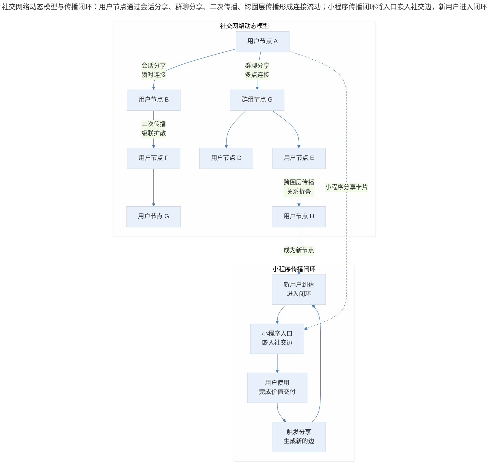
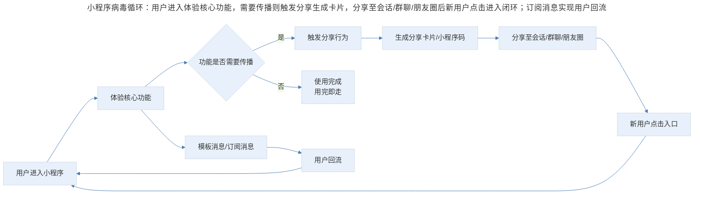
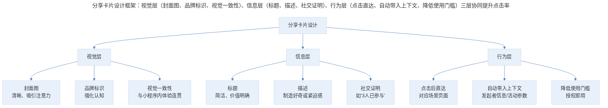

# 小程序传播机制的设计与增长策略

## 1. 导言

小程序的增长逻辑与传统互联网产品存在根本差异。传统 App 依赖应用商店分发（ASO）、广告投放（UA）等中心化获客渠道，而小程序的核心增长引擎则嵌入在平台场景的分布式入口（Distributed Entry Points）中。微信创始人张小龙曾明确表示"小程序在微信中没有入口"——这一表述的深层含义是：小程序没有中心化入口，其流量来源于社交网络中点与点之间的动态连接。

本文将从流量结构分析、传播机制设计、分享卡片优化及合规增长策略四个维度，系统阐述小程序传播机制的设计方法论。

## 2. 流量结构：中心化与分布式

### 2.1 入口分类体系

小程序的用户触达入口可分为两大类别：

| 入口类型 | 特征 | 典型入口 | 流量价值 |
|----------|------|----------|----------|
| 中心化入口 | 稳定存在、对所有用户一致 | 发现页小程序菜单、聊天列表下拉"最近使用"、搜索结果 | 培养用户使用习惯，个体小程序获客价值低 |
| 分布式入口 | 场景驱动、稍纵即逝 | 会话分享卡片、群聊分享、朋友圈小程序码、公众号文章嵌入、模板消息 | 核心获客渠道，传播驱动增长 |

中心化入口的存在本质上是平台在培养用户对小程序的心智习惯，而非为具体小程序提供稳定的流量来源。产品经理若将增长策略建立在中心化入口的流量获取上，将面临极大的不确定性。

### 2.2 分布式入口的网络效应模型

微信作为即时通讯工具，具有极强的网络效应（Network Effect）。其价值并非静态存在于用户节点中，而是动态生成于节点之间的连接流动中。

将微信中的每个用户视为网络中的节点，每次会话、群聊互动、朋友圈互动视为节点间的边，则这张社交网络呈现出以下特征：

- **边的瞬时性**：每条边（即一次连接）随时间推移被新的交互覆盖，稍纵即逝。
- **网络的整体稳定性**：虽然单条边时亮时灭，但整张网络的"亮度"——即连接的总频率——保持稳定。
- **价值存在于流动中**：网络价值不来自节点的静态集合，而来自节点间持续的交互流动。

> 社交网络动态模型与传播闭环：用户节点通过会话分享、群聊分享、二次传播、跨圈层传播形成连接流动；小程序传播闭环将入口嵌入社交边，用户使用后触发分享生成新的边，新用户进入闭环。

小程序的传播策略，本质上就是将产品入口嵌入这张社交网络的边中，使得每一次连接流动都成为潜在的用户触达机会。

## 3. 传播机制设计：从场景出发

### 3.1 核心设计原则

小程序的传播机制设计应遵循以下原则：

**原则一：场景植入，而非功能移植**

小程序不应将完整 App 功能移植进来，而应寻找那些天然带有传播属性的碎片化用例（Micro-Use-Case）。典型的传播型用例包括：

| 用例类型 | 传播机制 | 闭环条件 | 典型产品 |
|----------|----------|----------|----------|
| 拼团 | 发起者邀请参与，人数达标后生效 | 传播完成才能享受优惠 | 拼多多拼团 |
| 代付 | 发起订单后邀请他人付款 | 传播完成才能完成交易 | 电商代付 |
| 抽奖 | 发起者创建活动，参与者分享扩散 | 参与者主动传播以增加中奖概率 | 抽奖助手 |
| 投票 | 发起者创建投票，参与者拉票 | 参与者传播以获得更多票数 | 各类投票工具 |
| 分销 | 用户推荐后获得佣金 | 传播直接与收益挂钩 | 分销系统 |

关键判断标准：如果两个功能中，一个是独立完成，另一个必须通过传播才能完成闭环，应优先选择后者。在小程序的生存阶段，增长优先于体验（Growth over Experience）。

**原则二：传播动机的自然性**

传播行为应当对发起者和接受者均产生明确、易理解的价值。自然传播（Organic Sharing）与强制传播（Forced Sharing）的区别在于：

| 维度 | 自然传播 | 强制传播 |
|------|----------|----------|
| 用户动机 | 内在驱动（展示、分享、协作） | 外部驱动（利益、威胁、欺骗） |
| 传播内容 | 用户主动选择的内容 | 系统强制生成的推广信息 |
| 接受者感知 | 有价值的信息或服务 | 垃圾信息或骚扰 |
| 长期效果 | 品牌信任与用户沉淀 | 用户反感与平台处罚 |
| 网络影响 | 增强网络连接价值 | 损耗网络连接价值 |

**原则三：传播闭环的最短路径**

从用户接触到完成传播，步骤应尽可能精简。每增加一个步骤，转化率将呈指数级衰减，这一规律符合漏斗模型（Funnel Model）的基本原理。

### 3.2 病毒循环设计

小程序的病毒式增长（Viral Growth）遵循经典的病毒循环（Viral Loop）模型。关键指标为病毒系数（Viral Coefficient, K）：

$$K = i \times c$$

其中，$i$ 为每位用户发出的邀请数，$c$ 为邀请的转化率。当 $K > 1$ 时，用户量将指数级增长。

> 小程序病毒循环：用户进入体验核心功能，需要传播则触发分享生成卡片，分享至会话/群聊/朋友圈后新用户点击进入闭环；订阅消息实现用户回流，形成"使用-离开-回流"循环。

病毒循环的设计要点：

1. **入口即价值**：新用户通过分享入口进入后，应立即感知到价值，而非面对登录注册等障碍。
2. **闭环内传播**：核心功能的使用过程本身即包含传播环节，传播不是额外动作。
3. **回流机制**：通过模板消息（现改为订阅消息）在适当时机召回用户，形成"使用-离开-回流"的循环。

## 4. 分享卡片优化策略

分享卡片（Sharing Card）是小程序在社交场景中的"数字名片"，其设计质量直接影响点击率与转化率。

### 4.1 分享卡片设计框架

> 分享卡片设计框架：视觉层（封面图、品牌标识、视觉一致性）、信息层（标题、描述、社交证明）、行为层（点击直达、自动带入上下文、降低使用门槛）三层协同提升点击率。

### 4.2 分享卡片优化要点

**（1）封面图设计**

封面图是分享卡片中面积最大的视觉元素，承担"吸引注意"与"传递信息"双重职能。关键原则：

- 使用高对比度色彩，确保在聊天列表中脱颖而出
- 图中文字控制在 10 字以内，传递核心价值主张
- 避免使用系统默认截图，定制化封面图的点击率可提升 30%-50%（阿拉丁研究院，2024）

**（2）标题与描述的文案策略**

标题应回答"这是什么，对我有什么用"，描述应制造行动动机。例如：

- 弱文案：**抽奖活动** — 欢迎参与我们的抽奖
- 强文案：**3 人成团，低至 1 折** — 王某某等 3 人已参团，仅剩 2 个名额

社交证明（Social Proof）元素（如参与人数、好友动态）的引入，可显著提升卡片的可信度与点击意愿。

**（3）落地页的上下文衔接**

用户点击分享卡片后进入的页面，应与分享卡片承诺的内容完全一致。若用户点击"拼团"卡片却进入商城首页，转化率将大幅下降。技术上需确保分享参数（Share Parameters）正确传递，落地页直接展示对应场景。

### 4.3 不同场景的分享策略

| 分享场景 | 卡片形态 | 设计要点 | 适用功能类型 |
|----------|----------|----------|-------------|
| 单聊会话 | 标准分享卡片 | 强调一对一价值传递，可附带个人推荐语 | 代付、邀请、协作 |
| 群聊 | 标准分享卡片 + 小程序消息 | 强调群体参与感，展示已有参与人数 | 拼团、投票、抽奖 |
| 朋友圈 | 小程序码图片 | 视觉美观为主，小程序码嵌入不突兀 | 活动、工具、内容展示 |
| 公众号文章 | 文字链/小程序卡片 | 与文章内容自然衔接 | 内容关联服务 |
| 订阅消息 | 消息通知卡片 | 时间敏感、行动指令明确 | 到货提醒、活动开始、订单状态 |

## 5. 实践指南：传播策略执行清单

基于上述分析，产品经理在制定小程序传播策略时可参照以下执行清单：

1. **场景审计**：梳理产品中所有可能产生传播行为的用户场景，评估每个场景的传播自然性。
2. **功能裁剪**：从完整功能集中提取天然带有传播属性的碎片化用例，优先开发。
3. **分享卡片 A/B 测试**：对封面图、标题、描述进行多版本测试，优化点击率。
4. **落地页衔接验证**：确保每个分享入口的落地页与承诺内容一致，参数传递无误。
5. **订阅消息设计**：识别可自然获取用户授权的触点，设计订阅消息的触发时机与内容。
6. **合规自查**：对照平台最新政策与法律法规，检查分享机制是否存在诱导、强制或隐私违规风险。
7. **增长指标体系**：建立从"曝光-点击-激活-传播-回流"的完整指标体系，持续监控病毒系数与留存率。

## 6. 进阶延展：2024-2026 新变量与核心要点回顾

### 6.1 平台政策的持续收紧

微信自 2020 年以来持续收紧对诱导分享的管控。2024-2025 年的政策更新进一步明确：

- **禁止强制分享**：不得以分享作为功能使用的前提条件
- **限制利益驱动分享**：红包类、裂变类玩法需严格审核
- **规范模板消息使用**：模板消息升级为订阅消息，用户需主动订阅

这些政策变化意味着，依赖"利益诱导 + 强制分享"的粗暴裂变模型已不可持续。产品团队必须转向基于真实用户价值的自然传播策略。

### 6.2 AI 生成内容与传播

2024-2025 年，AI 生成内容（AIGC）为小程序传播带来了新的可能性与挑战：

**机遇方面**：

- AI 生成的个性化分享卡片（如 AI 头像、AI 生成海报）可显著提升分享意愿
- AI 驱动的智能推荐可提升分享的精准度，将合适的内容推送给合适的分享对象
- AI 生成的内容（如测试结果、创意图片）天然带有"展示与分享"属性

**风险方面**：

- 平台对 AI 生成内容的标识要求日趋严格（微信 2025 年新规）
- AI 生成的分享内容若过度模板化，可能导致用户审美疲劳
- 虚假 AI 生成内容（如伪造的测试结果）可能引发信任危机

### 6.3 隐私合规与社交传播

《个人信息保护法》（PIPL）与《数据安全法》（DSL）的实施，对小程序的社交传播机制提出了合规要求：

- 用户授权需遵循"最小必要"原则，不得以拒绝授权为由拒绝提供基本功能
- 好友关系链的使用需获得明确授权，2024 年微信更新了关系链 API 的调用规范
- 分享行为不得强制关联用户个人信息

合规前提下的传播设计需在"传播效率"与"隐私保护"之间寻找平衡点，这一约束将成为长期的设计边界。

### 6.4 从裂变增长到价值增长

2024-2026 年小程序增长策略的核心转变：

| 维度 | 红利期（2018-2020） | 当前阶段（2024-2026） |
|------|---------------------|----------------------|
| 增长模型 | 病毒式裂变（Viral Loop） | 价值驱动增长（Value-Led Growth） |
| 核心指标 | 分享率、K 因子 | 留存率、NPS、LTV |
| 传播动机 | 利益驱动（红包/优惠） | 体验驱动（有用/有趣/有共鸣） |
| 获客成本 | 极低（社交红利） | 逐步上升（流量成本增加） |
| 平台态度 | 宽容观察 | 严格治理 |
| 典型策略 | 强制分享、裂变红包 | 优质内容、场景服务、订阅召回 |

### 6.5 核心要点回顾

小程序的传播机制设计，本质上是对社交网络动态连接流的利用与嵌入。中心化入口培养用户心智，分布式入口驱动增长——后者才是小程序获客的核心路径。传播设计应从场景出发，寻找天然带有传播属性的碎片化用例，构建"使用即传播"的闭环，而非依赖利益驱动的强制裂变。

随着平台政策的持续收紧、隐私合规要求的提升以及 AI 技术的融入，小程序传播策略正在从"裂变驱动"转向"价值驱动"。产品经理应以长期主义视角审视传播设计，在合规边界内构建可持续的增长模型，让传播成为用户价值交付的自然延伸，而非用户注意力的粗暴掠夺。

---

## 参考资料

- 阿拉丁研究院. (2024). *2024年小程序行业发展白皮书*. 阿拉丁.
- 微信开放平台. (2025). *小程序内 AI 生成内容管理规范*. 腾讯.
- 微信开放平台. (2024). *小程序订阅消息使用规范（修订版）*. 腾讯.
- Chen, H., & Tse, D. (2023). Platform governance in super-app ecosystems: The case of WeChat mini programs. *Journal of Interactive Marketing*, 58(1), 45-62.
- Kumar, V., & Petersen, J. A. (2024). *Viral marketing: The science of sharing* (2nd ed.). Oxford University Press.
- 全国人民代表大会常务委员会. (2021). *中华人民共和国个人信息保护法*. 中国法律出版社.
- 全国人民代表大会常务委员会. (2021). *中华人民共和国数据安全法*. 中国法律出版社.
- Sunstein, C. R. (2023). *The psychology of nudging: Choice architecture in the digital age*. Yale University Press.