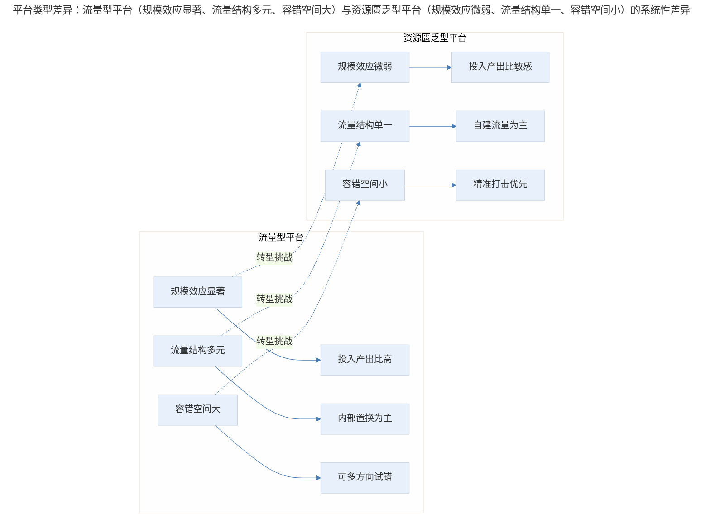
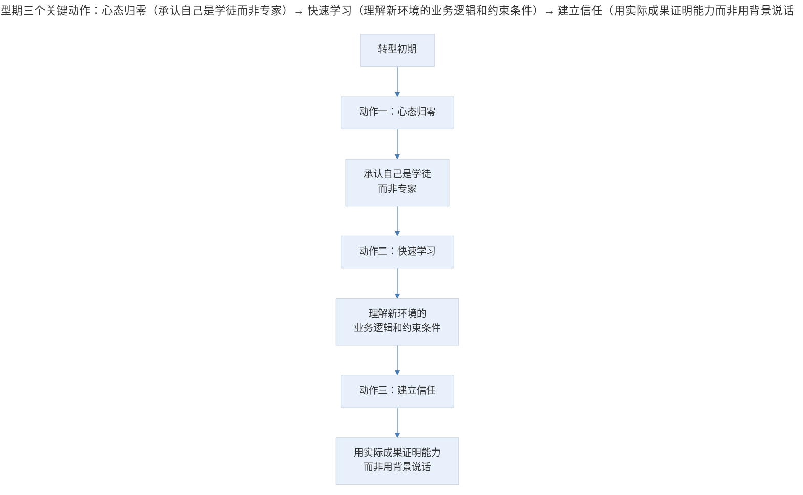

# 案例分析：平台转型中的增长策略调整

## 1. 导言

产品经理或运营人员在职业发展中常面临一个关键场景：从流量型平台（拥有可观流量或可通过集团内部产品获取流量）转向资源匮乏型平台（缺乏流量供给和品牌背书）。这种转型不仅是工作环境的切换，更是业务逻辑、决策思维和资源调配方式的根本性重构。

本案例源于一位从业者从大型互联网公司转入垂直领域准创业团队的真实经历，通过对比两种平台环境下的业务差异，提炼出平台转型中的核心策略调整框架。

## 2. 案例背景：平台类型的本质差异

流量型平台与资源匮乏型平台的差异并非简单的"资源多寡"，而是涉及规模效应、质量要求、流量结构和决策逻辑的系统性差异。

> 平台类型差异：流量型平台（规模效应显著、流量结构多元、容错空间大）与资源匮乏型平台（规模效应微弱、流量结构单一、容错空间小）在投入产出比、流量策略与决策方式上存在系统性差异。

四维度差异对比模型：

| 维度 | 流量型平台 | 资源匮乏型平台 | 核心差异 |
|------|-----------|---------------|---------|
| **规模效应** | 用户量级大，优化收益显著 | 用户量级小，优化收益有限 | 投入产出比的阈值不同 |
| **质量要求** | 影响面广，质量要求极高 | 影响面窄，可快速迭代 | 发布节奏与风险容忍度不同 |
| **流量结构** | 集团内部置换、外部合作多元 | 自有流量有限，需自建渠道 | 获客策略的根本差异 |
| **决策逻辑** | 可多方向投资源试错 | 需精准判断，钢用在刀刃上 | 资源配置的容错空间不同 |

规模差异对投入产出比的量化影响：

以转化率优化为例，假设投入 100 元进行页面优化，将转化率提升 1%：

| 场景 | 原有收入 | 1% 增量收入 | 投入产出比 | 决策倾向 |
|------|---------|-----------|-----------|---------|
| 流量型平台 | 1,000,000 元 | 10,000 元 | 100:1 | 立即执行 |
| 资源匮乏型平台 | 100 元 | 1 元 | 1:100 | 需掂量权衡 |

这一量化对比揭示了规模差异如何从根本上改变产品决策的阈值。在流量型平台中"显而易见"的优化决策，在资源匮乏型平台中可能完全不具备经济可行性。

## 3. 关键决策：四大策略转向

### 3.1 从"规模优先"到"精准优先"

在流量型平台，产品经理习惯于通过规模效应获取收益——即使单用户收益很低，庞大的用户基数也能产生可观的总体收益。但在资源匮乏型平台，这一逻辑完全失效。

**决策要点**：在资源匮乏型平台，产品经理需要将关注点从"覆盖面"转向"精准度"。每一个功能迭代、每一次运营活动都需要精确计算投入产出比，确保资源投入能够产生正向回报。

### 3.2 从"内部置换"到"自建渠道"

流量型平台的产品经理，获取流量的重要工作内容是在集团内找不同产品部门谈合作、谈置换。能在当红流量产品上开一个入口（文字链接或图片链接），就能立竿见影地获取流量。

资源匮乏型平台则完全不具备这种条件——整个公司的流量可以在一张桌子上数完，也没有其他产品可以抱团取暖。

**决策要点**：流量获取策略需要从"依赖外部输血"转向"自建造血能力"。这包括：

- 内容营销（Content Marketing）建立品牌认知
- 社交媒体运营构建用户社群
- SEO/ASO 优化获取自然流量
- 精细化运营提升用户生命周期价值（LTV）

### 3.3 从"多方向试错"到"单点突破"

流量型平台有"先行者包袱"——宁愿自己做错，也不愿自己错过，愿意向各个方向投资源做尝试，大不了关掉。而资源匮乏型平台则需要更尖锐地对方向进行判断，把钢用在刀刃上，每一步都尽量不踏错。

**决策要点**：资源配置策略需要从"广撒网"转向"单点突破"。在资源有限的情况下，集中资源攻克一个关键点，比分散资源尝试多个方向更有可能成功。这与现代创业方法论中的"Focus"原则高度一致（Ries, 2011）。

### 3.4 心态调整：从"平台光环"到"能力本位"

从动辄百万用户的产品经理变为以万为单位产品的产品经理，手中的资源决定了达成的事情可能截然不同，成就感会一落千丈，起初可能会感到"虎落平阳"的失落。

**关键认知**：能在不同规模、不同时期的产品中找到路径，本来就是产品经理应该具备的职业素养。森林中，大象和昆虫一样都有自己的空间，也有自己的挑战和精彩，没有高级低级之分。

**警示**：千万不要误将平台影响力当成自己的能力。以前在业务上的指点江山可能只是恰巧站在了巨人的肩膀上。脱离平台赋予的强大支援后，能做成多大的事情，才是衡量自己能力真正的标尺。

## 4. 经验提炼：能力迁移与转型方法论

### 4.1 平台转型的能力迁移矩阵

| 能力类型 | 流量型平台价值 | 资源匮乏型平台价值 | 迁移难度 |
|---------|--------------|------------------|---------|
| 数据分析能力 | 高（数据量大，分析空间大） | 中（数据量小，需更精细） | 低 |
| 产品设计能力 | 中（有容错空间） | 高（需一次做对） | 中 |
| 流量获取能力 | 低（依赖内部资源） | 高（需自建能力） | 高 |
| 项目管理能力 | 中（流程成熟） | 高（需灵活应变） | 中 |
| 战略判断能力 | 低（可试错） | 高（需精准判断） | 高 |

### 4.2 转型期的三个关键动作

> 转型期三个关键动作：心态归零（承认自己是学徒而非专家）→ 快速学习（理解新环境的业务逻辑和约束条件）→ 建立信任（用实际成果证明能力而非用背景说话）。

### 4.3 资源匮乏型平台的产品方法论

在资源匮乏型平台做产品，需要建立一套与流量型平台完全不同的方法论：

| 方法论要素 | 流量型平台 | 资源匮乏型平台 |
|-----------|-----------|---------------|
| **需求筛选** | 可尝试多个方向 | 需精准识别核心需求 |
| **功能设计** | 可做大而全 | 需做小而精 |
| **迭代节奏** | 可慢工出细活 | 需快速验证、快速调整 |
| **数据验证** | 样本量大，结论可靠 | 样本量小，需定性定量结合 |
| **团队协作** | 流程规范，分工明确 | 需一人多能，灵活协作 |

## 5. 实践指南：给转型者的核心建议

### 5.1 给转型者的核心建议

1. **不要看不起新的小团队同事**，处处以大公司背景自居。在新的环境里，自己才是学徒，摆正心态尽快融入才是正确态度。

2. **在资源匮乏型环境中把事情做成，或许才是更有挑战的事情**。这种挑战能够真正锻炼产品经理的核心能力——在约束条件下创造价值。

3. **建立"约束即机会"的思维模式**。资源匮乏不是劣势，而是倒逼精准决策、高效执行的约束条件。许多创新恰恰诞生于资源约束之中。

## 6. 进阶延展：2024-2026 年的实践演进与核心要点回顾

### 6.1 2024-2026 年的实践演进

在当前的产品实践中，"资源匮乏"已不再等同于"劣势"。随着 Product-Led Growth（PLG）理念的普及，越来越多成功产品证明了"小团队、精准切入、自增长"模式的可行性（Bush, 2023）。

关键变化包括：

- **工具门槛降低**：无代码/低代码工具使小团队能快速构建 MVP
- **获客渠道多元化**：社交媒体、内容平台提供了低成本获客可能
- **数据工具普及**：轻量级分析工具使小团队也能进行数据驱动决策
- **远程协作成熟**：分布式团队降低了人力成本

### 6.2 核心要点回顾

平台转型的增长策略调整，本质是业务逻辑、决策思维与资源调配方式的系统性重构。从流量型平台到资源匮乏型平台，产品经理需要完成四大策略转向：规模优先→精准优先、内部置换→自建渠道、多方向试错→单点突破、平台光环→能力本位。核心在于摆正心态（在资源匮乏中更能锻炼核心能力）、建立"约束即机会"的思维模式，并借助 PLG 等新范式在资源约束中实现精准增长。

---

## 参考资料

- Ries, E. (2011). *The lean startup: How today's entrepreneurs use continuous innovation to create radically successful businesses*. Crown Business.
- Bush, W. (2019). *Product-led growth: How to build a product that sells itself*. Product Led Institute.
- Christensen, C. M. (2016). *The innovator's dilemma: When new technologies cause great firms to fail*. Harvard Business Review Press.