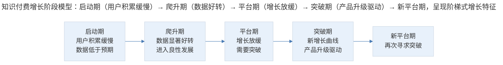
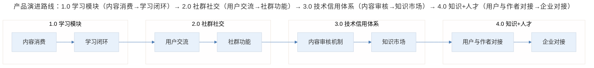

# 案例分析：知识付费产品的增长复盘

## 1. 导言

极客时间（GeekTime）是面向技术人群的知识付费（Knowledge Payment）平台，于 2017 年正式上线。在产品发展初期，平台经历了典型的增长曲线：前四个月收入与用户数据增长缓慢，进入瓶颈期；至次年 4 月数据明显好转，5-6 月出现显著爬升，随后进入良性发展轨道；但良性发展之后又遭遇新的平台期，需要寻求突破。

与此同时，平台上的专栏产品表现亮眼——邱岳的产品实战系列第一季订阅量超过 8000 份，第二季突破 10000 份，远超团队预期。这一成绩证明了技术人群对产品思维类内容的真实需求，也为知识付费产品的增长策略提供了有价值的复盘素材。

本案例以极客时间的发展历程为核心，从产品增长的阶段特征、内容策略、产品演进路线三个维度进行系统复盘。

## 2. 分析框架：增长阶段与内容策略

### 2.1 知识付费产品的增长阶段模型

> 知识付费增长阶段模型：启动期（用户积累缓慢）→ 爬升期（数据好转）→ 平台期（增长放缓）→ 突破期（产品升级驱动）→ 新平台期，呈现阶梯式增长特征。

极客时间的增长轨迹呈现出典型的**阶梯式增长**（Staircase Growth）特征：每一个增长阶段的突破，都伴随着产品形态或运营策略的质变，而非简单的量变累积。

### 2.2 增长驱动因素拆解

| 增长阶段 | 时间区间 | 核心特征 | 关键驱动因素 |
|----------|----------|----------|-------------|
| 启动期 | 上线后 1-4 个月 | 收入与用户数据低于预期 | 品牌认知不足、内容 SKU 有限、用户习惯待培育 |
| 爬升期 | 次年 4-6 月 | 数据显著好转 | 内容矩阵丰富、口碑积累释放、分享有赏功能上线 |
| 良性发展期 | 次年下半年 | 进入良性循环 | 内容供应链成熟、用户复购率提升、KOL 传播效应 |
| 平台期 | 良性发展后 | 增长再次放缓 | 市场饱和度提升、竞品增加、产品形态需要升级 |

### 2.3 内容策略分析

极客时间的核心内容策略是**坚持由一线实践者创作**，而非依赖职业讲师或内容工厂。这一策略的优势与挑战如下：

| 维度 | 优势 | 挑战 |
|------|------|------|
| 内容质量 | 真实经验、深度洞察、实操性强 | 作者时间有限，创作过程劳心费神 |
| 用户信任 | 一线背景增强内容可信度 | 非专业写作者，表达质量存在波动 |
| 差异化 | 与纯课程平台形成区隔 | 产能受限，内容 SKU 增长速度有限 |
| 社区效应 | 作者与读者之间形成真实连接 | 作者持续投入的激励机制需要设计 |

专栏销量过万的数据验证了一个关键假设：**技术人群对产品思维有强烈需求**。这一需求此前未被充分满足，原因在于多数技术教育平台聚焦纯技术内容，忽视了技术人群拓展视野和跨领域理解的诉求。

## 3. 关键决策：演进路线与平台期突破

### 3.1 产品演进路线规划

极客时间并未将自身定位为单纯的知识付费工具，而是规划了清晰的产品演进路线：

> 产品演进路线：1.0 学习模块（内容消费→学习闭环）→ 2.0 社群社交（用户交流→社群功能）→ 3.0 技术信用体系（内容审核→知识市场）→ 4.0 知识+人才（用户与作者对接→企业对接）。

这一演进路线的核心逻辑是：从**内容消费**（Content Consumption）到**社区互动**（Community Interaction），再到**平台生态**（Platform Ecosystem），最终实现**知识与人力的连接**（Knowledge-Talent Integration）。每一阶段的突破都需要前一阶段的用户基础和内容积累作为支撑。

### 3.2 垂直领域深耕 vs 横向扩张

在增长策略上，极客时间选择了垂直领域深耕路线。这一决策基于以下判断：

- 垂直领域的内容品质更容易建立壁垒，用户付费意愿更强
- 横向扩张虽然能快速扩大用户基数，但内容质量难以保证，品牌稀释风险高
- 垂直领域的用户画像清晰，有利于精准运营和商业化

### 3.3 突破平台期的策略

面对平台期，产品经理需要建立一种关键认知：**平台期一旦突破过一次，后续面对平台期的心态会从容许多**。突破平台期的核心方法包括：

1. **产品形态升级**：从单纯的内容消费工具升级为学习+社群+信用体系的综合平台
2. **内容品类扩展**：在技术领域内横向扩展，覆盖更多细分方向
3. **用户价值深化**：从一次性内容消费转向持续学习路径设计，提升用户生命周期价值（LTV, Life Time Value）

## 4. 经验提炼：知识付费增长的核心规律

### 4.1 知识付费产品增长的核心规律

| 规律 | 说明 | 实践启示 |
|------|------|----------|
| 阶梯式增长 | 增长不是线性攀升，而是阶梯式跃迁 | 不因短期数据低迷而动摇，专注产品质变的准备 |
| 内容即增长 | 优质内容是最根本的增长引擎 | 坚持内容品质，避免为了短期数据牺牲内容深度 |
| 社交传播杠杆 | KOL 和用户分享是突破增长瓶颈的关键杠杆 | 设计合理的利益分配机制，激活社交传播链路 |
| 平台期必然性 | 每一次增长突破后必然面临新的平台期 | 提前规划下一阶段的产品形态，而非被动等待 |

### 4.2 方法论要点

1. **增长不是匀速运动**：知识付费产品的增长具有明显的阶段性特征，前期的数据低迷不代表方向错误，可能是积累尚未到达质变临界点。产品经理需要具备穿越低谷的判断力和耐心。

2. **内容供应链是核心壁垒**：坚持由一线实践者创作内容，虽然产能受限，但形成的内容品质壁垒远比规模壁垒更加持久。这要求平台在作者运营和激励机制上持续投入。

3. **产品路线图要有"大图景"**：不能将产品定位局限于当前形态。极客时间从"卖课工具"到"知识+人才平台"的演进规划，体现了产品路线图（Product Roadmap）的战略前瞻性。

4. **平台期是常态而非异常**：每一次增长突破后都会面临新的平台期，这是产品生命周期的内在规律。关键在于提前储备下一阶段的产品能力，而非在平台期来临时仓促应对。

## 5. 实践指南：给产品经理的复盘启示

基于极客时间的增长复盘，产品经理在知识付费领域应把握以下实践要点：

- **穿越低谷的判断力**：前期数据低迷不代表方向错误，应判断是否处于质变临界点的积累期，而非仓促转向。
- **内容品质壁垒优先**：坚持一线实践者创作，用内容品质壁垒替代规模壁垒，构建持久的差异化优势。
- **产品路线图的前瞻性**：提前规划从内容消费到社区互动、平台生态直至知识+人才连接的多阶段演进路线。
- **平台期的主动应对**：将平台期视为产品生命周期的内在规律，提前储备下一阶段的产品能力，而非被动等待。

## 6. 进阶延展：当代实践与核心要点回顾

### 6.1 当代实践补充（2024-2026）

2024-2026 年，知识付费行业发生了深刻变化，以下实践值得参考：

- **AI 辅助内容生产**：大语言模型（LLM）的普及使得内容生产效率大幅提升，但同时也加剧了内容同质化问题。真正的一线实践经验和深度洞察变得更为稀缺和有价值（Zhang & Li, 2025）。
- **订阅制与会员制深化**：从单课付费向订阅制/会员制转型已成为行业趋势，如得到 App 的"得到听书"会员、极客时间的年度会员等，旨在提升用户 LTV 和留存率（Osterwalder et al., 2022）。
- **社群化与 AI 导师**：将 AI Agent 嵌入学习场景，提供个性化学习路径和实时答疑，是知识付费产品突破平台期的新增长点（Kaplan & Haenlein, 2025）。
- **短视频与微课融合**：以抖音、B 站为代表的短视频平台对知识付费的冲击持续加深，知识付费产品需要重新思考内容形态，将长内容拆解为适合碎片化消费的微课形式。

### 6.2 核心要点回顾

极客时间的增长复盘揭示了知识付费产品的核心规律：增长呈现**阶梯式跃迁**而非线性攀升，每一次突破都伴随产品形态或运营策略的质变；**优质内容是最根本的增长引擎**，坚持一线实践者创作所形成的内容品质壁垒远比规模壁垒持久；**平台期是常态而非异常**，需提前规划下一阶段产品形态。

在 2024-2026 年，AI 辅助内容生产、订阅制/会员制深化、社群化与 AI 导师、短视频微课融合正在重塑知识付费行业的增长范式。但"内容即增长、品质壁垒优先、产品路线图具有前瞻性"的底层逻辑始终不变。

---

## 参考资料

- Kaplan, A. M., & Haenlein, M. (2016). Higher education and the digital revolution: About MOOCs, SPOCs, social media, and the Cookie Monster. *Business Horizons*, 59(4), 441-450.
- Osterwalder, A., Pigneur, Y., Etiemble, F., & Smith, A. (2020). *The invincible company: How to constantly reinvent your organization with inspiration from the world's best business models*. Wiley.
- Zhang, W., & Li, H. (2025). AI-driven content production in knowledge economy: Opportunities and challenges. *Internet Research*, 35(1), 78-95.
- 易观分析. (2025). 中国知识付费行业年度分析 2025. 易观智库.