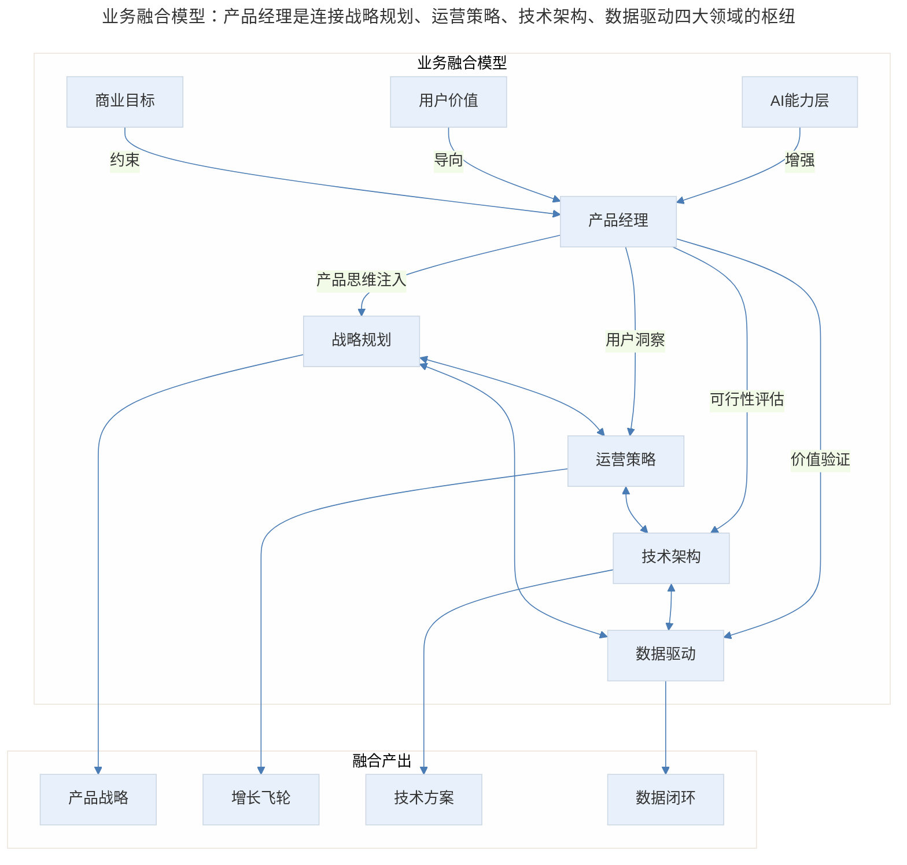
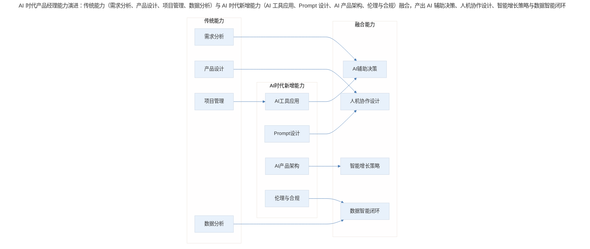
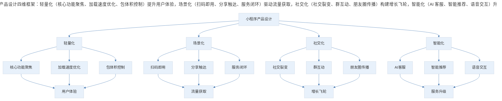
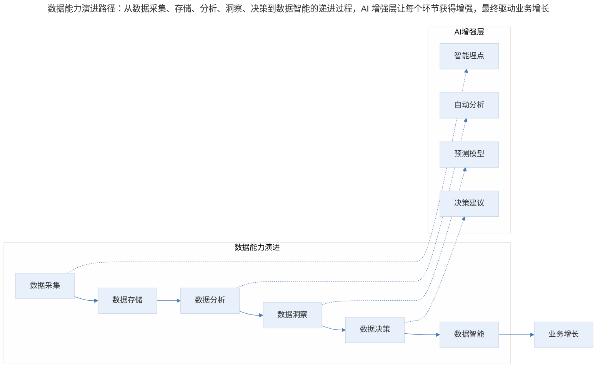
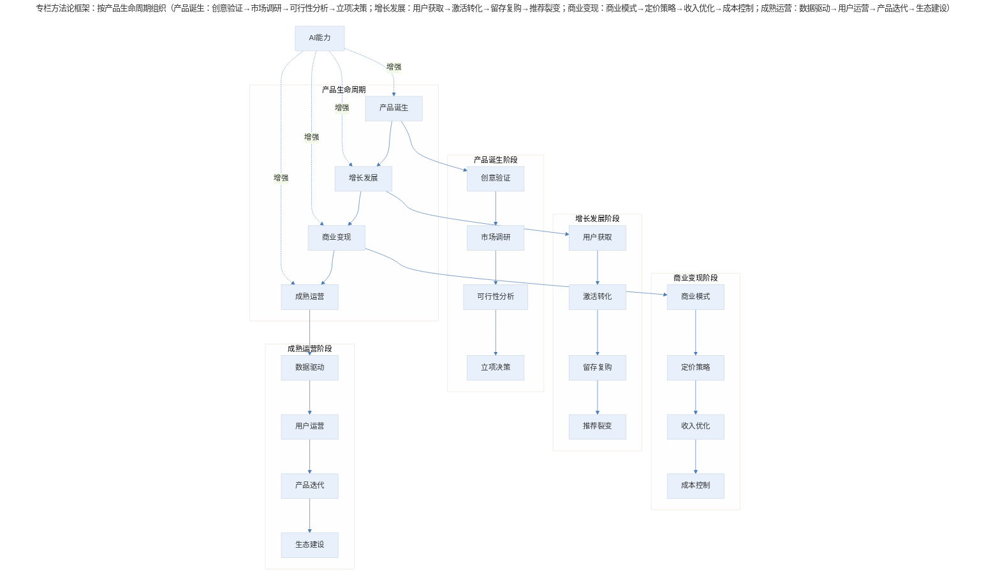

# 【第二季回归】二爷归来，再次扬帆起航

## 1. 导言

产品经理的核心价值不在于完成"自己的部分"，而在于将产品思维注入业务全链条，与各职能深度融合产生化学反应。在 AI 时代，这一角色定位更加关键——产品经理需要成为连接技术变革与用户价值的桥梁，既要理解 AI 能力边界，又要洞察人性需求。本文从"调酒"隐喻出发，系统阐述产品经理在业务各阶段的职责与能力要求，并提供分层能力框架供不同阶段从业者参考。

> **更新说明**：本文档于 2026-06 更新，主要更新点：补充 AI 时代产品经理角色定位新思考、更新微信小程序生态发展现状、深化数据能力与 AI 协同方法论、增加产品经理能力分层框架、新增 Mermaid 流程图。

## 2. 核心概念：产品经理的价值之问与"调酒"隐喻

### 2.1 产品经理的价值之问

有时我会想，如果我所在的公司把我或整个产品团队换掉，换成一个更好的产品经理或团队，公司会有什么变化？这个更好的产品经理会如何解决我解决不掉的难题，如何跨过那些让我踉踉跄跄的障碍，如何给公司带来可观的成长？

这样的想法会立刻消灭我所有的沾沾自喜与嚣张跋扈。我跟那个假想中更优秀的产品经理暗暗较劲，努力希望自己做到跟他一样好。

又或许，产品经理的平庸与卓越其实并不能左右一个公司的成败？即便把我换成更好的产品经理，公司也不会发生质变？我们自以为是的"产品力"，究竟能在整体业务中起到多大的作用？

一方面，当看到不拘小节甚至丑陋的产品大获成功时，我的内心其实会摇摆，怀疑我在日常工作中对那些产品细节不讲情面的苛刻是不是根本没有必要。另一方面，当我看到许多产品混乱的流程、矛盾的逻辑和糟糕的体验时，又会由衷地感慨：一个基本功扎实、思路正常的产品经理是多么重要。

### 2.2 "调酒"隐喻：产品经理的职责本质

这个过程坚定了我对产品经理职责的认识。我们过去会认为，产品经理规划产品功能、完成需求分析，就算是完成了"产品"部分的工作，剩下的则是其他人的职责，大家各安其位，边界清晰。

但实际上，并没有任何一件推动公司前进的事务能够泾渭分明地划分职能责任。一个产品的功能，可能来自于运营活动的沉淀，一处工程架构的设计，甚至是产品的发展方向。产品经理的工作方式不能是"我的部分做完了，其他的事情我不管"，当然，任何角色都不应该这样。

业务的发展不应该像搭积木，开发、产品和运营把自己的工作成果垒到一起，而应该像调酒，不同的角色把不同的原材料注入杯中摇动，互相交融甚至产生化学反应。

这样来打比方，产品经理的职责就是将对产品的思考和"产品力"注入到杯中，与其他环节充分融合、互相反应，进而完成业务规划和发展。

> 业务融合模型：产品经理是连接战略规划、运营策略、技术架构、数据驱动四大领域的枢纽，AI 能力层作为新的增强因素、用户价值为导向、商业目标为约束，融合产出产品战略、增长飞轮、技术方案与数据闭环。

**图表解读**：上图展示了产品经理在业务融合中的核心位置。产品经理不是孤立的职能节点，而是连接战略、运营、技术、数据四大领域的枢纽。AI 能力层作为新的增强因素，正在重塑产品经理的工作方式。

## 3. 关键方法：AI 时代产品经理的角色演进

### 3.1 AI 对产品经理工作的深刻影响

2023 年以来，以 ChatGPT 为代表的大语言模型（LLM）技术爆发，彻底改变了产品经理的工作范式。AI 不再只是产品中的一个功能模块，而是成为产品经理的"副驾驶"和"能力放大器"。

**AI 对产品经理工作的三层影响**：

| 层次 | 影响维度 | 具体表现 | 应对策略 |
|------|----------|----------|----------|
| **基础层** | 效率提升 | PRD 撰写、竞品分析、用户调研报告生成效率提升 3-5 倍 | 掌握 Prompt Engineering，建立 AI 辅助工作流 |
| **进阶层** | 能力扩展 | 非技术背景 PM 可独立完成原型、数据分析、简单代码编写 | 学习 AI 工具链，拓展技能边界 |
| **高阶层** | 角色重构 | 从"需求翻译者"升级为"AI 产品架构师" | 深入理解 AI 技术原理，设计 AI 原生产品 |

**2024-2026 年典型案例**：

- **Cursor**：AI 编程工具，让产品经理可以独立完成 MVP 开发，极大降低了产品验证成本
- **Perplexity**：AI 搜索引擎，重新定义了信息获取方式，产品经理需要思考如何设计 AI 驱动的交互范式
- **Midjourney**：AI 图像生成，产品经理需要理解生成式 AI 的能力边界与用户期望管理
- **Notion AI**：知识管理工具的 AI 化，展示了如何在成熟产品中嵌入 AI 能力

### 3.2 AI 时代产品经理的新能力要求

> AI 时代产品经理能力演进：传统能力（需求分析、产品设计、项目管理、数据分析）与 AI 时代新增能力（AI 工具应用、Prompt 设计、AI 产品架构、伦理与合规）融合，产出 AI 辅助决策、人机协作设计、智能增长策略与数据智能闭环。

**图表解读**：AI 时代的产品经理能力模型呈现"传统能力+AI 新能力→融合能力"的演进路径。不是替代，而是增强；不是颠覆，而是升级。

## 4. 实践落地：产品经理能力分层框架

### 4.1 基础层（0-2 年）

**核心能力**：需求分析、文档撰写、原型设计、项目跟进

**关键产出**：PRD、原型图、竞品分析报告

**AI 赋能点**：

- 使用 AI 辅助撰写 PRD，效率提升 50% 以上
- 利用 AI 生成竞品分析框架和初稿
- 通过 AI 工具快速生成原型交互说明

**常见误区**：过度依赖 AI 生成内容，缺乏独立思考；把 AI 当作答案机器而非思考伙伴

### 4.2 进阶层（2-5 年）

**核心能力**：产品规划、数据驱动、增长策略、跨部门协作

**关键产出**：产品路线图、增长实验方案、数据洞察报告

**AI 赋能点**：

- 利用 AI 进行用户反馈聚类分析，发现隐藏需求
- 使用 AI 辅助设计 A/B 测试方案和假设生成
- 通过 AI 工具进行数据可视化和洞察提炼

**典型案例**：某电商产品经理利用 AI 分析 10 万条用户评论，发现"物流时效焦虑"是核心痛点，设计"预计送达时间实时更新"功能，转化率提升 12%。

### 4.3 高阶层（5 年以上）

**核心能力**：战略规划、商业模式设计、组织影响力、AI 产品架构

**关键产出**：产品战略、商业计划书、AI 产品蓝图

**AI 赋能点**：

- 利用 AI 进行行业趋势分析和战略推演
- 设计 AI 原生产品架构，定义 AI 能力边界
- 建立 AI 伦理审查机制，确保产品合规

**战略思考**：高阶产品经理需要回答的核心问题是——"在 AI 时代，我们的产品如何创造不可替代的用户价值？"

### 4.4 微信小程序生态：从新兴形态到基础设施

**小程序生态发展历程（2017-2026）**：

| 阶段 | 时间 | 特征 | 产品经理关注点 |
|------|------|------|----------------|
| **探索期** | 2017-2018 | "用完即走"理念提出，生态初建 | 理解小程序与 APP 的差异定位 |
| **爆发期** | 2019-2021 | 日活突破 4 亿，电商、游戏爆发 | 流量获取、裂变机制设计 |
| **成熟期** | 2022-2024 | 日活超 6 亿，成为数字基础设施 | 用户留存、商业化闭环 |
| **AI 融合期** | 2025-2026 | AI 智能体+小程序深度融合 | AI 驱动的交互创新、智能服务 |

**小程序产品设计核心原则**：

> 小程序产品设计四维框架：轻量化（核心功能聚焦、加载速度优化、包体积控制）提升用户体验，场景化（扫码即用、分享触达、服务闭环）驱动流量获取，社交化（社交裂变、群互动、朋友圈传播）构建增长飞轮，智能化（AI 客服、智能推荐、语音交互）升级服务。

**图表解读**：小程序产品设计已从早期的"轻量化"单一维度，演进为"轻量化+场景化+社交化+智能化"四维框架。AI 融合期的新要求是：如何在小程序中嵌入 AI 能力，提供更智能的服务体验。

**小程序增长策略演进**：

- **早期策略（2017-2020）**：裂变红包、拼团砍价；社群运营、公众号导流；关键词优化、搜索排名
- **成熟期策略（2021-2024）**：私域流量运营、用户生命周期管理；视频号联动、直播带货；会员体系、积分商城
- **AI 时代策略（2025-2026）**：AI 智能客服提升服务效率；个性化推荐提升转化率；语音交互降低使用门槛；AI 生成内容（AIGC）丰富运营素材

## 5. 实践指南：数据意识与能力

### 5.1 数据能力的三重境界

**第一重：看数据**——理解核心指标定义（DAU、留存、转化率等）；能够阅读数据报表和仪表盘；发现数据异常并追溯原因

**第二重：用数据**——设计数据埋点方案；进行 A/B 测试和假设验证；基于数据优化产品决策

**第三重：数据智能**——建立数据驱动的决策文化；利用 AI 进行预测性分析；构建自动化数据闭环

> 数据能力演进路径：从数据采集、存储、分析、洞察、决策到数据智能的递进过程，AI 增强层（智能埋点、自动分析、预测模型、决策建议）让每个环节获得增强，最终驱动业务增长。

**图表解读**：数据能力的演进路径是从"采集"到"智能"的递进过程。AI 的引入让每个环节都获得增强，最终实现从"人看数据"到"AI 辅助决策"的跃迁。

### 5.2 AI 时代的数据能力新要求

| 传统数据能力 | AI 时代数据能力 | 差异说明 |
|--------------|----------------|----------|
| SQL 查询 | 自然语言查询 | 用自然语言直接问数据 |
| 手动报表 | 智能仪表盘 | AI 自动生成洞察 |
| A/B 测试 | 多臂老虎机 | 动态优化实验分配 |
| 归因分析 | AI 归因模型 | 处理复杂非线性关系 |
| 用户分群 | AI 聚类分群 | 自动发现隐藏群体 |

### 5.3 专栏内容架构与方法论框架

这也是我在这一次专栏中想要分享的内容，我希望能从整个产品业务的起承转合出发，去挖掘产品经理和"产品力"能够在其中起到的作用。我会根据产品的生命周期组织内容，包括"产品的诞生"（早期验证可行性、收集信息、推演产品逻辑）、产品的增长（推动萌芽期产品发展壮大、找用户和积蓄流量）、商业意识（从打造好用的产品到打造赚钱的产品、商业产品算账）、能力树（数据意识和能力）、微信小程序经验（形态特点、流量组成、设计原则、增长策略）。

**新增内容预告**：在本次更新中，我特别增加了 AI 时代产品经理专题，包括：AI 工具在产品工作中的应用实践、AI 原生产品的设计方法论、产品经理如何与 AI 协作、AI 伦理与产品合规。

> 专栏方法论框架：按产品生命周期组织（产品诞生：创意验证→市场调研→可行性分析→立项决策；增长发展：用户获取→激活转化→留存复购→推荐裂变；商业变现：商业模式→定价策略→收入优化→成本控制；成熟运营：数据驱动→用户运营→产品迭代→生态建设），AI 能力作为贯穿全程的增强因素。

**图表解读**：这些内容按照产品生命周期组织内容，每个阶段都有对应的方法论和实战要点。AI 能力作为贯穿全程的增强因素，正在重塑每个阶段的工作方式。

## 6. 进阶延展：实战要点与核心要点回顾

### 6.1 实战要点

| 要点 | 说明 | 适用场景 |
|------|------|----------|
| **调酒思维** | 产品经理要将产品思维注入业务全链条，而非完成"自己的部分" | 所有产品工作场景 |
| **AI 协作** | 把 AI 当作"副驾驶"而非替代者，建立人机协作工作流 | 日常产品工作 |
| **能力分层** | 根据职业阶段聚焦不同能力建设，避免能力错配 | 职业发展规划 |
| **数据智能** | 从"看数据"升级到"数据智能"，建立数据驱动决策文化 | 数据分析工作 |
| **小程序四维** | 轻量化+场景化+社交化+智能化，全面思考小程序产品 | 小程序产品设计 |
| **持续学习** | AI 时代技术迭代加速，保持学习心态比掌握具体技能更重要 | 长期职业发展 |

### 6.2 核心要点回顾

在写作上一季专栏"邱岳的产品手记"过程中，我收获良多，不但通过系统性写作与阶段性总结梳理了自己的产品脉络，也认识了很多朋友。他们是专栏的读者，同时也是专栏内容的贡献者，我经常在文章下读到非常精彩的评论，并得到很多启发。

我在上一季中曾提到过，专栏内容不是标准作业流程，也不是一定正确的金科玉律，它最好是线索和启发，帮助你找到适合自己的方法和模型。作为专栏的作者，我最盼望的不是你们在专栏中打破或重建知识体系，而是每个人在这里找到能完善自己的素材，点燃自己的火花。

本回归篇的核心要点：产品经理的核心价值在于将产品思维注入业务全链条（调酒隐喻），在 AI 时代成为连接技术变革与用户价值的桥梁。能力分层框架（基础层 0-2 年、进阶层 2-5 年、高阶层 5 年以上）指导不同阶段的从业者聚焦相应能力建设。小程序生态从"轻量化"单一维度演进为"轻量化+场景化+社交化+智能化"四维框架，数据能力从"看数据"升级到"数据智能"。专栏按产品生命周期组织内容，AI 能力作为贯穿全程的增强因素。"法无定法，然后知非法法也"，希望这些内容能够给你启发，帮你成长。让我们一起加油，超越那个曾经的自己，做出不辜负用户也不辜负自己的产品。

---

## 延伸阅读

1. **AI 与产品经理**：《AI 产品经理：定义、能力与未来》，人人都是产品经理，2024
2. **小程序生态**：《微信小程序白皮书（2025 版）》，微信官方
3. **数据驱动**：《数据驱动：从方法到实践》，GrowingIO
4. **产品增长**：《增长黑客》更新版，Sean Ellis，2023
5. **AI 工具应用**：《Product Manager's Guide to AI Tools》，Product School，2025

## 更新日志

| 版本 | 日期 | 更新内容 |
|------|------|----------|
| v1.0 | 2018-07 | 初始版本，发布 |
| v2.0 | 2026-06 | 补充 AI 时代产品经理角色定位新思考、更新微信小程序生态发展现状、深化数据能力与 AI 协同方法论、增加产品经理能力分层框架、新增 Mermaid 流程图 |