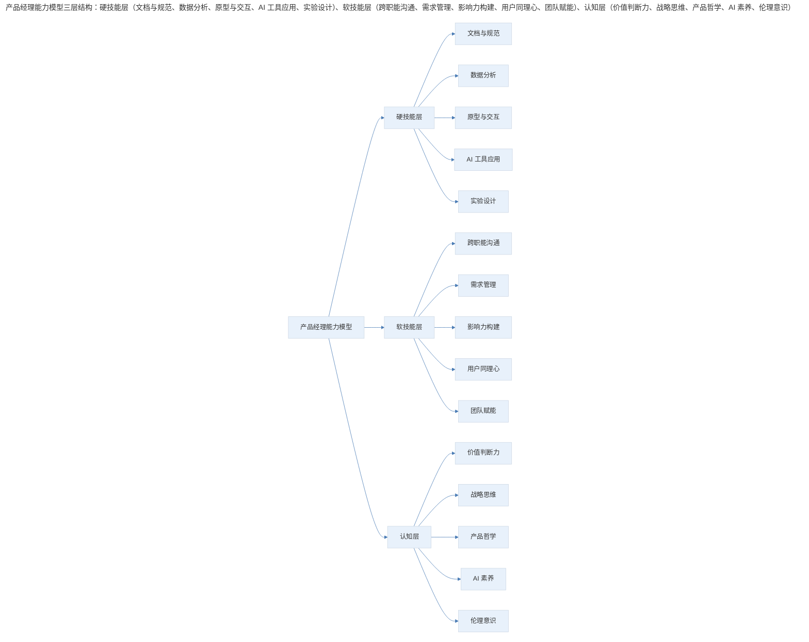

# 开篇词 | 产品经理的世界没有对错

## 1. 导言

产品领域只有成败，没有对错——这一判断在 AI 时代依然成立，甚至更加深刻。当大模型可以快速生成方案、A/B 测试可以自动优化、数据驱动决策成为标配，产品经理的核心价值不再是"给出正确答案"，而是在高度不确定的环境中做出价值选择与战略判断。产品经理行走江湖，产品才是唯一名片。

> **更新说明**：本文档于 2026-06 更新，主要更新点：补充 AI 时代产品经理的新定位与挑战；更新专栏框架描述，将"试用视频"调整为更贴合当前知识付费生态的内容形式；增加专业深度分层与 Mermaid 方法论框架；增加对整个专栏更新版的导读说明。

## 2. 核心概念：产品领域只有成败，没有对错

过去，我不太喜欢分享跟产品相关的东西，只是偶尔写写书评。一是觉得自己还没有形成值得对外输出的知识体系；二是因为产品与技术不同，产品领域只有成败，没有对错。

我们经常会听到说某款产品失败了，但它的技术团队非常厉害，却很少听说某款产品虽然失败了，但产品经理很厉害。

技术是硬指标，同样的业务，我单机能扛你十倍的 QPS，就可以直接宣布胜利了。同一套标准测试数据，你写的算法召回率和准确率都比我高，性能还比我的好，那也没有任何争辩的余地，我立刻鞠躬致敬，评价标准硬朗而清晰。

产品却不一样，它并没有一个明确的判断标准。小到产品特性的选择，比如微信的用户头像是方的，QQ 用户头像是圆的，哪个优哪个劣？钉钉有已读回执而微信没有，哪个好哪个坏？微博下拉刷新停留在最新，Twitter 下拉刷新停留在当前位置，哪个对哪个错？大到产品规划，先做留存还是先获客，头部还是长尾，社区还是工具？

每次有人找到我，想咨询我对类似问题的看法，我都不敢随意给出回应。因为怎么说都有道理，怎么说都能说圆。如果不是非常清楚一条产品线的来龙去脉和设计原则，哪怕只是一个细节，都很难给出明确的建议。

尤其年纪大一点的产品经理，见过了足够多的黑天鹅，看遍了各种意料之外的对错，更不敢随意分析，妄自断言。

越是在自己的产品里横刀立马的人，越不敢对别人的产品指手画脚。英语里有句话叫"it depends"，产品领域的对错取决于各种环境变量，更取决于掌舵人自己的价值选择与世界观。

## 3. 关键方法：AI 时代产品决策的新特征

2023 年以来，大语言模型（LLM）的爆发给产品领域带来了前所未有的冲击。当 ChatGPT 可以在几秒内生成产品方案，当 AI 可以自动完成 A/B 测试的实验设计与结果分析，当 Copilot 类工具可以辅助编写 PRD 和用户故事——产品经理的"对错"判断变得更加困难，也更加珍贵。

AI 时代的产品决策呈现出三个新特征：

1. **方案生成的边际成本趋近于零**：过去产品经理花一周打磨的方案，现在 AI 可以在十分钟内生成十个变体。当方案不再稀缺，选择什么方案、为什么选择，就成了核心能力。
2. **数据反馈的速度和维度指数级增长**：实时数据看板、AI 驱动的用户行为分析、自动化实验平台，让"用数据说话"的门槛大幅降低。但数据能告诉你"是什么"，却无法告诉你"应该是什么"。
3. **用户预期的持续抬升**：当用户习惯了 AI 原生产品的智能体验，对传统产品的容忍度急剧下降。产品经理不仅要判断"做什么"，还要判断"在 AI 能力边界内做到什么程度"。

这些变化并没有推翻"产品领域没有对错"的基本判断，反而让这个判断更加深刻——当 AI 可以帮你找到"局部最优解"时，产品经理的价值在于定义什么是"优"。

**产品经理行走江湖不看招式也不看颜值，产品，才应该是他唯一的名片。**

## 4. 实践落地：专栏框架与导读

如此看来，开个专栏写产品设计，对我来说实在是个忐忑之举。摸爬滚打数年，纵使有一腔倾诉欲，却又担心所观所想会误人视听。

极客邦总裁池老听闻后，拍桌子瞪眼说："你把我们用户当什么人，怎可能你一句两句就能给带偏了？"

**我一想也是，专栏作品从来不是什么"教程"，而应当是一扇可供交谈的窗口，所谓知识经济，其实带来最有价值的不是知识，而是求知的启发。**

所以我决定应了这差事，在专栏里写写自己在这么多年产品经理生涯中的见识和思考。我会尽可能避免求全中庸，尽量提供结实的结论。希望我能给你带来的是启发，而不是一份标准作业手册。

专栏的内容会从产品经理的岗位特性和职能出发，涉及以下几个方面：

```mermaid
---
title: 专栏四大模块框架：模块一产品经理基本功（产品文档、需求评审、产品节奏、用户调研、AI 辅助工作流）、模块二产品经理实战素养（项目管理、跨职能协作、数据驱动、AI 新角色、商业变现）、模块三产品观点与思考（应对抄袭、价值剖析、需求变更、增长伦理、AI 原生思考）、模块四产品案例深度剖析（AI 原生拆解、经典复盘、小程序生态、全球化产品、新兴交互范式）
---
%%{init: {"theme": "base", "themeVariables": {"primaryColor": "#E8F1FB", "lineColor": "#4A7CB5"}}}%%
graph TB
    A["邱岳的产品手记·更新版"] --> B["模块一：产品经理基本功"]
    A --> C["模块二：产品经理实战素养"]
    A --> D["模块三：产品观点与思考"]
    A --> E["模块四：产品案例深度剖析"]

    B --> B1["产品文档写作"]
    B --> B2["需求评审与沟通"]
    B --> B3["产品节奏管理"]
    B --> B4["用户调研方法"]
    B --> B5["AI 辅助产品工作流"]

    C --> C1["项目管理实战"]
    C --> C2["跨职能协作"]
    C --> C3["数据意识与数据驱动"]
    C --> C4["AI 时代产品经理新角色"]
    C --> C5["商业产品与变现"]

    D --> D1["应对抄袭与竞争"]
    D --> D2["产品价值剖析"]
    D --> D3["需求变更管理"]
    D --> D4["增长伦理与产品哲学"]
    D --> D5["AI 原生产品思考"]

    E --> E1["AI 原生产品拆解"]
    E --> E2["经典产品复盘"]
    E --> E3["小程序与轻应用生态"]
    E --> E4["出海与全球化产品"]
    E --> E5["新兴交互范式分析"]
```

> 专栏四大模块框架：模块一产品经理基本功（产品文档、需求评审、产品节奏、用户调研、AI 辅助工作流）、模块二产品经理实战素养（项目管理、跨职能协作、数据驱动、AI 新角色、商业变现）、模块三产品观点与思考（应对抄袭、价值剖析、需求变更、增长伦理、AI 原生思考）、模块四产品案例深度剖析（AI 原生拆解、经典复盘、小程序生态、全球化产品、新兴交互范式）。

**图表解读**：这些内容更新版围绕四大模块展开，每个模块包含五个核心主题。与原版相比，更新版在每个模块中均融入了 AI 时代的新议题——从 AI 辅助工作流到 AI 原生产品思考，从数据驱动到增长伦理，确保内容既覆盖产品经理的经典基本功，也面向 2026 年的新挑战。

### 4.1 模块一：产品经理的基本功

包括如何写好产品文档，如何开好需求评审会，如何管理产品节奏，如何做用户调研等。这部分内容可以帮助大家在日常工作中游刃有余，建立良好的习惯。**更新版新增**：如何利用 AI 工具（如 ChatGPT、Claude、Notion AI 等）辅助 PRD 撰写、竞品分析和用户访谈提纲生成，以及如何避免 AI 辅助带来的思维惰性。

### 4.2 模块二：产品经理的实战素养

这部分内容会跟大家分享产品经理的实战经验，从典型工作场景出发，聊一聊怎样做项目管理，怎样跟开发、运营、业务打交道，怎样建立数据意识。**更新版重点更新**：结合 AI 时代的新现实，深入探讨 AI 产品经理的角色定位——从"AI 功能的产品化"到"AI 原生产品的从零到一"，从 Prompt Engineering 到 AI 产品的评估体系，以及如何在传统产品中合理引入 AI 能力。

### 4.3 模块三：产品观点与思考

除了工作，我还会分享一些自己的观点和思考，不考虑对错，而是努力抛砖引玉，尽可能为你带来启发。比如怎样应对抄袭，如何剖析产品价值，或者是如何看待需求变更等。**更新版新增**：AI 时代的产品伦理——当 AI 可以帮你优化每一个转化率时，什么是不应该被优化的？增长黑客的边界在哪里？以及 AI 原生产品是否需要全新的产品哲学。

### 4.4 模块四：产品案例深度剖析

产品经理平时总会大量使用各种产品，并从中吸取灵感和收获启发。这一部分我将定期提供自己对有趣产品的深度拆解，把触动我的细节掰开揉碎，细说它们带给我的启发。**更新版调整**：原版的"试用视频"形式在当前图文/播客为主的知识付费生态中已较少见，更新版改为图文深度拆解形式，并增加 AI 原生产品（如 ChatGPT、Perplexity、Cursor 等）的专项分析。

## 5. 实践指南：专业深度分层与能力模型

### 5.1 专业深度分层

这些内容按照专业深度分为三个层次，方便不同阶段的读者各有侧重：

| 层次 | 目标读者 | 核心关注 | 学习建议 |
|------|----------|----------|----------|
| 基础层 | 0-2 年产品经理 / 转行新人 | 产品文档、需求评审、用户调研、基本数据意识 | 重点掌握模块一全部内容 + 模块二基础部分 |
| 进阶层 | 2-5 年产品经理 | 项目管理、跨职能协作、数据驱动、AI 产品化 | 重点掌握模块二 + 模块三，结合实战反思 |
| 高阶层 | 5 年以上 / 产品负责人 | 产品战略、商业意识、AI 原生产品、增长伦理 | 重点掌握模块三 + 模块四，形成自己的产品哲学 |

### 5.2 方法论框架：能力模型

> 产品经理能力模型三层结构：硬技能层（文档与规范、数据分析、原型与交互、AI 工具应用、实验设计）是"能做事"的基础；软技能层（跨职能沟通、需求管理、影响力构建、用户同理心、团队赋能）是"能成事"的关键；认知层（价值判断力、战略思维、产品哲学、AI 素养、伦理意识）是"做对事"的根本。

**图表解读**：产品经理的能力模型分为三个层次——硬技能层是"能做事"的基础，软技能层是"能成事"的关键，认知层是"做对事"的根本。AI 时代对每一层都提出了新要求：硬技能层需要掌握 AI 工具应用与实验设计，软技能层需要更强的跨职能协作与团队赋能能力，认知层则需要 AI 素养与伦理意识。三层能力相互支撑，缺一不可。

## 6. 进阶延展：实战要点与核心要点回顾

### 6.1 实战要点

| 要点 | 说明 | 适用场景 |
|------|------|----------|
| 产品无对错，只有成败 | 不要执着于证明自己"正确"，而要关注结果是否达成 | 产品决策、方案评审 |
| It Depends 思维 | 任何产品建议都依赖环境变量，脱离上下文的判断毫无意义 | 产品咨询、案例分析 |
| AI 是工具不是答案 | AI 可以加速方案生成，但价值判断仍需产品经理完成 | AI 辅助工作、方案生成 |
| 产品是唯一名片 | 不要用头衔、公司背景定义自己，用你做出的产品说话 | 职业发展、个人品牌 |
| 启发优于教程 | 专栏的价值在于激发思考，而非提供标准答案 | 学习方法、知识获取 |
| 深度分层学习 | 根据自身阶段选择重点内容，不必求全 | 专栏阅读规划 |

### 6.2 核心要点回顾

产品领域只有成败，没有对错——技术有硬朗而清晰的评价标准（QPS、召回率、准确率），而产品的好坏取决于环境变量（it depends）与掌舵人的价值选择。在 AI 时代，这一判断更加深刻：当 AI 可以帮你找到"局部最优解"时，产品经理的价值在于定义什么是"优"。产品经理行走江湖，产品才是唯一名片。专栏围绕四大模块（基本功、实战素养、观点思考、案例剖析）构建 AI 时代的产品能力体系，并以硬技能、软技能、认知三层能力模型为框架，帮助不同阶段的产品经理找到成长路径。

---

## 延伸阅读

- 《启示录：打造用户喜爱的产品》（Marty Cagan，2022 更新版）——产品经理经典入门与进阶读物
- 《AI 时代的产品经理》（多位作者，2024-2025 年出版）——理解 AI 对产品经理角色的重塑
- 《思考，快与慢》（丹尼尔·卡尼曼）——理解决策中的认知偏差，对产品判断至关重要
- 《The Design of Everyday Things》（Don Norman，修订版）——产品设计的底层逻辑
- 极客时间专栏《AI 大模型之美》——理解大模型技术原理，为 AI 产品化打基础

## 更新日志

| 版本 | 日期 | 更新内容 |
|------|------|----------|
| v1.0 | 2018-04 | 初始版本 |
| v2.0 | 2026-06 | 补充 AI 时代产品经理新定位；更新专栏框架为四大模块图文深度拆解形式；增加专业深度分层；增加能力模型 Mermaid 图表；增加延伸阅读 |