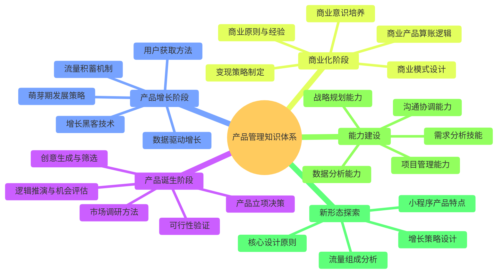
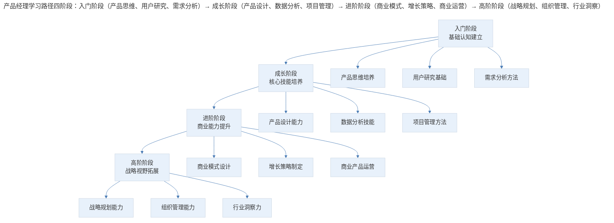

# 导言 | 产品实战的知识体系与学习路径

## 1. 导言

在现代企业组织架构中，产品经理（Product Manager, PM）扮演着连接商业目标、技术实现与用户需求的关键角色。然而，关于产品经理的核心价值，业界始终存在讨论：一个优秀的产品经理究竟能为企业带来多大程度的业务提升？当产品团队被替换时，企业的命运是否会发生根本性改变？

本文作为"产品实战"专题的导言，系统阐述产品经理的核心价值定位、产品管理知识体系框架、产品经理学习路径设计，以及学习方法论与知识内化原则，为读者构建"产品实战"完整的学习地图。

## 2. 核心概念：产品经理的核心价值定位

从组织行为学的视角审视，产品经理的价值并非孤立存在。企业的成功是多种职能协同作用的结果，产品经理的职责在于将"产品力"（Product Capability）注入业务流程的各个环节，与其他职能形成有机融合。这种融合模式可以类比于调酒工艺——不同角色将各自的"原料"注入同一容器，通过充分交融产生化学反应，最终形成具有独特价值的产出。

### 表1：传统职能分工模式与融合协作模式对比

| 维度 | 传统分工模式 | 融合协作模式 |
|------|-------------|-------------|
| 职责边界 | 各司其职，边界清晰 | 职能交叉，协同共创 |
| 工作交付 | 完成即交付，后续不跟进 | 全程参与，持续迭代 |
| 成果归属 | 可明确区分各环节贡献 | 整体产出，难以拆分 |
| 思维方式 | 本位主义，关注局部最优 | 系统思维，追求全局最优 |
| 协作机制 | 串行传递，信息衰减 | 并行协作，信息共享 |
| 价值创造 | 各环节价值叠加 | 跨职能协同产生增值 |

产品经理的核心职责，是将产品思维渗透至运营、技术、商业等各个领域。运营活动需要产品思维指导，产品设计需要融入运营策略；架构设计需要体现产品规划，产品决策需要充分理解技术边界。这种跨职能的产品思维渗透，正是产品经理区别于其他职能的核心价值所在。

## 3. 关键方法：产品管理知识体系框架

产品管理作为一门综合性学科，其知识体系涵盖产品全生命周期的各个阶段。基于产品生命周期理论（Product Life Cycle Theory），可将产品管理知识体系划分为以下核心模块：

> 产品管理知识体系五大模块：产品诞生阶段（创意生成、市场调研、可行性验证、立项决策）、产品增长阶段（萌芽期策略、用户获取、流量积蓄、增长黑客）、商业化阶段（商业意识、商业模式、算账逻辑、变现策略）、能力建设（数据分析、需求分析、沟通协调、战略规划、项目管理）、新形态探索（小程序产品特点、流量组成、设计原则、增长策略）。

### 3.1 产品诞生阶段

产品诞生阶段是产品管理的基础环节，涵盖从创意萌芽到产品立项的完整过程。该阶段的核心任务包括：

**创意生成与筛选**：运用系统化方法产生产品创意，并通过评估框架进行筛选。常用的创意来源包括用户反馈、竞品分析、技术趋势洞察、市场空白识别等。

**市场调研方法**：掌握定性与定量调研技术，包括用户访谈、问卷调查、焦点小组、可用性测试等，以获取真实可靠的市场信息。

**可行性验证**：从技术可行性、商业可行性、用户可行性三个维度评估产品创意的落地可能性。最小可行产品（Minimum Viable Product, MVP）方法是该阶段的重要工具。

**产品立项决策**：基于调研结果和可行性分析，做出是否推进产品开发的决策。该决策需要综合考虑资源投入、市场时机、竞争格局等因素。

### 3.2 产品增长阶段

产品增长阶段关注产品从上线到规模化发展的过程。该阶段的核心议题包括：

**萌芽期发展策略**：产品上线初期面临用户基数小、数据波动大、方向不确定等挑战，需要制定针对性的发展策略。

**用户获取方法**：通过有机增长（Organic Growth）和付费增长（Paid Growth）两种路径获取用户。前者依赖产品口碑和自然传播，后者通过广告投放和营销活动实现。

**流量积蓄机制**：建立可持续的流量获取和留存机制，包括搜索引擎优化（SEO）、内容营销、社交传播等手段。

**增长黑客技术**：运用数据驱动的实验方法，通过快速迭代找到有效的增长杠杆。

### 3.3 商业化阶段

商业化阶段标志着产品从"好用"向"赚钱"的转变。该阶段的核心能力包括：

**商业意识培养**：理解商业本质，建立成本收益思维，关注投入产出比（ROI）。

**商业模式设计**：选择适合产品特性的商业模式，如订阅制、广告变现、交易佣金、增值服务等。

**商业产品算账逻辑**：掌握单位经济模型（Unit Economics），理解客户获取成本（CAC）、客户终身价值（LTV）、边际成本等核心指标。

### 3.4 能力建设模块

产品经理的能力建设是贯穿职业生涯的持续过程。核心能力维度包括：

**数据分析能力**：从数据中发现问题、验证假设、指导决策。包括数据采集、数据处理、数据分析、数据可视化等技能。

**需求分析技能**：准确识别用户需求，区分表面需求与深层需求，建立需求优先级评估框架。

**沟通协调能力**：在跨职能协作中有效传达信息、协调资源、推动决策。

**战略规划能力**：制定产品愿景、规划产品路线图（Product Roadmap）、把握产品发展方向。

## 4. 实践落地：产品经理学习路径设计

基于上述知识体系，产品经理的学习路径应遵循"理论-实践-反思"的循环模式，按照产品生命周期的时间顺序展开。

> 产品经理学习路径四阶段：入门阶段（产品思维、用户研究、需求分析）→ 成长阶段（产品设计、数据分析、项目管理）→ 进阶阶段（商业模式、增长策略、商业运营）→ 高阶阶段（战略规划、组织管理、行业洞察）。

### 表2：产品经理能力发展阶段与学习重点

| 发展阶段 | 时间周期 | 核心能力 | 学习重点 | 典型产出 |
|---------|---------|---------|---------|---------|
| 入门阶段 | 0-1 年 | 基础认知 | 产品思维、用户研究、需求分析 | 需求文档、竞品分析报告 |
| 成长阶段 | 1-3 年 | 执行能力 | 产品设计、数据分析、项目管理 | 产品方案、迭代计划 |
| 进阶阶段 | 3-5 年 | 商业能力 | 商业模式、增长策略、商业运营 | 商业计划、增长方案 |
| 高阶阶段 | 5 年以上 | 战略能力 | 战略规划、组织管理、行业洞察 | 产品战略、路线图 |

### 4.1 入门阶段：基础认知建立

入门阶段的核心目标是建立产品管理的基本认知框架。学习者需要理解产品经理的角色定位、工作职责和核心方法论。

**产品思维培养**：建立以用户为中心的思考方式，理解产品价值创造的底层逻辑。产品思维强调从用户需求出发，通过产品功能解决问题、创造价值。

**用户研究基础**：掌握用户研究的基本方法，能够独立完成用户访谈、问卷设计、数据分析等工作。理解定性研究与定量研究的适用场景和互补关系。

**需求分析方法**：学习需求收集、需求分析、需求优先级排序的系统方法。能够区分用户需求（User Need）、产品需求（Product Requirement）和功能需求（Feature Requirement）。

### 4.2 成长阶段：核心技能培养

成长阶段聚焦于产品经理核心执行能力的培养。该阶段的学习者已具备基础认知，需要在实践中磨练专业技能。

**产品设计能力**：掌握产品设计的系统方法，包括信息架构设计、交互设计、视觉设计评审等。理解设计思维（Design Thinking）的核心原则。

**数据分析技能**：建立数据驱动的决策习惯，掌握常用数据分析工具和方法。能够设计数据指标体系，进行 A/B 测试，解读数据洞察。

**项目管理方法**：学习敏捷开发（Agile Development）、Scrum 等项目管理方法论，能够有效推动产品从设计到上线的全过程。

### 4.3 进阶阶段：商业能力提升

进阶阶段标志着产品经理从功能导向向商业导向的转变。该阶段的核心任务是培养商业意识和增长能力。

**商业模式设计**：深入理解各类商业模式的运作机制，能够根据产品特性选择或设计合适的商业模式。理解商业画布（Business Model Canvas）等战略工具。

**增长策略制定**：掌握增长黑客方法论，能够设计并执行用户增长策略。理解 AARRR 模型（获取、激活、留存、变现、推荐）等增长框架。

**商业产品运营**：学习商业产品的运营方法，包括定价策略、销售支持、客户成功管理等。

### 4.4 高阶阶段：战略视野拓展

高阶阶段的产品经理需要具备战略思维和组织影响力。该阶段的学习重点从个人能力转向组织能力和行业洞察。

**战略规划能力**：能够制定产品愿景和长期战略，规划产品路线图，把握产品发展方向。理解战略分析工具如 SWOT 分析、波特五力模型等。

**组织管理能力**：培养团队管理、跨部门协作、利益相关者管理等组织能力。能够影响他人、推动变革。

**行业洞察力**：建立对所在行业的深度理解，能够识别行业趋势、预判市场变化、发现战略机会。

## 5. 实践指南：学习方法论与知识内化

产品管理知识的学习不应止于理论认知，而应追求知识的内化与应用。有效的学习方法遵循"法无定法，然后知非法法也"的原则——方法论提供思考框架，但真正的能力来自于实践中的灵活运用。

### 5.1 知识内化的三个层次

**认知层**：理解概念、原理、方法论，建立知识框架。这是学习的基础层次，通过阅读、听课、讨论等方式实现。

**应用层**：将知识应用于实际工作场景，解决具体问题。这一层次需要通过实践项目、案例分析、模拟演练等方式达成。

**内化层**：将知识转化为直觉和习惯，能够在复杂情境中快速做出判断。这是学习的最高层次，需要大量的实践积累和反思总结。

### 5.2 实践导向的学习建议

**案例复盘**：定期对参与的产品项目进行复盘，总结成功经验和失败教训。复盘应遵循"回顾目标-评估结果-分析原因-总结规律"的结构化流程。

**跨界学习**：关注产品领域之外的知识，如心理学、经济学、设计学、技术趋势等。跨界知识能够为产品决策提供多元视角。

**社群交流**：参与产品经理社群，与同行交流经验、分享见解。他人的实践案例和思考角度能够拓展自身认知边界。

## 6. 进阶延展：结语与核心要点回顾

### 6.1 结语

产品管理是一门实践性极强的学科，其知识体系涵盖产品全生命周期的各个阶段。对于产品经理而言，建立系统的知识框架、遵循科学的学习路径、坚持实践导向的学习方法，是持续成长的关键。

本文所呈现的知识体系和学习路径，旨在为产品经理提供思考框架和行动指南。每位产品经理都应结合自身实际情况，探索适合自己的成长路径。真正的能力不在于掌握多少方法论，而在于能否在复杂多变的实际场景中灵活运用、持续精进。

### 6.2 核心要点回顾

产品经理的核心价值在于将产品思维渗透至运营、技术、商业等各个领域，通过跨职能协同产生增值。产品管理知识体系涵盖产品诞生、产品增长、商业化、能力建设与新形态探索五大模块。学习路径遵循"入门（基础认知）→成长（核心技能）→进阶（商业能力）→高阶（战略视野）"四阶段演进，并以"认知层→应用层→内化层"三个层次实现知识内化。核心方法是"理论-实践-反思"循环，通过案例复盘、跨界学习与社群交流持续精进。

---

## 参考文献（未核实）
> 注：以下条目为原始素材所附延伸文献，未逐条核实出处与真实性，仅供延伸参考。

- Cagan, M. (2018). *Inspired: How to create tech products customers love* (2nd ed.). Wiley.
- Kim, W. C., & Mauborgne, R. (2017). *Blue ocean shift: Beyond competing* (1st ed.). Hachette Books.
- Ries, E. (2011). *The lean startup: How today's entrepreneurs use continuous innovation to create radically successful businesses* (1st ed.). Crown Business.
- Cohen, B., & Kollmann, J. (2022). Product management in practice: A cross-functional approach. *Journal of Product Innovation Management, 39*(3), 245-262.
- McGrath, R. G. (2013). *The end of competitive advantage: How to keep your strategy moving as fast as your business* (1st ed.). Harvard Business Review Press.
- Ulrich, K. T., & Eppinger, S. D. (2015). *Product design and development* (6th ed.). McGraw-Hill Education.
- Hallowell, D. (2021). The product manager's toolkit: Methodologies and frameworks for product success. *Product Management Review, 12*(4), 78-95.
- Gothelf, J., & Seiden, J. (2021). *Lean UX: Designing great products with agile teams* (3rd ed.). O'Reilly Media.