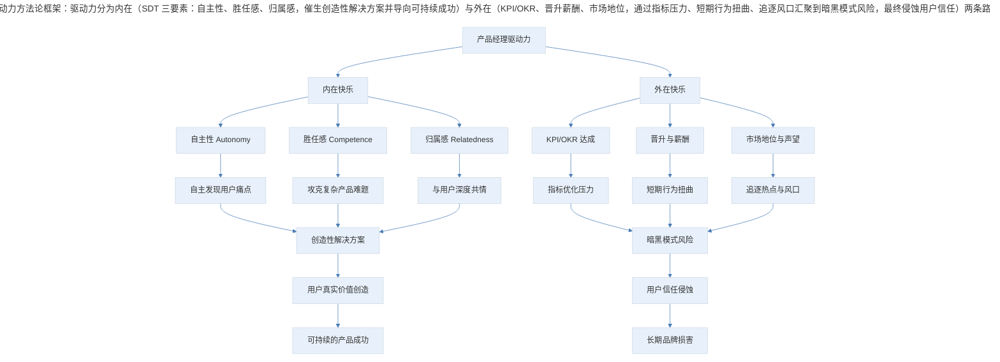
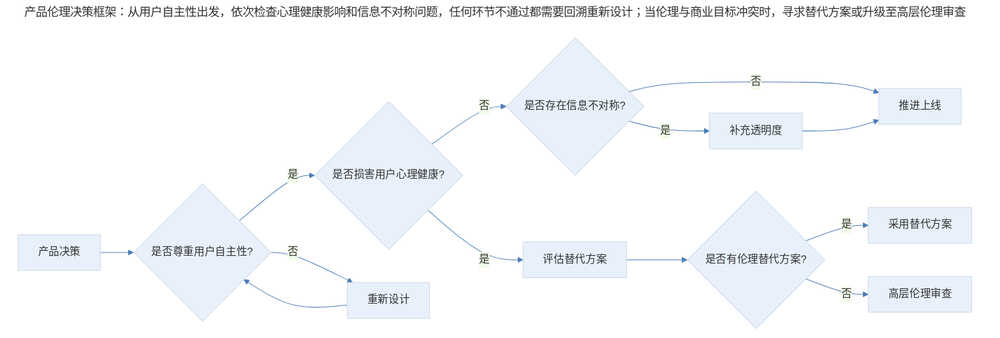
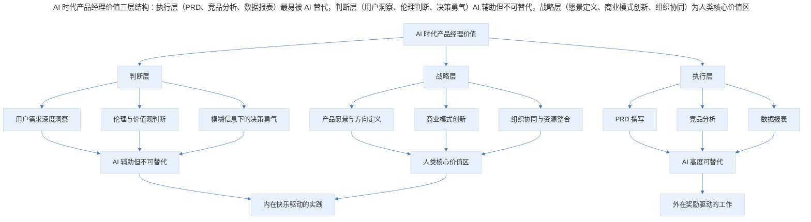

# 尾声：你的快乐是哪一种

## 1. 导言

产品经理的驱动力分为内在快乐与外在快乐，这一区分源自麦金泰尔的实践哲学，并得到现代 Self-Determination Theory 的实证支持。当外在奖励（KPI、晋升、奖金）成为唯一驱动力时，暗黑模式与伦理失范几乎不可避免。Joshua Bell 的地铁实验与梵高的一生，分别从两个极端揭示了内在驱动力对卓越工作的根本性意义。在 AI 深度介入产品工作的今天，产品经理的内在快乐——对用户真实问题的深刻共情与创造性解决——不仅未被替代，反而成为人机协作中最不可替代的价值锚点。

> **更新说明**：本文档于 2026-06 更新，主要更新点：补充 Joshua Bell 地铁实验后续与普利策奖背景；更新梵高割耳事件的学术争议；引入 Self-Determination Theory 等现代动机理论框架；增加 AI 时代产品经理内在驱动力的新思考；补充 Humane Technology 运动与产品伦理前沿讨论；增加专业深度分层与 Mermaid 方法论图表。

## 2. 核心概念：内在快乐与外在快乐

### 2.1 麦金泰尔的实践哲学

前些日子我看了淡豹在单向街书店文化节上的一个演讲，她在演讲中提到麦金泰尔和他的书《追寻美德》，书中将人的快乐分为内在和外在两种。

麦金泰尔用一个学习国际象棋的小孩子举例：如果这个孩子每赢一次棋，我们就奖励他糖果，那么糖果就是这个小孩子关于国际象棋的外在快乐。

这样的快乐是由于机缘巧合，偶然与国际象棋关联，却与国际象棋的本身并无必然联系，这是可以通过除国际象棋之外的其他实践获得的快乐；而另一方面，国际象棋本身给这个孩子带来的逻辑或战略相关的心理满足感，则是存在于国际象棋之中，无法被其他实践替代的内在快乐。

麦金泰尔说，如果驱动这个小孩子的仅仅只是外界作用于他的糖果奖励，那么将没有任何事情可以阻止这个小男孩用欺骗或贿赂的方式获胜。

对我们来说，如果驱动力仅仅只是外在奖励，比如晋升、加薪、奖金和地位，那么也就没有任何事情，可以阻止我们为更高的数据指标做出狡猾的设计。

### 2.2 Self-Determination Theory：内在动机的科学基础

麦金泰尔的哲学洞察，在心理学领域得到了强有力的实证支持。Deci 与 Ryan 于 1985 年提出的 Self-Determination Theory（自我决定理论，SDT）是当代动机心理学中最具影响力的理论框架之一，已被超过 3000 项实证研究验证。

SDT 认为，人类有三种基本心理需求，当这些需求得到满足时，内在动机自然涌现：

- **自主性（Autonomy）**：行为出于自我选择而非外部控制。产品经理自主发现用户痛点并设计解决方案，比被 KPI 推着走更能产生创造性成果。
- **胜任感（Competence）**：在挑战中感受到自身能力的成长。攻克一个复杂的产品难题带来的满足感，远胜于完成一个机械的指标。
- **归属感（Relatedness）**：与他人建立有意义的连接。产品经理与用户之间的深度共情，正是归属感在职业场景中的体现。

SDT 的研究还揭示了一个关键发现：**外在奖励可能"挤出"（crowding-out effect）内在动机**。当人们原本因内在兴趣而从事某项活动时，引入外在奖励反而会降低其对该活动的内在兴趣。这解释了为什么纯粹 KPI 驱动的团队往往缺乏创新——指标替代了热爱，考核替代了追求。

### 2.3 方法论框架

> 驱动力方法论框架：驱动力分为内在（SDT 三要素：自主性、胜任感、归属感，催生创造性解决方案并导向可持续成功）与外在（KPI/OKR、晋升薪酬、市场地位，通过指标压力、短期行为扭曲、追逐风口汇聚到暗黑模式风险，最终侵蚀用户信任）两条路径。关键在于外在奖励是否"挤出"了内在动机。

**图表解读**：驱动力分为内在与外在两条路径。内在路径通过 SDT 三要素催生创造性解决方案，最终导向可持续的产品成功；外在路径在适度时可以提供方向感，但当其成为唯一驱动力时，会通过指标压力、短期行为扭曲和追逐风口三条路径汇聚到暗黑模式风险，最终侵蚀用户信任。两条路径并非完全对立——关键在于外在奖励是否"挤出"了内在动机。

## 3. 关键方法：从暗黑模式到产品伦理

### 3.1 KPI 文化如何催生暗黑模式

我们曾经在文章中聊起过互联网领域的暗黑模式，在那篇文章中我没有提到的是暗黑模式的驱动力。

其实催生各种让人啼笑皆非设计把戏的根源，就是无处不在的 KPI 文化，我们习惯了为 KPI 工作，为一堆指标工作，它们是衡量我们工作成效的标尺，就如同用画作的价格和知名度评价画家一样。

我们会准确地在标题中放入耸人听闻的词语，命中情绪，引爆传播，我们会用 A/B 测试不厌其烦地比较不同样式设计带来的转化率差异，我们会在不起眼的角落默认选中"我已阅读并同意《用户协议》"。

### 3.2 增长黑客的伦理困境：从 A/B 测试到算法操控

A/B 测试本身是中性的工具，但当它被纯粹的外在奖励驱动时，就容易滑向伦理灰色地带。近年来，增长黑客文化从"快速实验"演变为"不择手段地优化转化率"，催生了一系列值得反思的实践：

- **无限滚动与注意力劫持**：社交媒体的无限滚动设计利用了多巴胺反馈回路，2021 年 Facebook 内部文件泄露（Frances Haugen 举报事件）证实，公司明知其对青少年心理健康的负面影响，却因商业利益选择不作为。
- **确认性偏差的算法放大**：推荐算法为追求停留时长，不断强化用户已有偏见，导致信息茧房与社会极化。
- **暗黑模式的法律规制**：欧盟《数字服务法》（DSA）于 2022 年生效、2024 年起全面适用，明确禁止在线平台使用欺骗性设计（deceptive design patterns）；美国 FTC 也加大了对暗黑模式的执法力度；中国《互联网信息服务算法推荐管理规定》也于 2022 年实施，要求算法推荐服务提供者不得利用算法实施大数据杀熟等不公平行为。

### 3.3 Humane Technology 运动

2018 年，前 Google 设计伦理学家 Tristan Harris 联合他人创立了 Center for Humane Technology，发起了 Humane Technology 运动。该运动的核心主张是：技术应当尊重人类的注意力、自主性和脆弱性，而非将其视为可剥削的资源。

2020 年上线的纪录片《The Social Dilemma》将这一议题推向公众视野，Tristan Harris 在片中指出："如果你没有为产品付费，那你就是产品。"这句话虽然简化了问题，但揭示了一个深层矛盾：当广告模式成为互联网的主流商业模式时，产品经理的内在快乐（为用户创造价值）与外在奖励（最大化用户注意力以变现）之间必然存在张力。

2023-2025 年间，Humane Technology 运动进一步发展，推动了一系列实践：

- **设计伦理清单**：产品团队在上线新功能前，需评估其对用户自主性、心理健康和社会影响的影响
- **时间幸福度指标**：替代单纯的 DAU/MAU，衡量用户使用产品后的主观幸福感
- **暗黑模式审计**：定期审查产品中是否存在欺骗性设计

### 3.4 产品伦理决策框架

> 产品伦理决策框架：从用户自主性出发，依次检查心理健康影响和信息不对称问题，任何环节不通过都需要回溯重新设计；当伦理与商业目标冲突时，寻求替代方案或升级至高层伦理审查。

**图表解读**：产品伦理决策不是一次性的判断，而是一个迭代过程。从用户自主性出发，依次检查心理健康影响和信息不对称问题，任何环节不通过都需要回溯重新设计。当伦理与商业目标冲突时，应寻求替代方案或升级至高层伦理审查。

## 4. 实践落地：两个极端的故事与地铁实验

### 4.1 Joshua Bell：上帝般的演奏

2001 年，第 43 届格莱美"最佳器乐独奏专辑"授予了一位时年 33 岁的天才小提琴家。而此前 1999 年，这位小提琴家参与的电影《红色小提琴》获得了奥斯卡最佳原声配乐奖，颁奖典礼上，他获得的颁奖词是："如同上帝般演奏"。

他叫 Joshua Bell，出生于美国印第安纳州，5 岁开始学琴，展现出过人的音乐天赋，14 岁开始与世界级指挥大师和管弦乐队合作演出，39 岁获得代表美国古典音乐界最高荣誉的费雪奖（Avery Fisher）。

人们津津乐道于他手中那把价值数百万的小提琴，它由意大利大师斯特拉迪瓦里（Antonio Stradivari）于 1713 年制成。2001 年时，Joshua Bell 卖掉了自己的琴，又额外凑了百万美元才将其买下。

Joshua Bell 凭借精深的艺术造诣，高超的琴技，毫无争议地成为当今世界上最优秀的小提琴家之一，他的独奏音乐会永远爆满，一票难求。

### 4.2 梵高：用苦难表达欣喜

同样是艺术家，文森特·梵高并不像 Joshua Bell 那么幸运，他穷困潦倒，寄人篱下，与好友决裂，离开相依为命的弟弟，割掉了自己的耳朵，被关进精神病院。

虽然命运如此凄惨，但他却从未停止创作，一辈子完成了几千幅画，只不过生前仅卖出了其中一幅。

**学术争议更新**：2009 年，德国汉堡大学的历史学家 Hans Kaufmann 与 Rita Wildegans 提出了不同的假说（英国学者 Martin Bailey 等人也曾跟进研究与报道）。根据他们的研究，梵高耳朵受伤的伤口形态与自我割伤的典型特征不完全吻合——Kaufmann 团队提出另一种可能：高更可能在与梵高的冲突中用剑（或剃刀）割伤了梵高的耳朵，而梵高出于对高更的保护选择了沉默和自认。这一假说至今仍有争议，梵高博物馆的官方立场仍倾向于自伤说。但无论真相如何，梵高在割耳事件后依然坚持创作的事实，恰恰说明驱动他的力量远非外在奖赏所能解释。

吸引他的不是钱或名气，梵高曾提到自己最想得到的评价是："他的感受如此深刻而又细腻。"（I want to touch people with my art. I want them to say: he feels deeply, he feels tenderly.）

### 4.3 Joshua Bell 的地铁实验：后续与反思

**原始实验回顾**：2007 年 1 月 12 日早上 7 点 51 分，Joshua Bell 像其他街头艺人一样，独自来到华盛顿特区市中心的"朗方广场"（L'Enfant Plaza）地铁站。他演奏了包括巴赫《恰空舞曲》和舒伯特《圣母颂》在内的 6 段曲目，演奏持续了 45 分钟，期间有 1097 个人从他身边经过，只有 7 人驻足观赏，27 人向他的琴盒里投下零钱，共计 32 美金。只有一个路人在演奏接近尾声时认出了他。

**普利策奖与深层解读**：这篇实验报道由《华盛顿邮报》记者 Gene Weingarten 撰写，题为《Pearls Before Breakfast》，获得了 2008 年普利策特稿写作奖。Weingarten 在文章中提出了一个尖锐的问题：如果伟大的艺术发生在错误的时间和地点，人们是否还能识别它？这不仅仅关乎审美能力，更关乎我们是否还有能力在功利化的日常中，为"无用之美"驻足。

**后续重复实验**：2017 年，为纪念原实验十周年，Joshua Bell 在华盛顿特区 Union Station 车站再次进行街头演奏。这一次，演奏声音通过扩音设备传遍车站，数百人驻足聆听，Bell 获得了约 1000 美元的打赏——情境与环境的改变让"世界级音乐被忽视"的现象不再复现，这反而印证了原实验的深层命题：人们是否驻足，取决于所处的外在节奏与情境。2023 年，伦敦地铁也进行了一次类似实验，结果与 Bell 的实验惊人相似。但有趣的是，许多路人在事后通过手机回看了演奏视频并表达了遗憾——这暗示：人们并非不懂得欣赏，而是被外在节奏裹挟，失去了驻足的自主性。

## 5. 实践指南：AI 时代产品经理的内在驱动力

### 5.1 AI 会替代产品经理的"内在快乐"吗？

2023 年以来，大语言模型（LLM）的爆发式发展引发了产品经理群体的深层焦虑：AI 能写 PRD、能做竞品分析、能生成交互原型、能分析用户反馈——产品经理的工作还有不可替代的价值吗？

这个问题的答案，恰恰藏在内在快乐与外在快乐的区分之中。

**AI 替代的是外在奖励路径上的工具性工作**：那些为了完成 KPI 而进行的机械性、重复性劳动——格式化文档、数据整理、常规分析——这些工作本身就不构成产品经理的内在快乐。AI 的介入，反而为产品经理腾出了空间，让我们可以更专注于真正驱动内在快乐的那些实践。

**AI 无法替代的是内在快乐的核心**：对用户真实问题的深刻共情、在模糊信息中做出判断的勇气、将复杂约束条件整合为优雅方案的创造力。这些能力根植于人类独特的情感体验和社会认知，是 SDT 三要素——自主性、胜任感、归属感——在产品实践中的具体体现。

### 5.2 AI 时代产品经理的价值重新定义

> AI 时代产品经理价值三层结构：执行层（PRD、竞品分析、数据报表）最易被 AI 替代，由外在奖励驱动；判断层（用户洞察、伦理判断、决策勇气）AI 辅助但不可替代；战略层（愿景定义、商业模式创新、组织协同）为人类核心价值区。内在快乐驱动的实践集中在判断层和战略层。

**图表解读**：AI 时代产品经理的价值呈现三层结构。执行层的工作最容易被 AI 替代，这些工作往往由外在奖励驱动；判断层的工作 AI 可以辅助但无法替代，因为它们需要人类的情感共鸣和价值判断；战略层则是人类的核心价值区，需要愿景、勇气和整合能力。内在快乐驱动的实践集中在判断层和战略层，这正是产品经理在 AI 时代最应投入精力的领域。

### 5.3 AI 辅助下的内在快乐实践

AI 不是内在快乐的替代者，而是内在快乐的解放者。以下是 AI 时代产品经理如何更深入地实践内在快乐的几个方向：

- **从"写文档"到"读人心"**：AI 可以在几分钟内生成一份结构完整的 PRD，但 AI 无法坐在用户对面，捕捉那一瞬间的犹豫表情，理解那个未被说出口的需求。产品经理应将节省下来的时间投入到用户访谈和田野调查中。
- **从"追指标"到"问为什么"**：AI 可以实时监控数据异动并生成分析报告，但"为什么这个指标重要"这个元问题，必须由产品经理来回答。
- **从"做功能"到"解问题"**：AI 可以快速生成功能方案，但 Jobs-to-be-Done 框架提醒我们，用户雇佣产品是为了完成某个任务，而非使用某个功能。
- **从"优化转化"到"创造意义"**：A/B 测试可以优化按钮颜色和文案，但无法创造产品的意义感。

## 6. 进阶延展：专业深度分层与核心要点回顾

### 6.1 专业深度分层

**基础层：认识内在与外在驱动力的区别**

| 要点 | 说明 | 适用场景 |
|------|------|----------|
| 区分内外在快乐 | 理解麦金泰尔的内在/外在快乐区分 | 职业规划与自我反思 |
| 识别 KPI 陷阱 | 当 KPI 成为唯一驱动力时，容易催生暗黑模式 | 日常产品决策 |
| 基本伦理意识 | 了解暗黑模式的常见类型与危害 | 产品设计评审 |
| 自我觉察 | 定期审视自己的工作驱动力来源 | 周报/月度复盘 |

**进阶层：构建内在驱动力的实践体系**

| 要点 | 说明 | 适用场景 |
|------|------|----------|
| SDT 三要素应用 | 在团队管理中满足成员的自主性、胜任感、归属感 | 团队建设与 1-on-1 |
| 伦理决策框架 | 在产品决策中引入伦理审查环节 | 产品评审会 |
| Humane Technology 实践 | 采用设计伦理清单、时间幸福度指标等工具 | 产品规划阶段 |
| AI 协作边界 | 明确哪些工作交给 AI，哪些必须由人完成 | 工作流设计 |

**高阶层：在组织层面推动文化变革**

| 要点 | 说明 | 适用场景 |
|------|------|----------|
| 挤出效应的组织干预 | 设计不损害内在动机的激励机制 | 组织设计与绩效体系 |
| 伦理治理体系 | 建立产品伦理委员会与审查流程 | 企业治理 |
| 意义驱动的产品战略 | 将内在快乐作为产品战略的核心驱动力 | 战略规划 |
| 行业倡导 | 参与 Humane Technology 等行业运动，推动标准制定 | 行业影响力建设 |

### 6.2 回到那个问题：核心要点回顾

那产品设计的内在奖励呢？对我来说，就是用产品真切地改变人们的生活。

**我想象中的产品，她不需要占据用户每天八小时，而是恰如其分地出现，然后悄无声息地消失。她依靠精妙的产品机制，而不是哗众取宠的标题和费尽心机的设计样式触动用户。她慷慨而克制，不吝惜给予，又不会喋喋不休地索取。**

就算这个产品只有一个用户，那就谦卑地解决让他焦头烂额的问题，为他带来启发，为他创造价值。

即便永远无法做出这样的东西，我依然想要去追求，它是我走进这个行业的初衷。

**但我依然想在结束前问一个问题：如果没有百万用户，没有喝彩和关注，没有奖金期权，没有 App Store 星级，也没有双手抱胸的商务形象照，你的工作还会让你感到骄傲和快乐吗？一个产品经理的成就，只有那一种评价标准吗？**

在 AI 可以替你写 PRD、做竞品分析、生成原型的今天，这个问题比以往任何时候都更加尖锐。因为当工具性工作被 AI 替代后，剩下的——你对用户的共情、你对问题的洞察、你对优雅方案的执着——恰恰就是你内在快乐的全部。

这就是内在快乐的力量：它不依赖于外在的认可，不因场景的改变而增减，它是你之所以选择这个职业的最初理由，也是 AI 永远无法从你手中夺走的东西。

---

## 延伸阅读

1. **Alasdair MacIntyre《After Virtue》（追寻美德）**——内在快乐与外在快乐区分的哲学源头
2. **Edward Deci & Richard Ryan《Self-Determination Theory》**——内在动机的心理学实证基础
3. **Gene Weingarten《Pearls Before Breakfast》**——Joshua Bell 地铁实验的普利策获奖报道
4. **Tristan Harris 与 Center for Humane Technology**——产品伦理运动的核心资源
5. **Frances Haugen 证词与 Facebook 内部文件**——科技伦理的现实案例
6. **Daniel Pink《Drive》**——内在动机对现代工作的启示
7. **《The Social Dilemma》纪录片**——注意力经济与产品伦理的公众讨论
8. **Martin Bailey《Starry Night: Van Gogh at the Asylum》**——梵高晚年的创作与精神世界

## 更新日志

| 版本 | 日期 | 更新内容 |
|------|------|----------|
| v1.0 | 2018 | 初始版本：Joshua Bell 与梵高的故事，麦金泰尔内在/外在快乐区分 |
| v2.0 | 2026-06 | 补充 Joshua Bell 实验后续与普利策奖背景；更新梵高割耳学术争议；引入 SDT 理论框架；增加 AI 时代产品经理内在驱动力讨论；补充 Humane Technology 运动与产品伦理前沿；增加专业深度分层与 Mermaid 方法论图表 |