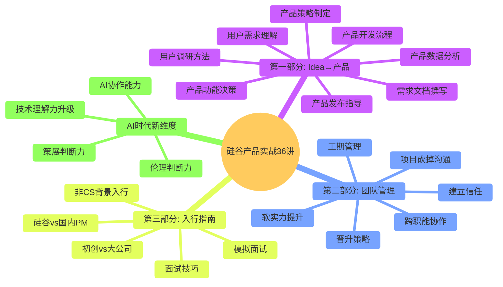

# 开篇词 | 打造千万用户的世界级产品

## 1. 导言

每次朋友聚会，甭管是高雅的奶酪红酒派对还是啤酒撸串，大家一见到我，总是会眉飞色舞地跟我吐槽，说我们刚刚发布的产品哪里哪里不好用，或者哪里哪里好玩得不得了；甚至和六七十岁的老校友聊天，说得最多的也是我们发布的产品。

纽约的地铁上、哥斯达黎加夜店的舞池上，看着形形色色的路人，坐着的，趴着的，站着的，看到他们拿出手机在 Facebook 产品的界面上敲敲打打，这是我最幸福的时刻。

我叫曲晓音，在 Facebook 做产品经理，领导着一个几十人的产品团队。之前，我在 Instagram、微软都做过产品经理，担任过多个千万级用户产品的产品经理，也有过自己的教育创业公司，还在上市之前的 Atlassian 做过营销工作。而我最喜欢的，就是打造世界级的产品。

## 2. 核心概念：为什么卓越的产品经理难找

我向来喜欢写作与分享，而第一次发布产品经理的相关文章，是写在美国 Medium 网站的产品经理面试秘籍，没想到文章一发布瞬间就火了，我因此收到无数的邮件和信息，太多人问我怎样才能成为产品经理，怎样才能成为一个卓越的产品经理。受宠若惊之余，我也意识到两个关键问题：一是产品经理受众人热捧，因此有很多人期望转行为产品经理；二是太多人对如何能够脱颖而出，成为真正优秀的产品经理备感困惑。

产品经理貌似随处可见，但是卓越的产品经理难找得很。产品经理理念与工作方式的不同，直接影响团队的开发效率和产品上线后的表现。因此，下面的这几个问题，是否已经说到你的心坎儿里？

- 你加班好几个月写出几万字的产品需求文档，却没有解决真实存在的用户需求；
- 你辛辛苦苦推出的新产品，却无人问津，没人下载；
- 你刚刚成为产品经理，怎么处理好产品团队关系，让你"亚历山大"；
- 或许你想进入产品经理这个行业，却不知道产品经理到底是什么，以及从何开始；
- 或许你信心满满的参加面试，可不知怎么的，总是拿不到理想的 offer；
- 或许你压根不想自己当产品经理，只是想知道，面对你那个讨厌的产品经理，该怎么对付他。

如你所期望的，我将在这些内容里解决你的这些痛点。

## 3. 关键方法：专栏要讲清楚的三件事

那是还在上学的时候，我刚刚听说有产品经理这个岗位，感觉酷极了。当时翻遍书海，找到了一本刚刚出版月余的*Cracking PM Interview*，即《产品经理面试宝典》，如获至宝，虽然这本书讲的内容其实很浅显，但对我而言就好比发现了宝藏。因此，我希望通过这些内容来帮你梳理思路，希望它之于你，也能像当年这本书之于我一样，带你入行，给你指引方向，让你成为一个更好的产品经理。

我希望通过这些内容，通过我在顶尖科技公司的实战所学，向你分享那些自己看书学理论学不到的东西。而我通过亲身实践试错得来的"秘籍"，希望能够总结我的试错经验，帮你绕过那些坑儿。在这里，我要给你讲清楚三件事。

- **第一，如何把一个随便说说的 idea，或者用户一句小声的抱怨，转化成一个实实在在、有着卓越体验的世界级产品。** 我会讲解产品经理最重要的基本功，比如产品开发的流程、如何理解用户需求、如何进行用户调研、如何制定产品策略、如何分析产品数据、如何决定产品功能、如何写产品需求文档，如何指导产品发布，等等。这一部分，希望能够提高你的产品思考能力，让你能开发出真正满足用户所需的、具有优秀用户体验的明星产品。
- **第二，如何引导团队里不同性格、不同经历、不同脑洞的工程师、运营、市场、法律、设计达人们，让大家能够拧成一股绳，高效地开发出最优秀的产品。** 我会把你想问但不敢问、敢问却得不到回答的那些问题，给你一五一十地讲出来。怎样晋升更快，怎样催促工程师加快工期却不得罪他们，怎样告诉你的团队项目被砍了，等等这些问题将不再棘手。这一部分，可以让产品经理学会如何高效管理团队，也可以让工程师、运营、设计师与不同职能的同事更好的密切配合，搞定你的产品经理。
- **第三，告诉你如何进入产品经理这个行业，带你了解硅谷和国内的产品经理有什么区别，初创公司和大公司的文化差异在哪里，怎么进行产品经理面试，面试又考察哪些内容。** 最后，我还会给你模拟一个硅谷顶级公司的产品经理面试，培养你世界级产品的思考能力。最后这一部分，希望能够帮你了解最新鲜的行内信息，帮你成为一个更好的产品经理。

## 4. 实践落地：专栏框架全景

> 硅谷产品实战专栏全景：第一部分 Idea→产品（开发流程、用户需求、用户调研、产品策略、数据分析、功能决策、需求文档、产品发布）、第二部分团队管理（跨职能协作、晋升策略、工期管理、项目砍掉沟通、建立信任、软实力）、第三部分入行指南（硅谷 vs 国内、初创 vs 大公司、面试技巧、模拟面试、非 CS 背景入行）、AI 时代新维度（AI 协作能力、伦理判断力、技术理解力升级、策展判断力）。

## 5. 实践指南：2025 年产品经理的新挑战

自这些内容首次发布以来，产品经理这个角色经历了深刻变革。2025 年，AI 的爆发给产品经理带来了全新的挑战：

- **AI 正在重塑产品开发流程**：从需求分析到原型设计，从用户调研到数据洞察，AI 工具正在渗透产品开发的每一个环节。产品经理需要学会与 AI 协作，而非被 AI 替代
- **"懂技术"的定义正在改变**：过去，"懂技术"意味着能写代码；现在，"懂技术"意味着能理解 AI 的能力边界、能设计人机协作流程、能在技术讨论中提出正确的问题
- **伦理判断力成为核心竞争力**：当 AI 产品可以影响数亿人的决策时，产品经理不再只是"做产品"，更是"负责任地做产品"。算法偏见、隐私保护、AI 生成内容的责任边界，这些都是 2025 年产品经理必须面对的课题
- **从执行者到策展者**：当 AI 可以快速生成大量方案时，产品经理的核心价值从"产生方案"转向"筛选和组合方案"——判断力比产出量更重要

这些变化不会让产品经理消失，但会让卓越的产品经理与普通的产品经理之间的差距更大。这些内容中的核心方法论——用户洞察、权衡取舍、团队协作——在 AI 时代不仅没有过时，反而更加重要。

## 6. 进阶延展：核心要点回顾

### 6.1 专栏的初心与承诺

我喜欢从 0 到 1 做产品，也喜欢从头开始尝试新鲜事物。我会在这些内容里和你分享硅谷产品经理工作的点点滴滴，也会仔细阅读每一位朋友的每一条留言。在这短短的三个月时间里，希望我们一起分享、交流和成长。

### 6.2 核心要点回顾

本开篇词阐述了"打造千万用户的世界级产品"的核心价值：产品经理貌似随处可见，但卓越的产品经理难找，其理念与工作方式直接影响团队效率和产品表现。专栏围绕三件事展开：将 idea 转化为世界级产品的基本功、高效管理跨职能团队、进入产品经理行业并了解硅谷与国内的差异。在 2025 年 AI 时代，AI 重塑产品开发流程、"懂技术"定义改变、伦理判断力成为核心竞争力、产品经理从执行者转向策展者——但用户洞察、权衡取舍与团队协作的核心方法论在 AI 时代不仅没有过时，反而更加重要。

---

## 参考资料

- *Cracking PM Interview*（《产品经理面试宝典》）——产品经理面试经典书籍
- 本案例内容来源于"极客时间"专栏《硅谷产品实战 36 讲》开篇词（作者曲晓音）。