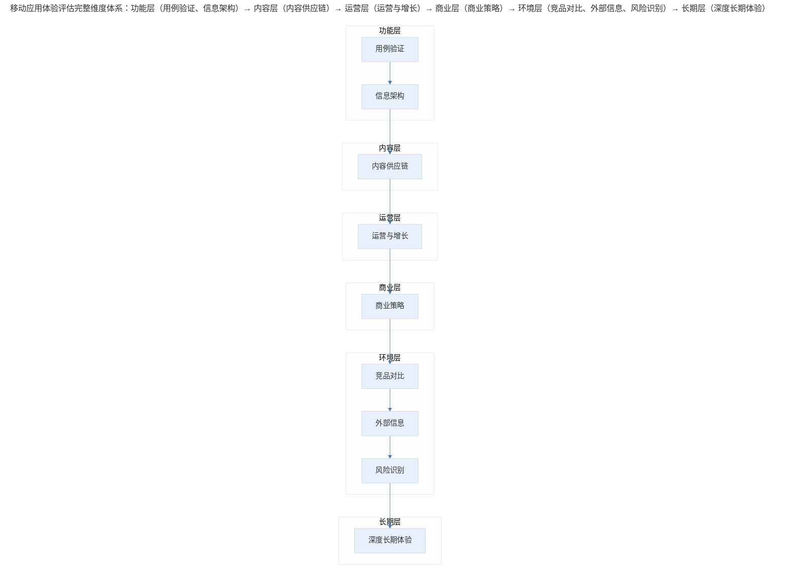
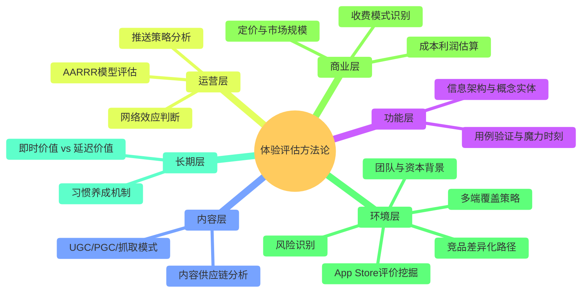

# 案例分析：产品体验评估的框架与实践

## 1. 导言

产品经理对移动应用的体验评估（Experience Evaluation）是一项系统性工作，不仅涉及功能层面的用例验证，更需要深入商业策略、竞品对比、风险识别等维度。本案例承接"移动应用体验评估的系统方法"中用例、信息架构、内容供应链、运营增长四个维度的分析，继续展开商业策略、竞品分析、外部环境与长期体验四个维度的评估实践，形成完整的移动应用体验评估闭环。

## 2. 评估框架：完整维度体系

> 移动应用体验评估完整维度体系：功能层（用例验证、信息架构）→ 内容层（内容供应链）→ 运营层（运营与增长）→ 商业层（商业策略）→ 环境层（竞品对比、外部信息、风险识别）→ 长期层（深度长期体验）。

前四个维度（用例、信息架构、内容供应链、运营增长）已在"移动应用体验评估的系统方法"中详述，本案例聚焦后四个维度。

## 3. 关键方法：商业策略与竞品环境评估

### 3.1 商业策略评估

商业策略评估是产品体验评估中从"产品怎么做"跃迁到"产品怎么活"的关键环节，包含以下子维度：

| 子维度 | 评估要点 | 分析方法 |
|--------|----------|----------|
| 收费模式 | 会员费、按资源收费、按时间收费、交易抽佣、广告变现 | 梳理产品内所有付费触点，绘制收费路径 |
| 成本与利润 | 规模扩张的固定成本 vs 可变成本；边际效应 | 成本结构拆解，盈亏平衡点估算 |
| 定价策略 | 定价区间、付费周期（月/季/年）、与同类产品的价格对比 | 价格弹性分析，竞品定价对标 |
| 市场规模 | 目标人群天花板、当前渗透率、未来发展空间 | TAM/SAM/SOM 模型估算 |

收费模式的典型分类：

| 收费模式 | 代表产品 | 核心逻辑 | 扩展性 |
|----------|----------|----------|--------|
| 会员订阅 | Netflix、Spotify | 持续服务换取持续付费 | 高（边际成本趋近于零） |
| 按资源付费 | 微信读书（单本购买） | 内容/功能按需付费 | 中（依赖内容供给） |
| 按时间付费 | 蜗牛读书（免费时长+付费） | 体验门槛+时间限制 | 中（需平衡免费与付费） |
| 交易抽佣 | 淘宝、美团 | 平台撮合交易抽取佣金 | 高（随交易量线性增长） |
| 广告变现 | 今日头条、抖音 | 流量聚集+广告填充 | 高（依赖用户规模） |

### 3.2 竞品对比与外部信息评估

**竞品对比**的核心不是罗列功能差异，而是理解不同产品在同一赛道中选择的差异化路径。以阅读类应用为例：

| 产品 | 核心模式 | 差异化策略 | 目标用户 |
|------|----------|------------|----------|
| 微信读书 | 单本购买+社交阅读 | 社交关系链驱动阅读 | 微信生态用户 |
| 蜗牛读书 | 每日免费时长+付费 | 时间计费降低决策门槛 | 轻度阅读用户 |
| Kindle | 硬件+内容一体化 | 沉浸式阅读体验 | 深度阅读用户 |

**外部信息评估**涵盖以下渠道：

- **App Store 评价**：用户评价中蕴含丰富的用户画像信息。典型案例——社交产品"一罐"的 App Store 评论区出现大量一星评价，但仔细阅读后发现，这些用户极度热爱产品，打一星的目的是"不让太多人发现"，属于典型的**小众社区保护行为**。这类信息对用户画像（User Persona）构建具有极高价值。
- **迭代记录**：版本更新频率反映团队节奏和产品阶段。每周更新 vs 每月更新，暗示不同的开发模式和产品成熟度。
- **团队与资本背景**：创始人的过往产品经历往往在新产品中留下痕迹，据此可以预判产品的发展方向。
- **多端覆盖策略**：同一产品在 App、小程序、Web、H5、公众号等不同端的用例实现差异，反映了其对不同场景和用户群体的覆盖策略。

### 3.3 风险识别

产品体验评估中容易被忽视但至关重要的维度是风险识别（Risk Identification）：

| 风险类型 | 典型场景 | 识别方法 |
|----------|----------|----------|
| 内容审查风险 | UGC 社区中的违规内容 | 评估内容审核机制和团队配置 |
| 市场竞争风险 | 与成熟产品争夺用户（如新阅读 App vs 微信读书） | 分析竞品壁垒和差异化空间 |
| 监管合规风险 | 数据隐私、支付合规等 | 评估合规声明和资质 |
| 技术依赖风险 | 依赖第三方平台（如微信生态） | 评估平台政策变化的影响 |

### 3.4 深度长期体验

短期体验评估的局限性在于，许多产品价值需要通过长期使用才能被感知。深度长期体验的核心目标是区分两类价值：

| 价值类型 | 获取方式 | 设计启示 |
|----------|----------|----------|
| 即时价值（Instant Value） | 首次使用即可感知 | 通过设计、引导、第一印象传递 |
| 延迟价值（Delayed Value） | 长期使用后才能感知 | 通过习惯养成机制、渐进式功能揭示传递 |

产品经理应选择若干优质应用，强迫自己长期使用并养成习惯，在长期使用中捕捉那些"初次体验无法发现、长期使用才能感知"的价值点。这些发现对自身产品的留存策略设计具有直接参考意义。

## 4. 关键决策：评估深度与风险的取舍

### 4.1 评估深度的取舍决策

产品体验评估面临一个核心取舍：**评估的广度 vs 深度**。并非每款应用都需要全维度深度评估，合理的决策框架是：

1. **初筛阶段**：对所有新接触的应用进行快速四维度评估（用例→信息架构→内容供应链→运营增长），每款应用投入 30-60 分钟
2. **精选阶段**：对初筛中发现的优质应用进行商业策略和竞品对比的深度评估
3. **长期跟踪阶段**：对极少数特别优秀的应用进行深度长期体验

### 4.2 风险评估中的判断决策

在识别到风险后，需要判断风险的严重程度和应对优先级。以 UGC 社区的内容审查风险为例：

- 若产品已有完善的审核机制（机器审核+人工审核），风险可控
- 若产品依赖纯机器审核且用户规模快速增长，风险较高，需持续关注
- 若产品完全无审核机制，则属于重大风险，可能影响产品存续

## 5. 经验提炼：体验评估的完整方法论

### 5.1 产品体验评估的完整方法论

> 体验评估方法论全景：功能层（用例验证与魔力时刻、信息架构）、内容层（内容供应链、UGC/PGC/抓取模式）、运营层（AARRR 评估、推送策略、网络效应）、商业层（收费模式、成本利润、定价与市场规模）、环境层（竞品路径、评价挖掘、团队背景、多端覆盖、风险识别）、长期层（即时 vs 延迟价值、习惯养成）。

### 5.2 方法论要点

1. **商业策略是产品生存的底层逻辑**：不理解产品如何赚钱，就无法真正理解产品为什么这样设计。收费模式决定了产品的核心约束条件，所有功能设计、运营策略都受此约束。

2. **外部信息是内部判断的校准器**：App Store 评价、迭代记录、团队背景等外部信息，可以校准或修正仅凭产品内部体验得出的判断。特别是用户评价中的"反直觉"现象（如一罐 App 的一星好评），往往蕴含最真实的用户洞察。

3. **风险识别是评估的必要闭环**：不做风险评估的产品体验评估是不完整的。风险不仅来自外部竞争，也来自内部的内容治理、合规要求等。

4. **长期体验是短期评估的必要补充**：短期评估能发现产品的"设计意图"，长期体验才能发现产品的"真实价值"。二者结合，才能形成对产品的完整认知。

## 6. 进阶延展：当代实践与核心要点回顾

### 6.1 当代实践补充（2024-2026）

2024-2026 年，产品体验评估方法有以下重要演进：

- **AI 辅助体验评估**：利用 AI 工具自动分析 App Store 评论情感倾向、竞品功能对比、版本更新追踪等，将原本耗时的人工信息收集环节自动化（Li et al., 2024）。
- **Product-Led Growth（PLG）评估框架**：PLG 模式下的体验评估需要额外关注产品的自传播机制、免费到付费的转化路径、以及产品内病毒式循环（Viral Loop）的设计质量（Bush, 2019）。
- **隐私与合规评估**：随着 GDPR、中国《个人信息保护法》等法规的严格执行，产品体验评估必须纳入隐私合规维度，评估产品的数据收集透明度和用户控制权（Solove & Schwartz, 2023）。

### 6.2 核心要点回顾

产品体验评估是覆盖功能层、内容层、运营层、商业层、环境层与长期层的系统性工作。本案例聚焦后四个维度的评估实践：商业策略评估（收费模式、成本利润、定价、市场规模）揭示产品生存的底层逻辑；竞品对比与外部信息评估（App Store 评价、迭代记录、团队背景）校准内部判断；风险识别（内容审查、市场竞争、监管合规、技术依赖）构成评估的必要闭环；深度长期体验区分即时价值与延迟价值。核心方法遵循"初筛→精选→长期跟踪"的评估深度取舍，并在 AI 辅助、PLG 评估框架与隐私合规等当代实践中持续演进。

---

## 参考资料（未核实）
> 注：以下条目为原始素材所附延伸文献，未逐条核实出处与真实性，仅供延伸参考。

- Bush, W. (2019). *Product-led growth: How to build a product that sells itself*. Product-Led Institute.
- Li, X., Wang, Y., & Chen, Z. (2024). Automated mobile app review analysis using large language models. *ACM Transactions on Software Engineering and Methodology*, 33(4), 1-28.
- Solove, D. J., & Schwartz, P. M. (2023). *Information privacy law* (7th ed.). Aspen Publishing.
- 刘建国. (2025). 产品体验评估的量化方法研究. *计算机工程与应用*, 61(2), 23-35.