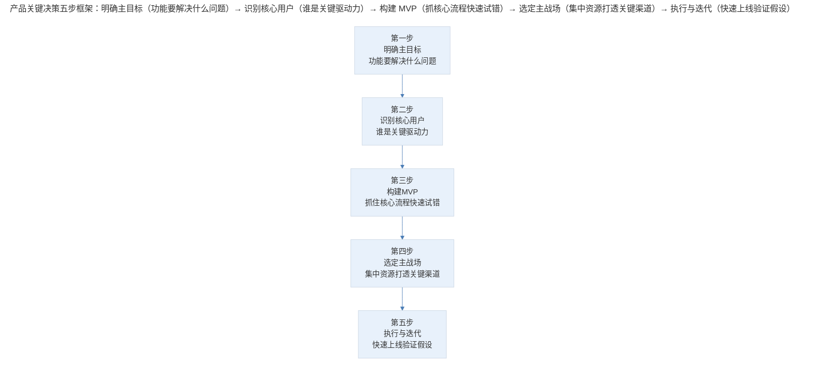
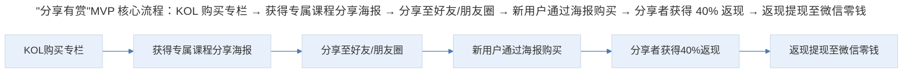
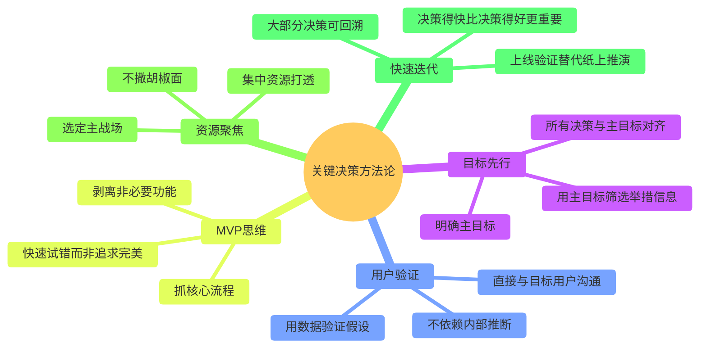
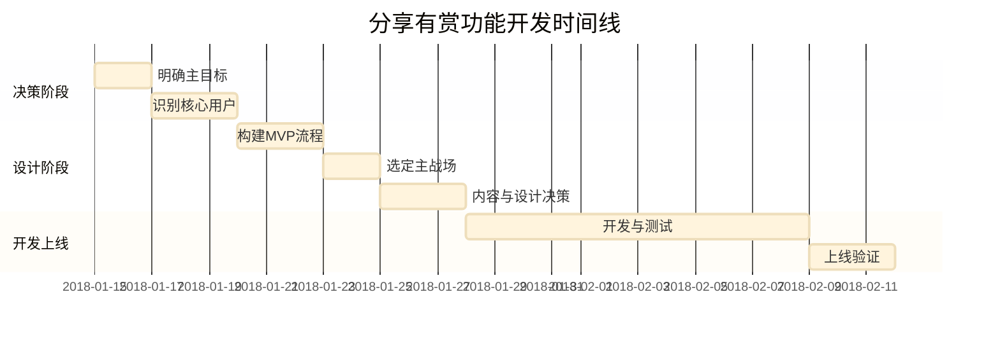

# 案例分析：产品关键决策的框架与方法

## 1. 导言

产品经理在日常工作中频繁面临多重抉择，如何做出关键决策（Key Decision）是产品管理能力的核心体现。本案例以极客时间"分享有赏"功能的产品决策过程为研究对象，系统复盘从功能立项到上线的全链路决策逻辑。

**业务背景：** 极客时间上线初期正值春节假期，数据增长和收入遭遇瓶颈。在此背景下，寻找更有效的自传播方式、推动产品数据增长成为紧迫需求。"分享有赏"功能正是在这一业务压力下启动的产品决策案例。

## 2. 决策框架：产品关键决策的五步框架

> 产品关键决策五步框架：明确主目标（功能要解决什么问题）→ 识别核心用户（谁是关键驱动力）→ 构建 MVP（抓核心流程快速试错）→ 选定主战场（集中资源打透关键渠道）→ 执行与迭代（快速上线验证假设）。

### 2.1 第一步：明确主目标

**决策内容：** 确定功能的核心目标——通过用户对好内容的主动分享，让产品获得更多曝光。

**决策原则：** 所有后续的细节决策，都必须与主目标保持一致。当面临取舍时，判断标准是"这是否服务于主目标"。

| 决策要素 | 内容 |
|----------|------|
| 目标定义 | 通过用户分享实现自传播，突破增长瓶颈 |
| 目标量化 | 提升新用户获取量和收入增长 |
| 约束条件 | 春节假期期间资源有限，时间紧迫 |

### 2.2 第二步：识别核心用户

**决策内容：** 在利益相关者（Stakeholder）中识别出最关键的驱动群体。

极客时间的主要利益相关者包括：普通用户、KOL（Key Opinion Leader）、内容作者、平台自身。经过分析，团队决定将**KOL**作为核心用户群体：

| 利益相关者 | 特征 | 传播价值 | 优先级 |
|-----------|------|----------|--------|
| KOL | 自带流量、有影响力 | 高——分享可带来大量订阅转化 | 核心关注 |
| 普通用户 | 数量大但单体影响力有限 | 中——长尾传播效应 | 次要关注 |
| 内容作者 | 内容生产者，有品牌效应 | 中——可作为 KOL 使用 | 视情况关注 |

**关键决策：返现比例的确定**

团队初步判断返现比例为专栏售价的 20%，认为"已经很高了"。但团队成员中没有 KOL，判断可能存在偏差。团队决定**直接与 KOL 沟通**，发现 20% 的返现比例确实偏低，最终将比例提升至 40%。

这一决策过程揭示了一个重要原则：**当团队缺乏目标用户群体的直接认知时，必须走出办公室进行用户验证，而非依赖内部推断。**

### 2.3 第三步：构建 MVP（Minimum Viable Product）

**决策内容：** 抓住最核心的产品流程，剥离多余功能和高级功能，确保主流程可运行。

MVP 的核心流程设计：

> "分享有赏"MVP 核心流程：KOL 购买专栏 → 获得专属课程分享海报 → 分享至好友/朋友圈 → 新用户通过海报购买 → 分享者获得 40% 返现 → 返现提现至微信零钱。

**MVP 上线后的数据验证：** KOL 带来的收入占"分享有赏"功能总收入的 80%，验证了"以 KOL 为核心用户"的决策正确性。

### 2.4 第四步：选定主战场

**决策内容：** 确定核心流量入口和转化渠道，集中资源打透。

| 渠道 | 特征 | 优先级 |
|------|------|--------|
| 朋友圈 | 社交传播、信任背书、适合 KOL | 主战场 |
| 微信群 | 精准触达、转化率高 | 主战场 |
| 公众号 | 内容驱动、适合长文种草 | 辅助战场 |

微信被确定为拉新和付费的主战场，团队在此渠道的体验和流程优化上投入了最多的精力。

### 2.5 第五步：内容与设计决策

**内容选择决策：** 选择《深入浅出区块链》而非《深度学习60讲》作为"分享有赏"的首个验证专栏：

| 决策因素 | 区块链专栏 | 深度学习专栏 |
|----------|-----------|-------------|
| 市场热度 | 极高（正值区块链火爆期） | 中等 |
| 传播友好度 | 高（话题性强） | 中（偏技术深度） |
| 定价门槛 | 较低 | 较高 |
| 综合判断 | 选择 | 不选 |

**海报设计决策：** 一改此前灰度较高的配色方案，选用饱和度高的渐变紫色，目的在于朋友圈信息流中迅速抓住注意力。但海报上**不展示任何"分享有赏"相关信息**，将重点放在课程内容上——确保通过好内容吸引用户，而非通过利益诱导。

## 3. 关键决策：一致性检验与去利益化

### 3.1 决策的一致性检验

在整个决策过程中，团队建立了一条**决策检验主线**：每一个细节决策都需要回答三个问题：

1. 这是否与主目标保持一致？
2. 这是否是现阶段资源可以实现的？
3. 这是否应用在主战场上？

满足三个条件的信息才是可做决策的关键信息；不满足条件的信息，不应犹豫，尽快敲定后继续推进。

### 3.2 "决策得快"比"决策得好"更重要

这一原则的核心逻辑是：

- **大部分决策是可回溯的**：发现决策错误后仍有补救余地，很少有某一个孤立的决策能够左右产品兴衰
- **快速决策带来快速验证**：快速上线验证假设，根据线上表现快速迭代，比反复推敲后做出"完美决策"更有效
- **犹豫不决的代价大于决策失误的代价**：在时间窗口有限的情况下（如春节假期），犹豫意味着机会流失

### 3.3 海报设计的"去利益化"决策

在海报上不展示"分享有赏"信息，是一个看似反直觉的决策。其背后的逻辑是：

- 利益诱导虽然能提升短期分享量，但损害内容品牌的长期价值
- 通过好内容吸引用户，才能形成健康的增长飞轮
- KOL 分享的信任背书来自内容质量，而非利益机制

## 4. 经验提炼：关键决策方法论

### 4.1 产品关键决策的方法论总结

> 关键决策方法论全景：目标先行（明确主目标、对齐所有决策、筛选信息）、用户验证（不依赖内部推断、直接沟通、数据验证）、MVP 思维（抓核心流程、剥离非必要、快速试错）、资源聚焦（选定主战场、集中资源、不撒胡椒面）、快速迭代（决策得快、可回溯、上线验证）。

### 4.2 方法论要点

1. **主目标是决策的北极星**：没有明确的主目标，所有决策都会陷入"既想又想"的纠结。主目标一旦确定，就为所有子决策提供了判断标准。

2. **走出办公室验证假设**：团队对返现比例 20% 的判断，与 KOL 的实际期望存在显著偏差。这类偏差只有通过直接的用户沟通才能发现。内部推断在涉及用户心理和行为预期时，可靠性极低。

3. **MVP 的核心是"快速试错"而非"优雅设计"**：MVP 的目标不是回答产品设计是否优雅，而是验证核心假设是否成立。完美不是目标，快速试错才是。

4. **主战场思维**：资源有限的情况下，选定主战场并集中所有"子弹"往一个方向打，远比四面出击更有效。微信生态被选为主战场，意味着所有体验优化和流程设计的资源都优先投入此处。

5. **内容为王的长期主义**：即使在增长压力最大的时刻，仍然坚持"通过好内容吸引用户"而非"通过利益诱导驱动增长"。这种长期主义思维是避免增长策略损害品牌价值的关键。

## 5. 实践指南：执行时间线与决策主线

### 5.1 执行时间线

从确定"分享有赏"到产品上线，整个周期仅为一个月：

> "分享有赏"功能开发时间线：决策阶段（明确主目标 2 天、识别核心用户 3 天）→ 设计阶段（构建 MVP 3 天、选定主战场 2 天、内容与设计决策 3 天）→ 开发上线（开发与测试 12 天、上线验证 3 天），整个周期约一个月。

### 5.2 决策检验主线

在整个决策过程中，团队建立了一条决策检验主线：每一个细节决策都需要回答三个问题——是否与主目标一致、是否现阶段资源可实现、是否应用在主战场上。满足三个条件的信息才是可做决策的关键信息；不满足条件的信息，不应犹豫，尽快敲定后继续推进。

## 6. 进阶延展：当代实践与核心要点回顾

### 6.1 当代实践补充（2024-2026）

2024-2026 年，产品关键决策方法有以下演进：

- **数据驱动的决策加速**：A/B 测试平台（如 Optimizely、神策数据）的成熟使得"快速试错"从理念变为可操作的工程实践，决策验证周期从"周"缩短到"天"（Kohavi et al., 2020）。
- **AI 辅助决策分析**：大语言模型（LLM）可快速生成决策方案的利弊分析、历史案例对标和风险评估，为产品经理提供决策参考，但最终判断仍需人类完成（Agrawal et al., 2025）。
- **决策日志（Decision Log）实践**：越来越多团队建立决策日志制度，记录每次关键决策的背景、选项、判断依据和结果，作为组织知识资产沉淀（Larman & Vodde, 2016）。
- **分销裂变模式的合规化演进**："分享有赏"类功能在后续发展中面临传销风险的监管审视，2024 年后的产品设计需更加注重合规边界，避免多级分销结构（国家市场监督管理总局, 2021）。

### 6.2 核心要点回顾

"分享有赏"案例揭示了产品关键决策的完整方法论：主目标是决策的北极星（为所有子决策提供判断标准）、走出办公室验证假设（避免内部推断偏差）、MVP 核心是快速试错而非优雅设计、主战场思维（集中资源打透关键渠道）、内容为王的长期主义。同时强调"决策得快比决策得好更重要"——大部分决策可回溯，快速上线验证比反复推敲更有效。在 2024-2026 年，A/B 测试平台、AI 辅助决策与决策日志实践进一步加速了决策效率，而合规边界的重视也提醒产品经理在利益驱动增长与长期价值之间保持平衡。

---

## 参考资料（未核实）
> 注：以下条目为原始素材所附延伸文献，未逐条核实出处与真实性，仅供延伸参考。

- Agrawal, A., Gans, J., & Goldfarb, A. (2025). *Prediction machines: The simple economics of artificial intelligence* (Updated ed.). Harvard Business Review Press.
- Kohavi, R., Tang, D., & Xu, Y. (2020). *Trustworthy online controlled experiments: A practical guide to A/B testing*. Cambridge University Press.
- Larman, C., & Vodde, B. (2016). *Large-scale scrum: More with LeSS*. Addison-Wesley.
- 国家市场监督管理总局. (2021). 网络交易监督管理办法（国家市场监督管理总局令第 37 号）.
- 俞军. (2019). 产品方法论. 中信出版社.