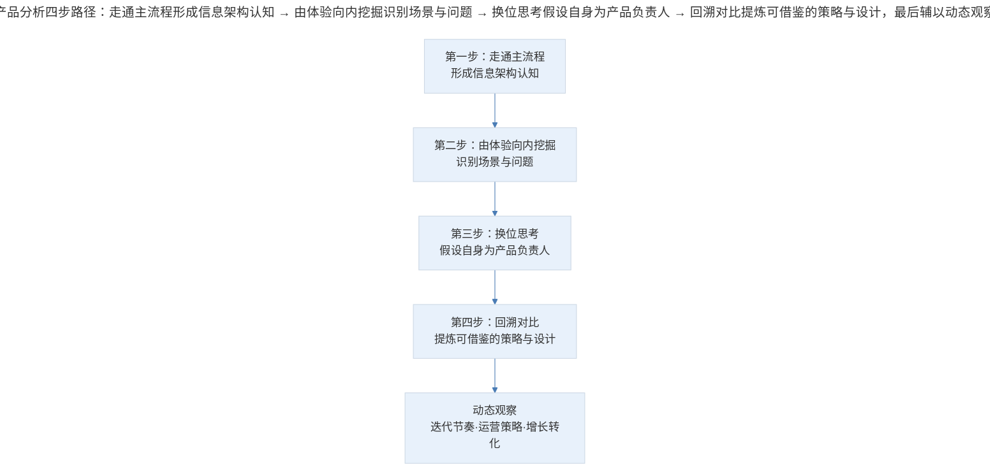
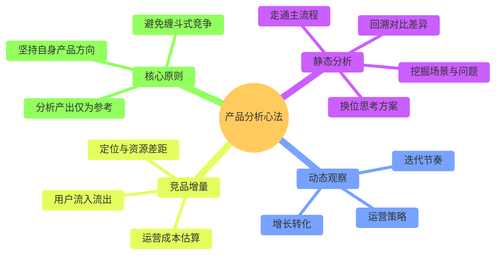

# 案例分析：产品分析的结构化方法论

## 1. 导言

在产品经理的日常实践中，产品分析（Product Analysis）与竞品分析（Competitive Analysis）是两项高频工作。然而，许多从业者在面对一款产品时，往往停留在"觉得好但说不清好在哪里"的模糊认知阶段，缺乏系统化的分析路径。同时，产品分析与竞品分析之间的边界模糊，导致分析产出缺乏针对性和决策支撑价值。

本案例基于一线产品实践，提炼出一套简洁而有效的产品分析框架，并明确区分产品分析与竞品分析的本质差异，为产品经理提供可操作的方法论指导。

## 2. 分析框架：产品分析与竞品分析的本质差异

产品分析与竞品分析在框架和方法层面具有高度相似性，二者的核心差异在于**出发点与立场**。

| 维度 | 产品分析 | 竞品分析 |
|------|----------|----------|
| 核心出发点 | 理解、学习与启发 | 对抗或共存 |
| 自身产品定位 | 游离于分析过程之外 | 分析过程的核心组成部分 |
| 分析者角色 | 学习者 | 战略分析者 |
| 产出导向 | 灵感储备与方法借鉴 | 策略调整与方向决策 |
| 情感基调 | 开放、好奇 | 紧绷、警觉 |
| 关注范围 | 产品内部逻辑 | 产品+市场+资源+成本 |

简言之，产品分析是将自身置于"学生"位置的学习过程，竞品分析则是将神经绷紧的战略战术分析。

## 3. 关键方法：产品分析的四步路径

> 产品分析四步路径：走通主流程形成信息架构认知 → 由体验向内挖掘识别场景与问题 → 换位思考假设自身为产品负责人 → 回溯对比提炼可借鉴的策略与设计，最后辅以动态观察。

**第一步：走通主流程。** 拿到产品后，首先完整走一遍核心流程，在脑海中形成产品的信息架构（Information Architecture）全貌。此阶段的目标是建立对产品整体逻辑的宏观认知。

**第二步：由体验向内挖掘。** 从直观的使用体验出发，向内挖掘场景与问题——该产品解决谁的什么问题，切中哪些场景。这一步将表层体验转化为对用户需求（User Need）和场景（Scenario）的结构化理解。

**第三步：换位思考。** 假设自身为该产品负责人，思考会用什么方案来解决同样的问题，可能的差异点在哪里。这一步将被动观察转化为主动建构，是分析深度的关键跃迁。

**第四步：回溯对比。** 回到细致的使用体验中，对比自身假设与实际产品的差异——哪些是自己没想到的，哪些让人眼前一亮，哪些策略和设计值得记录并在后续产品设计中借鉴。

### 3.1 动态观察维度

对于特别优秀的产品，静态分析远远不够，需要建立动态观察机制：

- **迭代节奏与逻辑**：多久感知到功能变化？变化是散落在全产品中，还是按模块/流程环节逐步推进？
- **运营策略**：产品如何运营，运营动作与产品迭代之间的关联性如何？
- **增长与转化**：通过可观测指标（如阅读量、社区发帖量等）推测增长趋势和转化效率。

### 3.2 竞品分析的增量维度

在产品分析的基础上，竞品分析需额外关注以下维度：

| 增量维度 | 分析要点 | 实践方法 |
|----------|----------|----------|
| 定位与资源差距 | 对方的用户定位、资源禀赋、品牌成熟度 | 公开信息搜集、行业报告 |
| 策略调整方向 | 该避开的领域、该竞争的领域 | 差异化定位分析 |
| 用户流入流出 | 用户口碑、迁移趋势 | App Store 评论、社交媒体监测 |
| 产品线布局 | 对方各条产品线的协同关系 | 产品矩阵梳理 |
| 运营成本 | 团队规模、薪资水平、流水估算 | 招聘网站、上市公司财报 |

## 4. 经验提炼：核心心法与决策原则

### 4.1 产品分析的核心心法

> 产品分析心法全景：静态分析（走通流程、挖掘场景、换位思考、回溯对比）、动态观察（迭代节奏、运营策略、增长转化）、竞品增量（定位资源差距、用户流、运营成本），核心原则是分析产出仅为参考、坚持自身产品方向、避免缠斗式竞争。

### 4.2 方法论要点

1. **"无他，唯手熟尔"**：产品分析能力并非天赋特质，而是大量实践的结果。保持手机中安装上百款应用、定期更新体验的习惯，是建立分析直觉的基础。

2. **解数学题式的拆解思维**：将产品分析视为解数学题的过程——逐步拆解、定位，观察每个细节对应的用户需求，每个跳转映射的设计理念。

3. **灵感蓄水池机制**：通过大量观摩与学习，将不同产品的策略、设计、交互模式沉淀为灵感储备，在自身产品设计时随时调用。

4. **竞品分析的克制原则**：竞品分析中最容易犯的错误是被对手的动作牵着走。始终保持"用兵在我不在敌"的意识，将竞品动态作为环境变量而非决策依据。

## 5. 实践指南：竞品策略的差异化决策

### 5.1 竞品策略的差异化决策

当竞争对手在高端用户市场已建立成熟的产品与品牌，且拥有现成的高端用户资源时，正面竞争并非最优策略。合理的决策路径是：

1. 从中低端用户切入，用标准化、低成本的解决方案快速起量
2. 在站稳脚跟后，再向高端市场发起竞争

这一决策的核心逻辑是**避免在对手的优势领域进行消耗战**，转而寻找对手覆盖不足的市场缝隙。

### 5.2 "用兵在我不在敌"的决策原则

无论是产品分析还是竞品分析，最重要的前提是**坚持自身的产品方向**。从分析中获得的产出，只能作为决策的参考信息，而不应成为决策的关键性依据。

面对竞品时，产品经理应有意识地压制与对手缠斗的冲动，走好自己的路，而非试图将对手从路上挤出去。任何成功的产品，都不是通过"搞死竞争对手"获得成功的，而是通过持续为用户创造不可替代的价值。

## 6. 进阶延展：当代实践与核心要点回顾

### 6.1 当代实践补充（2024-2026）

在 2024-2026 年的产品实践中，产品分析方法论有以下演进：

- **AI 辅助分析**：利用大语言模型（LLM）快速生成产品分析的初始框架，再由产品经理进行深度补充和修正，显著提升分析效率（Chen, 2025）。
- **数据驱动竞品监测**：借助 SimilarWeb、Sensor Tower 等工具实现竞品数据的自动化采集与对比，将原本依赖人工估算的维度（如运营成本、用户规模）转化为可量化的数据指标。
- **持续交付背景下的动态分析**：在 CI/CD（Continuous Integration/Continuous Deployment）环境下，竞品的迭代频率大幅提升，传统的静态竞品分析报告已不足以支撑决策，需要建立持续监测机制（Cagan, 2017）。

### 6.2 核心要点回顾

产品分析是将自身置于"学生"位置的学习过程，通过"走通主流程 → 由体验向内挖掘 → 换位思考 → 回溯对比"四步路径，将模糊的"觉得好"转化为结构化认知；竞品分析则是神经紧绷的战略战术分析，需额外关注定位资源差距、策略调整方向、用户流入流出等增量维度。核心心法是"无他唯手熟尔"的实践积累、解数学题式的拆解思维与灵感蓄水池机制。决策原则上坚持"用兵在我不在敌"，将竞品动态作为环境变量而非决策依据，避免在对手优势领域打消耗战，通过持续为用户创造不可替代的价值获得成功。

---

## 参考资料（未核实）
> 注：以下条目为原始素材所附延伸文献，未逐条核实出处与真实性，仅供延伸参考。

- Cagan, M. (2017). *Inspired: How to create tech products customers love* (2nd ed.). Wiley.
- Chen, L. (2025). AI-assisted product analysis: Frameworks and practices. *Journal of Product Innovation Management*, 42(1), 112-128.
- Sensor Tower. (2025). *State of mobile 2025*. Sensor Tower Inc.
- 刘飞. (2024). 产品竞品分析方法论：从静态报告到动态监测. *人人都是产品经理*, 15(3), 45-52.