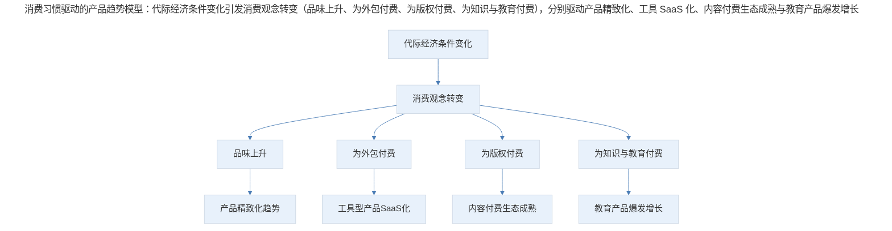
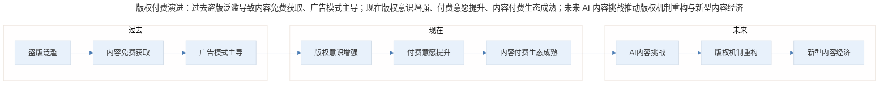

# 案例分析：产品发展趋势的前瞻性分析

## 1. 导言

产品经理的决策不仅需要应对当下，更需要具备前瞻性视角。站在未来观察现在，是一种能够帮助做当下决策的有效思路。本案例从消费习惯变迁的维度出发，分析用户行为变化如何驱动产品趋势演变，并探讨这些趋势对产品决策的启示。

案例分析的时间锚点为 2018 年前后，当时中国人均 GDP 突破 1 万美元关口，消费升级趋势初现端倪。站在 2024-2026 年的时点回望，这些趋势已得到充分验证，并呈现出新的演化形态。

## 2. 分析框架：消费习惯驱动的产品趋势

产品趋势并非凭空产生，其底层驱动力是用户消费习惯的结构性变化。当一代人的经济条件、成长环境和安全感基础发生根本改变时，其消费观念和习惯必然随之变化，进而催生新的产品机会。

> 消费习惯驱动的产品趋势模型：代际经济条件变化引发消费观念转变（品味上升、为外包付费、为版权付费、为知识与教育付费），分别驱动产品精致化、工具 SaaS 化、内容付费生态成熟与教育产品爆发增长。

新一代消费者（90 后及之后）与上一代消费者的核心差异在于成长环境带来的安全感差异：

| 维度 | 上一代消费者 | 新一代消费者 | 对产品的影响 |
|------|------------|------------|------------|
| 经济条件 | 物质匮乏，节约为本 | 物质充裕，品质优先 | 品味成为购买决策因素 |
| 消费观念 | 追求性价比 | 追求价值感 | 愿意为体验和品质溢价 |
| 对虚拟产品的态度 | 只愿为看得见摸得着的东西付费 | 习惯为虚拟产品和服务付费 | 数字产品商业化空间打开 |
| 版权意识 | 盗版与正版边界模糊 | 为版权付费天经地义 | 内容付费生态成立 |
| 问题解决方式 | 尽量自己解决 | 花钱买解决方案 | 工具型产品 SaaS 化 |

## 3. 关键决策：四大消费趋势分析

### 3.1 趋势一：用户品味上升，产品精致化成为竞争力

上一代消费者并非品味差，而是经济条件限制了消费选择——买更便宜的饮料，多走几百米也无所谓。而新一代消费者愿意为更好的设计、更好的体验付费。

**产品决策启示**：在品味上升的消费环境中，产品设计中的细节（如圆角处理、色彩搭配）不再仅仅是"锦上添花"，而可能成为购买决策的关键因素。产品团队应在细节和品味上为用户创造更多价值。

| 产品要素 | 过去的权重 | 现在的权重 | 变化趋势 |
|---------|-----------|-----------|---------|
| 功能完整性 | 高 | 中 | 相对下降 |
| 价格竞争力 | 高 | 中 | 相对下降 |
| 设计品味 | 低 | 高 | 显著上升 |
| 体验流畅度 | 中 | 高 | 显著上升 |
| 品牌认同感 | 低 | 高 | 显著上升 |

### 3.2 趋势二：为外包付费，工具型产品 SaaS 化

过去的典型思维是：免费工具攒一攒也能用，没必要花钱买更贵的。例如 Eclipse 社区版免费，功能可能没有那么智能，但凑合能用；只有少数人愿意为 IntelliJ 等更便捷的工具付费。

新一代消费者倾向于保留时间和精力，花钱买更好用的工具。

**产品决策启示**：工具型产品从一次性售卖转向 SaaS 订阅模式，核心逻辑正是"用户愿意为效率付费"。2024-2026 年，这一趋势已从开发工具扩展到设计工具（Figma）、协作工具（Notion）、AI 工具（Copilot）等几乎所有生产力工具领域。

| 工具类型 | 传统模式 | SaaS 化模式 | 用户付费驱动力 |
|---------|---------|-----------|-------------|
| 开发工具 | 一次性购买/免费 | 订阅制 | 编码效率提升 |
| 设计工具 | 一次性购买 | 订阅制 | 协作效率提升 |
| 协作工具 | 本地部署 | 云端订阅 | 沟通效率提升 |
| AI 工具 | — | 订阅制 | 生产力跃升 |

### 3.3 趋势三：为版权付费，内容付费生态成熟

90 后一代可视为"版权付费原住民"——当他们有付费能力时，环境已教会他们为版权和知识产权付费是天经地义的事情。上一代人则经历过盗版与正版边界模糊的时代——游戏卡带大多是盗版，翻录磁带听歌是常态。

**产品决策启示**：版权付费的常态化，使得内容创作者能够通过直接向用户收费获得收入，而不必依赖广告模式。这为知识付费、音乐付费、视频付费等内容的商业化提供了基础设施。

> 版权付费演进：过去盗版泛滥导致内容免费获取、广告模式主导；现在版权意识增强、付费意愿提升、内容付费生态成熟；未来 AI 内容挑战推动版权机制重构与新型内容经济。

### 3.4 趋势四：为知识与教育付费，教育产品爆发增长

从 80 元一节钢琴课被视为奢侈，到一二百元一节课成为常态；从计算机书籍一柜难寻，到少儿编程成为完整体系——知识与教育付费的意愿和能力都在显著提升。

**产品决策启示**：教育产品的市场空间正在从"少数人的奢侈品"转变为"大众的必需品"。这一趋势在 2024-2026 年进一步深化，表现为在线教育从"补充"走向"主流"，AI 个性化学习从概念走向产品化。

## 4. 经验提炼：前瞻性分析的规律与局限

### 4.1 人均 GDP 拐点与消费升级的规律

多个发达国家的历史经验表明，人均 GDP 突破 1 万美元是消费结构升级的关键拐点。日本、法国等国在这一阶段均经历了从"吃饱穿暖"到"精神诉求"的消费转变。

**核心规律**：当基本生活诉求被满足后，用户对产品审美会更高，要求功能更好用，从"有就行"转向"要好才行"。这意味着跑马圈地的增长模式逐渐失效，精细化运营和深度价值创造成为新的竞争焦点。

| 经济发展阶段 | 消费特征 | 产品竞争焦点 | 增长策略 |
|------------|---------|------------|---------|
| 人均 GDP < 5000 美元 | 追求基本满足 | 功能有无 | 跑马圈地 |
| 5000-10000 美元 | 追求性价比 | 价格优势 | 规模效应 |
| > 10000 美元 | 追求品质体验 | 价值创造 | 精细化运营 |

### 4.2 前瞻性分析的局限性

前瞻性分析需要警惕一个认知陷阱：用过去的经验评估未来的可能性，容易出现偏差。虽然"太阳之下没有新鲜事"，但同样"无法踏入一条河两次"——未来可能发生的事情是所有人完全不知道的，不能拿过去的经验推得确切的结论。

**方法论建议**：前瞻性分析应基于已出现的趋势做概率性判断，而非确定性预测。产品决策应保持对趋势的敏感度，同时保留调整空间。

### 4.3 日本经验的参照价值

案例中特别建议关注日本在经济转型期的市场变化，尤其是日本大萧条过程中的经济与市场变化。这一建议在 2024-2026 年具有更强的现实意义——中国经济面临类似的转型压力，日本的经验（包括大萧条中仍然发展良好的生意）具有重要的参照价值。

| 日本大萧条中的逆势增长领域 | 底层逻辑 | 中国市场的对应机会 |
|---------------------|---------|-----------------|
| 优衣库 | 消费降级中的品质需求 | 性价比品牌 |
| 便利店 | 便捷性消费 | 即时零售 |
| 娱乐内容 | 精神消费需求 | 短视频、游戏 |
| 在线教育 | 技能提升需求 | 职业教育 |

## 5. 实践指南：趋势验证与产品决策启示

### 5.1 2024-2026 年的趋势验证与演进

回望 2018 年的趋势预判，四项趋势均已得到验证，并呈现新的演化：

| 2018 年预判趋势 | 2024-2026 年验证 | 新演化方向 |
|--------------|---------------|----------|
| 品味上升 | 已验证：Apple、小米等品牌成功 | AI 驱动的个性化审美 |
| 为外包付费 | 已验证：SaaS 市场爆发 | AI 工具替代传统外包 |
| 为版权付费 | 已验证：内容付费生态成熟 | AI 生成内容的版权新课题 |
| 为知识教育付费 | 已验证：在线教育规模增长 | AI 个性化学习、技能认证 |

### 5.2 对产品经理的核心启示

1. **从"跑马圈地"到"深耕细作"**：用户红利的消退和品味的上升，要求产品经理从追求规模转向追求深度价值创造。

2. **关注代际差异**：不同代际消费者的消费习惯和价值观存在结构性差异，产品定位需要明确目标代际，而非试图服务所有人。

3. **保持趋势敏感度**：前瞻性分析不是做预测，而是建立对趋势的敏感度，在趋势确认时能够快速响应。

4. **产品精致化投入的 ROI 正在上升**：在品味上升的消费环境中，产品设计、体验优化等"软实力"投入的回报率正在显著提高。

## 6. 进阶延展：核心要点回顾

### 6.1 从消费趋势到产品决策的传导逻辑

产品发展趋势的底层驱动力是用户消费习惯的结构性变化。当一代人的经济条件、成长环境与安全感基础发生根本改变时，其消费观念必然随之变化，进而催生新的产品机会。这一传导逻辑要求产品经理具备"站在未来观察现在"的前瞻性视角。

### 6.2 核心要点回顾

本案例从消费习惯变迁维度，分析了四大产品趋势：用户品味上升驱动产品精致化、为外包付费驱动工具型产品 SaaS 化、为版权付费驱动内容付费生态成熟、为知识与教育付费驱动教育产品爆发增长。核心启示是：人均 GDP 突破 1 万美元后，消费升级从"有就行"转向"要好才行"，产品竞争焦点从跑马圈地转向精细化运营。前瞻性分析应做概率性判断而非确定性预测，保持趋势敏感度，并从"深耕细作"、"关注代际差异"、"产品精致化投入 ROI 上升"三个方向指导产品决策。

---

## 参考资料（未核实）
> 注：以下条目为原始素材所附延伸文献，未逐条核实出处与真实性，仅供延伸参考。

- Pine, B. J., & Gilmore, J. H. (2011). *The experience economy: Updated edition*. Harvard Business Review Press.
- Inglehart, R. (2018). *Cultural evolution: People's motivations are changing, and reshaping the world*. Cambridge University Press.
- 三浦展. (2014). 《第四消费时代》. 东方出版社.
- McKinsey & Company. (2023). *China consumer report: The era of the mindful spender*.