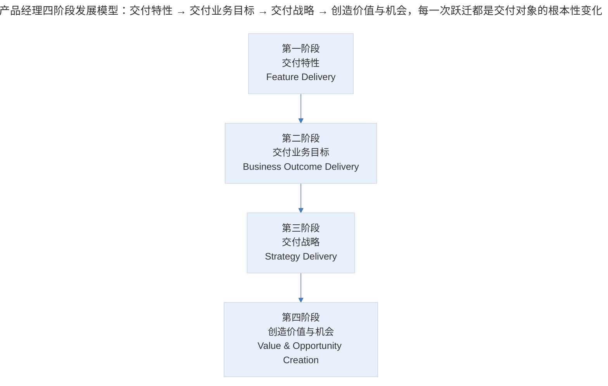
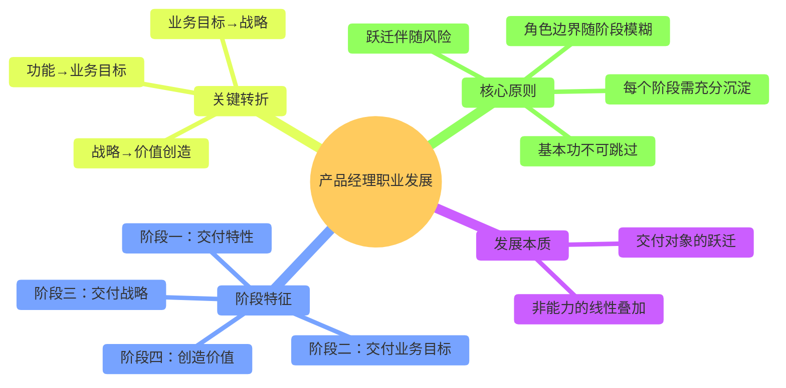

# 案例分析：产品经理职业发展的能力模型

## 1. 导言

产品经理（Product Manager）作为职业角色在中国互联网行业被广泛接受不过十余年时间，缺乏大量前人样本作为参照体系。许多从业者在入行后经常陷入方向性迷茫——不清楚职业发展分为哪些阶段、每个阶段需要具备哪些能力、不同职级之间的本质差异是什么。尤其对于工作 3-5 年的产品经理，"全栈产品经理"与"产品总监"的边界模糊，容易在职业规划上产生偏差。

本案例基于一线产品管理实践与行业观察，构建产品经理职业发展的四阶段能力模型，为从业者提供自我定位和能力建设的参考框架。

## 2. 发展框架：四阶段能力模型

> 产品经理四阶段发展模型：交付特性 → 交付业务目标 → 交付战略 → 创造价值与机会，每一次跃迁都是交付对象的根本性变化。

产品经理的职业发展并非线性的能力叠加，而是**交付对象的根本性跃迁**——从交付功能特性，到交付业务结果，再到交付战略方向，最终创造更大的价值与机会。每一次跃迁都伴随工作本质、能力要求和角色定位的质变。

### 2.1 阶段一：交付特性（Feature Delivery）

**核心任务：** 将明确指派的功能点落地交付。

**工作特征：**

| 维度 | 初期 | 成熟期 |
|------|------|--------|
| 任务来源 | 主管/导师指派具体功能点 | 直接从运营、用户、市场获取需求 |
| 需求分析 | 不需要独立分析，直接执行 | 需独立分析需求，决定特性设计方案 |
| 工作内容 | "把按钮从上面移到下面" | "优化页面体验，提高点击通过率" |
| 决策空间 | 极小 | 逐渐扩大 |
| 交付标准 | 功能上线 | 功能上线+数据指标改善 |

**能力建设重点：**

- 方案设计能力：积累足够多的设计经验，成为"总是有办法"的产品经理
- 基本功夯实：需求文档（PRD）、原型设计、项目管理、概念模型、需求分析等硬技能
- 从功能本身向功能和需求背后的业务目标转移注意力

**关键转折点：** 当特性设计从"工作目标"变为"工作手段"，关注重心从功能本身转向其背后的需求和业务目标时，即进入第二阶段的准备期。

### 2.2 阶段二：交付业务目标（Business Outcome Delivery）

**核心任务：** 交付业务层面的结果，如用户留存提升、收入规模扩大等。

**工作特征：**

| 维度 | 说明 |
|------|------|
| 任务指派 | 宏观而抽象，需自行拆解和落地 |
| 资源协调 | 可协调资源增多，受到的指导和干涉减少 |
| 组织角色 | 从独立作战单元转变为前线小队长 |
| 团队建设 | 可能开始组建团队，构建团队交付能力 |
| 失败代价 | 目标失败将导致信任损失，可能退回上一阶段 |

**能力建设重点：**

- 目标拆解能力：将宏观业务目标拆解为可执行的产品动作
- 独立决策能力：在有限指导下做出正确判断
- 团队管理能力：构建和带领小团队，形成组织级的交付能力
- 风险控制能力：全力以赴同时谨慎行事，如履薄冰

**关键挑战：** 此阶段是职业发展中最艰难的过渡期。成功完成目标可获得信任和更大挑战，视野和经历随之进步；连续失败则可能被迫退回上一阶段，陷入职业发展的瓶颈。

### 2.3 阶段三：交付战略（Strategy Delivery）

**核心任务：** 参与决策产品和业务的走向与发展方向。

**典型决策场景：**

- 先做 ToB 还是 ToC
- 先做内容还是先做社区
- 要不要快速扩张团队
- 下个季度保收入还是保用户量

**角色变化：**

| 维度 | 阶段二 | 阶段三 |
|------|--------|--------|
| 关注范围 | 产品功能和流程设计 | 整个团队和业务的系统性思考 |
| 角色边界 | 产品经理 | 公司战略决策参与者 |
| 能力要求 | 产品专业能力 | 职业素养+行业判断+战略思维 |
| 决策影响 | 影响单个产品或功能 | 影响业务走向和组织方向 |

**能力建设重点：**

- 战略思维：从局部优化到全局博弈
- 行业判断：形成独立的行业认知和趋势判断
- 组织领导：影响和推动组织层面的决策与变革

### 2.4 阶段四：创造价值与机会

第四阶段超越了传统意义上的"职业发展"，进入价值创造的更高维度：

- 让身边的人获得更多成长和机会
- 让团队成员过上更加体面的生活
- 让产品和业务改变世界，使一部分人的生活因之更加便捷或美好

这一阶段难以在未到达之前进行完整描述，但其核心特征是从"交付"转向"创造"——不再是被分配目标后的执行，而是主动定义什么值得做。

### 2.5 四阶段能力模型总览

| 维度 | 阶段一 | 阶段二 | 阶段三 | 阶段四 |
|------|--------|--------|--------|--------|
| 交付对象 | 功能特性 | 业务目标 | 战略方向 | 价值与机会 |
| 任务来源 | 指派 | 半指派半自驱 | 自驱为主 | 完全自驱 |
| 决策空间 | 极小 | 中等 | 较大 | 极大 |
| 核心能力 | 执行力+设计力 | 目标拆解+独立决策 | 战略思维+行业判断 | 愿景构建+价值创造 |
| 组织角色 | 执行者 | 小队长 | 决策参与者 | 价值定义者 |
| 失败代价 | 个人成长放缓 | 可能退回上一阶段 | 业务方向偏差 | 组织和社会层面的影响 |
| 典型年限 | 0-2 年 | 2-5 年 | 5-10 年 | 10 年以上 |

## 3. 关键决策：路径选择与阶段跨越

### 3.1 "全栈产品经理" vs "产品总监"的定位决策

这是一个常见的职业困惑，二者的本质差异不在于能力宽度，而在于**交付层次**：

| 维度 | 全栈产品经理 | 产品总监 |
|------|-------------|----------|
| 核心定位 | 能独立完成端到端产品工作的个体 | 能带领团队持续交付业务结果的管理者 |
| 交付层次 | 阶段一至阶段二的横向扩展 | 阶段二至阶段三的纵向跃迁 |
| 价值创造方式 | 个人能力覆盖更多环节 | 组织能力覆盖更大范围 |
| 发展路径 | 深度专业路线 | 管理与战略路线 |

选择哪条路径，取决于个人禀赋和职业倾向，二者无优劣之分，但需要清晰认知差异，避免方向性误判。

### 3.2 阶段跨越的时机决策

何时从当前阶段向下一阶段跃迁，是一个需要审慎判断的决策：

- **过早跃迁**：基本功未夯实就急于承担更大责任，容易因能力不足导致目标失败
- **过晚跃迁**：在当前阶段已形成舒适区，不敢接受更大挑战，陷入职业倦怠

合理的判断标准是：当当前阶段的核心能力已经内化为本能反应，且对下一阶段的工作产生了持续的好奇和渴望时，即是跃迁的合适时机。

## 4. 经验提炼：职业发展的核心规律

### 4.1 职业发展的核心规律

> 产品经理职业发展核心规律：发展本质是交付对象的跃迁而非能力线性叠加；四个阶段对应交付特性/业务目标/战略/价值创造；关键转折为功能→业务目标→战略→价值创造；核心原则是基本功不可跳过、阶段充分沉淀、跃迁伴随风险、角色边界随阶段模糊。

### 4.2 方法论要点

1. **每个阶段不可跳过**：产品经理的职业发展没有捷径。阶段一的基本功如果未夯实，在阶段二和阶段三会持续暴露短板。"总是有办法"的产品经理，其底气来自大量方案设计经验的积累。

2. **交付对象决定能力要求**：不是先有能力再承担更大责任，而是在承担更大责任的过程中发展出相应能力。关键是获得承担更大责任的机会，并在机会中证明自己。

3. **阶段二是分水岭**：从交付特性到交付业务目标的跃迁，是产品经理职业发展中最关键也最艰难的一步。成功跨过此阶段的产品经理，职业天花板将大幅提升。

4. **角色边界随阶段模糊**：越往高阶发展，"产品经理"的角色定义越模糊。到阶段三和阶段四，角色边界已经不再局限于传统意义上的产品管理，而是向战略决策、组织领导等方向延伸。

5. **行业定义仍在演进中**：产品经理岗位被广泛接受不过十余年，缺乏大量前人样本。从这个意义上说，产品经理能做成什么，"产品经理"这个角色就会变成什么。

## 5. 实践指南：自我定位与能力建设

### 5.1 四阶段自我定位

产品经理可通过以下方式定位自身所处阶段：

- **阶段一**：检验自己是否仍在被动接收功能指派，能否独立完成端到端的功能交付
- **阶段二**：检验自己是否承担了可量化的业务目标，能否独立拆解目标并带领小团队交付
- **阶段三**：检验自己是否参与业务走向的战略决策，能否从全局视角系统性思考
- **阶段四**：检验自己是否从"交付"转向"创造"，主动定义什么值得做

### 5.2 能力建设的优先序

- **阶段一**：优先夯实方案设计能力与基本功（PRD、原型、项目管理、需求分析）
- **阶段二**：优先建设目标拆解、独立决策、团队管理与风险控制能力
- **阶段三**：优先建设战略思维、行业判断与组织领导能力
- **阶段四**：转向愿景构建与价值创造

## 6. 进阶延展：当代实践与核心要点回顾

### 6.1 当代实践补充（2024-2026）

2024-2026 年，产品经理职业发展有以下新趋势：

- **AI 时代的能力重构**：大语言模型（LLM）的普及使得需求文档撰写、竞品分析、数据分析等传统产品经理的核心工作被部分自动化，产品经理的核心竞争力正在从"执行效率"转向"判断力"和"创造力"（McKinsey Global Institute, 2023）。
- **Product Operations（产品运营）岗位兴起**：随着产品团队规模扩大，产品运营作为独立职能从产品经理职责中分离出来，使产品经理能更聚焦于战略和方向性工作（Perri & Tilles, 2023）。
- **AI Product Manager 成为新赛道**：AI 产品的特殊性（模型不确定性、数据依赖性、伦理合规性）催生了 AI Product Manager 这一新角色，要求产品经理具备机器学习基础知识和 AI 产品特有的决策框架（Bratsis, 2025）。
- **远程协作能力成为标配**：分布式团队成为常态，产品经理需要具备跨时区、跨文化的协作和领导能力（Neeley, 2021）。

### 6.2 核心要点回顾

产品经理职业发展的本质是交付对象的根本性跃迁：从交付特性（阶段一）、交付业务目标（阶段二）、交付战略（阶段三）到创造价值与机会（阶段四）。每个阶段的能力要求、角色定位与失败代价各不相同，且不可跳过——基本功未夯实会在后续阶段持续暴露短板。关键决策包括全栈产品经理（横向扩展）与产品总监（纵向跃迁）的路径选择，以及阶段跨越的时机判断（过早跃迁能力不足，过晚跃迁陷入舒适区）。在 2024-2026 年，AI 重构核心竞争力（从执行效率转向判断力与创造力）、Product Operations 岗位兴起与 AI Product Manager 新赛道正在重塑产品经理的职业发展图景。

---

## 参考资料（未核实）
> 注：以下条目为原始素材所附延伸文献，未逐条核实出处与真实性，仅供延伸参考。

- Bratsis, I. (2025). *The AI product manager's handbook* (2nd ed.). Packt Publishing.
- Perri, M., & Tilles, D. (2023). *Product operations: How successful companies launch, improve, and scale their software business*. O'Reilly Media.
- McKinsey Global Institute. (2023). *The economic potential of generative AI: The next productivity frontier*. McKinsey & Company.
- Neeley, T. (2021). *Remote work revolution: Succeeding from anywhere*. Harper Business.
- 谢欣. (2024). 产品经理的能力演进：从执行到战略. *哈佛商业评论（中文版）*, (8), 56-63.