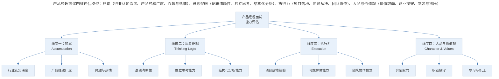
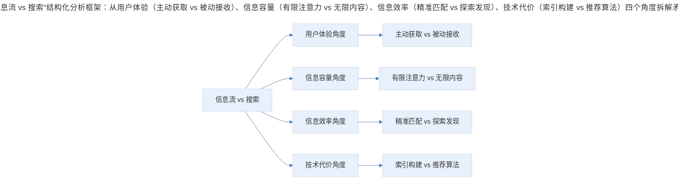
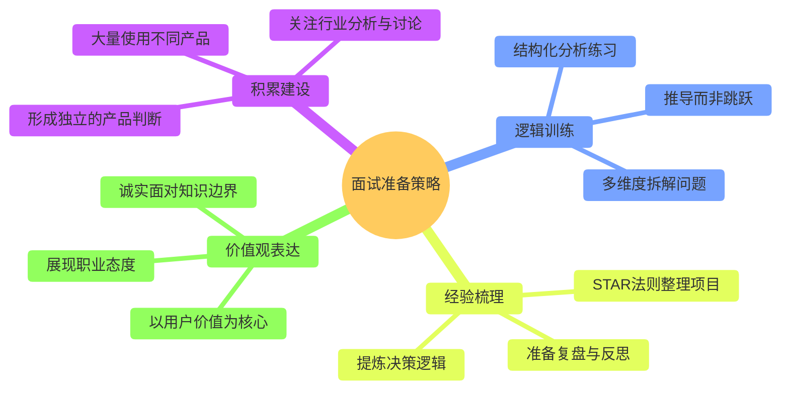

# 案例分析：产品经理面试的能力评估框架

## 1. 导言

产品经理面试的核心挑战在于：面试题目往往没有标准答案，面试官真正评估的不是"答案的正确性"，而是候选人的思维方式、积累深度和职业素养。以头部互联网公司的产品经理面试题为例——"如何解决 Facebook 假新闻问题"——Facebook 自身已为此投入数亿美元、组建庞大审核团队，仍未完全解决。这类问题的设计目的绝非获取"正确答案"，而是观察候选人面对开放性问题的思维路径和表达质量。

本案例以行业典型面试题为素材，构建产品经理面试的四维能力评估框架，帮助面试者理解面试的评估逻辑，并指导其进行有针对性的准备。

## 2. 评估框架：面试评估的四维模型

产品经理面试的评估维度可归纳为四个核心方向：

> 产品经理面试四维评估模型：积累（行业认知深度、产品经验广度、兴趣与热情）、思考逻辑（逻辑清晰性、独立思考、结构化分析）、执行力（项目落地、问题解决、团队协作）、人品与价值观（价值取向、职业操守、学习与抗压）。

### 2.1 维度一：积累（Accumulation）

积累维度评估的是候选人对行业和产品的认知深度与广度。以面试题"如何理解信息流和搜索的矛盾"为例：

| 积累层次 | 评估内容 | 判断标准 |
|----------|----------|----------|
| 基础层 | 是否知道信息流和搜索指的是什么形态 | 能准确描述两种产品形态 |
| 进阶层 | 是否关注过相关分析、访谈或争论 | 能引用行业讨论和观点 |
| 实战层 | 是否在足够多的产品中感受过二者的异同 | 能结合实际产品案例讨论 |
| 前瞻层 | 是否关注到产品从搜索向信息流的演进趋势 | 能引用 Google 等产品的实际测试案例 |

**关键信号：** 声称对产品经理充满信念且投入大量时间自学，但对行业几乎没有任何了解的候选人，暴露的不是能力问题，而是真实的兴趣缺失。

### 2.2 维度二：思考逻辑（Thinking Logic）

思考逻辑维度评估的是候选人分析问题时的结构化程度、逻辑清晰度和独立思考能力。

以"信息流与搜索的矛盾"为例，结构化分析的框架可以是：

> "信息流 vs 搜索"结构化分析框架：从用户体验（主动获取 vs 被动接收）、信息容量（有限注意力 vs 无限内容）、信息效率（精准匹配 vs 探索发现）、技术代价（索引构建 vs 推荐算法）四个角度拆解矛盾。

**评估要点：**

- 能否将复杂问题拆解为多个可分析的子维度
- 每个子维度的分析是否逻辑自洽
- 能否在不同维度之间建立关联和对比
- 最终判断是否基于前面的分析推导，而非凭空跳跃

即使具体判断存在偏差，清晰的分析过程也能展现思考逻辑的成熟度。

### 2.3 维度三：执行力（Execution）

执行力维度通常通过**行为面试法（Behavioral Interview）** 评估，即围绕候选人实际做过的项目展开追问：

| 追问方向 | 典型问题 | 评估目标 |
|----------|----------|----------|
| 项目背景 | 这个项目的目标是什么？你负责哪些部分？ | 判断参与深度和责任边界 |
| 困难与挑战 | 遇到了什么困难？如何解决的？ | 判断问题解决能力和应变能力 |
| 结果与复盘 | 最终取得了什么结果？如果重做会有什么不同？ | 判断学习能力和自我反思深度 |
| 团队协作 | 你与团队如何配合？遇到分歧如何处理？ | 判断协作模式和沟通风格 |

**应届生的特殊处理：** 由于缺乏实际项目经验，面试官通常会转向课程设计或社会实践活动进行评估。

### 2.4 维度四：人品与价值观（Character & Values）

价值观维度看似抽象，实则通过候选人在分析问题时的价值取向自然流露。典型案例：

> 候选人回答"如何解决 Facebook 假新闻问题"时提出："信息流推点色情内容粘住用户，然后把广告伪装成内容骗点击赚钱。"

这类回答直接暴露了候选人的价值取向。面试官需要评估这种取向与公司文化的匹配程度。在多数情况下，"好人更有市场"并非道德说教，而是商业事实——以损害用户利益为手段的短期增长，终将损害产品的长期价值。

| 评估项 | 正面信号 | 负面信号 |
|--------|----------|----------|
| 价值取向 | 以用户价值为核心 | 以短期利益为优先 |
| 职业操守 | 诚实面对知识边界 | 不懂装懂、刻意迎合 |
| 学习能力 | 主动学习、持续迭代 | 固步自封、拒绝反馈 |
| 抗压能力 | 困境中保持理性 | 压力下情绪失控或回避 |

### 2.5 四维评估模型的权重分配

| 评估维度 | 初级 PM 权重 | 中级 PM 权重 | 高级 PM 权重 |
|----------|-----------|-----------|-----------|
| 积累 | 30% | 20% | 15% |
| 思考逻辑 | 30% | 30% | 25% |
| 执行力 | 25% | 35% | 35% |
| 人品与价值观 | 15% | 15% | 25% |

## 3. 关键决策：面试中的应对策略

### 3.1 "展现对职位的回答" vs "展现对题目的回答"

面试的核心策略是**展现对职位的适配性，而非对题目的完美解答**。具体而言：

- 面试题只是载体，面试官通过题目观察的是候选人与岗位的匹配度
- 试图揣测"面试官想听什么"然后迎合，是一种高风险策略——一旦被识破，信任将严重受损
- 正确的做法是：基于自身真实的认知和思考，清晰、结构化地表达观点

### 3.2 面试中的诚实决策

面试中经常面临"诚实 vs 表现"的权衡。关键原则是：

1. **绝不伪装**：伪装即使通过面试，入职后也会因为能力与岗位不匹配而痛苦
2. **不懂就问**：面试官提到不熟悉的术语，大方请教远好于不懂装懂
3. **展现真实思考**：即使答案不够"漂亮"，真实的思考过程比包装后的"正确答案"更有价值

### 3.3 面试结果的归因决策

面试失败不等于能力否定，面试成功也不意味着胜利：

- 面试失败充其量只证明候选人不适合该岗位，或暂时不适合
- 面试成功只是起点，真正的考验在入职后的实际工作中
- 产品经理的职业发展是长期过程，任何单次面试的结果都不具有决定性

## 4. 经验提炼：面试准备的核心策略

### 4.1 面试准备的核心策略

> 面试准备策略全景：积累建设（大量使用产品、关注行业分析、形成独立判断）、逻辑训练（结构化分析、多维度拆解、推导而非跳跃）、经验梳理（STAR 法则整理项目、提炼决策逻辑、准备复盘）、价值观表达（以用户价值为核心、诚实面对边界、展现职业态度）。

### 4.2 方法论要点

1. **答案不重要，思路和表达才是关键**：面试官评估的是候选人面对开放性问题的思维路径、分析框架和表达质量，而非最终结论的正确性。对于没有标准答案的问题尤其如此。

2. **积累是面试表现的底层支撑**：无法在面试前临时"准备"出积累。长期的产品使用习惯、行业关注和独立思考，才是面试中"有东西可说"的根本来源。

3. **逻辑清晰比结论正确更重要**：即使对某个问题的判断存在偏差，只要分析过程逻辑清晰、结构完整，就能展现思考的成熟度。反之，结论正确但推导混乱，反而暴露思维缺陷。

4. **真实表达是长期最优策略**：伪装可能通过单次面试，但入职后的能力不匹配将带来更大的职业挫折。诚实表达不仅能找到更匹配的岗位，也是职业发展的长期保障。

5. **表达和气场与内容同等重要**：产品经理需要在跨部门协作中建立影响力，因此表达力和气场是面试官关注的重要维度。核心要求是"硬朗"——有立场、有态度、有力量，而非粗鲁或咄咄逼人。

## 5. 实践指南：面试准备的行动清单

### 5.1 面试准备的四维行动

- **积累建设**：大量使用不同产品，关注行业分析与讨论，形成独立的产品判断
- **逻辑训练**：进行结构化分析练习，学会多维度拆解问题，坚持推导而非跳跃
- **经验梳理**：用 STAR 法则整理项目经历，提炼决策逻辑，准备复盘与反思
- **价值观表达**：以用户价值为核心，诚实面对知识边界，展现职业态度

## 6. 进阶延展：当代实践与核心要点回顾

### 6.1 当代实践补充（2024-2026）

2024-2026 年，产品经理面试的评估方法有以下重要变化：

- **Case Interview 成为主流**：借鉴咨询行业的案例面试法，通过现场产品案例分析评估候选人的结构化思维和即时分析能力（Chen & Wang, 2025）。
- **AI 辅助面试评估**：部分企业开始使用 AI 工具对面试回答进行语义分析和逻辑结构评估，面试者的表达结构化程度将被更加精确地量化（Li et al., 2024）。
- **Portfolio（作品集）评估权重增加**：与设计师类似，产品经理的作品集（包含产品分析报告、PRD 示例、数据复盘文档等）在面试评估中的权重持续提升（Gothelf & Seiden, 2017）。
- **AI Product Manager 面试的特殊维度**：AI 产品经理面试需额外评估对模型不确定性的理解、数据标注和训练流程的认知、以及 AI 伦理合规的敏感度（Bratsis, 2025）。

### 6.2 核心要点回顾

产品经理面试评估的底层逻辑是：答案不重要，思路和表达才是关键。四维评估框架（积累、思考逻辑、执行力、人品与价值观）覆盖了候选人的认知深度、分析能力、落地经验与价值取向。核心策略是展现对职位的适配性而非对题目的完美解答，坚持诚实表达（绝不伪装、不懂就问、展现真实思考），并将面试结果视为长期职业发展中的单点事件。在 2024-2026 年，Case Interview、AI 辅助评估、作品集权重提升与 AI PM 特殊维度正在丰富面试评估方法，但"积累是底层支撑、逻辑清晰比结论正确更重要、真实表达是长期最优策略"的核心原则始终不变。

---

## 参考资料（未核实）
> 注：以下条目为原始素材所附延伸文献，未逐条核实出处与真实性，仅供延伸参考。

- Bratsis, I. (2025). *The AI product manager's handbook* (2nd ed.). Packt Publishing.
- Chen, Y., & Wang, L. (2025). Case-based interviewing in product management: A systematic review. *Journal of Business Research*, 178, 114-128.
- Gothelf, J., & Seiden, J. (2017). *Sense and respond: How successful organizations listen to customers and create new products continuously*. Harvard Business Review Press.
- Li, M., Zhang, R., & Wu, S. (2024). AI-driven interview assessment: Accuracy, fairness, and implications. *Personnel Psychology*, 77(2), 445-472.
- 周鸿祎. (2024). 产品经理的选拔与培养. *清华管理评论*, (4), 78-85.