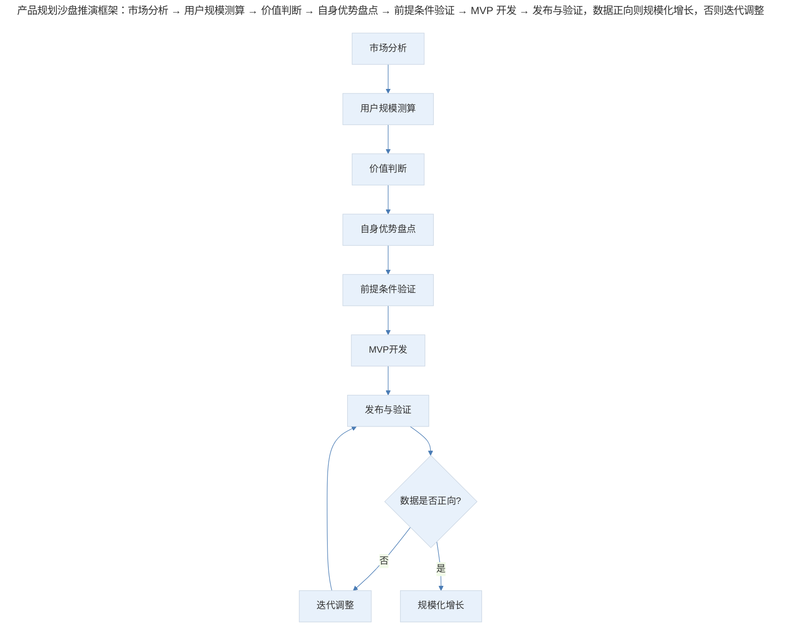
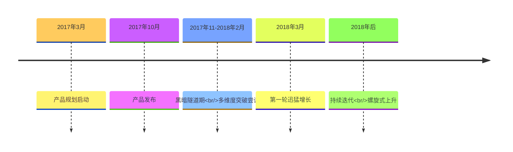

# 案例分析：产品规划的方法论与实践复盘

## 1. 导言

"极客时间"是一款面向 IT 技术人群的付费知识产品平台，从 2017 年 3 月启动规划，到 2017 年 10 月发布，再到 2018 年 3 月迎来第一轮迅猛增长，经历了一个完整的从零到一过程。本案例聚焦"极客时间"的产品规划过程，分析从创意到落地的关键决策节点，提炼知识付费产品规划的方法论。

案例的特殊价值在于：作为一款垂直领域的知识付费产品，"极客时间"在启动时并不被看好——"这个领域太垂直了，用户群少，又过于理性，能搞出什么花样呢？"然而产品最终成功验证了垂直知识付费的商业模式，其规划过程具有典型的研究价值。

## 2. 规划框架：沙盘推演与四要素模型

产品规划的核心是"沙盘推演"——在动手之前，对市场、用户、竞争、自身能力进行系统性分析，形成可验证的假设，再通过 MVP 验证假设。

> 产品规划沙盘推演框架：市场分析 → 用户规模测算 → 价值判断 → 自身优势盘点 → 前提条件验证 → MVP 开发 → 发布与验证，数据正向则规模化增长，否则迭代调整。

产品规划的四要素模型：

| 要素 | 核心问题 | 分析内容 |
|------|---------|---------|
| **市场空间** | 这个市场有多大？ | 用户规模测算、增长预测 |
| **价值判断** | 这个市场值得做吗？ | 人群价值、技术价值、商业价值 |
| **自身优势** | 我们凭什么能赢？ | 资源积累、能力储备、渠道优势 |
| **前提条件** | 成功需要什么条件？ | 支付基础设施、用户付费意愿 |

## 3. 关键决策：从创意到落地

### 3.1 市场空间测算：从质疑到验证

产品启动时，有朋友质疑"这个领域太垂直了，用户群少，又过于理性，能搞出什么花样呢？"

**决策过程**：团队通过数据测算验证市场空间：

| 数据来源 | 测算内容 | 结论 |
|---------|---------|------|
| GitHub 官方数据及年度报告 | 国内 IT 技术从业者规模 | 700-1000 万 |
| IDC 报告 | 行业增长趋势 | 年增长率约 30% |
| 中国统计年鉴 | 人口结构变化 | 编程教育普及趋势 |
| 综合预测 | 2022 年 IT 技术人群规模 | 预计达 3000 万甚至更多 |

**关键洞察**：垂直领域并不意味着市场小。IT 技术人群虽然相对总人口是"垂直"的，但绝对规模已达千万级别，且增长迅速。更重要的是，这个领域中最有价值的是技术和掌握了这些技术的人群——驱动商业世界和人类社会前行的永远是最底层和最先进的技术。

### 3.2 自身优势盘点：三架马车

**决策内容**：团队系统盘点自身优势，形成"资源-内容-运营"三架马车的战略定位。

| 优势类型 | 具体内容 | 战略价值 |
|---------|---------|---------|
| **资源积累** | 大量专题资源（视频、演讲稿、课件、技术文章） | 内容生产的基础设施 |
| **KOL 资源** | 大量高端技术人员和互联网领域 KOL | 专栏作者和讲师的来源 |
| **运营能力** | 非常强的线上和线下运营能力 | 用户获取和留存的能力 |

**决策逻辑**：产品成功需要"产品、内容、运营"三架马车缺一不可。内容是重中之重，没有差异化的精品内容，产品不能成立。但仅有内容不够，需要产品能力呈现内容，需要运营能力触达用户。

### 3.3 前提条件验证：付费意愿的实验

**决策内容**：在正式启动产品开发前，团队进行了付费订阅和付费社群的实验，收到的反馈相当不错。

**决策逻辑**：网络支付的便捷性和 IT 人群对知识付费的认可程度，是产品成立的前提条件。前提条件的验证不能停留在"感觉"，需要通过实际实验获得数据支撑。

| 前提条件 | 验证方式 | 验证结果 |
|---------|---------|---------|
| 支付便捷性 | 移动支付普及度观察 | 微信支付、支付宝已普及 |
| 付费意愿 | 付费订阅实验 | 反馈相当不错 |
| 内容需求 | 社群运营反馈 | 用户有强烈学习需求 |

### 3.4 MVP 策略：快速验证假设

**决策内容**：在完成分析、推演和实践后，团队用 MVP 方式推进产品研发。

**执行过程**：产品发布后"高开低走"，在黑暗的隧道中摸索爬行了三个月（2017 年 11 月-2018 年 2 月），从产品、数据、内容、传播各个层面进行突破，到 2018 年 3 月才迎来第一轮迅猛增长。

> 极客时间从零到一时间线：2017 年 3 月产品规划启动，10 月发布，2017 年 11 月-2018 年 2 月经历黑暗隧道期的多维度突破尝试，2018 年 3 月迎来第一轮迅猛增长，此后持续迭代螺旋式上升。

### 3.5 内容质量标准：口语化、场景化、交付感

**决策内容**：团队建立了内容质量的三个核心标准：

| 标准 | 定义 | 对立面 |
|------|------|--------|
| **口语化** | 像在咖啡厅向朋友讲述知识点 | 教条主义、照本宣科 |
| **场景化** | 带着问题找答案：发现问题→解决问题→得出结论 | 理论堆砌、脱离实际 |
| **交付感** | 用户看完就能立马分享给小伙伴 | 内容无法落地应用 |

**决策逻辑**：知识产品的核心价值是"让用户在有限时间里高效获取知识"。预设的内容场景是"一个周末午后的咖啡厅里，作者向坐在对面的朋友讲述某一个知识点"。

### 3.6 内容下线决策：与功能下线的本质差异

**问题**：功能特性验证后效果达不到预期可以下线，但专栏或课程数据指标不理想，是否应该下线？

**决策**：内容不能下线。理由如下：

| 考量维度 | 决策逻辑 |
|---------|---------|
| **知识图谱完整性** | 极客时间的目标是打造 IT 知识技能图谱，部分专栏受众小或现阶段接受度不够，但知识是图谱的一部分，必须做 |
| **长尾价值** | 即使现在只有几千人订阅，也帮到了这几千人，有价值 |
| **网络效应** | 随着图谱丰富，会做出技能树和学习路径，小众知识产品会重新焕发生机 |

## 4. 经验提炼：从零到一的关键认知

### 4.1 分析推演与执行验证的关系

分析和推演是做产品的前提，但最重要的是能把产品做出来，并完成从零到一的成长。

**关键认知**：2017 年 10 月发布时，没有几个人看好这个产品，也没人想到技术类知识产品能有几万付费订阅，更不会想到专栏作者收入可以到百万级别。几个最好的朋友说"你做吧，我全力支持，万一成了呢？"

**启示**：如果一个东西全世界的人都看懂了、看好了，不一定是好事——大家都看好的事，会有多少人去做？哪里还会轮到你？有时候需要给自己的直觉一个机会。

### 4.2 从零到一的隧道期

产品发布后并非立即成功，而是经历了三个月的"黑暗隧道期"。这个阶段需要从产品、数据、内容、传播各个层面进行突破尝试。

| 隧道期特征 | 应对策略 |
|-----------|---------|
| 数据不达预期 | 多维度分析，找到突破点 |
| 用户增长缓慢 | 尝试不同获客渠道 |
| 内容反馈一般 | 优化内容质量标准 |
| 团队信心动摇 | 保持战略定力，快速迭代 |

### 4.3 产品、内容、运营的协同关系

| 角色 | 核心职责 | 成功标准 |
|------|---------|---------|
| **产品** | 新设备上的新技术呈现、场景化学习、用户习惯培养 | 迭代速度、更新频率、用户体验 |
| **内容** | 口语化、场景化、交付感强的知识生产 | 订阅量、完课率、用户反馈 |
| **运营** | 用户获取、留存、传播 | 增长速度、用户活跃度、口碑传播 |

**关键洞察**：没有任何产品是靠某个单一方面就能成功的，成功构建在协作之上。在特定阶段，运营可能比产品和内容更重要——"酒香也怕巷子深"。

## 5. 实践指南：产品规划的核心原则

产品规划的核心原则：

1. **数据支撑直觉**：直觉很重要，但需要数据验证。市场空间测算、前提条件验证都是用数据支撑直觉的过程。

2. **MVP 快速验证**：分析推演再充分，也需要通过 MVP 快速验证假设。从零到一的过程充满不确定性，需要快速迭代、快速调整。

3. **隧道期的心理准备**：产品发布后不会立即成功，需要做好"黑暗隧道期"的心理准备和资源储备。

4. **三架马车协同**：产品、内容、运营缺一不可，需要建立协同机制，避免单点突破的陷阱。

5. **长期主义**：内容下线决策体现了长期主义思维——不因短期数据不理想而放弃长期价值。

## 6. 进阶延展：方法论演进与核心要点回顾

### 6.1 2024-2026 年的方法论演进

在当前的产品规划实践中，以下方法论演进值得关注：

| 方法论要素 | 2017 年实践 | 2024-2026 年演进 |
|-----------|-----------|----------------|
| 市场测算 | 手工收集多源数据 | AI 辅助市场研究、实时数据监测 |
| MVP 验证 | 功能级 MVP | 假设驱动实验、数据驱动迭代 |
| 内容生产 | 编辑主导品控 | AI 辅助内容生产、用户共创 |
| 增长策略 | 分享有赏+口碑传播 | PLG（Product-Led Growth）+社区运营 |

### 6.2 核心要点回顾

"极客时间"的产品规划案例揭示了完整的从零到一方法论：通过沙盘推演框架（市场分析→用户测算→价值判断→优势盘点→前提验证）形成可验证假设，再用 MVP 快速验证。关键决策包括：用数据测算验证市场空间（垂直不等于市场小）、三架马车协同（产品/内容/运营缺一不可）、前提条件实验验证付费意愿、内容质量三标准（口语化/场景化/交付感）、内容不下线的长期主义决策。

核心启示是：数据支撑直觉、MVP 快速验证、隧道期的心理准备、三架马车协同、长期主义。在 2024-2026 年，AI 辅助市场研究、假设驱动实验、PLG 与社区运营正在重塑产品规划实践，但"分析推演与执行验证相结合、长期主义"的底层逻辑始终不变。

---

## 参考资料（未核实）
> 注：以下条目为原始素材所附延伸文献，未逐条核实出处与真实性，仅供延伸参考。

- Ries, E. (2011). *The lean startup: How today's entrepreneurs use continuous innovation to create radically successful businesses*. Crown Business.
- Blank, S. (2013). *The four steps to the epiphany: Successful strategies for products that win* (5th ed.). K&S Ranch.
- Cagan, M. (2017). *Inspired: How to create tech products customers love* (2nd ed.). Wiley.
- Moore, G. A. (2014). *Crossing the chasm: Marketing and selling disruptive products to mainstream customers* (3rd ed.). HarperBusiness.