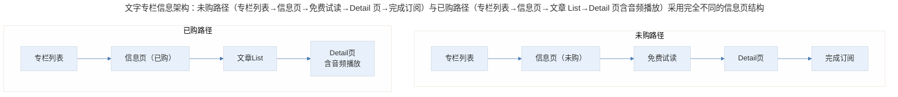
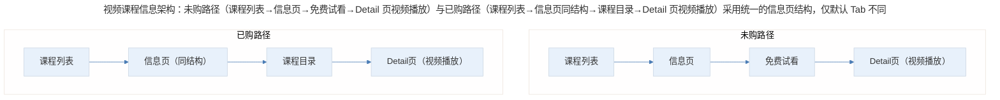
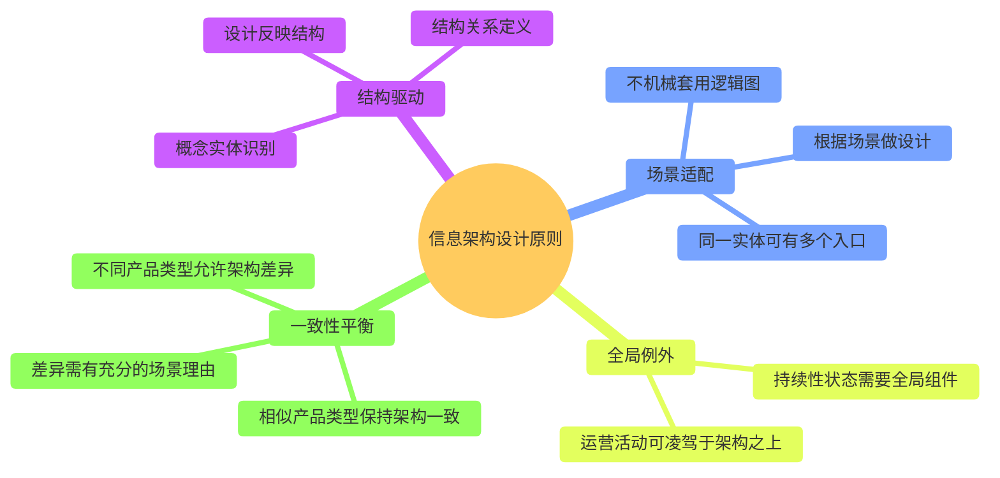

# 案例分析：信息架构设计的实践方法论

## 1. 导言

信息架构（Information Architecture, IA）是产品设计的骨架，决定了概念实体的组织方式、结构关系的表达形式以及用户在产品中的导航路径。然而，信息架构设计并非简单的逻辑分类——过于机械地按照逻辑层级排布入口和路径，会导致产品体验死板、缺乏场景感；而过度迁就场景又会造成结构混乱、认知负担加重。

本案例以极客时间 App 的信息架构为研究对象，系统分析不同产品类型的信息架构设计差异、场景驱动的架构取舍、以及凌驾于架构之上的特殊设计模式，提炼信息架构设计的实践方法论。

## 2. 分析框架：信息架构总览与产品类型差异

### 2.1 极客时间的信息架构总览

极客时间 App 采用经典的三 Tab 架构：

| Tab | 定位 | 核心功能 |
|-----|------|----------|
| 首屏（Tab 1） | 运营属性页面 | 推荐内容、活动入口、流量分发 |
| 知识产品索引（Tab 2） | 信息架构核心 | 四类知识产品的完整列表与入口 |
| 个人中心（Tab 3） | 用户管理 | 已购内容、学习记录、账户管理 |

四个核心概念实体位于 Tab 2：**文字专栏、视频课程、每日一课、微课**。信息架构设计的核心挑战在于：不同产品类型的信息结构存在差异，如何在统一架构中容纳这些差异。

### 2.2 文字专栏的信息架构

> 文字专栏信息架构：未购路径（专栏列表→信息页→免费试读→Detail 页→完成订阅）与已购路径（专栏列表→信息页→文章 List→Detail 页含音频播放）采用完全不同的信息页结构。

**关键发现：** 文字专栏的未购路径与已购路径采用了**完全不同的信息页结构**。未购用户通过"免费试读"进入 Detail 页完成转化；已购用户直接进入包含文章 List 的更详细信息页。这一设计可能基于以下假设：文字内容的转化需要"试读"作为中间步骤，用户在试读中感受内容质量后才会产生订阅决策。

### 2.3 视频课程的信息架构

> 视频课程信息架构：未购路径（课程列表→信息页→免费试看→Detail 页视频播放）与已购路径（课程列表→信息页同结构→课程目录→Detail 页视频播放）采用统一的信息页结构，仅默认 Tab 不同。

**关键发现：** 视频课程的未购与已购采用了**统一的信息页结构**，区别仅在于默认 Tab 页不同——未购默认展示"课程信息"，已购默认展示"课程目录"。

### 2.4 两种产品类型的架构差异对比

| 维度 | 文字专栏 | 视频课程 |
|------|----------|----------|
| 未购/已购信息页结构 | 不同 | 相同（仅默认 Tab 不同） |
| 转化路径设计 | 独立"免费试读"中间页 | 直接进入视频播放页 |
| 架构一致性 | 较低 | 较高 |
| 设计复杂度 | 较高（需维护两套信息页） | 较低（统一页面+Tab 切换） |

**设计偏好判断：** 视频课程的统一简洁设计在信息架构层面更为优雅。文字专栏的"免费试读"中间页从逻辑结构看略显突兀，可能是出于文字内容转化路径的特殊需求而做的场景化妥协。

## 3. 关键决策：场景驱动的架构取舍

### 3.1 信息架构 vs 场景设计的取舍

信息架构设计中最核心的决策是：**何时遵循逻辑结构，何时因场景而打破结构。**

**原则：不能将 App 设计等同于逻辑图。** 如果严格按照信息架构的层级关系排布所有入口和路径，产品将变得死板如黄页。必须在结构严谨性与场景适配性之间取得平衡。

| 设计决策 | 逻辑结构视角 | 场景设计视角 | 取舍判断 |
|----------|-------------|-------------|----------|
| 社群入口位置 | 与知识产品并列的独立模块 | 嵌入已购专栏的信息页 | 选择场景视角——为特定专栏组织社群，入口放在已购页 |
| "每日一课"入口 | 仅放在"已购"列表内 | 同时在个人中心提供独立入口 | 选择场景视角——满足快速访问需求 |
| 免费试读中间页 | 不需要，直接从信息页进 Detail | 文字内容需要试读作为转化阶梯 | 选择场景视角——优化转化路径 |

### 3.2 社群的架构定位决策

社群在信息架构中的定位是一个典型的取舍决策，存在三种方案：

| 方案 | 架构位置 | 优势 | 劣势 |
|------|----------|------|------|
| 方案 A | 与知识产品并列的独立模块 | 架构清晰、入口独立 | 社群与内容割裂、活跃度难保障 |
| 方案 B | 挂在某个专栏下 | 社群与内容紧密关联 | 架构层级下沉、可发现性降低 |
| 方案 C（极客时间选择） | 已购专栏信息页的入口 | 关联购买行为、精准触达付费用户 | 仅对已购用户可见、传播性受限 |

极客时间选择方案 C，入口放在已购信息页的右上方——这一位置与信息架构的设计吻合，既不破坏结构，又满足了"付费用户进入专栏社群"的核心场景。

### 3.3 凌驾于架构之上的设计模式

在信息架构之外，存在一类需要"凌驾于整个架构之上"的设计元素：

**模式一：音频控制组件**——极客时间的音频播放控制始终停留在右上角，无论页面如何转场，该控件始终可见且可操作。核心逻辑是：音频播放是持续性状态，不应因页面跳转而中断；控制入口需要随时可达，与当前浏览内容无关；属于"全局性功能"，不适合嵌入任何局部信息架构节点。

**模式二：运营浮窗**——双十一期间的"特价拼团"浮窗，虽然与购买流程相关，但很难嵌入某个具体的结算页面或信息架构深处——因为其核心目的是抓取流量，需要最大化的曝光面。

| 设计模式 | 适用场景 | 设计原则 |
|----------|----------|----------|
| 全局控制组件 | 持续性状态（如音频播放） | 始终可见、始终可操作、不随页面转场变化 |
| 运营浮窗 | 临时性活动（如促销拼团） | 高曝光、轻交互、可关闭、不干扰核心流程 |

### 3.4 首屏信息架构的优化建议

极客时间首屏（Tab 1）存在以下信息架构问题：

1. **概念交叉**："推荐阅读"（专栏内容）与"热门课程"（视频课内容）的命名存在交叉感，新用户可能困惑二者是否重复
2. **分类混淆**：热门课程（视频）、每日一课（视频）、底部视频合集三个入口可能造成混淆——用户可能期望在"视频合集"中找到"每日一课"和视频课程的内容，但实际并非如此

| 问题 | 原因分析 | 优化建议 |
|------|----------|----------|
| "推荐阅读"与"热门课程"概念交叉 | 运营导向命名与信息架构分类不一致 | 按产品类型命名，如"精选专栏""精选课程" |
| 多个视频入口造成混淆 | "每日一课""热门课程""视频合集"缺乏清晰的分类逻辑 | 明确各入口的内容边界，或合并重叠入口 |

这类问题在运营驱动的首屏设计中较为常见——运营需求（如推广特定内容）与信息架构的清晰性之间存在天然张力。

## 4. 经验提炼：信息架构设计的核心原则

### 4.1 信息架构设计的核心原则

> 信息架构设计原则全景：结构驱动（概念实体识别、结构关系定义、设计反映结构）、场景适配（不机械套用逻辑图、根据场景设计、同一实体可有多个入口）、全局例外（持续性状态需全局组件、运营活动可凌驾架构）、一致性平衡（相似类型一致、不同类型可差异、差异需场景理由）。

### 4.2 方法论要点

1. **设计必须反映结构，但不能等同于结构**：信息架构是设计的底层逻辑，交互和视觉是结构的表现形式。好的设计能让用户通过界面感知到背后的结构关系，但同时需要根据场景做灵活调整，避免死板的逻辑映射。

2. **同一概念实体可以出现在多个架构位置**：如"每日一课"既在"已购"列表中，又在个人中心有独立入口。这种设计在逻辑上看似冗余，但在场景层面满足了不同使用路径的需求。关键是要把场景考虑清楚，才能做出此类提升。

3. **架构一致性是原则而非教条**：视频课程保持未购/已购路径的架构一致性，文字专栏则因场景需要打破了这种一致性。一致性本身不是目的，用户认知效率和转化效果才是。

4. **全局性功能需要跳出局部架构**：音频控制、运营浮窗等需要"凌驾于架构之上"的设计，核心判断标准是——该功能是否与当前浏览内容无关、是否需要持续可访问。满足这两个条件时，应考虑全局化设计。

5. **首屏是运营与架构的博弈场**：首屏既要承载信息架构的清晰性，又要满足运营推广的灵活性。当二者冲突时，需要明确优先级——通常新用户的首屏应以架构清晰性为优先，避免认知混乱。

## 5. 实践指南：信息架构设计的应用要点

### 5.1 场景驱动的架构取舍决策

| 场景特征 | 架构处理方式 | 判断标准 |
|----------|-------------|----------|
| 转化路径需要中间步骤 | 允许打破逻辑结构（如免费试读中间页） | 转化效果是否显著提升 |
| 特定用户群体需要精准触达 | 入口嵌入特定场景（如社群入口） | 是否不破坏整体架构 |
| 快速访问需求 | 同一实体多入口（如每日一课） | 场景需求是否充分 |
| 持续性使用状态 | 全局组件凌驾架构 | 是否与当前内容无关且需持续可访问 |

### 5.2 信息架构评估清单

- [ ] 概念实体是否清晰识别并有明确的边界？
- [ ] 各产品类型的信息架构是否与其特性匹配？
- [ ] 场景驱动的架构取舍是否有充分的场景理由？
- [ ] 全局性功能是否已跳出局部架构进行设计？
- [ ] 首屏在运营与架构的博弈中是否保持了清晰性？
- [ ] 架构的一致性是否在合理范围内被允许差异？

## 6. 进阶延展：当代演进与核心要点回顾

### 6.1 当代实践补充（2024-2026）

2024-2026 年，信息架构设计有以下重要演进：

- **AI 驱动的个性化信息架构**：基于用户行为数据的动态信息架构（Dynamic IA）成为趋势——不同用户看到不同的导航结构和内容组织方式，如 TikTok 的"For You"页本质上是高度个性化的信息架构（Kalbach, 2024）。
- **设计系统（Design System）与信息架构的融合**：Figma 等设计工具的组件化能力使得信息架构的设计与验证效率大幅提升，团队可以在设计系统层面定义标准化的架构模式（Kholmatova, 2017）。
- **无障碍访问（Accessibility）成为架构约束**：WCAG 2.2 标准对信息架构提出了新的要求，如导航路径的一致性、可预测性等，直接影响架构设计决策（W3C, 2023）。
- **小程序与超级 App 的信息架构挑战**：微信小程序、支付宝小程序等"应用内的应用"带来了新的信息架构问题——如何在宿主 App 的信息架构中嵌入子应用的完整架构，且不造成用户认知混乱（Liu & Chen, 2025）。

### 6.2 核心要点回顾

信息架构设计的核心是"设计必须反映结构，但不能等同于结构"——在结构严谨性与场景适配性之间取得动态平衡。极客时间案例揭示了场景驱动的架构取舍（社群入口、每日一课多入口、免费试读中间页）、凌驾于架构之上的全局设计模式（音频控制、运营浮窗），以及首屏运营与架构的博弈。核心原则是：同一概念实体可有多个架构位置（满足不同场景路径）、架构一致性是原则而非教条（用户认知效率与转化效果才是目的）、全局性功能需跳出局部架构。在 2024-2026 年，AI 驱动的个性化信息架构、设计系统融合、无障碍约束与超级 App 的信息架构挑战正在重塑设计实践。

---

## 参考资料（未核实）
> 注：以下条目为原始素材所附延伸文献，未逐条核实出处与真实性，仅供延伸参考。

- Kalbach, J. (2024). *Information architecture: For designers and developers* (2nd ed.). O'Reilly Media.
- Liu, H., & Chen, W. (2025). Information architecture design in super-app ecosystems: Challenges and best practices. *International Journal of Human-Computer Interaction*, 41(2), 189-205.
- Kholmatova, A. (2017). *Design systems: A practical guide to creating design languages for digital products*. A Book Apart.
- W3C. (2023). *Web content accessibility guidelines (WCAG) 2.2*. World Wide Web Consortium.
- 罗浩. (2024). 移动应用信息架构设计实战. 人民邮电出版社.