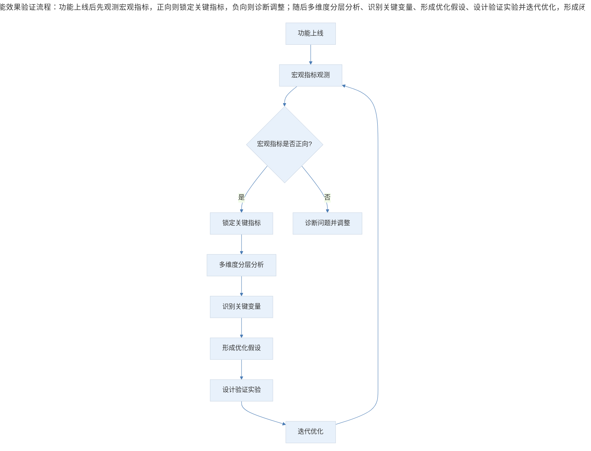

# 案例分析：数据驱动的功能效果验证方法

## 1. 导言

"极客时间"是一款面向 IT 技术人群的付费知识产品平台，在产品增长进入瓶颈期后，团队上线了"分享有赏"功能——用户订阅专栏后生成专属分享海报，他人通过海报订阅后，分享者可获得返现奖励。该功能的核心目标是借助用户自传播（Viral Loop）实现增长突破。

功能上线三个月后，产品团队对"分享有赏"进行了系统性的数据复盘，以验证功能效果并指导后续迭代。本案例将围绕此次数据验证的完整过程，提炼出可复用的功能效果验证方法论。

## 2. 分析框架：功能效果验证的整体流程与指标体系

### 2.1 功能效果验证的整体流程

功能上线后的数据验证并非简单的"看数据"，而需要建立从宏观到微观、从整体到分层的系统化分析框架。

> 功能效果验证流程：功能上线后先观测宏观指标，正向则锁定关键指标，负向则诊断调整；随后多维度分层分析、识别关键变量、形成优化假设、设计验证实验并迭代优化，形成闭环。

### 2.2 指标体系设计

在功能效果验证中，指标体系的设计至关重要。本案例中，团队将指标分为两个层次：

**第一层：宏观效果指标**——用于判断功能整体是否有效

| 指标名称 | 定义 | 数据表现 |
|---------|------|---------|
| 分享海报 PV 占比 | 通过分享海报进入的 PV / 专栏详情页总 PV | 27.68% |
| 分享海报 UV 占比 | 通过分享海报进入的 UV / 专栏详情页总 UV | 26.75% |
| 分享订单占比 | 分享有赏订单数 / 专栏订阅总量 | 29.95% |
| 主返现用户占比 | 获得主返现的用户数 / 整体订阅人数 | 8.06% |

**第二层：关键过程指标**——用于诊断功能运转机制是否健康

| 指标名称 | 定义 | 分析意义 |
|---------|------|---------|
| 有效分享人数占比 | 海报被扫码查看的人数 / 总订阅人数 | 衡量用户分享意愿 |
| 海报订阅转化率 | 返现带来的订单数 / 返现海报 UV | 衡量海报购买吸引力 |
| 获得返现用户占比 | 获得主返现的用户数 / 总订阅人数 | 衡量 KOL 依赖度 |

### 2.3 理想模型与实际偏差

团队构建了"分享有赏"的理想运转模型：有效分享人数越多 → 海报曝光越高 → 订阅转化越多 → 返现用户越多 → 分享动力增强，形成正向循环。同时，外部 KOL 的推广可维持高曝光状态，使功能持续处于强动力、高效的自传播状态。

然而，实际数据与理想模型之间存在显著偏差，这正是数据分析的核心价值所在——通过识别偏差来定位问题。

## 3. 关键决策：变量识别与策略选择

### 3.1 价格变量对功能效果的决定性影响

通过对各专栏在"限时优惠期"与"恢复原价后"两个阶段的数据对比，团队发现了价格变量对三个关键指标的差异化影响：

| 关键指标 | 价格变化影响 | 典型案例 |
|---------|------------|---------|
| 有效分享人数占比 | 影响较小，部分专栏反而上升 | F 专栏：24.68% → 28.24%；C 专栏：28.64% → 30.46% |
| 海报订阅转化率 | 影响极为显著，大幅下降 | D 专栏：11.92% → 4.95%；I 专栏：11.58% → 0.15% |
| 获得返现用户占比 | 随转化率下降而降低 | 各专栏均有不同程度下降 |

**核心发现**：价格上涨并未抑制用户的分享意愿（有效分享人数占比稳定甚至上升），但严重削弱了海报的购买转化率。这意味着"分享有赏"功能的增长引擎在恢复原价后几乎失速——用户愿意分享，但被分享者不愿付费。

### 3.2 单向返现与双向返现的策略选择

案例中存在一个重要的策略讨论：是否将 KOL 返现的一部分剥离，返给通过分享码购买的用户（即双向返现），类似 Uber 的推荐策略。

团队实际尝试了双向返现功能，但数据观察与 KOL 交流后发现，该策略可能与预期背道而驰。这一决策的关键在于：返现策略的设计需要同时考虑供给侧（分享者动力）和需求侧（购买者动力），而非简单地将资源从一端转移到另一端。

### 3.3 基于数据的两个核心结论

1. **不同专栏的数据表现天然存在差异**，源于选题大小、讲师段位等因素。但每个专栏应独立分析其关键指标表现，在三项指标（有效分享人数占比、海报订阅转化率、获得返现用户占比）表现良好的前提下，配合推广资源，才能最大化功能效果。

2. **价格是当前影响海报订阅转化率的最大可识别因素**，建议在不同阶段变化海报文案和设计风格，并追踪转化率变化，以探索最优海报模板。

## 4. 经验提炼：功能效果验证的方法论

### 4.1 功能效果验证的三步法

| 步骤 | 核心动作 | 关键要点 |
|------|---------|---------|
| 第一步：趋势观测 | 在不同周期内持续用数据了解趋势和现状 | 功能上线后即开始数据采集，避免事后补数据 |
| 第二步：指标锁定 | 为数据分析制定方向，收集相关数据，锁定关键指标 | 指标选择应聚焦，避免数据泛滥导致分析失焦 |
| 第三步：分层深挖 | 围绕关键指标，在不同维度、不同阶段做分析 | 找出产品和运营改进的关键点，对最佳效果无限逼近 |

### 4.2 比例指标优于绝对值指标

本案例中，团队刻意选择比例指标而非绝对值进行跨专栏对比。原因在于：各专栏的订阅量差异巨大，使用绝对值无法进行有效横向比较。比例指标能够消除规模差异的干扰，更准确地反映功能在各专栏中的实际运转效率。

这一原则在 2024-2026 年的数据分析实践中被进一步强化。现代 Product Analytics 工具（如 Amplitude、Mixpanel）普遍采用归一化指标（Normalized Metrics）进行跨群组对比，其底层逻辑与本案例中的比例指标选择一致。

### 4.3 分阶段分析揭示变量影响

将数据按"限时优惠期"和"恢复原价后"两个阶段拆分分析，是本案例中最具洞察力的分析动作。这种分阶段分析（Cohort Analysis 的变体）能够有效识别外部变量（价格）对功能效果的影响，避免将不同阶段的数据混合后得出错误结论。

### 4.4 数据验证的局限性认知

团队坦诚地指出了本次分析的不足：未统计各专栏通过返现带来的新用户数；因样本量不足，无法判断单向返现与双向返现策略的差异。这种对局限性的认知本身就是专业数据分析的标志——明确知道"不知道什么"，比得出不确定的结论更有价值。

后续建议采用 A/B Testing 方法，选取若干专栏在不同时期分别使用不同返现策略，追踪数据后得出明确结论。这一思路与当前业界标准的实验驱动（Experiment-Driven）产品决策方法完全一致（Kohavi et al., 2020）。

### 4.5 从"药到病除"到"持续监护"的产品管理思维

功能上线如同给产品"开药"，数据验证则是观察"药效"。但药效验证不是终点——即使宏观指标正向，仍需深入过程指标，识别功能运转中的结构性问题。产品经理对产品的管理应从"一次性交付"转向"持续监护"，通过数据不断校准功能效果，调整策略。

## 5. 实践指南：功能效果验证的执行清单

### 5.1 数据验证执行清单

- [ ] 功能上线后是否立即开始数据采集，而非事后补数据？
- [ ] 是否建立了宏观效果指标与关键过程指标的双层指标体系？
- [ ] 跨群组对比是否优先采用比例指标（归一化指标）而非绝对值？
- [ ] 是否通过分阶段（如价格变化前后）分析识别外部变量的影响？
- [ ] 是否坦承了数据验证的局限性，并明确了下一步的实验设计？
- [ ] 宏观指标正向时，是否仍深入过程指标识别结构性问题？

### 5.2 功能验证的三步法应用

1. **趋势观测**：功能上线后持续采集数据，了解趋势和现状
2. **指标锁定**：制定分析方向，聚焦关键指标避免失焦
3. **分层深挖**：围绕关键指标，多维度多阶段分析，定位改进关键点

## 6. 进阶延展：当代演进与核心要点回顾

### 6.1 当代演进（2024-2026）

- **实验驱动决策常态化**：A/B 测试平台（如 Optimizely、LaunchDarkly）的成熟使"分享有赏"案例中提到的 A/B Testing 验证方法成为产品决策的标准流程，功能效果验证从"事后复盘"走向"事前实验"（Kohavi et al., 2020）。
- **AI 辅助数据分析**：AI 工具可自动完成多维度分层分析、异常检测与变量识别，大幅提升功能效果验证的效率，但核心的分析思维（比例指标、分阶段分析、局限性认知）依然依赖产品经理（Croll & Yoskovitz, 2023）。
- **实时监控与预测**：从"上线后三个月复盘"演进为上线即实时监控关键指标，AI 可预测功能效果的长期走向，提前预警结构性问题。

### 6.2 核心要点回顾

数据驱动的功能效果验证遵循"趋势观测→指标锁定→分层深挖"三步法，核心方法论包括：双层指标体系（宏观效果指标判断整体有效性，关键过程指标诊断运转机制）、比例指标优于绝对值指标（消除规模差异干扰）、分阶段分析揭示变量影响（如价格变化对转化率的决定性影响）、以及数据验证的局限性认知（明确知道"不知道什么"更有价值）。"分享有赏"案例的核心发现是：价格上涨不抑制分享意愿但严重削弱购买转化率，增长引擎在恢复原价后几乎失速。产品经理对产品的管理应从"一次性交付"转向"持续监护"，通过数据不断校准功能效果。

---

## 参考资料（未核实）
> 注：以下条目为原始素材所附延伸文献，未逐条核实出处与真实性，仅供延伸参考。

- Kohavi, R., Tang, D., & Xu, Y. (2020). *Trustworthy online controlled experiments: A practical guide to A/B testing*. Cambridge University Press.
- Croll, A., & Yoskovitz, B. (2013). *Lean analytics: Use data to build a better startup faster*. O'Reilly Media.
- 刘建国, & 极客时间产品团队. (2018). 分享有赏功能数据分析内部报告.