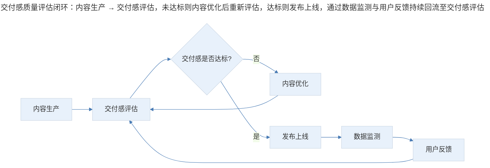
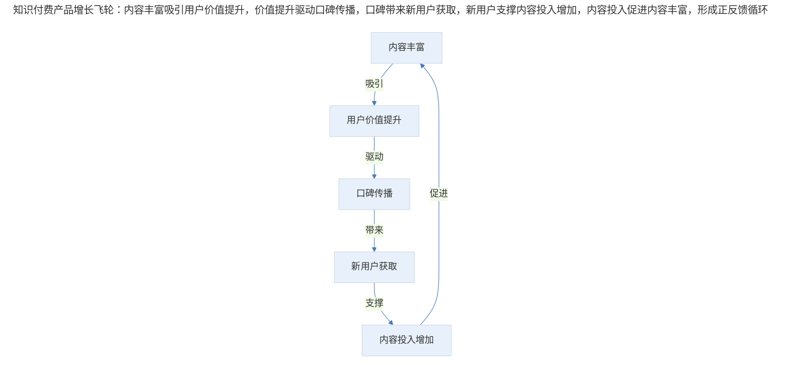

# 案例分析：知识付费产品的获客与传播策略

## 1. 导言

"极客时间"是一款面向 IT 技术人群的付费知识产品平台，在产品发展过程中，团队面临知识付费产品的典型挑战：如何实现可持续的用户获取与传播。与工具类或娱乐类产品不同，知识付费产品的获客面临独特约束——用户付费意愿的培养需要时间，内容质量是核心变量，学习粘性天然较弱。

本案例聚焦"极客时间"在获客与传播上的策略演进，从内容建设、价值交付到粘性提升的三阶段路径，提炼知识付费产品的增长方法论。

## 2. 分析框架：获客路径模型与方式对比

### 2.1 知识付费产品的获客路径模型

知识付费产品的获客逻辑与传统互联网产品存在本质差异。传统产品可通过补贴、裂变等手段快速获客，但知识付费产品的核心价值在于"让用户学会技术、得到提升、乃至快速变现"，这决定了其获客路径必须以价值创造为起点。

```mermaid
---
title: 知识付费产品获客路径模型：第一阶段内容建设（丰富内容覆盖、构建知识图谱、多形式内容矩阵）→ 第二阶段价值交付（内容质量把控、交付感优化、品控体系建立）→ 第三阶段粘性提升（学习习惯培养、激励机制设计、社群与成就体系）
---
%%{init: {"theme": "base", "themeVariables": {"primaryColor": "#E8F1FB", "lineColor": "#4A7CB5"}}}%%
flowchart TD
    subgraph 第一阶段：内容建设
        A1["丰富内容覆盖"] --> A2["构建知识图谱"]
        A2 --> A3["多形式内容矩阵"]
    end

    subgraph 第二阶段：价值交付
        B1["内容质量把控"] --> B2["交付感优化"]
        B2 --> B3["品控体系建立"]
    end

    subgraph 第三阶段：粘性提升
        C1["学习习惯培养"] --> C2["激励机制设计"]
        C2 --> C3["社群与成就体系"]
    end

    A3 --> B1
    B3 --> C1
```
> 知识付费产品获客路径模型：第一阶段内容建设（丰富内容覆盖、构建知识图谱、多形式内容矩阵）→ 第二阶段价值交付（内容质量把控、交付感优化、品控体系建立）→ 第三阶段粘性提升（学习习惯培养、激励机制设计、社群与成就体系）。

### 2.2 两种获客方式的对比

| 获客方式 | 核心逻辑 | 典型手段 | 适用场景 |
|---------|---------|---------|---------|
| **直接获客** | 产品方与目标用户直接沟通 | 分享有赏、广告投放、渠道合作 | 产品初期、快速获客需求 |
| **价值传播** | 用户感知价值后主动推荐 | 内容质量、学习效果、口碑传播 | 产品成长期、可持续增长 |

"分享有赏"功能遵循的是直接获客逻辑，而本案例聚焦的是价值传播路径——通过持续增强产品核心功能，为用户创造更多价值，从而驱动用户自发传播。

## 3. 关键决策：三阶段策略

### 3.1 第一阶段决策：内容覆盖优先于深度运营

知识付费产品的核心价值载体是内容。如同书店，书籍越多，用户采购几率越大；书店空空如也，用户转头就走。

**决策内容**：在一年内上线近 50 个专栏，同时推出"每日一课"模块，集合国内外顶级技术大会演讲视频，覆盖人工智能、大数据、云计算、架构、运维、移动、前端等热门领域。

**决策逻辑**：专栏形式覆盖深度学习需求，"每日一课"覆盖广度和时效性需求。通过两种内容形式的组合，在保证质量的前提下最大化内容覆盖面。

| 内容类型 | 覆盖需求 | 内容特点 | 用户价值 |
|---------|---------|---------|---------|
| 专栏课程 | 深度学习 | 体系化、连载更新 | 技能系统提升 |
| 每日一课 | 广度涉猎 | 碎片化、前沿动态 | 行业视野拓展 |

### 3.2 第二阶段决策：交付感作为内容质量的核心指标

内容质量是知识产品的灵魂，但"质量"是一个模糊概念。团队将"交付感"作为可操作的质量指标——一篇文章是否让用户看得懂、学得明白。

**决策内容**：建立品控手册，明确内容交付标准；编辑团队持续强调交付感，探索知识传播的最优方式。

**决策逻辑**：知识付费产品与书籍的被动讲述不同，需要主动探索知识传播的有效方式。交付感的核心是将与用户工作真正相关的内容、宝贵的行业经验，有条理有效地传递给用户。


> 交付感质量评估闭环：内容生产 → 交付感评估，未达标则内容优化后重新评估，达标则发布上线，通过数据监测与用户反馈持续回流至交付感评估。

### 3.3 第三阶段决策：游戏化机制破解学习粘性难题

数据分析发现一个关键问题：即便是优秀的课程内容，用户到中期的跟读率并不高。用户买了课程后学了几天就放下，无法保持长期学习状态。

**问题诊断**：学习类产品需要如履薄冰，一不小心就挫伤用户学习的小火苗。人类自身的惰性导致学习粘性天然较弱，用户可能连 App 都不愿意打开。

**决策内容**：借鉴游戏类产品的粘性机制，设计学习模块，包括社群交流、持续学习激励、成就获得等机制，协助用户建立学习习惯。

| 游戏化机制 | 游戏产品应用 | 知识产品迁移 |
|-----------|------------|------------|
| 每日登录奖励 | 每日登录送金币 | 每日学习打卡奖励 |
| 持续行为激励 | 连续登录送道具 | 持续学习天数奖励 |
| 任务完成奖励 | 完成几局游戏获得奖励 | 完成课程章节获得奖励 |
| 成就系统 | 达成系列获得成就 | 学习成就徽章体系 |

### 3.4 数据驱动的质量监测体系

团队建立了实时观测文章阅读数、打开率等数据指标的内部系统，用于监测文章发布后读者的实时反馈。这一数据反馈成为内容质量的重要参考依据。

**关键洞察**：数据监测不仅是"看数据"，更是建立"内容生产-数据反馈-内容优化"的闭环。通过数据识别内容质量问题，驱动内容迭代优化。

## 4. 经验提炼：增长飞轮与核心竞争力

### 4.1 知识付费产品的增长飞轮

知识付费产品的增长逻辑可抽象为一个飞轮模型：内容丰富 → 用户价值提升 → 口碑传播 → 新用户获取 → 内容投入增加 → 内容更丰富。


> 知识付费产品增长飞轮：内容丰富吸引用户价值提升，价值提升驱动口碑传播，口碑带来新用户获取，新用户支撑内容投入增加，内容投入促进内容丰富，形成正反馈循环。

飞轮启动的关键在于：内容必须足够丰富且高质量，才能产生足够的用户价值；用户价值足够高，才能驱动口碑传播；口碑传播足够有效，才能带来可持续的新用户获取。

### 4.2 交付感：知识产品的核心竞争力

"交付感"概念的提出，为知识付费产品的质量评估提供了可操作的框架。交付感的核心是"让用户看得懂、学得明白"，这要求内容生产者从"我有什么知识"转向"用户需要什么知识、如何有效传递"。

| 传统内容思维 | 交付感思维 |
|------------|-----------|
| 我有这些知识，写出来 | 用户需要这些知识，如何传递 |
| 内容完整即可 | 用户能理解、能应用 |
| 一次性交付 | 持续优化交付方式 |

### 4.3 学习粘性的本质挑战

知识付费产品面临一个本质挑战：学习是反人性的。用户购买课程时的动机是"我想学习"，但实际使用时的行为是"我不想学习"。这种动机与行为的落差，导致知识付费产品的完课率普遍较低。

**应对策略**：通过游戏化机制，将"学习"这一反人性活动，包装为"打卡、成就、奖励"等顺人性活动。这不是欺骗用户，而是利用人性特点，帮助用户克服学习惰性。

## 5. 实践指南：获客策略的阶段适配

知识付费产品的获客策略需要与产品发展阶段相匹配：

| 产品阶段 | 核心挑战 | 获客策略重点 |
|---------|---------|------------|
| 冷启动期 | 内容不足、用户信任未建立 | 直接获客（分享有赏、KOL 合作） |
| 成长期 | 内容丰富、需要口碑传播 | 价值传播（内容质量、交付感） |
| 成熟期 | 用户增长放缓、需要提升 LTV | 粘性提升（游戏化、社区化） |

"极客时间"的策略演进正是这一框架的实践验证：从"分享有赏"的直接获客，到内容建设和价值交付的价值传播，再到游戏化机制的粘性提升，形成了完整的获客策略演进路径。

### 5.1 知识付费获客的执行要点

- **冷启动期**：以直接获客快速验证需求，建立初始用户池和内容基础
- **成长期**：以内容质量和交付感驱动口碑传播，实现可持续增长
- **成熟期**：以游戏化和社区化提升用户粘性与 LTV，拓展变现空间

## 6. 进阶延展：当代演进与核心要点回顾

### 6.1 当代演进（2024-2026）

在当前的知识付费产品实践中，以下趋势值得关注：

| 趋势 | 具体表现 | 对产品设计的启示 |
|------|---------|----------------|
| **AI 辅助学习** | AI 助教、智能问答、个性化学习路径 | 提升交付感的新手段 |
| **社区化学习** | 学习小组、同伴互助、导师辅导 | 增强学习粘性的社交杠杆 |
| **微学习** | 碎片化内容、短视频课程、音频课程 | 适应用户时间碎片化 |
| **学习效果可视化** | 学习报告、技能图谱、能力认证 | 强化学习成就感 |

### 6.2 核心要点回顾

知识付费产品的获客与传播遵循"内容建设→价值交付→粘性提升"三阶段路径。核心决策包括：内容覆盖优先于深度运营（专栏覆盖深度学习、每日一课覆盖广度）、交付感作为内容质量的核心指标（从"我有什么知识"转向"用户需要什么知识"）、游戏化机制破解学习粘性难题（利用人性特点帮助用户克服学习惰性）。增长飞轮模型（内容丰富→用户价值→口碑传播→新用户→内容投入）揭示了价值传播的可持续性。在 2024-2026 年，AI 辅助学习、社区化学习、微学习与学习效果可视化正在重塑知识付费产品的获客与传播策略，但"交付感是核心竞争力、价值传播优于直接获客"的底层逻辑始终不变。

---

## 参考资料（未核实）
> 注：以下条目为原始素材所附延伸文献，未逐条核实出处与真实性，仅供延伸参考。

- Eyal, N., & Hoover, R. (2014). *Hooked: How to build habit-forming products*. Portfolio.
- Thompson, B. (2017). The subscription economy. *Stratechery*.
- Osterwalder, A., & Pigneur, Y. (2010). *Business model generation: A handbook for visionaries, game changers, and challengers*. Wiley.