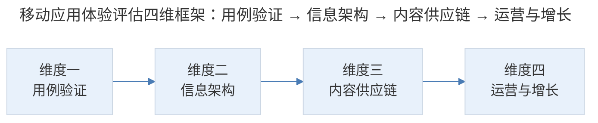
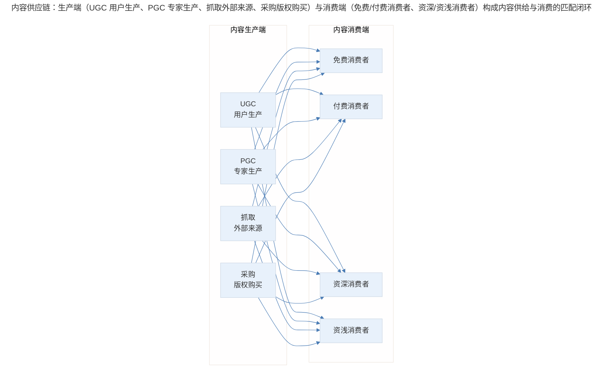
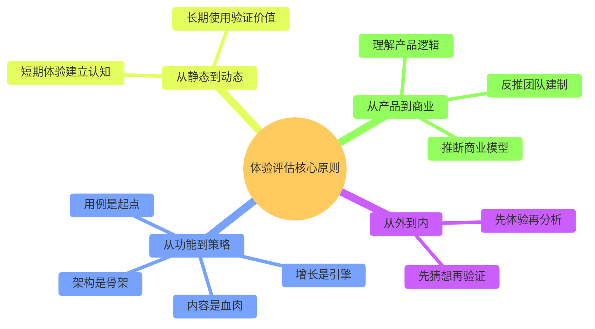

# 案例分析：移动应用体验评估的系统方法

## 1. 导言

产品经理对移动应用的体验评估是一项基础但关键的专业能力。与普通用户的使用体验不同，产品经理需要从专业视角拆解应用的用例设计（Use Case Design）、信息架构（Information Architecture）、内容供应链（Content Supply Chain）和运营增长策略（Growth Strategy），将感性体验转化为结构化的专业认知。

本案例以阅读类应用为示例场景，系统阐述产品经理上手体验一款移动应用的完整方法论，覆盖从用例验证到运营增长评估的四个核心维度。

## 2. 分析框架：体验评估的四维框架

### 2.1 体验评估的四维框架

> 移动应用体验评估四维框架：用例验证 → 信息架构 → 内容供应链 → 运营与增长，由产品功能层向商业策略层递进。

### 2.2 维度一：用例验证

用例（Use Case）是产品设计的原子单元，指用户在产品中可以完成的动作、流程及由此获得的价值。用例验证是体验评估的起点，包含三个递进步骤：

**步骤一：猜想用例。** 根据应用的名称、封面、介绍说明，猜想该应用可能支持的用例。以阅读类应用为例，猜想用例可能包括：浏览书架、搜索书籍、阅读内容、添加书签、购买书籍、朗读等。

**步骤二：发现用例。** 观察应用如何通过新手引导（Onboarding）、信息架构设计等方式，引导用户发现实际支持的用例。关注入口的可见性、可发现性和引导效率。

**步骤三：试用用例。** 逐一试用已发现的用例，评估交互方式（按钮/方框/图形界面/文字界面）、流程顺畅度和体验完整性。

在用例试用过程中，需要特别关注**魔力时刻（Aha Moment）**——即使用过程中某个功能或节点突然击中用户预期、带来强烈愉悦感的关键体验点。魔力时刻的识别对理解产品的核心价值主张（Value Proposition）至关重要。

| 用例验证步骤 | 核心任务 | 评估重点 |
|-------------|----------|----------|
| 猜想用例 | 基于外部信息预判产品功能 | 自身认知与产品设计的差距 |
| 发现用例 | 观察产品如何引导功能发现 | 引导效率、入口可见性 |
| 试用用例 | 实际操作验证功能体验 | 交互方式、流程顺畅度 |
| 识别魔力时刻 | 捕捉关键体验节点 | 核心价值主张的传递方式 |

### 2.3 维度二：信息架构

信息架构评估的核心是理解产品中的**概念实体（Conceptual Entity）**及其**结构关系**。

**概念实体识别：** 以阅读类应用为例，概念实体可能包括：书籍、作者、书评、类别、书架、书城等。需要逐一识别产品提供了哪些概念实体。

**结构关系分析：** 概念实体之间的关系结构主要有两种典型模式：

| 结构类型 | 特征 | 典型表现 |
|----------|------|----------|
| 树状结构 | 父子层级关系，一个父节点下有多个子节点 | 书城→分类→书籍 |
| 标签结构 | 多对多关系，一个内容可关联多个标签 | 一本书同时属于"技术"和"畅销"标签 |

**设计反映结构：** 评估产品的交互设计和视觉设计是否准确反映了概念实体之间的结构关系。关键判断点包括：

- 并列关系（如书架与书城）是用 Tab 展现还是抽屉菜单？
- 书评是展示在书籍属性页还是由时间线展示？
- 概念实体的层级关系是否在导航路径中清晰体现？

### 2.4 维度三：内容供应链

内容供应链评估关注内容的**生产者**与**消费者**两端：

> 内容供应链：生产端（UGC 用户生产、PGC 专家生产、抓取外部来源、采购版权购买）与消费端（免费/付费消费者、资深/资浅消费者）构成内容供给与消费的匹配闭环。

生产端模式对比：

| 生产模式 | 定义 | 优势 | 挑战 |
|----------|------|------|------|
| UGC（User Generated Content） | 普通用户生产内容 | 内容丰富、社区活跃 | 质量参差、审核成本高 |
| PGC（Professionally Generated Content） | 认证专家生产内容 | 质量可控、品牌感强 | 产能受限、成本较高 |
| 抓取 | 从外部来源自动采集 | 内容量大、成本低 | 版权风险、同质化 |
| 采购 | 购买版权内容 | 品质保证、合规 | 成本高、更新依赖供应方 |

**消费端分析要点：** 消费者不仅按免费/付费区分，还需按消费深度（资深/资浅）、内容偏好（类目关注）等维度细分，以理解产品的用户结构。

### 2.5 维度四：运营与增长

运营与增长评估基于 AARRR 模型（Acquisition-Activation-Retention-Referral-Revenue），逐层分析产品的增长策略：

| AARRR 环节 | 评估要点 | 典型观察方法 |
|-----------|----------|-------------|
| 获客（Acquisition） | 获客渠道：朋友圈传播、微博传播、App Store 广告投放 | 分析应用分享机制和外部投放痕迹 |
| 激活（Activation） | 新用户转化为真实用户的路径：新手引导、注册墙设计 | 体验首次使用流程，评估转化阻力 |
| 留存（Retention） | 用户长期留存的机制：推送策略、唤醒机制 | 允许推送通知，观察推送频率和内容质量 |
| 传播（Referral） | 用户传播的激励手段和产品机制 | 识别分享入口和传播链路设计 |
| 收入（Revenue） | 变现模式与付费转化 | 识别付费触点和定价策略 |

**推送策略的专业观察方法：** 新安装应用时主动允许所有推送通知，持续观察推送的频率、内容格调、时机选择。若推送频繁且格调低，则关闭；若推送克制且有价值，则保留并持续学习其策略。

**网络效应（Network Effect）评估：** 判断产品是否具有"用户越多、价值越大"的特征。典型案例——微信的联系人数量与产品价值正相关：2 个联系人的微信吸引力远低于几千个联系人的微信。网络效应是留存和传播的底层驱动力。

**团队建制反推：** 根据产品的运营增长策略，反推其所需的团队建制——是否需要社区管理员（自聘/兼职）、内容运营团队、增长团队等，进而估算运营成本。可通过上市公司财报、行业信息等渠道验证估算的准确性。

## 3. 关键决策：评估优先级与魔力时刻识别

### 3.1 评估优先级的决策

面对一款新应用，四个维度的评估并非均等投入。决策原则如下：

1. **用例验证是必选项**：无论时间多紧，至少完成用例验证，建立对产品的基本认知
2. **信息架构视产品复杂度决定深度**：简单产品快速过，复杂产品需详细拆解
3. **内容供应链对内容型产品是重点**：工具型产品可适当简化
4. **运营增长对增长期产品是重点**：成熟期产品的增长策略参考价值有限

### 3.2 魔力时刻的识别决策

魔力时刻的识别需要区分"惊喜感"和"真正价值"：

- 惊喜感来自超出预期的交互设计或视觉呈现，但可能不具备持续价值
- 真正价值来自产品核心功能与用户需求的精准匹配，具有持续性和可迁移性

产品经理应将评估重心放在后者，避免被表面的设计技巧所吸引而忽视底层的产品逻辑。

## 4. 经验提炼：体验评估的核心原则

### 4.1 体验评估的核心原则

> 体验评估核心原则：从外到内（先猜想再验证、先体验再分析）、从功能到策略（用例是起点、架构是骨架、内容是血肉、增长是引擎）、从静态到动态（短期体验建立认知、长期使用验证价值）、从产品到商业（理解产品逻辑、推断商业模型、反推团队建制）。

### 4.2 方法论要点

1. **猜想-验证循环**：体验评估不是被动接受，而是主动猜想与验证的循环。先猜想产品应该有什么，再验证实际有什么，二者的差距就是学习的机会。

2. **结构决定设计**：信息架构是产品的骨架，交互和视觉设计是骨架上的皮肤。不理解结构，就无法判断设计的合理性。

3. **内容供应链决定产品本质**：同样是阅读应用，UGC 社区和 PGC 平台是本质不同的产品。内容供应链分析是理解产品本质的关键入口。

4. **推送策略是运营能力的窗口**：推送的频率、内容、时机，直接反映产品团队的运营水平和用户理解深度。主动允许推送并持续观察，是低成本高回报的评估手段。

5. **网络效应是增长的底层逻辑**：具有网络效应的产品，增长策略与无网络效应的产品截然不同。识别网络效应的存在与否，是增长评估的第一步。

## 5. 实践指南：体验评估的应用要点

### 5.1 四维评估的应用

| 维度 | 核心任务 | 关键输出 |
|------|----------|----------|
| 用例验证 | 猜想→发现→试用→识别魔力时刻 | 产品功能全景与核心价值主张 |
| 信息架构 | 识别概念实体与结构关系 | 产品架构图与结构合理性判断 |
| 内容供应链 | 分析生产者与消费者两端 | 产品本质与用户结构认知 |
| 运营增长 | 基于 AARRR 逐层评估 | 增长策略与团队建制反推 |

### 5.2 评估优先级决策

- **必选项**：用例验证
- **视复杂度决定深度**：信息架构
- **对内容型产品是重点**：内容供应链
- **对增长期产品是重点**：运营增长

## 6. 进阶延展：当代演进与核心要点回顾

### 6.1 当代演进（2024-2026）

2024-2026 年，移动应用体验评估方法有以下演进：

- **AI 辅助用例发现**：利用 AI 工具自动遍历应用界面、生成交互流程图，大幅提升用例验证的效率（Wang et al., 2025）。
- **无代码工具辅助信息架构可视化**：通过 Miro、FigJam 等协作工具快速绘制信息架构图，实现团队协作式评估。
- **增长黑客（Growth Hacking）工具链成熟**：Mixpanel、Amplitude 等产品的 AI 分析功能，使得对竞品增长策略的推测更加数据化、精准化（Ellis & Brown, 2017）。
- **App Store Optimization（ASO）分析工具**：Sensor Tower、data.ai 等工具可快速获取竞品的下载量、收入估算、评价趋势等数据，将原本依赖人工估算的维度转化为可量化指标。

### 6.2 核心要点回顾

移动应用体验评估的四维框架（用例验证、信息架构、内容供应链、运营增长）为产品经理提供了将感性体验转化为结构化专业认知的方法论。核心方法包括：用例验证的"猜想→发现→试用→识别魔力时刻"递进步骤、信息架构的概念实体识别与结构关系分析、内容供应链的生产者-消费者两端分析、基于 AARRR 的运营增长评估。核心原则是"猜想-验证循环"、"结构决定设计"、"内容供应链决定产品本质"、"推送策略是运营能力窗口"与"网络效应是增长底层逻辑"。在 2024-2026 年，AI 辅助用例发现、无代码协作工具与 ASO 分析工具正在提升评估效率，但四维框架与底层分析思维依然依赖产品经理的专业判断。

---

## 参考资料（未核实）
> 注：以下条目为原始素材所附延伸文献，未逐条核实出处与真实性，仅供延伸参考。

- Ellis, S., & Brown, M. (2017). *Hacking growth: How today's fastest-growing companies drive breakout success*. Currency.
- Wang, J., Liu, Y., & Zhang, H. (2025). Automated UI exploration for mobile app testing using reinforcement learning. *IEEE Transactions on Software Engineering*, 51(3), 567-583.
- Krug, S. (2014). *Don't make me think, revisited: A common sense approach to Web usability* (3rd ed.). New Riders.
- 苏杰. (2024). 人人都是产品经理（进阶版）. 电子工业出版社.