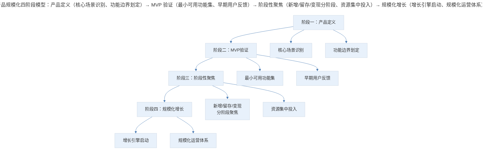
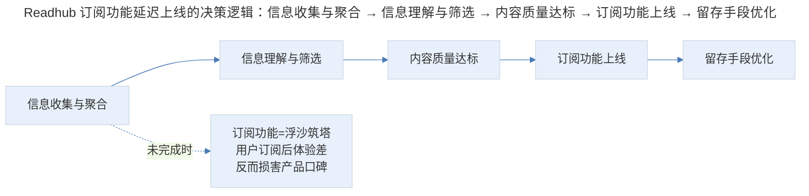
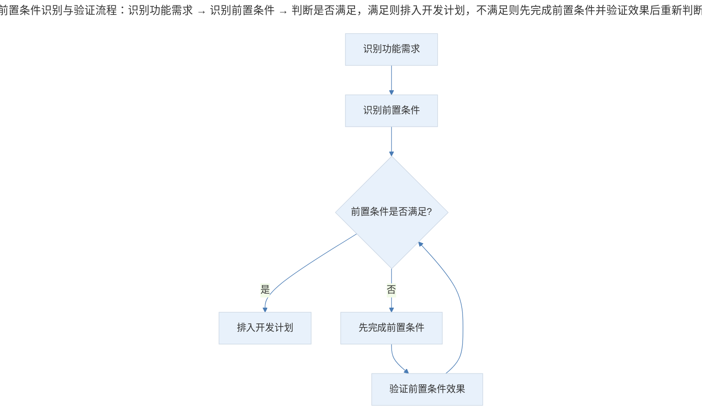

# 案例分析：规模化产品的构建路径与关键决策

## 1. 导言

"Readhub"是一款 TMT 领域资讯聚合阅读产品，"抽奖助手"是一款基于微信小程序的社交互动工具。两款产品均由无码科技团队打造，从零起步逐步积累了可观的用户规模。本案例聚焦于这两款产品从构思到规模化的完整路径，重点分析功能选择、时机判断与技术约束三大核心决策维度。

两款产品的核心差异在于：Readhub 定位为信息效率工具，强调内容质量与分发效率；抽奖助手定位为社交互动工具，强调传播裂变与增值变现。这种差异使得本案例能够覆盖不同产品类型在规模化过程中的共性与个性。

## 2. 分析框架：规模化的四阶段模型与功能选择

### 2.1 产品规模化的四阶段模型

> 产品规模化四阶段模型：产品定义（核心场景识别、功能边界划定）→ MVP 验证（最小可用功能集、早期用户反馈）→ 阶段性聚焦（新增/留存/变现分阶段、资源集中投入）→ 规模化增长（增长引擎启动、规模化运营体系）。

### 2.2 功能选择的决策框架

产品经理面对的真正难点不在于"想到"，而在于"选择"。需求列表永远是增长的，能加入其中的特性都有其价值和可行性，挑战在于从所有"正确"中挑出一个"合适"。

功能选择涉及两个维度：

| 决策维度 | 核心问题 | 判断标准 |
|---------|---------|---------|
| **特性的选择** | 做哪个功能？ | 与当前阶段性目标的匹配度 |
| **时机的选择** | 什么时候做？ | 前置条件是否已满足 |

## 3. 关键决策：时机判断、用户驱动与技术适配

### 3.1 功能时机判断：Readhub 订阅功能的延迟上线

Readhub 的订阅早报功能在产品刚有雏形时就已被讨论，上线后也有大量用户反馈希望有订阅功能，但团队选择延迟上线，直到整体信息质量达到一定标准之后才实施。

**决策逻辑**：在信息聚合质量未达标之前做订阅功能，等同于"浮沙筑塔"——如同攒钱买车，还没攒够首付就开始购买大量汽车用品，花的可是买车的钱。

> Readhub 订阅功能延迟上线的决策逻辑：信息收集与聚合 → 信息理解与筛选 → 内容质量达标 → 订阅功能上线 → 留存手段优化；若在信息质量未达标前上线订阅功能，等于"浮沙筑塔"，用户订阅后体验差反而损害产品口碑。

**决策原则**：功能上线的前提不是"用户需要"，而是"支撑该功能的基础条件已满足"。内容是一切的基础，在此基础之上才去考虑用产品手段提高用户留存。

### 3.2 用户驱动创新：抽奖助手"皮一下"功能的诞生

抽奖助手的"皮一下"功能并非团队最初设计，而是在迭代过程中，因大量用户反馈将抽奖助手当作与朋友互动的游戏工具，从而获得的启发。

**决策逻辑**：用户的实际使用方式往往超出产品设计者的预期。当大量用户以非预期方式使用产品时，产品经理需要判断：这种行为是否代表了真实需求？是否值得产品化？

| 用户行为类型 | 处理策略 | 案例 |
|------------|---------|------|
| 非预期使用且频次高 | 产品化支持 | "皮一下"功能 |
| 非预期使用但频次低 | 观察但不行动 | — |
| 预期使用且频次高 | 持续优化 | 一键复制功能 |
| 预期使用但频次低 | 评估是否保留 | — |

### 3.3 阶段性目标驱动：一键复制功能的产品逻辑

抽奖助手的"一键复制"功能诞生于团队集中发力做功能变现的产品阶段。在微信小程序的封闭环境中，许多抽奖发起者需要用文字描述的方式告知用户去哪里找到自己（如微信公众号或 App 下载链接），对用户来说体验很差。

**决策逻辑**：每一个做出来的特性不应是散落的点，而应基于某一阶段性目的做出集中性尝试。一个阶段性目的又应基于整体产品路径——出发点是路径和目的，而不是一个具体功能。

| 产品阶段 | 核心目标 | 功能投入方向 |
|---------|---------|------------|
| 阶段一 | 用户获取 | 新增相关功能、传播机制 |
| 阶段二 | 用户留存 | 内容质量、体验优化 |
| 阶段三 | 商业变现 | 增值功能、付费转化 |
| 阶段四 | 用户唤醒 | 推送机制、召回策略 |

一键复制功能属于阶段三（商业变现）的集中尝试之一，同期团队还做了大量增值产品变现的测试和尝试。

### 3.4 技术约束与产品适配

产品的实现始终受限于技术能力、平台规范和外部环境。抽奖助手的"点击跳转小程序"功能在微信支持小程序跳转能力之前无法实现；即使现在，也只能对联合绑定的小程序做跳转，无法跳转任意小程序。

**决策原则**：改变不了的限制，必须接受并与之共存。产品经理需要区分三类约束：

| 约束类型 | 应对策略 | 案例 |
|---------|---------|------|
| 可突破的技术约束 | 投入资源突破 | 性能优化 |
| 平台规范约束 | 等待平台开放或寻找替代方案 | 小程序跳转限制 |
| 环境约束 | 适配而非对抗 | 微信生态规则 |

### 3.5 信息架构演进：产品复杂度的必然增长

关于"得到"App 变得繁琐的讨论，涉及产品演进中的核心矛盾：内容丰富度与体验简洁性之间的平衡。

**核心观点**：一个教育类产品的血肉是内容，当内容增加时，势必需要设计恰当的信息架构（Information Architecture）来承托。如同图书馆，只有一本书时不需要检索系统，但藏书增多后，找书的体验可能变"繁琐"，而图书馆的价值却在增大。

| 产品阶段 | 内容规模 | 信息架构需求 | 体验特征 |
|---------|---------|------------|---------|
| 早期 | 几个专栏 | 极简，一两屏尽览 | 简洁 |
| 成长期 | 数十个专栏+课程 | 需要分类和推荐 | 开始复杂 |
| 成熟期 | 百级别内容+多品类 | 需要完整信息架构 | 复杂但有序 |

## 4. 经验提炼：从功能到路径的能力跃迁

### 4.1 产品路径优于单个功能

产品经理最重要的能力不是"想到好功能"，而是"在正确的时间做正确的功能"。这要求建立清晰的产品路径（Product Roadmap），并确保每个功能决策都服务于当前阶段的战略目标。

**关键原则**：功能是手段，路径是方向。脱离路径的功能，即使"正确"也不"合适"。

### 4.2 前置条件的识别与验证

功能上线前必须识别并验证其前置条件是否已满足。常见的陷阱是"用户需要所以我们就做"，而忽略了支撑该功能的基础设施是否到位。

> 前置条件识别与验证流程：识别功能需求 → 识别前置条件 → 判断是否满足，满足则排入开发计划，不满足则先完成前置条件并验证效果后重新判断。

### 4.3 用户非预期使用的价值挖掘

规模化产品的构建过程中，用户往往以非预期方式使用产品。这些"意外"使用方式中蕴含着真实需求。产品经理需要建立用户行为监测机制，识别高频非预期使用行为，并评估其产品化价值。

在 2024-2026 年的产品实践中，这一思路被进一步系统化。通过 Product Analytics 工具追踪用户行为路径（User Journey），识别非预期的高频行为模式，已成为产品发现（Product Discovery）的标准流程之一。

### 4.4 技术约束是产品设计的输入条件

技术约束不应被视为"需要克服的障碍"，而应作为产品设计的输入条件。产品经理需要在技术约束的边界内寻找最优解，而非假设技术约束不存在来设计"理想方案"。

### 4.5 产品复杂度管理的核心矛盾

产品规模化的必然结果是复杂度增长。产品经理需要在"内容丰富度"和"体验简洁性"之间找到动态平衡——不是一味追求简洁，而是在复杂度增长的同时，通过信息架构设计和交互优化来控制用户感知到的复杂度。

"极客时间"的内容和用户定位决定了它会更贴近职场教育，注重学习过程、完课率和学习内部奖励。这种产品定位决定了其信息架构的设计方向——宁可稍微繁琐，也要让用户找到体系化的优质内容，这才是核心价值。

## 5. 实践指南：规模化产品的关键决策清单

### 5.1 功能时机决策清单

- [ ] 支撑该功能的基础条件（内容质量、技术能力）是否已达标？
- [ ] 该功能是否服务于当前阶段的核心战略目标？
- [ ] 是否已识别并验证功能的前置条件？
- [ ] 是否有足够的技术与运营资源保障该功能顺利落地？

### 5.2 用户驱动创新决策清单

- [ ] 是否建立了用户行为监测机制（Product Analytics）？
- [ ] 是否识别出高频的非预期使用行为？
- [ ] 该行为是否代表了真实的用户需求？
- [ ] 是否评估了该行为产品化的成本与价值？

### 5.3 产品复杂度管理原则

- [ ] 是否认识到产品规模化的必然结果是复杂度增长？
- [ ] 是否通过信息架构设计来控制用户感知到的复杂度？
- [ ] 是否在内容丰富度与体验简洁性之间建立了动态平衡？
- [ ] 产品定位是否清晰地指导了信息架构的设计方向？

## 6. 进阶延展：当代实践与核心要点回顾

### 6.1 当代实践补充（2024-2026）

2024-2026 年，规模化产品的构建路径呈现以下演进：

- **产品发现（Product Discovery）的系统化**：用户非预期使用的价值挖掘已从"偶然发现"升级为系统化的产品发现流程，通过行为分析工具自动识别高频非预期行为（Cagan, 2023）。
- **平台开放与生态依赖**：小程序、平台型产品的技术约束正在因平台开放而缓解，但产品对平台的生态依赖（如流量、支付、审核政策）成为新的关键约束（Thomas, 2024）。
- **AI 辅助的信息架构演进**：随着产品内容规模的增长，AI 驱动的个性化推荐和信息组织成为控制复杂度的新手段，取代部分传统的信息架构设计（McKinsey, 2025）。

### 6.2 核心要点回顾

规模化产品的构建路径遵循"产品定义→MVP 验证→阶段性聚焦→规模化增长"四阶段模型，其中功能选择（做哪个）与时机判断（何时做）是两大核心决策维度。关键决策包括：Readhub 订阅功能延迟上线的"前置条件优先"原则、抽奖助手"皮一下"功能的用户驱动创新、一键复制功能的阶段性目标驱动、技术约束作为产品设计输入条件、以及内容丰富度与体验简洁性的动态平衡。核心启示是"产品路径优于单个功能"——功能是手段，路径是方向，脱离路径的功能即使"正确"也不"合适"。

---

## 参考资料（未核实）
> 注：以下条目为原始素材所附延伸文献，未逐条核实出处与真实性，仅供延伸参考。

- Cagan, M. (2017). *Inspired: How to create tech products customers love* (2nd ed.). Wiley.
- Gothelf, J., & Seiden, J. (2021). *Lean UX: Designing great products with agile teams* (3rd ed.). O'Reilly Media.
- Pichler, R. (2010). *Agile product management with Scrum: Creating products that customers love*. Addison-Wesley.
- Thomas, O. (2024). Platform dependence and product strategy in the super-app era. *Journal of Strategic Information Systems*, 33(1), 45-68.
- McKinsey & Company. (2025). *The state of AI in product development*. McKinsey Digital.