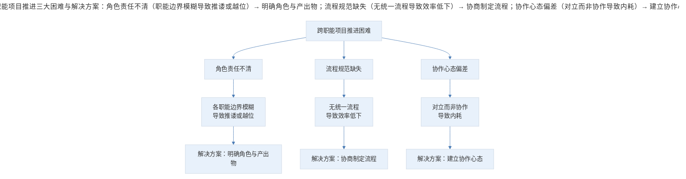
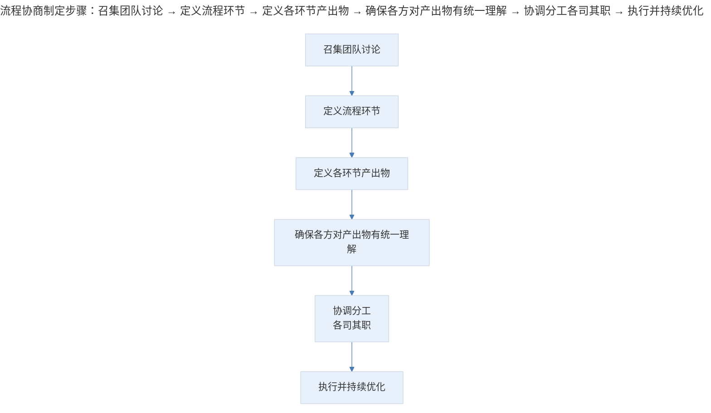
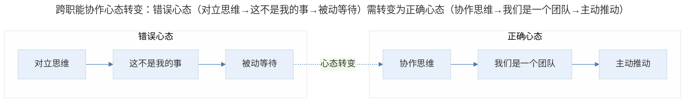

# 案例分析：跨职能项目推进的协作方法论

## 1. 导言

在产品从规划到发布的全过程中，作为立项人需要把握整个项目的节奏。然而，许多产品经理和运营人员在实际工作中面临一个普遍困境：没有项目管理经验，如何推动团队一起完成任务？尤其是在缺乏强制执行的标准流程规范的团队中，如何以非管理身份推进跨职能协作？

本案例源于一位运营人员作为立项人推进项目时的实际困境：产品岗位同事未能负起应有责任，导致立项人不得不代为执行产品工作，项目推进困难重重。通过分析这一典型场景，提炼跨职能项目推进的协作方法论。

## 2. 分析框架：跨职能协作的核心挑战与角色矩阵

### 2.1 跨职能协作的核心挑战

跨职能项目推进的困难，本质上不是"项目管理能力"的问题，而是三个更深层的问题：

> 跨职能项目推进三大困难与解决方案：角色责任不清（职能边界模糊导致推诿或越位）→ 明确角色与产出物；流程规范缺失（无统一流程导致效率低下）→ 协商制定流程；协作心态偏差（对立而非协作导致内耗）→ 建立协作心态。

### 2.2 角色责任矩阵

| 角色 | 核心职责 | 常见问题 | 正确姿态 |
|------|---------|---------|---------|
| **立项人** | 把控项目整体节奏、协调资源 | 越位执行其他职能工作 | 推动而非替代 |
| **产品经理** | 需求定义、方案设计 | 未能负起责任 | 承担而非推诿 |
| **设计师** | 交互与视觉设计 | 等待需求明确 | 主动参与需求讨论 |
| **工程师** | 技术实现 | 被动等待需求 | 主动评估可行性 |

## 3. 关键决策：协作推进的四项决策

### 3.1 决策一：帮助而非替代

案例中，立项人因产品岗位同事未能负起责任，而选择替代其执行产品工作。这一选择看似解决了短期问题，实际上造成了三个负面后果：

| 替代行为的后果 | 具体表现 |
|--------------|---------|
| **责任转移** | 被替代者永远学不会负责任，形成恶性循环 |
| **精力分散** | 立项人精力被分散到非本职工作，核心职责失焦 |
| **团队信任受损** | 其他成员对立项人的角色定位产生困惑 |

**正确策略**：帮助一个人的方法有很多——提醒、要求、建议，甚至换掉，但替他做事情并不是好方法。核心原则是"不要让自己的队友失败"——在心态上，不应想着打垮或取代队友，而应该帮助他负起自己的责任。

### 3.2 决策二：协商制定流程而非等待流程

案例中，团队缺乏强制执行的标准流程规范。立项人面临的选择是：等待公司建立流程，还是自己推动建立流程。

**决策**：由团队自己讨论和商定项目流程。

> 流程协商制定步骤：召集团队讨论 → 定义流程环节 → 定义各环节产出物 → 确保各方统一理解 → 协调分工各司其职 → 执行并持续优化。

**产出物的形式灵活适配**：需求产出物可以是 PRD（Product Requirements Document），可以是原型图，甚至可以是白板草图和口头描述——根据团队的情况达成一致即可，形式不重要，统一理解才重要。

### 3.3 决策三：运营作为立项人的合理性

**问题**：运营做立项人是否合适？

**决策**：合适。理由如下：

| 论据 | 具体内容 |
|------|---------|
| **职能边界不应僵化** | 并没有任何一件推动公司前进的事务能够泾渭分明地划分职能责任 |
| **用户视角优势** | 运营作为距离用户最近的人，可以更敏锐地感知用户需求 |
| **及时调整能力** | 在与各职能打交道时，可以及时调整产品细节 |
| **困难是普遍的** | 立项过程的困难对其他职能岗位同样存在，甚至因业务不通而更难 |

### 3.4 决策四：以热情驱动主动承担

案例中，立项人展现了"想把事情做成的热情"。这股热情如果成为支撑主动承担更多责任、解决团队问题的驱动力，将带来意想不到的收获。

**关键认知**：付出更多精力和时间，这些付出终会是值得的。在缺乏流程和规范的团队中，主动承担者往往能够获得更大的成长空间和影响力。

## 4. 经验提炼：协作核心原则与心态建设

### 4.1 "不要让自己的队友失败"原则

这一原则是跨职能协作的基石。其核心逻辑是：

| 协作模式 | 行为特征 | 结果 |
|---------|---------|------|
| **对抗模式** | 打垮队友、取代队友 | 团队内耗、项目失败 |
| **替代模式** | 替队友做事 | 队友永远学不会、自己精力分散 |
| **帮助模式** | 提醒、要求、建议队友 | 队友成长、团队协作改善 |

帮助模式的具体操作包括：

- **提醒**：在关键节点提醒队友其职责和交付时间
- **要求**：明确表达对队友交付物的期望和标准
- **建议**：提供专业建议，帮助队友提升工作质量
- **换人**：当队友确实无法胜任时，推动人员调整（这是帮助团队的最终手段）

### 4.2 流程自建方法论

在缺乏标准流程的团队中，产品经理/运营需要掌握"流程自建"的能力：

| 步骤 | 核心动作 | 关键要点 |
|------|---------|---------|
| 第一步 | 召集团队讨论 | 确保所有相关职能参与 |
| 第二步 | 定义流程环节 | 需求→方案→开发→测试→发布 |
| 第三步 | 定义各环节产出物 | PRD/原型/代码/测试报告 |
| 第四步 | 确保统一理解 | 所有参与者对产出物有一致认知 |
| 第五步 | 协调分工 | 各司其职、各尽其能 |
| 第六步 | 持续优化 | 根据执行反馈调整流程 |

### 4.3 跨职能协作的心态建设

> 跨职能协作心态转变：错误心态（对立思维→这不是我的事→被动等待）需转变为正确心态（协作思维→我们是一个团队→主动推动）。

**核心原则**：

1. 产品经理与开发工程师由于思维方式与关注领域的不同，产生逻辑上的不一致是难免的，但本质上依然是合作与共赢的关系
2. "兄弟阋于墙，外御其务"——关起门可能吵起来，但在做产品的时刻，依然是朝着同一个业务目标努力的兄弟
3. 产品经理并不需要说服开发的同事，而应该和工程师站在一起，把产品做好

### 4.4 非管理身份的领导力

本案例的核心启示是：推动项目不需要管理权限，需要的是领导力。非管理身份的领导力体现在：

1. **主动承担**：在没有人推动时，主动站出来推动事情发生
2. **流程建设**：在缺乏流程时，主动推动流程的建立
3. **协作促进**：在团队协作出现问题时，主动帮助而非替代
4. **热情驱动**：用"想把事情做成"的热情感染和带动团队

这种领导力不依赖于组织架构中的职位，而依赖于个人影响力和专业能力。在越来越多的扁平化组织中，这种非管理身份的领导力正成为产品经理的核心竞争力。

## 5. 实践指南：跨职能协作的应用要点

### 5.1 立项人的行动清单

- [ ] 是否明确了各职能角色的核心职责与边界？
- [ ] 是否推动团队协商制定了统一的项目流程与产出物？
- [ ] 面对队友未尽责时，是否选择了帮助而非替代？
- [ ] 是否以热情驱动主动承担，而非越位执行？
- [ ] 是否与团队成员建立了合作共赢的协作心态？

### 5.2 帮助模式的选择

| 场景 | 正确行动 | 错误行动 |
|------|----------|----------|
| 队友遗漏关键节点 | 提醒其职责与交付时间 | 代为完成其工作 |
| 队友交付质量不达标 | 明确表达期望与标准 | 默默返工 |
| 队友能力不足 | 提供专业建议与指导 | 越位包办 |
| 队友确实无法胜任 | 推动人员调整（最终手段） | 长期替代导致恶性循环 |

## 6. 进阶延展：当代演进与核心要点回顾

### 6.1 当代演进（2024-2026）

在当前的跨职能协作实践中，以下趋势值得关注：

| 协作要素 | 传统实践 | 2024-2026 年演进 |
|---------|---------|----------------|
| **项目管理** | 人工协调、会议驱动 | 异步协作工具（Notion、Linear）、AI 辅助排期 |
| **需求传递** | PRD 文档 | 交互式原型、可交互规格、AI 生成文档 |
| **进度追踪** | 周会汇报 | 实时看板、自动化状态更新 |
| **跨职能沟通** | 面对面会议 | 混合办公模式、异步视频沟通 |
| **决策机制** | 经验判断 | 数据驱动决策、A/B Testing |

### 6.2 核心要点回顾

跨职能项目推进的协作方法论围绕三大核心挑战展开：角色责任不清（通过明确角色与产出物解决）、流程规范缺失（通过协商制定流程解决）、协作心态偏差（通过建立协作心态解决）。四项关键决策包括：帮助而非替代（核心原则是"不要让自己的队友失败"）、协商制定流程（产出物形式灵活但统一理解重要）、运营作为立项人的合理性、以热情驱动主动承担。核心启示是"推动项目不需要管理权限，需要的是领导力"——通过主动承担、流程建设、协作促进与热情驱动，在扁平化组织中发挥非管理身份的领导力。

---

## 参考资料（未核实）
> 注：以下条目为原始素材所附延伸文献，未逐条核实出处与真实性，仅供延伸参考。

- Lencioni, P. (2002). *The five dysfunctions of a team: A leadership fable*. Jossey-Bass.
- Sutherland, J. (2014). *Scrum: The art of doing twice the work in half the time*. Crown Business.
- Anderson, D. J. (2010). *Kanban: Successful evolutionary change for your technology business*. Blue Hole Press.
- Senge, P. M. (2006). *The fifth discipline: The art and practice of the learning organization* (Rev. ed.). Doubleday.