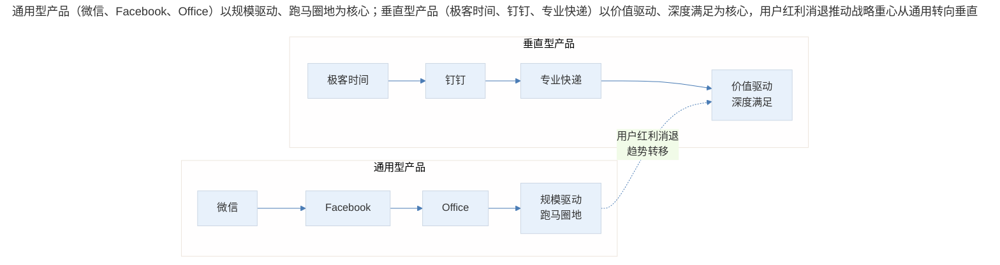
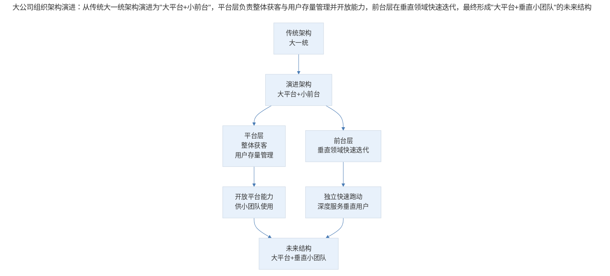
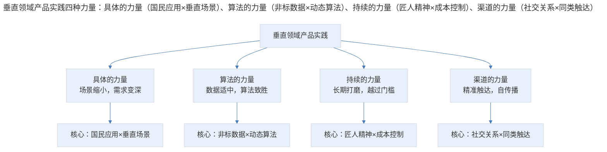
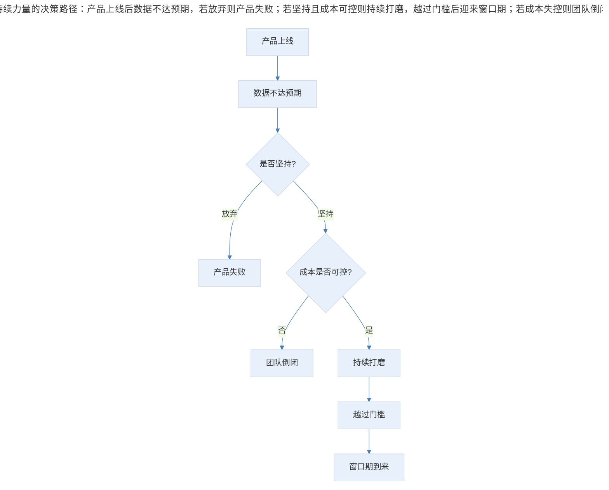
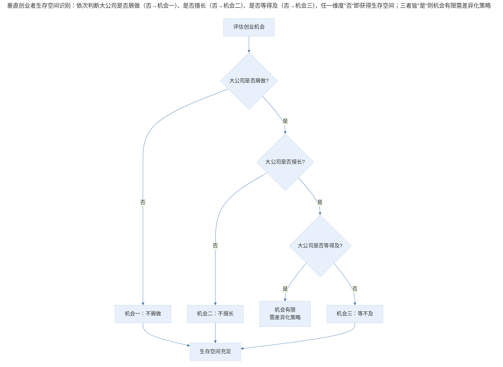
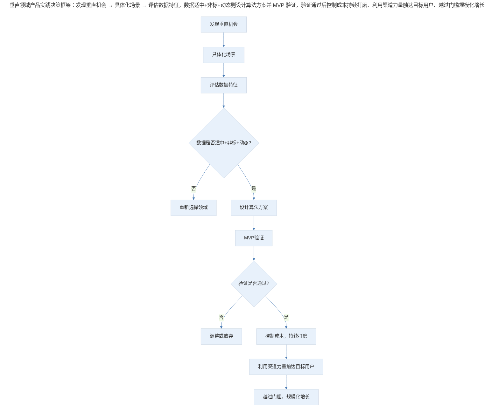

# 案例分析：通用型与垂直型产品的战略选择

## 1. 导言

在产品战略选择中，"面向大众的通用型产品"与"面向细分市场的垂直型产品"之间的博弈，是产品经理和创业者面临的核心战略问题。尤其是当创业者被问及"如果 BAT 也做和你一样的事情你怎么办"时，这一问题变得更加紧迫。

本案例基于 QCon 全球软件开发大会"产品经理必修之用户细分与产品定位"专题的主题演讲内容，第一部分分析通用型产品与垂直型产品在战略层面的差异及垂直领域创业者的生存空间（不屑做、不擅长、等不及），第二部分聚焦垂直领域产品的实践方法论——具体的力量、算法的力量、持续的力量与渠道的力量，形成完整的通用型与垂直型产品战略选择框架。

## 2. 分析框架：本质差异与市场环境变迁

### 2.1 通用型与垂直型产品的本质差异

通用型产品面向广阔市场，追求规模效应；垂直型产品面向细分市场，追求深度价值。二者的差异不仅体现在用户规模上，更体现在战略定位、竞争格局和执行策略上。

> 通用型产品（微信、Facebook、Office）以规模驱动、跑马圈地为核心；垂直型产品（极客时间、钉钉、专业快递）以价值驱动、深度满足为核心。用户红利消退推动战略重心从通用转向垂直。

### 2.2 市场环境的变化驱动战略重心转移

两个关键趋势正在改变通用型与垂直型产品的竞争格局：

| 趋势 | 具体表现 | 对战略的影响 |
|------|---------|------------|
| **用户红利减少** | 新增用户越来越少，获客成本越来越高 | 跑马圈地模式失效 |
| **人均 GDP 上升** | 用户从"有就行"转向"要好才行" | 品味和品质成为竞争力 |

当增量用户不再涌入，存量用户开始挑剔，整个市场的重心从"获取"转向"留存"。这意味着投入一元钱的决策逻辑发生变化：从投 SEM、买流量、做合作转向投留存、打磨产品、深入满足用户垂直需求。

## 3. 关键决策：垂直领域的生存空间与四种力量

### 3.1 决策一：寻找大公司"不屑做"的市场

大公司有用户、有钱、有能力超群的工程师，并且他们还不睡觉。正面对抗无异于以卵击石。但大公司有结构性盲区——市场规模天花板有限、年收入不够看的项目，大公司不屑于投入资源。

**案例**：某大公司内部一个产品线年收入一千万，团队再怎么努力也难以避免被拆掉的命运——因为另一个产品线一天就一千万。被拆的原因不是产品不好，而是市场小、规模小、收入低。

| 大公司不屑做的特征 | 判断标准 | 创业机会 |
|-----------------|---------|---------|
| 市场天花板有限 | 年收入上限在十亿级别以下 | 大公司不会投入资源 |
| 规模效应不明显 | 无法复用大公司基础设施 | 大公司架构不适配 |
| 短期回报不明显 | 需要长期投入才能见效 | 大公司等不及 |

### 3.2 决策二：寻找大公司"不擅长"的事情

大公司的架构和中间件追求统一，追求实施率最大化。为了让实施率尽可能广泛，中间件会做得极其抽象——而极其抽象的结果是，无法满足垂直领域特别细微的需求。

**案例**：想在一个相对特殊的订单结构中加字段或改表结构，负责中间件的团队会问"你这个收入能有多少？"——当收入还不及他们一天的收入时，这个需求就被否决了。

| 大公司不擅长的原因 | 具体表现 | 创业机会 |
|-----------------|---------|---------|
| 架构过于抽象 | 中间件无法适配特殊需求 | 细分场景的定制化方案 |
| KPI 驱动 | 实施率优先，非标需求被忽视 | 非标需求的深度满足 |
| 规模导向 | 小规模需求无经济性 | 小规模高价值需求 |

### 3.3 决策三：寻找大公司"等不及"的事情

大公司的高管面临极大的业绩压力——给你一个战场、一堆人，三个月没打下来就被换掉。在这种环境下，维持一个需要长期打磨的产品非常耗心力。

而在创业团队中，只要不倒闭，就可以持续打磨——三个月或六个月是可以算出来的，账上的钱除以花钱的速度，只要不超过就还有希望。

| 时间维度 | 大公司 | 创业团队 |
|---------|-------|---------|
| 评估周期 | 季度/半年 | 按月计算现金流 |
| 容错空间 | 极小，三个月不见效换人 | 可控，账面可支撑就有希望 |
| 长期投入 | 耗心力，随时可能被叫停 | 可持续，只要不倒闭 |
| 决策机制 | 层层审批，方向可能随时变化 | 扁平高效，方向稳定 |

### 3.4 大公司组织架构的演进趋势

大公司正在向"大平台+小前台"的组织架构转型——平台负责整体获客和用户存量运营，小团队在垂直领域快速跑动。

> 大公司组织架构演进：从传统大一统架构演进为"大平台+小前台"，平台层负责整体获客与用户存量管理并开放能力，前台层在垂直领域快速迭代，最终形成"大平台+垂直小团队"的未来结构。

**核心判断**：未来会是大的、广阔的、开放平台，加上一个一个垂直领域里面做垂直细分市场服务的小团队。大公司会变得更加开放，把自己的获客能力和用户存量开放出来，给能够在垂直领域提供更细致入微服务的创业团队或体内小团队更多机会。

### 3.5 垂直领域产品实践的四种力量

> 垂直领域产品实践四种力量：具体的力量（国民应用×垂直场景）、算法的力量（非标数据×动态算法）、持续的力量（匠人精神×成本控制）、渠道的力量（社交关系×同类触达）。

| 力量类型 | 核心逻辑 | 竞争优势来源 | 适用场景 |
|---------|---------|------------|---------|
| **具体的力量** | 场景缩小使问题简化，需求变深 | 通用产品无法覆盖的细分需求 | 垂直人群×通用场景 |
| **算法的力量** | 数据量适中+非标+动态 | 大公司不屑洗，小团队洗不过来 | 非结构化专业数据处理 |
| **持续的力量** | 长期打磨越过的门槛 | 大公司等不及的耐心 | 需要时间沉淀的产品 |
| **渠道的力量** | 社交关系的精准触达 | 同类人群的同类推荐 | 微信生态等社交平台 |

### 3.6 具体的力量：国民应用×垂直场景

将国民应用（如微信、快递等通用服务）与垂直场景交叉，可以发现通用产品无法覆盖的细分机会。

| 通用服务 | × 垂直场景 | 垂直产品 | 通用产品无法覆盖的原因 |
|---------|-----------|---------|---------------------|
| IM（即时通讯） | × 职场 | 钉钉 | 微信无法满足职场协同需求 |
| 快递 | × 医疗检验标本 | 检验标本专递 | 顺丰/韵达不处理标本特殊要求 |
| 资讯阅读 | × TMT 领域 | Readhub | 通用新闻客户端无法深度覆盖 TMT |

**Readhub 的实践**：当场景缩小到 TMT 领域时，许多在通用场景中极难实现的能力变得可行：

| 能力 | 通用场景难度 | TMT 垂直场景 | 差异原因 |
|------|-----------|-----------|---------|
| 标题筛选/鉴别/生成 | 极高（全品类新闻） | 可行（TMT 领域） | 场景缩小，可用神经网络训练模型 |
| 实体识别 | 极高（百万级实体） | 可行（TMT 公司有限） | 实体数量有限，甚至可手工计算 |
| 知识图谱 | 极高（全领域） | 可行（TMT 领域） | 领域边界清晰，关系可控 |
| 市值统一换算 | 不会做（太小众） | 可行（上市公司有限） | TMT 公司多为上市，有市值查询需求 |

**核心洞察**：当领域缩小到足够具体、足够小时，在垂直细分领域做事情就变成了相对简单的事，也可以把用户的需求满足得非常细致和具体。这种"具体的深度"是通用产品天然无法提供的。

### 3.7 算法的力量：非标数据×动态算法

在垂直领域中，非结构化专业数据的清洗和应用存在巨大的发展空间。大平台处理的是大量、尽可能通用的数据，而垂直领域可以找到更细致的处理方法。

垂直领域数据的三个特征：

| 特征 | 定义 | 竞争优势 |
|------|------|---------|
| **数据量适中** | 几万到十几万级别 | 大公司不屑于清洗，小团队人工洗不过来 |
| **数据非标** | 无法直接获取标准格式数据 | 能拿到的标准数据大公司也能拿 |
| **动态性强** | 数据不断变化 | 静态数据容易被爬取替代，动态数据需要持续算法处理 |

数据竞争的四象限模型：

|  | 数据量大 | 数据量小 |
|---|---------|---------|
| **动态性强/非标/专业深度高** | Q2：大平台有优势但深度不足 | **Q1：垂直团队机会** |
| **动态性弱/标准/专业深度低** | Q3：大平台绝对优势 | Q4：无竞争价值 |

**核心洞察**：大部分平台性企业位于左下角（数据量大但动态性弱），而垂直领域创业团队可能位于右上角（数据量适中但动态性强、专业度高）。整理好这些数据，就是与大厂竞争的地方。

### 3.8 持续的力量：匠人精神×成本控制

现在愿意秉持匠人精神持续打磨产品的团队越来越少——大公司催得急、股东催得急、竞争催得急，都想赶紧获客。增长黑客、朋友圈裂变、分销成为最火的话题，却很久没有人提出要看产品价值、看如何满足用户。

**问题诊断**：很多时候不是产品不好、场景不好、解决方案不好，而是没有等到它满足用户需求、真正发展起来成功的那一刻，过早地倒下了。

持续打磨的两个关键条件：

| 条件 | 说明 | 实践要点 |
|------|------|---------|
| **战略耐心** | 不被短期数据焦虑驱动，不被外界批评影响 | 微信最早发布时评价全是负面的 |
| **成本控制** | 控制团队规模，确保存活到窗口期到来 | 过早扩张=付不起工资=团队倒闭 |

> 持续力量的决策路径：产品上线后数据不达预期，若放弃则产品失败；若坚持且成本可控则持续打磨，越过门槛后迎来窗口期；若成本失控则团队倒闭。

**MVP 的正确理解**：MVP 很好，可以快速验证想法，但很多产品需要投入更长时间才能打磨到想要的程度。MVP 是验证工具，不是终态——验证通过后，还需要持续投入才能越过质量门槛。

### 3.9 渠道的力量：社交关系×同类触达

微信小程序的爆发，核心机制是：当为一个用户创造价值后，他可以帮你精准找到同类人群的位置。

| 环节 | 机制 | 效果 |
|------|------|------|
| 为用户创造价值 | 产品满足用户需求 | 用户产生分享意愿 |
| 用户社交圈同类聚集 | 产品经理的朋友圈多是产品经理 | 分享精准触达目标人群 |
| 同类用户转化 | 同类需求相似，转化率高 | 高效自传播 |

## 4. 经验提炼：生存空间识别与决策框架

### 4.1 垂直创业者的生存空间识别框架

面对"如果 BAT 也做和你一样的事情你怎么办"的问题，垂直领域创业者可以从三个维度识别生存空间：

| 维度 | 核心问题 | 识别方法 |
|------|---------|---------|
| **不屑做** | 这个市场是否太小，大公司看不上？ | 评估市场规模天花板 |
| **不擅长** | 这个需求是否太细，大公司架构不适配？ | 评估需求与标准化架构的匹配度 |
| **等不及** | 这个产品是否需要长期打磨？ | 评估产品达到用户满意的周期 |

> 垂直创业者生存空间识别：依次判断大公司是否屑做（否→机会一）、是否擅长（否→机会二）、是否等得及（否→机会三），任一维度"否"即获得生存空间；三者皆"是"则机会有限需差异化策略。

### 4.2 垂直领域产品实践的决策框架

> 垂直领域产品实践决策框架：发现垂直机会 → 具体化场景 → 评估数据特征，数据适中+非标+动态则设计算法方案并 MVP 验证，验证通过后控制成本持续打磨、利用渠道力量触达目标用户、越过门槛规模化增长。

### 4.3 从"跑马圈地"到"深度留存"的战略转型

| 战略阶段 | 核心逻辑 | 资源投入方向 | 竞争焦点 |
|---------|---------|------------|---------|
| 跑马圈地期 | 获取增量用户 | SEM、渠道合作、买流量 | 用户规模 |
| 过渡期 | 获取+留存并重 | 获客与留存均衡投入 | 规模+粘性 |
| 深度留存期 | 留住存量用户 | 产品打磨、垂直需求满足 | 用户价值 |

## 5. 实践指南：不同角色的行动建议与核心原则

### 5.1 不同角色的行动建议

| 角色 | 核心建议 | 具体策略 |
|------|---------|---------|
| **创业团队** | 从垂直具体场景入手，做足够尖锐的产品 | 两三人小团队快速做、快速打磨、快速优化 |
| **巨头** | 开放资源，赋能垂直团队 | 开放关系链和用户池（如微信小程序） |
| **巨头内小团队** | 争取足够长的时间窗口 | 物理隔离，不复用大团队中间件 |

### 5.2 给垂直领域产品经理的核心建议

1. **不要正面对抗巨头**，找到巨头不屑做、不擅长、等不及的缝隙
2. **深度满足用户需求**，在垂直领域做到极致，这是巨头无法复制的
3. **关注平台开放红利**，利用超级应用的基础设施降低获客成本
4. **保持战略耐心**，垂直产品的价值需要时间沉淀，不要被短期数据焦虑驱动
5. **建立数据壁垒**，垂直领域的数据积累是长期竞争力
6. **把自己作为匠人的心态重新拿出来**，付出耐心打磨产品，再稍微坚持一下

## 6. 进阶延展：AI 时代的战略演进与核心要点回顾

### 6.1 2024-2026 年的战略演进

在当前的市场环境中，通用型与垂直型产品的博弈呈现出新的特征：

| 维度 | 2018 年态势 | 2024-2026 年态势 |
|------|-----------|----------------|
| 用户红利 | 开始消退 | 基本消失 |
| 获客成本 | 持续上升 | 高企不下 |
| 垂直机会 | 初现端倪 | 大量涌现 |
| 平台开放度 | 小程序为主 | 多平台开放生态 |
| AI 赋能 | 未普及 | 垂直产品 AI 化成为新壁垒 |
| 超级应用 | 微信为主 | 微信+抖音+小红书多极 |

### 6.2 "具体的力量"在 AI 时代的放大效应

2024-2026 年，AI 技术的普及为"具体的力量"带来了新的放大效应。当场景足够具体时，AI 模型可以在小数据集上实现高精度——这与本案例中"场景缩小使问题简化"的逻辑完全一致。

| 传统垂直产品逻辑 | AI 时代的垂直产品逻辑 |
|----------------|-------------------|
| 场景缩小 → 需求变深 → 人工满足 | 场景缩小 → 数据变纯净 → AI 精准满足 |
| 人工标注和处理 | AI 自动识别和处理 |
| 几万到十几万数据是优势 | 小数据+AI = 垂直壁垒 |
| 算法是竞争壁垒 | 场景理解+数据+AI = 更高壁垒 |

**核心洞察**：AI 并没有消除"具体的力量"的价值，反而放大了它。因为 AI 的效果高度依赖数据的纯净度和场景的明确性——场景越具体，AI 效果越好。垂直领域产品经理对场景的深度理解，加上 AI 的执行能力，将产生比以往更强的竞争壁垒。

### 6.3 产品经理黄金时代的重新到来

当用资本和运营手段抢流量、抢用户的事情慢慢走向天花板时，行业会转过头来，希望把产品做得更好，用价值去保留用户、让用户留存。这时产品经理的价值才会真正发挥出来。

**核心论断**：产品经理的黄金时代将在未来重新到来。获客的边际效益递减，留存的边际价值递增——当获客成本高到一定程度时，产品力成为最核心的竞争力。

### 6.4 核心要点回顾

通用型与垂直型产品的战略选择包含两大维度：战略博弈（通用 vs 垂直的本质差异、市场环境变迁）与垂直实践（四种力量）。垂直领域创业者可通过"不屑做、不擅长、等不及"三维识别生存空间，并通过具体的力量（国民应用×垂直场景）、算法的力量（非标数据×动态算法）、持续的力量（匠人精神×成本控制）、渠道的力量（社交关系×同类触达）构建垂直产品竞争力。在 2024-2026 年，AI 放大"具体的力量"、多平台开放生态与垂直产品 AI 化重塑了竞争格局，而"场景具体化、数据是护城河、成本控制、战略耐心"的核心原则始终不变。当获客成本高企、留存的边际价值递增时，产品经理的黄金时代将重新到来。

---

## 参考资料（未核实）
> 注：以下条目为原始素材所附延伸文献，未逐条核实出处与真实性，仅供延伸参考。

- Christensen, C. M. (2016). *The innovator's dilemma: When new technologies cause great firms to fail*. Harvard Business Review Press.
- Porter, M. E. (1985). *Competitive advantage: Creating and sustaining superior performance*. Free Press.
- Ries, E. (2011). *The lean startup: How today's entrepreneurs use continuous innovation to create radically successful businesses*. Crown Business.
- Thiel, P. (2014). *Zero to one: Notes on startups, or how to build the future*. Crown Business.
- O'Reilly, T. (2017). *WTF?: What's the future and why it's up to us*. Harper Business.