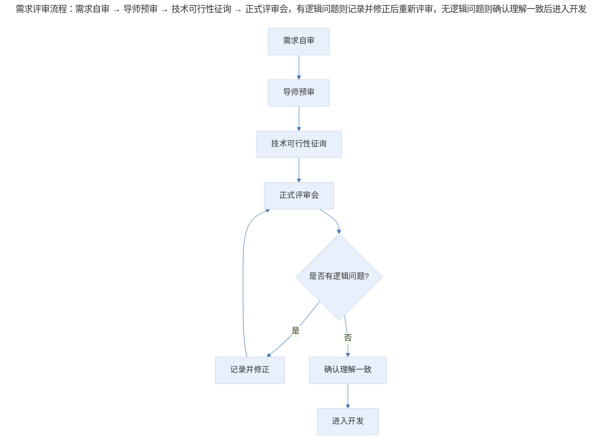
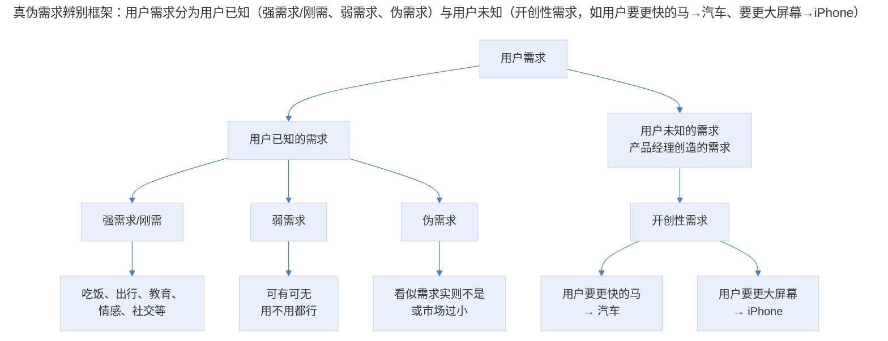
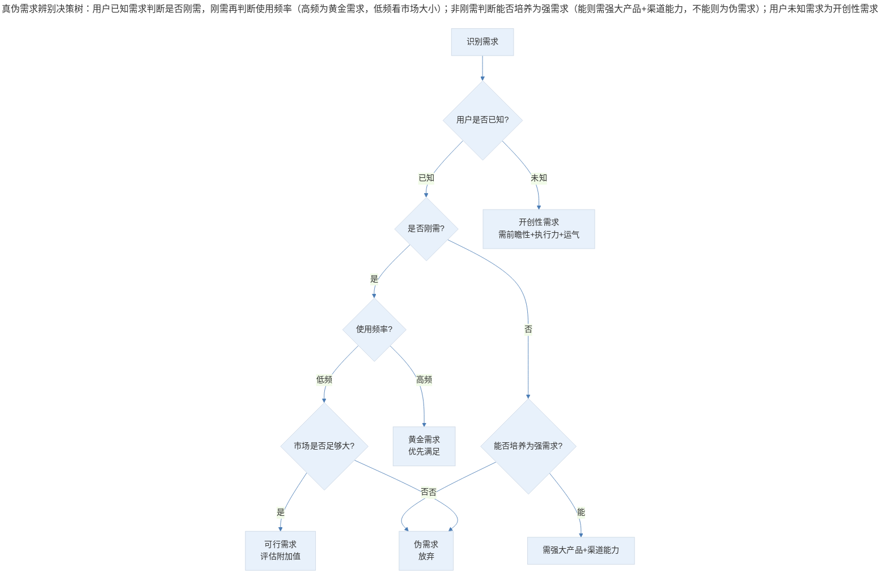

# 案例分析：需求评审的流程与真伪需求辨别

## 1. 导言

需求评审（Requirement Review）是产品开发流程中的关键环节，也是产品经理与开发工程师产生冲突的高频场景。产品新人常在评审会上被资深开发挑战至无言以对，会议陷入无休止的质疑；工程师发现需求逻辑不一致时不知如何处理；而"如何区分真需求与伪需求"更是产品经理面临的核心难题。

本案例从工程师与产品经理双重视角出发，分析需求评审的流程规范、逻辑冲突处理机制，以及真伪需求的辨别框架。

## 2. 分析框架：需求评审的流程规范与逻辑冲突

### 2.1 需求评审的流程规范

需求评审不是一场"辩论赛"，而是一个"对齐会"。其核心目标是确保所有参与者对需求的理解一致，而非说服对方接受自己的观点。

> 需求评审流程：需求自审 → 导师预审 → 技术可行性征询 → 正式评审会，有逻辑问题则记录并修正后重新评审，无逻辑问题则确认理解一致后进入开发。

### 2.2 逻辑不一致的分类与处理

需求评审中发现的"逻辑不一致"并非单一类型，需要分类处理：

| 逻辑不一致类型 | 定义 | 处理原则 |
|--------------|------|---------|
| UI 与交互逻辑不一致 | 界面表现与交互流程存在矛盾 | 必须修正，不可让步 |
| 后端业务逻辑不一致 | 业务处理规则存在矛盾 | 必须修正，不可让步 |
| UI 与业务逻辑不一致 | 界面表现与业务规则不匹配 | 必须修正，不可让步 |
| 新旧需求逻辑不一致 | 本次需求与已有产品逻辑冲突 | 需评估影响后决策 |

**核心原则**：逻辑上的不一致会引发很多问题，没有什么可以让步的——让步就是对产品和用户不负责任。真正需要平衡的是产品的实现效果、交互优化、功能改进与技术实现难度之间的取舍。

## 3. 关键决策：评审准备、真伪辨别与工程协作

### 3.1 决策一：逻辑问题零容忍，效果与成本可平衡

需求评审中存在两类问题，处理方式截然不同：

| 问题类型 | 处理方式 | 原因 |
|---------|---------|------|
| **逻辑不一致** | 零容忍，必须修正 | 逻辑错误会导致产品缺陷，影响用户体验 |
| **效果与成本权衡** | 协商取舍 | 需评估工程进度与功能实现的优先级 |

效果与成本权衡的具体决策维度：

| 权衡因素 | 倾向功能实现 | 倾向工程进度 |
|---------|------------|------------|
| 业务紧急度 | 高 | 低 |
| 用户影响面 | 大 | 小 |
| 技术复杂度 | 可控 | 过高 |
| 替代方案 | 无 | 有 |

### 3.2 决策二：产品新人的评审准备流程

产品新人在需求评审会上被挑战，根本原因不是"资历浅"，而是"准备不足"。不靠谱的需求不应该出现在评审会上——那只会给自己带来挫败感，并浪费所有人的时间。

| 步骤 | 核心动作 | 产出 |
|------|---------|------|
| 第一步：自审 | 检查需求是否达到产品目的、是否满足用户需求、逻辑是否有问题、技术是否可行 | 自审通过的需求 |
| 第二步：导师预审 | 与导师（直属上级或指定导师）交流，获取反馈 | 补充完善后的需求 |
| 第三步：技术征询 | 就技术实现拿不准的部分征求工程师意见 | 技术可行性确认 |
| 第四步：正式评审 | 一切准备妥当后发起评审会 | 评审通过的需求 |

**关键认知**：产品经理不需要说服开发同事，而应该和工程师站在一起把产品做好。如果大家觉得你是靠谱的人，自然乐意和你合作。工程师心疼的是被浪费的时间，痛恨的是不靠谱的需求——避免了这两点，就可能在一起做出优秀产品。

### 3.3 决策三：真伪需求的辨别框架

需求辨别是产品经理的核心能力。从大的层面，需求可分为两种：

> 真伪需求辨别框架：用户需求分为用户已知（强需求/刚需、弱需求、伪需求）与用户未知（开创性需求，如用户要更快的马→汽车、要更大屏幕→iPhone）。

### 3.4 需求强度与使用频率的二维判断

判断需求的真伪，不能仅看"是否刚需"，还需结合使用频率进行二维判断：

|  | 高频使用 | 低频使用 |
|---|---------|---------|
| **强需求** | 黄金需求（如社交、出行） | 需评估市场大小和附加值 |
| **弱需求** | 可培养为强需求（需强大产品+渠道能力） | 高概率为伪需求 |

**关键洞察**：一个刚需产品，如果半年用户才用一次，或一年完成一次交易，就需要看市场是否足够大、产品附加值是否足够高。如果答案是否定的，很可能是伪需求。市面上大部分产品都试图满足低频需求或伪需求，这就是创业公司相继消失的原因。

### 3.5 决策四：工程师懂产品的价值

技术人学习产品知识，有助于做出更好的产品。核心价值在于"跳出技术框，从更高维度考虑问题"。

**案例**：把两个盒子装到另一个看起来难装的盒子里——

| 思维方式 | 解决方案 | 效果 |
|---------|---------|------|
| 技术思维 | 把大盒子拆开搞大，研究如何塞进两个小盒子 | 复杂、低效 |
| 产品思维 | 把两个小盒子拆开或重新组装，像买东西把包装扔掉再放袋子里 | 简单、高效 |

**核心原则**：只有懂产品、业务和需求背景，才能做出不用技术就可以轻松解决问题的决策。技术人钻到牛角尖里，就是沿着一个技术问题一直求最优解，最终变得异常复杂。跳出技术思维，从产品思维或用户角度出发，可能找到不用技术的解决方案。

## 4. 经验提炼：评审三不原则与需求辨别决策树

### 4.1 需求评审的"三不原则"

| 原则 | 含义 | 实践要点 |
|------|------|---------|
| **不让步逻辑** | 逻辑不一致必须修正 | 逻辑错误是产品缺陷，不是权衡空间 |
| **不浪费他人时间** | 不靠谱的需求不上评审会 | 做好自审和预审，确保需求质量 |
| **不对立协作** | 产品与工程是合作关系 | 站在一起做产品，而非说服对方 |

### 4.2 真伪需求辨别的决策树

> 真伪需求辨别决策树：用户已知需求判断是否刚需，刚需再判断使用频率（高频为黄金需求，低频看市场大小）；非刚需判断能否培养为强需求（能则需强大产品+渠道能力，不能则为伪需求）；用户未知需求为开创性需求。

### 4.3 弱需求变强需求的条件

弱需求并非不可做，但需要满足特定条件：

| 条件 | 说明 | 案例 |
|------|------|------|
| **强大的产品能力** | 产品体验远超替代方案 | 微信替代短信 |
| **强大的渠道能力** | 能够触达并教育用户 | 支付宝通过红包教育用户 |
| **习惯培养周期** | 用户使用后形成依赖 | 短视频从"无聊看看"到"每天必刷" |

### 4.4 开创性需求的识别与创造

用户只是希望一匹更快的马，但想不到汽车；用户希望更大的屏幕和触摸笔，不会想到 iPhone 和 Android。能够创造出这种需求和产品的产品经理，都是开创时代的人——他们对技术、产业、趋势有很好的前瞻性，同时具备强大的执行能力，最后，运气都很好。

| 开创性需求特征 | 说明 |
|--------------|------|
| **用户无法表达** | 用户不知道自己需要什么 |
| **技术驱动** | 新技术使全新解决方案成为可能 |
| **范式转移** | 不是优化现有方案，而是创造全新方案 |
| **高风险高回报** | 成功者改变行业，失败者无人知晓 |

## 5. 实践指南：产品经理与工程师的协作原则

### 5.1 协作原则

1. **工程师应尊重产品经理的产品决策**，就像产品人员应相信工程师的技术决策
2. **产品经理应保持开放心态**，接受工程师从技术角度提出的建议
3. **双方共同的目标是做出好产品**，而非在评审会上"赢"对方
4. **逻辑问题零容忍**，效果与成本的权衡需要双方共同决策
5. **需求质量是评审效率的前提**，不靠谱的需求不应上评审会

### 5.2 评审准备清单

- [ ] 需求是否自审通过（达到产品目的、满足用户需求、逻辑无误、技术可行）？
- [ ] 是否已与导师预审并获取反馈？
- [ ] 拿不准的技术部分是否已征询工程师意见？
- [ ] 正式评审前是否已准备妥当？

## 6. 进阶延展：当代演进与核心要点回顾

### 6.1 当代演进（2024-2026）

在当前的产品开发实践中，需求评审的方式正在发生显著变化：

| 评审要素 | 传统实践 | 2024-2026 年演进 |
|---------|---------|----------------|
| **需求文档** | 长篇 PRD | 交互式原型+AI 生成规格 |
| **评审形式** | 全员会议 | 异步评审+关键节点同步 |
| **逻辑验证** | 人工检查 | AI 辅助逻辑一致性检测 |
| **需求优先级** | 主观判断 | RICE/ICE 等量化框架 |
| **真伪需求验证** | 经验判断 | 快速实验（Rapid Experimentation） |

### 6.2 核心要点回顾

需求评审是"对齐会"而非"辩论赛"，其流程规范为"自审→导师预审→技术征询→正式评审"。核心原则是"三不"：不让步逻辑（逻辑不一致必须修正）、不浪费他人时间（不靠谱需求不上评审会）、不对立协作（产品与工程是合作关系）。真伪需求辨别采用"用户已知（强/弱/伪需求）vs 用户未知（开创性需求）"框架，并结合需求强度与使用频率的二维判断。核心洞察是：一个刚需产品若低频使用，需评估市场大小与附加值，否则很可能是伪需求。在 2024-2026 年，交互式原型、异步评审、AI 逻辑验证与快速实验正在重塑需求评审实践。

---

## 参考资料（未核实）
> 注：以下条目为原始素材所附延伸文献，未逐条核实出处与真实性，仅供延伸参考。

- Cagan, M. (2017). *Inspired: How to create tech products customers love* (2nd ed.). Wiley.
- Christensen, C. M. (2016). *The innovator's dilemma: When new technologies cause great firms to fail*. Harvard Business Review Press.
- Krug, S. (2014). *Don't make me think, revisited: A common sense approach to Web usability* (3rd ed.). New Riders.
- Norman, D. A. (2013). *The design of everyday things: Revised and expanded edition*. Basic Books.