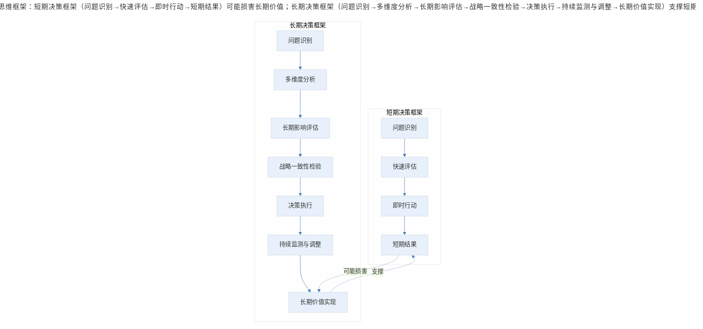
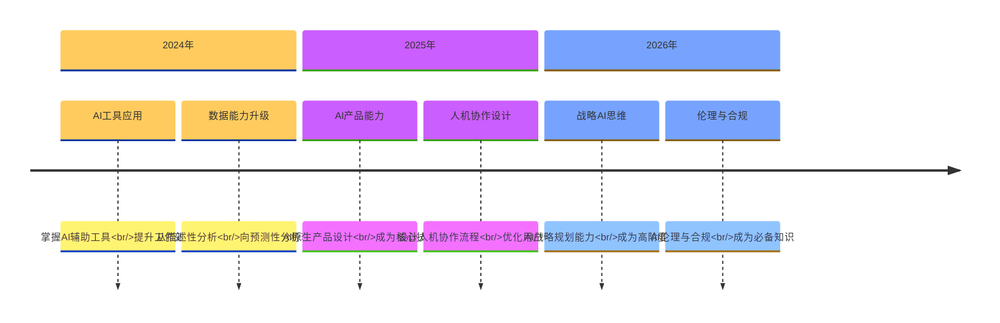
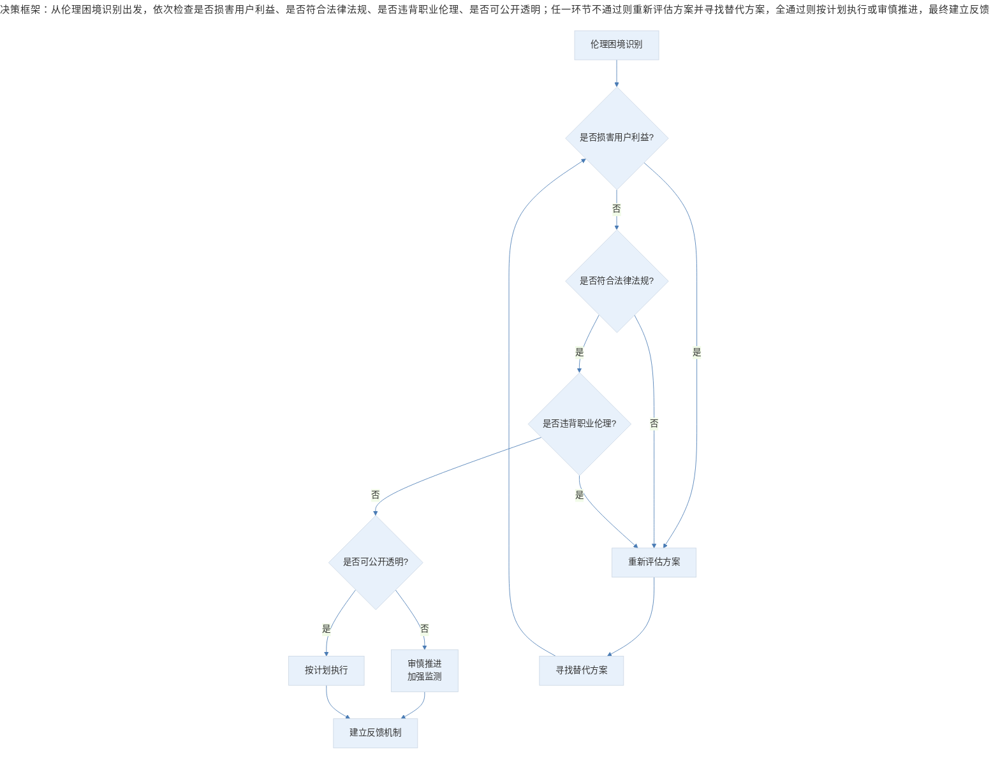

# 结语 | 产品经理的长期主义与职业素养

## 1. 导言

产品经理的职业发展是一个从技术能力向综合素养演进的过程。在掌握需求分析、产品设计、数据驱动等核心技能之后，产品经理面临的挑战逐渐从"如何做好产品"转向"如何在不确定性中坚持正确的事"。这种转变要求产品经理具备更深层次的职业素养——坚韧的心理素质、长期的战略视野、务实的商业意识。

本文将从三个维度探讨产品经理的长期主义与职业素养：坚韧力量与长期思维、商业意识与务实精神、职业伦理与价值坚守。同时，结合 2024-2026 年产品经理能力要求的演变趋势，分析 AI 时代产品经理的核心竞争力。

## 2. 核心概念：坚韧力量与长期思维

### 2.1 产品发展的非线性特征

产品发展遵循非线性规律，成功往往不是一蹴而就的直线进程。从产品生命周期理论（Product Life Cycle Theory）的视角观察，任何成功产品都经历过萌芽期的迷茫、成长期的波动、成熟期的挑战。那些最终取得成功的产品，其背后是团队在低谷期的坚守和在迷雾中的探索。

以知识付费领域为例，许多成功产品在上线初期都经历过数据低迷、市场质疑的阶段。这些产品之所以能够最终脱颖而出，关键在于团队对产品价值的坚定信念和对长期目标的持续投入。正如王兴所言："对未来有信心，才能对现在有耐心。"（王兴，2019）

### 2.2 长期思维框架

长期思维（Long-term Thinking）是产品经理的核心认知能力之一。它要求产品经理在决策时超越短期利益，从更长远的时间维度评估选择的价值。

> 长期思维框架：短期决策框架（问题识别→快速评估→即时行动→短期结果）可能损害长期价值；长期决策框架（问题识别→多维度分析→长期影响评估→战略一致性检验→决策执行→持续监测与调整→长期价值实现）支撑短期结果。

长期思维的核心要素包括：

**时间跨度延展**：将决策的时间维度从季度、年度延伸至三年、五年甚至更长的周期。当产品规划以二十年为预期时，决策者不会因错过个别热点而焦虑，也不会为短期利益做出损害长期价值的选择。

**终局思维**：从期望的终局状态倒推当前决策。如同跆拳道中劈木板的诀窍——着力点要在木板之后而非木板表面，产品经理需要向着更远的目标发力，才能击碎眼前的障碍。

**反脆弱设计**：在产品设计中融入反脆弱（Antifragile）理念，使产品能够从波动和压力中获益，而非仅仅具备抵抗风险的能力。

### 表1：短期思维与长期思维对比分析

| 决策维度 | 短期思维 | 长期思维 |
|---------|---------|---------|
| 时间跨度 | 季度/年度 | 三年/五年/十年 |
| 目标导向 | 即时结果 | 持续价值 |
| 风险态度 | 规避风险 | 管理风险 |
| 资源配置 | 满足当前需求 | 投资未来能力 |
| 竞争策略 | 跟随热点 | 建立护城河 |
| 用户关系 | 交易型 | 伙伴型 |
| 组织文化 | 结果导向 | 成长导向 |
| 失败认知 | 需要避免 | 学习机会 |

### 2.3 坚韧力量的培养

坚韧（Resilience）是产品经理在不确定性中前行的心理基础。坚韧力量的培养需要从认知重构和行为训练两个层面展开。

**认知重构**：将困难视为成长的必经过程，而非需要逃避的负面事件。理解"没有一马平川的胜利之路"的本质含义——如果成功之路平坦无阻，终点早已人满为患。困难的存在本身就是一种筛选机制，淘汰那些缺乏坚持能力的竞争者。

**行为训练**：建立面对挫折的标准化应对流程。包括情绪管理（接纳负面情绪）、问题分析（客观评估现状）、行动规划（制定应对方案）、资源调动（寻求支持帮助）四个步骤。

## 3. 关键方法：商业意识与务实精神

### 3.1 从理想主义到务实主义

产品经理群体中存在一种倾向：过度追求产品的"纯粹性"和"完美性"，而忽视商业现实的约束。这种理想主义倾向表现为对竞品的批判、对"低级"功能的排斥、对商业化的抵触。然而，通往理想的道路是由现实铺就的，只有活下来的人才有资格谈论愿景和使命。

柳传志曾指出："做成事情要有理想，但不可以理想化。"（柳传志，2008）这一原则同样适用于产品管理。产品经理需要在坚持底线的前提下，接受市场规则，在竞争中生存发展。

### 3.2 商业意识的内涵

商业意识（Business Acumen）是产品经理从"功能导向"向"价值导向"转变的关键能力。其核心内涵包括：

**成本收益思维**：在产品决策中始终关注投入产出比，理解每一项功能开发的成本和预期收益。

**市场敏感度**：对市场变化保持敏锐感知，能够识别市场机会和威胁，及时调整产品策略。

**竞争意识**：理解竞争格局，制定有效的竞争策略，在竞争中建立差异化优势。

**盈利模式理解**：深入理解产品的盈利逻辑，能够设计可持续的商业模式。

### 3.3 务实精神的实践原则

务实精神要求产品经理在理想与现实之间找到平衡点。其实践原则包括：

**接受不完美**：理解产品迭代是持续优化的过程，追求"足够好"而非"完美"。MVP（最小可行产品）思维的核心就是快速验证、持续迭代。

**尊重市场规律**：市场是检验产品价值的最终标准。产品经理需要放下主观偏好，以市场反馈为决策依据。

**底线坚守**：务实不等于无原则。产品经理需要在商业利益与用户价值、短期收益与长期信任之间保持平衡，坚守职业道德底线。

## 4. 实践落地：AI 时代产品经理能力演进

### 4.1 2024-2026 年产品经理能力要求变化

随着人工智能技术的快速发展，产品经理的能力要求正在发生深刻变化。从 2024 年到 2026 年，这一变化呈现出加速趋势。

> 产品经理能力演进时间线：2024 年（AI 工具应用、数据能力从描述性向预测性升级）→ 2025 年（AI 原生产品设计成为核心技能、人机协作设计）→ 2026 年（AI 战略规划成为高阶要求、AI 伦理与合规成为必备知识）。

### 表2：传统产品经理与 AI 时代产品经理能力对比

| 能力维度 | 传统产品经理 | AI 时代产品经理 |
|---------|-------------|---------------|
| 需求分析 | 用户访谈、问卷调研 | AI 辅助洞察、行为预测 |
| 产品设计 | 功能导向设计 | AI 原生设计、智能体验设计 |
| 数据分析 | 描述性分析、诊断分析 | 预测性分析、自动化洞察 |
| 技术理解 | 基础技术认知 | AI/ML 原理、模型能力边界 |
| 决策方式 | 经验驱动 | 数据+AI 辅助决策 |
| 竞争优势 | 功能差异化 | 智能化体验、数据资产 |
| 伦理意识 | 隐私保护 | AI 伦理、算法公平性 |

### 4.2 AI 时代核心能力构建

**AI 产品能力**：理解 AI 技术的应用场景和能力边界，能够设计 AI 原生产品（AI-Native Product）。这包括理解机器学习（Machine Learning）、自然语言处理（NLP）、计算机视觉（CV）等技术的应用潜力。

**人机协作设计**：设计有效的人机协作流程，平衡自动化与人工干预。理解何时应该由 AI 自主决策，何时需要人工介入，如何设计人机交互界面。

**AI 伦理意识**：关注 AI 产品的伦理问题，包括算法偏见、数据隐私、决策透明性等。确保 AI 产品的设计和应用符合伦理规范和法律法规。

**持续学习能力**：AI 技术发展迅速，产品经理需要建立持续学习的机制，跟踪技术前沿，更新知识体系。

## 5. 实践指南：产品经理职业伦理

### 5.1 职业伦理的核心原则

产品经理的职业伦理是长期主义的重要支撑。在商业利益与用户价值、短期目标与长期信任之间，产品经理需要坚守以下原则：

**用户价值优先**：在商业决策中始终将用户价值放在首位。短期商业利益不应以损害用户利益为代价。

**透明诚实**：对用户、对团队、对利益相关者保持透明和诚实。不隐瞒产品缺陷，不夸大产品能力。

**隐私保护**：尊重用户隐私，在数据收集和使用中遵循最小必要原则，获得用户明确授权。

**社会责任**：考虑产品对社会的影响，避免设计具有成瘾性、操纵性的功能。

### 5.2 伦理决策框架

当面临伦理困境时，产品经理可以运用以下决策框架：

> 伦理决策框架：从伦理困境识别出发，依次检查是否损害用户利益、是否符合法律法规、是否违背职业伦理、是否可公开透明；任一环节不通过则重新评估方案并寻找替代方案，全通过则按计划执行或审慎推进，最终建立反馈机制。

## 6. 进阶延展：长期主义的实践路径与核心要点回顾

### 6.1 个人层面

**能力复利投资**：将时间和精力投资于具有复利效应的能力建设，如系统思维、战略规划、领导力等。这些能力不会因技术迭代而贬值，反而会随着经验积累而增值。

**个人品牌建设**：通过持续输出高质量内容、参与行业交流、建立专业声誉，积累个人品牌资产。

**健康关系维护**：与用户、同事、合作伙伴建立长期信任关系，这些关系是职业发展的宝贵资产。

### 6.2 产品层面

**价值积累设计**：在产品设计中融入价值积累机制，使用户的使用时间越长，获得的价值越大。这包括数据积累、个性化优化、网络效应等。

**可持续商业模式**：设计能够长期可持续的商业模式，避免过度商业化损害用户体验和长期价值。

**技术债务管理**：平衡短期交付与长期架构，有计划地偿还技术债务，保持产品的可维护性和可扩展性。

### 6.3 组织层面

**团队文化建设**：在团队中倡导长期主义文化，建立鼓励探索、容忍失败、重视学习的组织氛围。

**人才梯队建设**：投资团队成员的成长，建立人才梯队，为组织的长期发展储备能力。

**知识资产沉淀**：建立知识管理体系，将个人经验转化为组织资产，实现知识的传承和复用。

### 6.4 结语与核心要点回顾

产品经理的职业发展是一场马拉松，而非短跑。坚韧的力量、长期的视野、务实的精神、职业的伦理，是支撑产品经理走完全程的核心素养。

在 AI 时代，产品经理的能力要求正在快速演变，但长期主义的价值不会改变。那些能够在不确定性中保持定力、在短期诱惑面前坚守长期价值、在商业现实中不忘理想追求的产品经理，终将在职业道路上走得更远、更稳。

"胸怀远大，心狠手辣"——这八个字概括了产品经理应有的精神气质：既要有远大的理想和格局，也要有务实的策略和执行力。理想指引方向，务实推动落地，两者缺一不可。

愿每一位产品经理都能在长期主义的道路上，做出不辜负用户、不辜负自己的产品。

---

## 参考资料（未核实）
> 注：以下条目为原始素材所附延伸文献，未逐条核实出处与真实性，仅供延伸参考。

- Taleb, N. N. (2012). *Antifragile: Things that gain from disorder* (1st ed.). Random House.
- Collins, J., & Porras, J. I. (1994). *Built to last: Successful habits of visionary companies* (1st ed.). HarperBusiness.
- Christensen, C. M. (2016). *The innovator's dilemma: When new technologies cause great firms to fail* (Reprint ed.). Harvard Business Review Press.
- Thiel, P., & Masters, B. (2014). *Zero to one: Notes on startups, or how to build the future* (1st ed.). Crown Business.
- Bezos, J. (2021). Invent and wander: The collected writings of Jeff Bezos. *Harvard Business Review Press*.
- Davenport, T. H., & Ronanki, R. (2018). Artificial intelligence for the real world. *Harvard Business Review, 96*(1), 108-116.
- McAfee, A., & Brynjolfsson, E. (2017). *Machine, platform, crowd: Harnessing our digital future* (1st ed.). W. W. Norton & Company.
- Furr, N., & Dyer, J. (2014). *The innovator's method: Bringing the lean start-up into your organization* (1st ed.). Harvard Business Review Press.
- 王兴. (2019). 王兴访谈录：对未来有信心，才能对现在有耐心. *财经杂志*, (15), 42-48.
- 柳传志. (2008). 联想之道：做成事情要有理想，但不可以理想化. *中国企业家*, (8), 56-61.