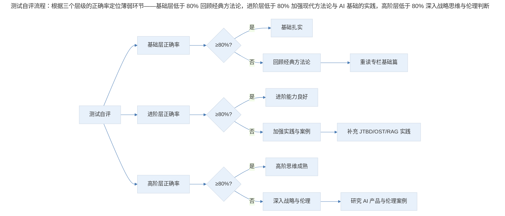

# 结课测试 | 关于产品的这些知识，你都掌握了吗？

## 1. 导言

> **更新说明**：本文档于 2026-06 更新，主要更新点：原测试链接已失效，改为直接在文档中编写完整测试题；题目从原 7 单选 + 3 多选扩展为 10 单选 + 5 多选；新增 AI 时代产品经理、现代方法论（JTBD、OST、RICE/WSJF）、产品伦理法规、新工具（Figma、Notion、Mermaid）等考点；每道题附答案与详细解析；增加专业深度分层与 Mermaid 知识体系图谱。

本测试覆盖产品经理核心知识体系，从需求分析、优先级管理、产品规划到 AI 时代新能力，共 10 道单选题与 5 道多选题。题目设计遵循基础层/进阶层/高阶层三级深度，既检验对经典方法论的理解，也考察对 AI 时代新工具、新伦理、新范式的掌握。建议独立完成后再对照答案解析，查漏补缺。

## 2. 核心概念：知识体系总览

```mermaid
---
title: 产品经理知识体系六大模块：产品分析方法论（利益相关者分析、JTBD、OST、用户故事地图）、需求管理（RICE、WSJF、Feature Flag、MVP/MLP）、AI 时代产品能力（Prompt Engineering、RAG、大模型应用设计、AI 产品评估指标）、产品文档与工具（Figma、Notion、Mermaid、PRD 最佳实践）、产品伦理（暗黑模式法规、AI 伦理、Humane Technology、数据隐私合规）、产品规划与战略（OKR、双轨敏捷、Lean Startup、产品路线图）
---
%%{init: {"theme": "base", "themeVariables": {"primaryColor": "#E8F1FB", "lineColor": "#4A7CB5"}}}%%
graph TD
    A["产品经理知识体系"] --> B["产品分析方法论"]
    A --> C["需求管理"]
    A --> D["AI 时代产品能力"]
    A --> E["产品文档与工具"]
    A --> F["产品伦理"]
    A --> G["产品规划与战略"]
    B --> B1["利益相关者分析"]
    B --> B2["JTBD"]
    B --> B3["Opportunity Solution Tree"]
    B --> B4["用户故事地图"]
    C --> C1["RICE 优先级"]
    C --> C2["WSJF"]
    C --> C3["Feature Flag"]
    C --> C4["MVP 与 MLP"]
    D --> D1["Prompt Engineering"]
    D --> D2["RAG 架构"]
    D --> D3["大模型应用设计"]
    D --> D4["AI 产品评估指标"]
    E --> E1["Figma 协作"]
    E --> E2["Notion 文档"]
    E --> E3["Mermaid 图表"]
    E --> E4["PRD 最佳实践"]
    F --> F1["暗黑模式法规"]
    F --> F2["AI 伦理"]
    F --> F3["Humane Technology"]
    F --> F4["数据隐私合规"]
    G --> G1["OKR"]
    G --> G2["双轨敏捷"]
    G --> G3["Lean Startup"]
    G --> G4["产品路线图"]
```

> 产品经理知识体系六大模块：产品分析方法论（利益相关者分析、JTBD、OST、用户故事地图）、需求管理（RICE、WSJF、Feature Flag、MVP/MLP）、AI 时代产品能力（Prompt Engineering、RAG、大模型应用设计、AI 评估指标）、产品文档与工具（Figma、Notion、Mermaid、PRD 实践）、产品伦理（暗黑模式法规、AI 伦理、Humane Technology、数据隐私合规）、产品规划与战略（OKR、双轨敏捷、Lean Startup、产品路线图）。

**图表解读**：产品经理知识体系分为六大模块。产品分析方法论是基础，需求管理是日常核心工作，AI 时代产品能力是 2023 年以来的新增重点，产品文档与工具是落地手段，产品伦理是底线思维，产品规划与战略是高阶能力。各模块之间相互关联，构成完整的能力矩阵。

## 3. 关键方法：单选题（共 10 题，每题 5 分，共 50 分）

### 第 1 题【基础层·产品分析方法论】

在利益相关者分析中，"高影响力 + 低兴趣"的利益相关者应采取哪种管理策略？

A. 重点管理，密切沟通
B. 保持满意，定期告知
C. 监控即可，最低限度沟通
D. 积极参与，纳入决策

**答案：B**

**解析**：根据利益相关者矩阵（影响力 × 兴趣度），"高影响力 + 低兴趣"的利益相关者被称为"令其满意"（Keep Satisfied）群体。他们虽然对项目兴趣不高，但拥有较大影响力，一旦被忽视可能造成重大阻碍。因此应保持满意、定期告知，确保他们不会成为阻力，但也不必过度占用其时间。选项 A 对应"高影响力 + 高兴趣"的核心利益相关者；选项 C 对应"低影响力 + 低兴趣"的监控群体；选项 D 会导致资源浪费。

### 第 2 题【基础层·需求管理】

RICE 优先级框架中，"R"代表的是什么？其计算方式是？

A. Revenue（收入），计算方式为：收入 × 影响力 × 信心度 ÷ 工作量
B. Reach（触达），计算方式为：触达人数 × 影响力 × 信心度 ÷ 工作量
C. Risk（风险），计算方式为：风险值 × 影响力 × 信心度 ÷ 工作量
D. Return（回报），计算方式为：回报率 × 影响力 × 信心度 ÷ 工作量

**答案：B**

**解析**：RICE 是 Intercom 提出的需求优先级框架，四个维度分别是：Reach（触达人数，每季度受影响的用户数）、Impact（影响力，0.25-3 分制，即 0.25/0.5/1/2/3 五档）、Confidence（信心度，百分比）、Effort（工作量，人月）。RICE 得分 = (Reach × Impact × Confidence) ÷ Effort。得分越高，优先级越高。RICE 的优势在于将主观判断量化，减少"谁声音大听谁的"问题。

### 第 3 题【进阶层·产品分析方法论】

Jobs-to-be-Done（JTBD）框架的核心思想是什么？

A. 用户购买产品是为了获得产品的功能特性
B. 用户"雇佣"产品是为了完成某个特定任务或达成某个目标
C. 产品的竞争力取决于其技术指标的优越性
D. 用户忠诚度主要由价格和品牌决定

**答案：B**

**解析**：JTBD 框架由 Clayton Christensen 提出，核心思想是：用户不是在购买产品，而是在"雇佣"产品来完成某个任务（Job）。经典的奶昔案例说明：早上通勤的顾客"雇佣"奶昔是为了在漫长车程中有事可做且不弄脏手，而不是因为奶昔的味道。这一框架帮助产品经理跳出功能竞争的思维定式，从用户真正要完成的任务出发思考产品价值。

### 第 4 题【进阶层·产品规划】

双轨敏捷（Dual-Track Agile）中，Discovery 轨道和 Delivery 轨道的关系是？

A. Discovery 完成后才能进入 Delivery，严格串行
B. 两条轨道完全独立，互不影响
C. 两条轨道并行运行，Discovery 为 Delivery 提供经验证的需求，Delivery 的反馈反哺 Discovery
D. Discovery 是 Delivery 的子集，属于同一个迭代周期内的不同阶段

**答案：C**

**解析**：双轨敏捷由 Marty Cagan 推广，核心思想是产品团队同时运行两条轨道：Discovery（探索）轨道通过快速实验验证需求假设，产出经验证的产品待办项；Delivery（交付）轨道负责将已验证的需求构建并交付为可工作的软件。两条轨道并行而非串行，Discovery 的产出持续流入 Delivery，Delivery 的用户反馈又反哺 Discovery 的新假设。

### 第 5 题【进阶层·AI 时代产品能力】

在基于大语言模型的产品中，RAG（Retrieval-Augmented Generation）架构的主要作用是？

A. 减少模型参数量以降低推理成本
B. 通过检索外部知识库增强模型回答的准确性和时效性
C. 用强化学习替代监督学习来训练模型
D. 将多模态输入统一转换为文本格式

**答案：B**

**解析**：RAG（检索增强生成）是 2023-2025 年大模型应用的主流架构模式。其核心思路是：在用户提问后，先从外部知识库（如企业文档、数据库）中检索相关内容，再将检索结果作为上下文与用户问题一起输入大模型，让模型基于检索到的事实生成回答。RAG 解决了大模型的三个关键问题：知识截止日期（时效性）、幻觉（准确性）、私有数据访问（定制性）。

### 第 6 题【基础层·产品文档与工具】

在 Figma 中，"Component"与"Variant"的核心区别是？

A. Component 是静态的，Variant 是动态的
B. Component 是可复用的设计元素，Variant 是同一 Component 的不同状态或版本
C. Component 用于开发交付，Variant 仅用于设计展示
D. Component 只能包含文本，Variant 只能包含图形

**答案：B**

**解析**：Figma 的 Component 是可复用的设计元素（如按钮、卡片），创建后可在多处实例化，修改主组件则所有实例同步更新。Variant 是同一 Component 的不同状态或版本（如按钮的默认态、悬停态、禁用态），它们被组织在同一个 Component Set 中，方便在设计时切换状态。Variant 的引入解决了早期 Figma 中同一组件不同状态散落各处、难以管理的问题。

### 第 7 题【高阶层·产品伦理】

欧盟《数字服务法》（DSA，2022 年生效）对在线平台暗黑模式的核心规定是？

A. 允许使用暗黑模式，但需在隐私政策中声明
B. 禁止使用欺骗性设计模式，特别是诱导用户做出非自愿选择的设计
C. 仅禁止针对未成年人的暗黑模式，成年人不受保护
D. 要求平台对暗黑模式进行 A/B 测试后再决定是否使用

**答案：B**

**解析**：欧盟 DSA 第 25 条明确规定：在线平台不得以欺骗、操纵或扭曲用户行为的方式设计、组织或运营其界面，特别是不得使用暗黑模式来诱导用户做出非自愿的选择。这一规定覆盖所有用户，不仅限于未成年人。违反者可能面临高达全球年营业额 6% 的罚款。

### 第 8 题【进阶层·需求管理】

WSJF（Weighted Shortest Job First）框架中，"Time Criticality"维度衡量的是？

A. 功能的技术实现难度
B. 需求对业务时间窗口的敏感程度
C. 用户对该功能的满意度
D. 开发团队的工作负荷

**答案：B**

**解析**：WSJF 是 SAFe（Scaled Agile Framework）中的优先级框架，公式为：WSJF = (User/Business Value + Time Criticality + Risk Reduction/Opportunity Enablement) ÷ Job Size。其中 Time Criticality 衡量的是需求对业务时间窗口的敏感程度——例如，法规合规需求通常 Time Criticality 很高（必须在法规生效前完成），而某些优化类需求则 Time Criticality 较低。

### 第 9 题【高阶层·AI 时代产品能力】

在设计 AI 对话产品时，"Prompt Engineering"中"Few-Shot Prompting"的含义是？

A. 不提供任何示例，让模型自由生成
B. 在提示词中提供少量示例，引导模型理解期望的输出格式和逻辑
C. 限制模型只能生成少量回答
D. 使用少量训练数据微调模型

**答案：B**

**解析**：Few-Shot Prompting 是 Prompt Engineering 的核心技术之一，指在提示词中提供 2-5 个示例（input-output 对），让大模型通过上下文学习（in-context learning）理解期望的输出格式、风格和推理逻辑。与之对应的还有 Zero-Shot（不提供示例）和 One-Shot（提供一个示例）。Few-Shot 的优势在于无需修改模型参数即可显著提升输出质量。

### 第 10 题【高阶层·产品规划】

Opportunity Solution Tree（OST）中，从"Desired Outcome"到"Opportunity"的推导，最核心的方法是？

A. 直接从竞品功能列表中选取
B. 通过用户研究（访谈、观察等）发现用户在达成目标过程中的痛点、障碍和未满足需求
C. 由技术团队根据技术可行性提出
D. 通过 A/B 测试数据自动生成

**答案：B**

**解析**：Opportunity Solution Tree 由 Teresa Torres 提出，是产品发现的结构化方法。树的最顶层是 Desired Outcome（期望成果），第二层是 Opportunity（机会，即用户在达成目标过程中遇到的痛点、障碍或未满足需求），第三层是 Solution（解决方案），最底层是 Experiment（实验）。从 Outcome 到 Opportunity 的推导，最核心的方法是持续的用户研究——通过访谈、观察、日记研究等方法，深入理解用户的行为、痛点和需求。

## 4. 实践落地：多选题（共 5 题，每题 10 分，共 50 分；多选少选均不得分）

### 第 11 题【基础层·产品分析方法论】

以下哪些属于麦金泰尔在《追寻美德》中关于"内在快乐"的特征？（多选）

A. 存在于特定实践之中，无法被其他实践替代
B. 可以通过除该实践之外的其他方式获得
C. 与实践本身有必然联系
D. 仅仅依赖外界的奖励和认可

**答案：A、C**

**解析**：麦金泰尔将快乐分为内在与外在两种。内在快乐的核心特征是：它存在于特定实践之中（选项 A），与实践本身有必然联系（选项 C），无法被其他实践替代。例如，国际象棋带来的战略思维满足感，无法通过玩其他游戏获得。选项 B 和 D 描述的是外在快乐的特征。产品经理需要区分这两种快乐，因为当外在快乐成为唯一驱动力时，就容易催生暗黑模式等伦理问题。

### 第 12 题【进阶层·AI 时代产品能力】

在设计基于大语言模型的 AI 产品时，以下哪些做法有助于减少模型"幻觉"（Hallucination）？（多选）

A. 采用 RAG 架构，将检索到的外部知识作为上下文输入模型
B. 在提示词中明确要求模型"如果不确定，请回答不知道"
C. 增大模型的 Temperature 参数值
D. 对模型输出进行事实性校验，设置置信度阈值

**答案：A、B、D**

**解析**：选项 A：RAG 架构通过检索外部知识库为模型提供事实依据，显著降低幻觉概率；选项 B：在提示词中设置"不确定时回答不知道"的指令，可以让模型在缺乏足够信息时选择拒绝回答而非编造；选项 D：对模型输出进行事实性校验（如与知识库比对、使用另一个模型交叉验证），设置置信度阈值。选项 C 错误：Temperature 参数控制输出的随机性，增大 Temperature 反而会增加幻觉的概率。

### 第 13 题【进阶层·产品伦理】

以下哪些属于当前全球范围内对暗黑模式的法律或监管措施？（多选）

A. 欧盟《数字服务法》（DSA）禁止在线平台使用欺骗性设计
B. 美国 FTC 对暗黑模式违规企业开出罚单
C. 中国《互联网信息服务算法推荐管理规定》禁止算法推荐中的不公平行为
D. 全球统一禁止所有 A/B 测试

**答案：A、B、C**

**解析**：选项 A：欧盟 DSA 第 25 条明确禁止暗黑模式，这是目前全球最明确的法律规定之一；选项 B：美国 FTC 在 2022-2024 年间多次对使用暗黑模式的企业采取执法行动；选项 C：中国 2022 年实施的《互联网信息服务算法推荐管理规定》要求算法推荐服务提供者不得利用算法实施大数据杀熟等不公平行为。选项 D 错误：A/B 测试本身是中性的研究方法，监管针对的是欺骗性设计而非测试方法。

### 第 14 题【高阶层·产品规划与战略】

关于 OKR（Objectives and Key Results），以下哪些说法是正确的？（多选）

A. Objective 应当是定性的、有启发性的方向描述
B. Key Results 应当是可量化的、可衡量的结果指标
C. OKR 应当与绩效考核和薪酬直接挂钩
D. OKR 鼓励设定有挑战性的目标，完成 70% 即可视为成功

**答案：A、B、D**

**解析**：选项 A：Objective 是定性的方向描述，应当有启发性和挑战性；选项 B：Key Results 是可量化的结果指标；选项 D：OKR 的理念是设定"拉伸目标"（stretch goals），完成 70% 左右即视为成功。选项 C 错误：这是 OKR 实践中最常见的误区。John Doerr 明确指出，OKR 不应与绩效考核和薪酬直接挂钩，否则会导致目标保守化。OKR 应与绩效评估分离。

### 第 15 题【高阶层·综合能力】

以下哪些是 AI 时代产品经理相比传统产品经理需要新增或强化的核心能力？（多选）

A. 对用户真实问题的深度共情与洞察
B. 评估 AI 模型输出质量与可靠性的能力
C. 在模糊和不确定条件下做出判断的勇气
D. 熟练编写 Python 机器学习训练代码的能力

**答案：A、B、C**

**解析**：选项 A：AI 时代，产品经理更需要深度共情；选项 B：AI 产品经理需要评估模型输出的质量（如幻觉率、相关性、一致性）；选项 C：AI 产品的不确定性远高于传统软件产品，产品经理需要在模糊条件下做出判断。选项 D 错误：产品经理不需要编写机器学习训练代码——这是数据科学家和 ML 工程师的职责。产品经理需要理解 AI 的基本原理和局限性，但不需要成为 AI 工程师。

## 5. 实践指南：答题自评与知识图谱

完成测试后，请根据以下维度进行自评：

> 测试自评流程：根据三个层级的正确率定位薄弱环节——基础层低于 80% 回顾经典方法论，进阶层低于 80% 加强现代方法论与 AI 基础的实践，高阶层低于 80% 深入战略思维与伦理判断。

**图表解读**：根据三个层级的正确率定位薄弱环节。基础层低于 80% 需回顾经典方法论；进阶层低于 80% 需加强现代方法论与 AI 基础的实践；高阶层低于 80% 需深入战略思维与伦理判断。三个层级层层递进，建议先补基础再攻高阶。

### 5.1 各层级知识点速查

**基础层**

| 要点 | 说明 | 对应题号 |
|------|------|----------|
| 利益相关者分析 | 影响力 × 兴趣度矩阵，四种管理策略 | 第 1 题 |
| RICE 优先级 | Reach × Impact × Confidence ÷ Effort | 第 2 题 |
| 内在/外在快乐 | 麦金泰尔《追寻美德》的核心区分 | 第 11 题 |

**进阶层**

| 要点 | 说明 | 对应题号 |
|------|------|----------|
| JTBD 框架 | 用户"雇佣"产品完成任务 | 第 3 题 |
| 双轨敏捷 | Discovery 与 Delivery 并行协同 | 第 4 题 |
| RAG 架构 | 检索增强生成，解决幻觉与时效性 | 第 5 题 |
| Figma Component/Variant | 设计系统的基础构建方式 | 第 6 题 |
| WSJF 优先级 | 含 Time Criticality 维度的加权最短作业优先 | 第 8 题 |
| AI 幻觉缓解 | RAG + 提示词策略 + 事实校验 | 第 12 题 |
| 暗黑模式法规 | DSA / FTC / 算法推荐管理规定 | 第 13 题 |

**高阶层**

| 要点 | 说明 | 对应题号 |
|------|------|----------|
| DSA 暗黑模式规定 | 欧盟对欺骗性设计的法律禁止 | 第 7 题 |
| Few-Shot Prompting | 提示词工程中的上下文学习技术 | 第 9 题 |
| Opportunity Solution Tree | 从 Outcome 到 Opportunity 的用户研究推导 | 第 10 题 |
| OKR 实践要点 | O 定性、KR 定量、与绩效脱钩、鼓励挑战 | 第 14 题 |
| AI 时代 PM 新能力 | 共情 + AI 评估 + 模糊判断，非编码 | 第 15 题 |

## 6. 进阶延展：学习建议与核心要点回顾

### 6.1 学习建议

1. **基础层薄弱**：重读专栏中关于需求分析、利益相关者管理、优先级框架的基础篇，结合实际项目练习 RICE 和利益相关者矩阵的使用。
2. **进阶层薄弱**：重点补充 JTBD、OST、RAG 等现代方法论，推荐阅读 Teresa Torres《Continuous Discovery Habits》和关于 RAG 架构的技术博客。
3. **高阶层薄弱**：关注 AI 产品设计的前沿实践（如 Prompt Engineering 指南、AI 伦理白皮书），参与 Humane Technology 社区讨论，在实际项目中尝试引入伦理决策框架。
4. **全面巩固**：将本测试作为知识地图，对照知识体系总览图，逐一检验每个节点的掌握程度，形成自己的学习优先级。

### 6.2 核心要点回顾

本测试覆盖产品经理六大知识模块（产品分析方法论、需求管理、AI 时代产品能力、产品文档与工具、产品伦理、产品规划与战略），共 15 道题目。核心考点包括：利益相关者矩阵的四种管理策略、RICE 优先级框架、JTBD 核心思想、双轨敏捷的并行协同、RAG 架构作用、Figma Component/Variant、DSA 暗黑模式规定、WSJF 的 Time Criticality、Few-Shot Prompting、OST 的用户研究推导、内在/外在快乐、AI 幻觉缓解、暗黑模式法规、OKR 实践要点与 AI 时代 PM 新能力。测试结果通过三层自评（基础/进阶/高阶）定位薄弱环节，形成针对性的学习路径。

---

## 延伸阅读

1. **Teresa Torres《Continuous Discovery Habits》**——Opportunity Solution Tree 与持续发现方法
2. **Clayton Christensen《Competing Against Luck》**——JTBD 框架的完整阐述
3. **Marty Cagan《Inspired》与《Empowered》**——双轨敏捷与产品团队建设
4. **John Doerr《Measure What Matters》**——OKR 的理论与实践
5. **SAFe 官方文档中 WSJF 章节**——加权最短作业优先的详细说明
6. **OpenAI Prompt Engineering Guide**——Few-Shot、CoT 等提示词工程技术
7. **欧盟 DSA 官方文本第 25 条**——暗黑模式法律规定的原文
8. **Center for Humane Technology 资源库**——产品伦理实践工具与案例

## 更新日志

| 版本 | 日期 | 更新内容 |
|------|------|----------|
| v1.0 | 2018 | 初始版本：7 道单选 + 3 道多选，链接至极客时间测试页面 |
| v2.0 | 2026-06 | 扩展为 10 单选 + 5 多选，直接内嵌题目与解析；新增 AI 时代产品能力、现代方法论（JTBD/OST/RICE/WSJF）、产品伦理法规、新工具（Figma/Mermaid）等考点；增加知识体系 Mermaid 图谱与专业深度分层 |