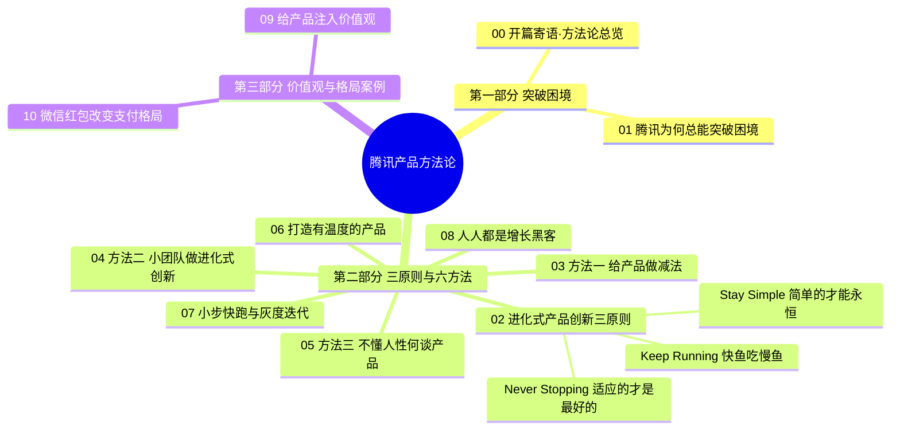
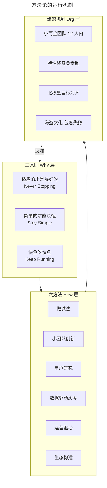

# 腾讯产品方法论总览：跨越两个时代的产研心法

> **适用范围**：互联网产品经理、产研负责人、创业团队、企业数字化转型决策者
> **更新摘要**：v2 在原版"开篇寄语"基础上升级为「腾讯产品方法论总览」，新增全 11 篇知识地图（mindmap）、腾讯 2024–2026 期间的组织与产品演进（PCG 调整、视频号商业化、混元大模型、企业微信/腾讯会议/腾讯文档协同生态），并补充 AI 时代产品观的延伸视角。
> **版本**：v2 · 2026-08 更新

---

## 1. 导言

### 1.1 为什么要重读腾讯产品方法论

腾讯成立于 1998 年，是中国互联网行业中极少数能够同时跨越 PC 互联网与移动互联网两个时代、并在 2023 年生成式 AI 浪潮中再次完成战略重置（Strategic Reset）的科技企业。从早期 QQ 到微信、从游戏到内容、从消费互联网到产业互联网，腾讯的"产研心法"既不是某一位创始人的灵光乍现，也不是某一本畅销书的舶来品，而是一套在 20 余年实战中沉淀、被多个 BU 反复验证的方法论体系。

这套方法论之所以值得被系统性重写与扩充，原因有三：

1. **跨越周期的可复现性**：QQ 邮箱、微信、王者荣耀、视频号等产品在不同时间窗口、不同赛道上反复验证了同一套底层逻辑，这种"可复现性"本身就是方法论成熟度的标志。
2. **AI 时代的产品观迁移**：2024–2026 年，混元大模型、AI 智能体（Agent）、生成式内容正在重塑产品形态。腾讯的"聚焦用户价值""进化式创新""小团队敏捷"等原则在 AI 时代是否仍然成立、如何被重新诠释，是当前产品人最关心的命题。
3. **组织演进的方法论外显**：腾讯近年来的 PCG（平台与内容事业群）调整、工作室制深化、独立团队机制（如微信事业群的相对独立运作），本身就是"小团队大成就"原则在组织层面的演化，值得作为案例库被结构化呈现。

### 1.2 本课程是什么

《腾讯产品启示录》是一套以腾讯实战案例为底座的产品方法论课程。本 v2 版本在保留原版三条原则、六个方法的核心结构之上，按"导言—核心方法论—关键流程—工具与实战—常见误区—进阶延展"的统一骨架进行重写，并整合 2024–2026 年的最新实践。

本课程**不是**：

- 不是腾讯官方授权的内部资料披露，而是基于公开案例与作者在腾讯 11 年（2003–2014，第 391 号员工）实战经验的二次结构化整理；
- 不是产品经理入门教程，而是面向有一定产研经验、希望体系化提升方法论判断力的中高级产品人；
- 不是案例堆砌的故事集，而是以方法论为骨架、案例为论证的专业体系。

### 1.3 适用读者

- 互联网/移动互联网产品经理，尤其是负责 To C 大流量产品的从业者；
- 产研负责人、技术管理者，需要建立产品判断力的工程化团队 Lead；
- 创业团队 Founder 与产品合伙人，需要一套可落地的产品创新方法论；
- 企业数字化/智能化转型负责人，希望借鉴互联网产品方法论改造传统业务流程。

---

## 2. 核心方法论

### 2.1 一句话定义

腾讯产品方法论的核心命题是：**以用户价值为依归（User Value First），通过进化式产品创新（Evolutionary Product Innovation）持续打磨产品，使产品像一个生命体一样在市场环境中迭代适应，最终实现长期主义的产品成功。**

### 2.2 三条原则与六个方法

腾讯产品方法论可被概括为"3 + 6"结构：

**三条原则（Why 层）**：

| 原则 | 英文对照 | 核心要义 |
| --- | --- | --- |
| 适应的才是最好的 | Never Stopping | 不追求一次性完美设计，跟着用户的足迹持续进化 |
| 简单的才能永恒 | Stay Simple | 极简主义是互联网最好的审美观，功能返璞归真 |
| 快鱼吃慢鱼 | Keep Running | 互联网产品即服务，小周期迭代、60 分打天下 |

**六个方法（How 层）**：

1. **给产品做减法**（Subtraction-driven Design）：通过用户高频路径分析定位优化点，用美化/简化/强化/趣化四法雕琢常用功能。
2. **小团队做进化式创新**（Small Full-stack Team）：12 人以内的小而全团队 + 瑞士军刀式协作，加快决策、降低推诿。
3. **用户研究与需求洞察**（User Research & Insight）：10/100/1000 法则、客服听音、热心用户群值班等机制持续接近用户。
4. **数据驱动与灰度迭代**（Data-driven & Grayscale Release）：基于北极星指标（North Star Metric）构建指标体系，通过灰度发布与 A/B 测试验证假设。
5. **运营驱动产品创新**（Operation-driven Innovation）：产品即服务，运营前置参与需求定义，构建内容/活动/数据飞轮。
6. **跨界创新与生态构建**（Cross-boundary & Ecosystem）：通过开放平台、投资并购、内部赛马机制构建产品生态。

### 2.3 边界条件

这套方法论并非万能，其有效性依赖以下边界条件：

- **适用赛道**：高频、强用户参与、可在线迭代的 To C 互联网产品；对 To B 长周期交付型产品需要做适应性改造。
- **组织前提**：需要相对授权的组织文化，能够容忍"小团队全权负责"和"包容失败尝试"；高度 KPI 驱动、强中央集权的组织难以复制。
- **数据基础**：需要具备用户行为埋点、AB 实验平台、实时数据看板等基础设施，否则"跟着用户足迹前进"无从落地。
- **AI 时代的再校准**：生成式 AI 降低了功能生产成本，"做减法"的对抗压力反而更大；"60 分打天下"在 AI 原生产品中需要重新定义（详见各篇进阶延展）。

### 2.4 关键术语对照表

| 中文术语 | 英文对照 | 简要释义 |
| --- | --- | --- |
| 进化式产品创新 | Evolutionary Product Innovation | 把产品视为生命体，持续小步迭代适应市场 |
| 用户价值为依归 | User Value First | 所有决策以用户价值为最终裁判标准 |
| 产品-市场匹配 | Product-Market Fit, PMF | 产品满足某个市场真实需求的临界点 |
| 最小可行产品 | Minimum Viable Product, MVP | 验证核心假设的最小功能集 |
| 北极星指标 | North Star Metric | 团队共同对齐的核心增长指标 |
| 日活/月活 | DAU / MAU | Daily / Monthly Active Users |
| 留存优先增长 | Retention-first Growth, RARRA | 强调留存优于拉新的增长模型 |
| 海盗指标 | AARRR | 获客-激活-留存-推荐-收入漏斗 |
| 钩子模型 | Hook Model | 触发-行动-奖励-投入的上瘾循环 |
| 灰度发布 | Grayscale Release / Canary Release | 按比例放量验证新版本 |

---

## 3. 关键流程：腾讯产品方法论知识地图

下图以 mindmap 形式给出本课程 11 篇文档的完整知识结构，便于读者按需跳转与系统性学习。

**图 3-1 解读**：知识地图以"突破困境—方法论—价值观与格局"三段式组织。第一部分回答"为什么是腾讯"的问题，以历史案例建立方法论可信度；第二部分是课程主干，三原则为道、六方法为术，逐层递进；第三部分以价值观与微信红包两个案例收束全课。本 v2 已完成全 11 篇（00–10）的现代化改写。

### 3.1 方法论的运行机制

下图概括了"原则—方法—组织"三层之间的运行机制：原则定义价值判断的尺度，方法定义具体动作，组织机制（小团队、特性终身负责制、海盗文化）保障方法能够长期稳定执行。

**图 3-2 解读**：三层结构并非自上而下的单向传导，组织机制会反向校准原则——例如"特性终身负责制"会强迫团队面对产品长期价值，从而强化"适应的才是最好的"这一原则；"海盗文化"则使"快鱼吃慢鱼"在团队层面具备心理安全感。理解这种双向循环，是判断方法论是否能在自己团队落地的前提。

---

## 4. 工具与实战

### 4.1 经典案例索引（PC 与移动时代）

| 时期 | 产品 | 关键节点 | 方法论映射 |
| --- | --- | --- | --- |
| 2005–2008 | QQ vs MSN | 文件快速传输 + 截屏工具 | 进化式创新·优化常用功能 |
| 2007–2009 | QQ 邮箱 vs 网易邮箱 | 文件中转站、反垃圾、回复/转发分离 | 三原则齐备，2007–2008 两年累计 2000 项改进 |
| 2011–2012 | 微信 vs 米聊/手机 QQ | 语音聊天、摇一摇、433 天破亿 | 60 分打天下 + 极简主义 + 快鱼吃慢鱼 |
| 2013 | 天天系列游戏 | 每周版本、持续集成 | 小周期迭代 + 数据驱动 |
| 2014 | 手机管家 vs 360 手机卫士 | 小火箭垃圾清理 | 探索产品价值 + 趣化设计 |

### 4.2 2024–2026 最新案例

#### 4.2.1 视频号商业化逆袭

视频号（Channels）于 2020 年内测，2022–2023 年完成基础建设，2024 年起进入商业化加速期：

- **DAU 与时长**：2024 年视频号 DAU 突破 5 亿，用户总使用时长同比增长超 50%，成为腾讯广告收入增长的最大贡献者之一；
- **直播电商**：2024 年微信小店统一品牌上线，视频号直播带货 GMV 同比大幅增长，2025 年进一步完善达人分销与品牌自播双轨；
- **方法论映射**：视频号是"跟着用户足迹前进"的典型——初期不强行规划短视频形态，而是依托微信社交关系链让用户行为自然涌现，再沿足迹铺路；商业化则采用"小步迭代"，先广告后电商再达人与品牌，每一步都通过灰度验证。

#### 4.2.2 企业微信 / 腾讯会议 / 腾讯文档协同生态

腾讯在产业互联网入口的协同生态以"连接器"为定位：

- **企业微信**：与微信互通，连接超 1200 万家企业与组织，成为 To B 触达 To C 的核心通道；
- **腾讯会议**：用户数突破 3 亿，AI 小助手基于混元大模型提供纪要、字幕、翻译；
- **腾讯文档**：月活用户超 2 亿，与微信、企业微信深度联动；
- **方法论映射**：三个产品通过"瑞士军刀式协作"组合提供服务，而非构建一个臃肿的超级应用，体现了"做减法"与"小团队大成就"的协同。

#### 4.2.3 混元大模型与 AI 时代的产品观

- **混元大模型**：2023 年 9 月发布，同年年底升级为 MoE 架构并开放文生图，2024 年起持续开源 Hunyuan-Large、视频生成等多模态模型，参数规模与推理性能持续迭代；
- **应用场景**：腾讯会议 AI 小助手、腾讯文档智能写作、微信输入法 AI 模式、QQ 浏览器 AI 助手、元宝 App（AI 助手）；
- **方法论映射**：AI 时代，腾讯仍然遵循"小步迭代 + 用户价值优先"——混元的 to C 应用先以辅助工具形态切入，而非一次性推出"全能 AI"，这正是 60 分打天下原则的当代演绎。

#### 4.2.4 微信小程序：DAU 5.5 亿的生态范式

- 2024–2025 年微信小程序 DAU 稳定在 5.5 亿规模，成为开发者生态的范式；
- 小程序从工具属性演化为交易、内容、AI Agent 的统一载体，2025 年开始接入混元能力，支持自然语言调用小程序；
- **方法论映射**：小程序的演化路径完美诠释"跟着用户足迹前进"——先做轻量工具，再做交易闭环，再成为 AI Agent 入口，每一步都依托用户行为数据驱动。

### 4.3 实操工具清单

| 工具类别 | 工具示例 | 在方法论中的位置 |
| --- | --- | --- |
| 用户行为分析 | 腾讯分析 TA、神策、GrowingIO | 高频路径分析 |
| AB 实验平台 | 腾讯数据实验室、火山 ABOptimizer | 数据驱动与灰度迭代 |
| 客服听音系统 | 内部 CE 平台 | 用户研究与需求洞察 |
| 项目协同 | TAPD、企业微信、腾讯文档 | 小团队敏捷协作 |
| 北极星指标看板 | 自建 BI（如 TencentBI） | 北极星目标对齐 |

---

## 5. 常见误区与避坑指南

### 误区 1：把"腾讯方法论"当作可一键复制的模板

腾讯方法论的成立高度依赖其组织文化（授权、包容失败、强用户导向）、数据基础设施与历史积累。脱离这些前提直接照搬"小团队""两周迭代""60 分发布"，往往导致团队丧失节奏感与质量底线。

**避坑建议**：先评估组织文化成熟度与数据基建水平，再选择 1–2 个最契合的方法试点，而非全面铺开。

### 误区 2：把"做减法"等同于"砍功能"

减法的本质是"在用户高频路径上集中资源做雕琢"，而不是机械地砍掉长尾功能。机械砍功能会破坏产品生态与用户预期。

**避坑建议**：减法前必须完成用户高频路径分析，明确"在哪儿减、为什么减、减完如何强化主路径"。

### 误区 3：把"60 分打天下"理解为"可以粗糙"

60 分的真正含义是"完成了能体现初心的一个功能即达 60 分"，其余 40 分是已知缺陷，而非未识别的缺陷。把"粗糙"当作"60 分"会导致用户首次体验即流失。

**避坑建议**：发布前必须明确哪些是已知缺陷、哪些是核心验证假设，并向种子用户清晰说明。

### 误区 4：把"小团队"理解为"人数少就行"

小团队的本质是"全角色配齐 + 全权负责 + 失败无法推诿"。如果只是把大团队拆成小团队但保留跨组评审与外部依赖，决策效率反而会下降。

**避坑建议**：以"业务模块"而非"专业职能"划分团队，确保每个小团队具备端到端交付能力。

### 误区 5：在 AI 时代仍沿用消费互联网的迭代节奏

生成式 AI 产品的核心矛盾从"功能供给不足"变为"供给过剩导致用户选择困难"，原有的"小步快跑 + 功能叠加"策略可能反噬体验。

**避坑建议**：AI 原生产品应在"做减法"上加倍投入，将"减法决策树"前置到需求评审环节（详见第 03 篇）。

---

## 6. 进阶延展与参考资料

### 6.1 延伸阅读路径

1. **腾讯官方材料**：腾讯历年财报与业绩电话会议、腾讯文化官方账号、马化腾内部讲话公开整理；
2. **方法论对照**：《精益创业》（Eric Ries）对应"60 分打天下 + 小步迭代"，《Hooked》（Nir Eyal）对应"Hook 模型"，《Measure What Matters》（John Doerr）对应"北极星指标 + OKR"；
3. **AI 时代产品观**：《Software 2.0》（Andrej Karpathy）讨论 AI 重构软件栈对产品方法论的影响；
4. **腾讯案例研究**：吴晓波《腾讯传》、林军《沸腾十五年》中关于腾讯的章节，可作为历史背景阅读。

### 6.2 课程结构与学习建议

- **学习节奏**：建议每篇配合至少 1 个自己当前负责的产品功能做对照分析，写成 1 页纸的方法论应用笔记；
- **学习闭环**：每读完一原则或一方法，回到本篇图 3-1 的知识地图，确认其在整体中的位置，避免孤立理解；
- **进阶方向**：本 v2 已覆盖全 11 篇（00–10），可进一步延伸关注数据驱动、运营驱动、生态构建与 AI 时代产品观再校准等主题。

### 6.3 与其他方法论的对照

| 方法论体系 | 共通点 | 差异点 |
| --- | --- | --- |
| 精益创业 Lean Startup | MVP、小步迭代、验证假设 | 腾讯更强调"常用功能雕琢"而非"功能试错" |
| 敏捷开发 Agile | 小团队、短周期迭代 | 腾讯叠加了"特性终身负责制"与"海盗文化" |
| OKR | 北极星目标对齐 | 腾讯的北极星更聚焦于用户行为指标而非业务指标 |
| RARRA 模型 | 留存优先 | 腾讯在产品早期即可同步关注留存与情感价值（如 QQ 秀） |

---

> **下一篇**：第 01 篇《腾讯为何总能突破困境》——以 QQ 邮箱反超网易、视频号逆袭抖音、混元大模型追赶为案例，拆解"用户价值为依归"如何成为腾讯突破困境的统一心法。