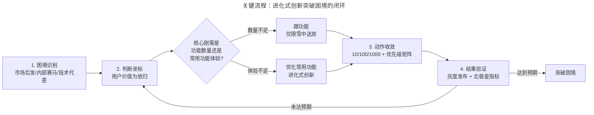

# 腾讯为何总能突破困境：用户价值为依归的逆袭心法

> **适用范围**：面临竞争困局的产品团队、后发追赶型产品的负责人、希望理解腾讯产品方法论起点的产品经理
> **更新摘要**：v2 在原版 QQ 邮箱反超网易案例基础上，新增 2018 年「930 变革」PCG 调整、2022–2025 年视频号逆袭抖音、2023–2026 年混元大模型追赶三个新案例，并将原口语化叙事重构为"困境—判断—动作—结果"四步法。新增 Mermaid 流程图一张用于呈现"进化式创新突破困境"的完整闭环。
> **版本**：v2 · 2026-08 更新

---

## 1. 导言

### 1.1 为什么是"突破困境"

自 1998 年成立以来，腾讯表面上"一路顺风顺水"，但深入历史细节会发现：每一款明星产品都诞生于"囚徒困境"——QQ 邮箱起步时仅 3.7% 市场份额、微信起步时面临内部 3 款竞品 + 外部米聊/陌陌/飞信围剿、视频号起步时抖音已占据短视频绝对头部、混元大模型起步时 OpenAI 已迭代至 GPT-4 时代。

腾讯能够多次从"囚徒困境"中突围，并不是因为运气，而是因为有一套被反复验证的判断与动作体系。本篇的目标是抽出这套体系，使它从"故事"变为"可复用的判断框架"。

### 1.2 本篇要回答的三个问题

1. 在竞争压力下，腾讯选择"盯竞争对手"还是"盯目标用户"？为什么？
2. 当竞争对手推出新功能时，腾讯用什么方法判断"跟"还是"不跟"？
3. 这套心法在 AI 时代是否仍然成立？边界条件是什么？

### 1.3 适用场景

- 后发进入已被头部占据的赛道（如腾讯当年做邮箱、做短视频、做大模型）；
- 内部出现多个竞品、资源分散、需要做战略收敛的场景；
- 团队因竞争压力陷入"应激式跟功能"的恶性循环，需要方法论止血。

---

## 2. 核心方法论

### 2.1 核心命题：每个产品都是囚徒，突围的唯一坐标是用户价值

腾讯在内部反复强调一句话："**一切以用户价值为依归**"（User Value as the Ultimate Anchor）。马化腾曾公开表示："真正的危机从来不会从外部袭来，只有我们漠视用户体验时，才会遇到真正的危机。"

这句话不是口号，而是一个**判断坐标**：当团队面临"是否跟进竞品功能""是否做加法还是做减法""先做什么后做什么"的多重选择时，所有判断都要回到"用户价值"这个唯一坐标系上重新校验。竞品最多起到"提醒遗漏"的作用，绝不是裁判。

### 2.2 困境突围的四步法

腾讯在多次突围中沉淀出"困境—判断—动作—结果"四步法，可作为通用框架：

| 步骤 | 关键问题 | 工具与方法 |
| --- | --- | --- |
| 1. 困境识别 | 我们处在哪种类型的困境？是市场后发、内部赛马还是技术代差？ | 竞争格局图、用户份额分析 |
| 2. 判断坐标 | 在用户价值坐标系下，目标用户的核心刚需是什么？ | 10/100/1000 法则、客服听音 |
| 3. 动作收敛 | 把资源集中到优先级最高的 1–2 个刚需上，主动放弃非刚需 | 优先级矩阵、高频路径分析 |
| 4. 结果验证 | 用数据验证假设，小步迭代，不追求一击必中 | 灰度发布、AB 实验、北极星指标 |

### 2.3 边界条件

- **不适用场景**：当目标用户群体本身存在严重分裂（如同时面向 To B 与 To C），单一"用户价值坐标"难以收敛判断时，需要先做用户分层，再分层套用本方法；
- **失效风险**：当团队对"用户价值"的判断脱离一线用户研究、沦为老板拍脑袋时，本方法会被滥用为"以用户之名行 KPI 之实"；
- **AI 时代校准**：生成式 AI 产品的"用户价值"往往是"未被用户表达的潜在需求"，传统问卷与访谈失效，需要用"原型共测 + 行为日志分析"替代。

### 2.4 关键术语对照

| 中文术语 | 英文对照 | 释义 |
| --- | --- | --- |
| 用户价值为依归 | User Value First / User-Centric | 所有决策以用户价值为最终裁判 |
| 进化式产品创新 | Evolutionary Product Innovation | 持续小步迭代适应市场，反对一次性完美设计 |
| 10/100/1000 法则 | 10/100/1000 Rule | 每月做 10 个用户调研、研究 100 篇用户长文、查看 1000 条用户反馈 |
| 囚徒困境 | Prisoner's Dilemma | 产品定位与外部竞争双重夹击下的战略两难 |
| 北极星指标 | North Star Metric | 团队共同对齐的核心增长指标 |

---

## 3. 关键流程：进化式创新突破困境的闭环

下图给出腾讯在多次突围中沉淀的"困境—判断—动作—结果"闭环，闭环的关键在于"动作—结果"之间的快速反馈与"判断—动作"之间的优先级收敛。

**图 3-1 解读**：闭环的核心不是流程本身，而是**判断节点 C**——腾讯在多次突围中都拒绝了"竞品有我们就跟"的应激式反应，而是先回到用户价值坐标系判断"用户真正的痛点是数量还是体验"。QQ 邮箱案例中，团队判断"用户痛点不是容量而是附件体积"，于是放弃跟进"无限容量"，转而做"文件中转站"；视频号案例中，团队判断"用户痛点不是缺少短视频平台而是缺少与社交关系链绑定的短视频"，于是放弃复制抖音的内容分发逻辑，转而依托微信社交关系链构建视频号。**这个判断节点是腾讯方法论的核心壁垒**。

---

## 4. 工具与实战

### 4.1 经典案例：QQ 邮箱反超网易邮箱（2007–2009）

#### 4.1.1 困境

2006 年中国电子邮箱市场中，QQ 邮箱份额仅 3.7%，且主要依赖腾讯内部产品拉动；网易 163 与 126 两款邮箱合计占据近半壁江山。Yahoo、网易相继推出"无限容量邮箱"，市场叫好声不断。

#### 4.1.2 判断

QQ 邮箱团队没有跟进"无限容量"，而是基于用户研究判断：

- 中国办公室场景下邮箱容量由公司/老板负责，个人用户对容量不敏感；
- 生活场景下用户痛点是**附件体积过小**（20M 限制导致单反照片无法分享给冲洗店）；
- 大附件功能多数厂商不敢做是因为存储成本过高。

#### 4.1.3 动作

团队找到"7 天有效期 + 用户每次分享延长 7 天"的存储成本平衡方案，后延长至 30 天，即"文件中转站"。同期通过 10/100/1000 法则发现 QQ 邮箱 99% 邮件为垃圾邮件（因 QQ 号 + @qq.com 的账号体系极易被 for 循环遍历骚扰），将"反垃圾"列为最高优先级，耗时半年彻底解决。

#### 4.1.4 结果

2007–2008 两年累计完成约 2000 项产品改进，2009 年 QQ 邮箱月活跃用户跃居国内第一，反超深耕邮箱 10 年的网易。马化腾亲自参与"回复/转发"差异化设计讨论，使最常用功能的体验显著优于竞品，为后续留住用户起到关键作用。

### 4.2 2018 年「930 变革」与 PCG 调整

#### 4.2.1 困境

2018 年头条系（抖音、今日头条）在内容赛道强势崛起，腾讯原有的内容分发体系（OMG + MIG + SNG 的内容业务）分散在多个事业群，缺乏统一作战能力。

#### 4.2.2 判断与动作

2018 年 9 月 30 日，腾讯启动"930 变革"，成立平台与内容事业群（PCG，Platform & Content Group），将原社交、内容、工具类业务整合，对长短视频、信息流、文学、动漫等内容赛道统一作战。同期 CSIG（云与智慧产业事业群）成立，发力产业互联网。

#### 4.2.3 结果

PCG 的成立为后续视频号、腾讯视频会员增长、阅文集团整合提供了组织基础。这一案例的本质是：**当困境来自组织而非产品本身时，"用户价值为依归"要求先做组织重构**——因为分散的组织无法对用户价值形成统一判断。

### 4.3 视频号逆袭抖音（2020–2025）

#### 4.3.1 困境

2020 年视频号内测时，抖音 DAU 已超 6 亿，短视频赛道被认为"格局已定"。腾讯此前微视反击未果，市场对视频号普遍看衰。

#### 4.3.2 判断

视频号团队没有复制抖音的中心化算法分发逻辑，而是判断"微信用户的核心需求不是再多一个抖音，而是与社交关系链绑定的短视频消费"——这是一个未被抖音满足的差异化需求。

#### 4.3.3 动作

- 起步阶段：依托微信社交关系链（朋友点赞、关注）做内容分发，不强行规划内容形态；
- 2022–2023 年：完善直播、原创鼓励、内容生态治理；
- 2024 年：商业化加速，上线微信小店统一品牌，打通视频号—公众号—小程序—企业微信的交易闭环；
- 2025 年：达人分销与品牌自播双轨成熟，AI 推荐与社交推荐融合。

#### 4.3.4 结果

2024 年视频号 DAU 突破 5 亿，总使用时长同比增长超 50%，成为腾讯广告收入增长的最大贡献者之一；2025 年直播带货 GMV 持续放大，视频号成为微信生态内最重要的商业化增量。

### 4.4 混元大模型追赶（2023–2026）

#### 4.4.1 困境

2022 年底 ChatGPT 发布后，国内大模型竞赛启动。腾讯混元 2023 年首次发布时，市场上已有百度文心、阿里通义、智谱 GLM 等先发玩家，外界普遍质疑腾讯在 AI 时代"慢了"。

#### 4.4.2 判断

腾讯没有选择"先做通用大模型再找场景"的路径，而是判断"AI 的用户价值必须通过具体产品验证，不能脱离场景谈模型能力"——这本质上是"用户价值为依归"在 AI 时代的再演绎。

#### 4.4.3 动作

- 模型层：混元持续迭代，2023 年发布并于同年年底升级为 MoE 架构，此后持续扩展文生图、视频生成等多模态能力；
- 应用层：腾讯会议 AI 小助手、腾讯文档智能写作、QQ 浏览器 AI 助手、元宝 App、微信输入法 AI 模式等场景化产品陆续上线；
- 生态层：腾讯云向开发者开放混元 API，与微信小程序生态打通。

#### 4.4.4 结果

混元在内部多个产品中实现规模化落地，腾讯会议、腾讯文档的 AI 功能成为用户切换成本的关键护城河。这一案例的方法论映射是：**AI 时代的"突破困境"不再靠"模型能力第一"，而靠"场景化产品体验第一"**。

### 4.5 工具清单

| 工具 | 用途 | 阶段 |
| --- | --- | --- |
| 10/100/1000 法则 | 用户研究标准化 | 困境识别—判断 |
| 客服听音 | 一线用户痛点捕捉 | 判断 |
| 优先级矩阵 | 多需求收敛 | 动作收敛 |
| 灰度发布平台 | 假设验证 | 结果验证 |
| 北极星指标看板 | 长期目标对齐 | 结果验证—闭环 |

---

## 5. 常见误区与避坑指南

### 误区 1：把"用户价值为依归"理解为"用户要什么做什么"

用户价值为依归**不是**用户要什么就做什么。QQ 邮箱团队早期做"边聊边发邮件"，本质上是迎合用户的表面需求，结果丝毫没有提升活跃度。真正的"用户价值为依归"是通过深度研究识别**未被表达的刚需**。

**避坑建议**：建立"用户说要什么—用户为什么这么说—真实痛点是什么"的三层穿透式研究机制。

### 误区 2：竞品跟进决策被短期舆论绑架

QQ 邮箱当年若跟进"无限容量"会消耗大量存储成本却无法解决真实痛点。短视频时代，许多团队跟风做"画中画""弹幕""短剧"等功能，本质上是被舆论与竞品节奏绑架。

**避坑建议**：建立"竞品功能跟进评审"机制，每个跟进需求必须回答"这在用户价值坐标系中处于什么位置"。

### 误区 3：把"小步迭代"当作"无规划"的借口

小步迭代的前提是"判断坐标清晰"，没有判断坐标的小步迭代等于乱跑。视频号的迭代节奏虽快，但每一步都依托"社交关系链短视频"这一清晰坐标。

**避坑建议**：每次迭代前必须明确"本轮验证的假设是什么"，否则迭代无效。

### 误区 4：把"突破困境"寄托于单一英雄产品经理

腾讯方法论的成立依赖组织机制（小团队、特性终身负责制、北极星目标、海盗文化）。脱离组织机制谈"找到下一个张小龙"是错误归因。

**避坑建议**：评估产品突围可行性时，先评估组织机制是否到位，再谈产品策略。

### 误区 5：在 AI 时代照搬消费互联网的"60 分打天下"

AI 原生产品的"60 分"门槛显著高于传统产品——一个会"幻觉"的 AI 助手可能在 60 分阶段就破坏用户信任。腾讯混元选择"先在已有产品中做辅助功能"而非"独立 App 一战定胜负"，正是对这一误区的规避。

**避坑建议**：AI 产品的发布策略应区分"高风险场景"（医疗、法律、金融）与"低风险场景"（娱乐、辅助写作），前者发布门槛需提高至 80 分以上。

---

## 6. 进阶延展与参考资料

### 6.1 横向对照

| 维度 | 腾讯突围策略 | 字节跳动突围策略 | 阿里突围策略 |
| --- | --- | --- | --- |
| 核心坐标 | 用户价值（社交关系链） | 算法效率（兴趣分发） | 商业效率（交易闭环） |
| 决策机制 | 小团队 + 北极星 | 数据驱动 + AB 实验 | 中台赋能 + 业务闭环 |
| 突围方式 | 沿用户足迹铺路 | 算法快速试错 | 资源整合 + 投资并购 |

### 6.2 延伸思考题

1. 如果你是 2026 年某 AI 创业公司的产品负责人，面临大厂大模型的围剿，如何用"用户价值为依归"框架判断突围方向？
2. 视频号的成功有多少可归因于"方法论正确"，多少可归因于"微信流量红利"？两者如何剥离？
3. PCG 调整后的组织形态是否仍然适合 AI 时代的内容生产？需要再做哪些调整？

### 6.3 参考资料

- 腾讯控股历年财报与业绩电话会议公开材料；
- 马化腾《给全体员工的内部信》（2018 年 9 月 30 日，"930 变革"公开信）；
- 易观国际《中国电子邮箱市场季度监测报告》（2006–2009）；
- 公开报道：视频号商业化进展（2024–2025）、混元大模型技术演进（2023–2026）；
- 配套阅读：本课程第 02 篇《如何做到产品进化式创新》将拆解"三原则"的底层逻辑。

---

> **下一篇**：第 02 篇《如何做到产品进化式创新》——以"Never Stopping / Stay Simple / Keep Running"三原则为主线，并用 timeline 呈现微信生态从公众号→小程序→视频号→AI 的完整演进路径。