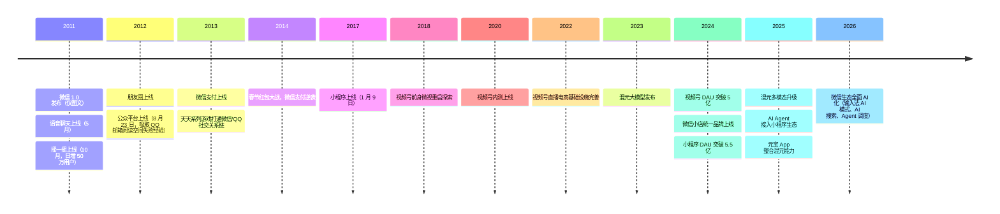
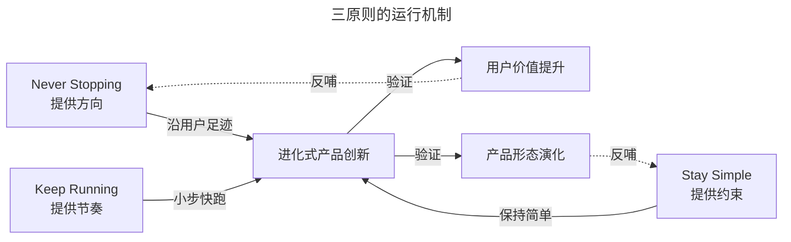

# 如何做到产品进化式创新：三原则与微信生态演进

> **适用范围**：负责产品中长期规划的产品经理、产研负责人、需要建立方法论判断力的产品决策者
> **更新摘要**：v2 在原版"三原则"叙事基础上，新增微信生态演进 timeline（公众号→小程序→视频号→AI Agent）、2024–2026 年视频号商业化与混元大模型应用案例，并将三原则由口语化解读重构为"定义—边界—反模式"结构化呈现。
> **版本**：v2 · 2026-08 更新

---

## 1. 导言

### 1.1 为什么需要"进化式"创新

好的产品是进化出来的，不是规划出来的。QQ、QQ 邮箱、微信、视频号——腾讯几乎所有的明星产品都验证了这一命题。这与达尔文进化论（Darwin's Theory of Evolution）的逻辑同构：每个生命体在强大的求生意志下不断适应环境，持续调整自身机能，适应的特征被保留，多代之后形态已发生巨大变化。

把产品视为生命体，把市场视为环境，把用户需求视为生存压力，"进化式产品创新"就是把生物进化逻辑迁移到产品领域的方法论。

### 1.2 进化式创新与一次性创新的根本差异

| 维度 | 一次性创新（One-shot Innovation） | 进化式创新（Evolutionary Innovation） |
| --- | --- | --- |
| 心智模型 | 产品是被设计出来的（Designed） | 产品是被演化出来的（Evolved） |
| 发布节奏 | 等到完美才发布 | 60 分即发布，持续迭代 |
| 功能取舍 | 喜欢做新颖、强大的新功能 | 优先优化常见、基础的常用功能 |
| 失败处理 | 失败即归责 | 失败即学习，团队互相勉励 |
| 资源配置 | 大规划、大兵团作战 | 小团队、小周期、快速验证 |

### 1.3 三原则总览

进化式创新在腾讯被概括为三条原则：

1. **Never Stopping——适应的才是最好的**：跟着用户足迹前进，包容失败尝试，适应不完美环境；
2. **Stay Simple——简单的才能永恒**：回归产品初心，符合人性，功能设计极简；
3. **Keep Running——快鱼吃慢鱼**：互联网产品即服务，小周期迭代，60 分打天下。

### 1.4 适用范围

- 高频用户参与、可在线迭代的 To C 互联网产品；
- 中长期产品规划与节奏管理；
- 团队文化建设与组织机制设计（与第 04 篇互补）。

---

## 2. 核心方法论：三原则的结构化定义

### 2.1 原则一：Never Stopping——适应的才是最好的

#### 2.1.1 定义

产品创新不应追求一次性"上帝之手"式的完美设计，而应跟着用户的足迹持续进化。所谓"跟着用户的足迹前进"，是指先观察用户在产品中自然形成的行为路径，再沿这条路径铺路（铺设功能与界面），而不是先按产品经理的主观规划铺一条"漂亮的石砌路"再强迫用户走。

#### 2.1.2 三个子原则

1. **跟着用户的足迹前进**：产品经理不是上帝视角，而是观察者与铺路者。2002 年 QQ 群的诞生就是典型案例——团队从邮件组里发现用户对"群体即时沟通"的需求，沿这条足迹铺出 QQ 群；后续又从"群主难管理潜水成员"的痛点出发，沿足迹铺出"等级外显"功能。
2. **包容失败尝试**：创新是高风险活动，大部分创新以失败告终。QQ 邮箱阅读空间（基于 RSS）在 2010 年停更，团队复盘三点失败原因（用户不理解 RSS、操作繁琐、内容质量不受控），这些经验直接催生了 2012 年微信公众平台——把"关注"按钮简化为一个动作，把内容生产统一到公众平台编辑器。
3. **团队适应不完美**：完美是理想，现实是不完美的。微信大型线上活动（如十周年活动）期间，在网络不佳或服务器过载时，微信会用昵称替代头像呈现好友信息，让用户继续看到点赞与评论——这是"主动适应不完美"的典型设计。

#### 2.1.3 边界条件

- 不适用：当产品处于强监管、强安全约束场景（如医疗、金融核心系统）时，"适应不完美"会带来合规风险，需要提高发布门槛；
- 反模式：把"适应不完美"理解为"可以长期不修 Bug"，会导致产品长期处于半成品状态。

### 2.2 原则二：Stay Simple——简单的才能永恒

#### 2.2.1 定义

张小龙说："极简主义是互联网最好的审美观。"简单的本质不是"功能少"，而是"用最少的形态承载最强的用户价值"。腾讯产品保持简单的方法有三：

1. **回归产品初心**：朋友圈的初心是"好友间用图片简单同步信息"，所以默认只能发图片，发文字需长按相机按钮——这是对初心的克制；
2. **人性未曾改变**：飞机大战排行榜与微信运动排行榜的设计逻辑完全一致，都基于人性中"炫耀与比较"的需求；
3. **功能设计的极简**：微信摇一摇做到"什么都没有"，竞争对手想超越就必须加东西，一加就复杂——这是极简带来的不可超越性。

#### 2.2.2 边界条件

- 不适用：To B 复杂业务系统难以做到极致简单，需要在"专业用户效率"与"简单"之间权衡；
- 反模式：把"简单"理解为"砍功能"，会破坏产品生态（详见第 03 篇误区部分）。

### 2.3 原则三：Keep Running——快鱼吃慢鱼

#### 2.3.1 定义

互联网时代不是"大鱼吃小鱼"，而是"快鱼吃慢鱼"。互联网产品不是被售卖的软件，而是被租赁的服务——产品即服务（Product as a Service）。这意味着产品的价值取决于持续服务用户的能力，而不是一次性交付的能力。

#### 2.3.2 三个子原则

1. **互联网产品即服务**：QQ 早期只是即时通讯工具，用户粘性不足。2002 年 QQ 秀上线，把 QQ 从通讯工具升级为"虚拟空间身份象征"，为 2005 年 QQ 空间奠定基础。后续竞争对手只做通讯功能不做情感服务，大多失败。
2. **小迭代的优势**：腾讯提倡 APP 类产品两周一版本、H5/Web 类一周一版本。2013 年天天酷跑坚持每周发版，配合持续集成（Continuous Integration, CI）机制，团队每天上班前试玩昨天版本，结合用户反馈确定当天优先级。
3. **60 分打天下**：60 分即发布，与用户互动获得反馈，再小步快跑。微信 1.0 版本只能发图片和文字，APP Store 一片骂声，但通过这次发布团队验证了"仅发图片文字不能得到认同"的假设，数月后上线语音聊天取得突破。同期 Q 信因为追求 80 分延迟发布，被微信一路压制。

#### 2.3.3 边界条件

- 不适用：高合规、高安全场景的发布门槛需提高；
- AI 时代校准：生成式 AI 产品的 60 分门槛高于传统产品，因 AI 幻觉可能直接破坏用户信任（详见第 5 节误区）。

### 2.4 关键术语对照

| 中文术语 | 英文对照 | 释义 |
| --- | --- | --- |
| 进化式产品创新 | Evolutionary Product Innovation | 持续小步迭代适应市场 |
| 持续集成 | Continuous Integration, CI | 代码持续合并与构建的工程实践 |
| 最小可行产品 | Minimum Viable Product, MVP | 验证核心假设的最小功能集 |
| 产品即服务 | Product as a Service | 产品以服务方式持续交付价值 |
| 北极星指标 | North Star Metric | 团队共同对齐的核心指标 |

---

## 3. 关键流程：微信生态演进 Timeline

下图以 timeline 形式呈现微信生态从 2011 年到 2026 年的关键演进节点，是"三原则"在 15 年时间尺度上的完整验证。

**图 3-1 解读**：这条 timeline 的关键不是节点本身，而是节点之间的**演进逻辑**——每一个新形态都不是凭空规划，而是沿着上一阶段的用户足迹铺设：

- **公众号**：吸取 QQ 邮箱阅读空间 RSS 失败经验，把"订阅"简化为"关注"按钮；
- **小程序**：沿着"用户在微信内即用即走"的足迹铺设，避免 App 安装成本；
- **视频号**：沿着"用户在社交关系链内消费短视频"的足迹铺设，与抖音的算法分发错位；
- **AI Agent**：沿着"用户用自然语言调度小程序与服务"的足迹铺设，混元能力嵌入微信生态。

每一次形态跃迁都不是"颠覆式创新"，而是"进化式跃迁"——这正是 Never Stopping 原则的 15 年实证。

### 3.1 三原则的运行机制

下图给出三原则之间的运行机制：Never Stopping 提供方向（沿用户足迹前进），Stay Simple 提供约束（保持简单），Keep Running 提供节奏（小步快跑）。

**图 3-2 解读**：三原则不是并列关系，而是"方向—约束—节奏"的三角结构。任何一个产品决策都需要同时通过三原则的检验：是否沿用户足迹（方向）？是否保持简单（约束）？是否小步快跑（节奏）？三者缺一不可。如果只有方向没有约束，产品会膨胀复杂；如果只有约束没有节奏，产品会停滞不前；如果只有节奏没有方向，产品会乱跑失焦。

---

## 4. 工具与实战

### 4.1 经典案例

#### 4.1.1 QQ 群的诞生（2002）

腾讯通过邮件组用户讨论发现"群体即时沟通"需求，沿足迹铺设 QQ 群。后续从"群主难管理潜水成员"痛点出发，铺设"等级外显"功能，提升群的活跃度与健康度。

#### 4.1.2 公众平台的进化（2012）

QQ 邮箱阅读空间（2009）的失败经验被沉淀为三条教训：用户不理解技术术语、操作繁琐、内容质量不受控。2012 年 8 月 23 日微信公众平台吸取这三条经验：把"订阅"简化为"关注"按钮，把内容生产统一到公众平台编辑器，使自媒体能够方便地制作美观文章。

#### 4.1.3 摇一摇的极简（2011）

微信摇一摇做到"什么都没有"，张小龙给马化腾的邮件回复成为经典："因为我们的摇一摇已经做到了极简化了，竞争对手不可能超越我们了，因为我们是做到了什么都没有，你要超过我们总要加东西吧，你一加，就超不过我们了。"摇一摇的"咔咔"声是来复枪步枪上膛的声音，对男性用户的心理感受是"性感"——这是对人性的精准把握。

#### 4.1.4 天天酷跑的小迭代（2013）

每周发版 + 持续集成机制：每天下班前必须 Build 一个版本供内部试玩，不能存在影响试玩的 Bug。坚持两个月后团队形成"每天上班前试玩 + 用户反馈"的闭环，工作有效性大幅提升。最终天天系列游戏占据当年手游市场很大份额。

### 4.2 2024–2026 最新案例

#### 4.2.1 视频号商业化：进化式创新的当代样本

视频号的演进路径完美诠释三原则：

- **Never Stopping**：起步时不强行规划内容形态，依托社交关系链让用户行为自然涌现；
- **Stay Simple**：商业化路径选择"先广告后电商再达人与品牌"，每一步都保持单一主线，不急于叠加复杂变现；
- **Keep Running**：2024 年 DAU 突破 5 亿后仍保持每月产品迭代，2025 年达人分销与品牌自播双轨持续优化。

#### 4.2.2 小程序 DAU 5.5 亿：用完即走的演化

小程序从 2017 年的"用完即走"理念出发，到 2024 年 DAU 5.5 亿、2025 年接入 AI Agent，演化路径如下：

| 阶段 | 时期 | 核心定位 | 用户足迹 |
| --- | --- | --- | --- |
| 工具期 | 2017–2019 | 即用即走的轻量工具 | 线下扫码 + 线上分享 |
| 交易期 | 2020–2022 | 交易闭环载体 | 直播带货 + 服务预约 |
| 内容期 | 2023–2024 | 内容与服务的混合载体 | 视频号 + 公众号联动 |
| Agent 期 | 2025–2026 | AI Agent 调度入口 | 自然语言调用服务 |

#### 4.2.3 混元大模型应用：60 分打天下的 AI 版本

腾讯混元没有走"独立 App 一战定胜负"的路径，而是把 AI 能力嵌入已有产品（腾讯会议、腾讯文档、QQ 浏览器、微信输入法），以辅助工具形态切入。这是 60 分打天下原则在 AI 时代的当代演绎——先在已有用户场景中验证 AI 价值，再逐步独立化（元宝 App）。

### 4.3 工具清单

| 工具 | 用途 | 原则映射 |
| --- | --- | --- |
| 用户行为埋点平台 | 跟踪用户足迹 | Never Stopping |
| 灰度发布平台 | 小步快跑验证 | Keep Running |
| 持续集成 CI/CD | 每日构建与试玩 | Keep Running |
| 极简评审清单 | 是否保持简单 | Stay Simple |
| 北极星指标看板 | 团队对齐方向 | Never Stopping |

---

## 5. 常见误区与避坑指南

### 误区 1：把"跟着用户足迹"理解为"顺从用户"

跟着用户足迹前进**不是**用户要什么做什么，而是观察用户行为后沿足迹铺路。QQ 群的诞生不是用户说"我们要群功能"，而是产品经理从邮件组讨论中识别出"群体即时沟通"的潜在需求。

**避坑建议**：建立"用户行为日志—行为模式识别—潜在需求推断—功能铺设"的四步研究链路。

### 误区 2：把"包容失败"理解为"可以反复失败"

包容失败的前提是每次失败都要有结构化复盘，把教训沉淀为团队知识。QQ 邮箱阅读空间的失败教训直接催生了公众号的成功——这才是"包容失败"的真正价值。如果只是失败后归咎于"市场不成熟"，教训无法沉淀。

**避坑建议**：每次失败必须输出 1 页纸的"失败复盘报告"，包含假设、动作、结果、教训、可复用经验五个部分。

### 误区 3：把"适应不完美"当作"可以长期不修"

适应不完美是"在网络不佳时降级呈现，让用户继续操作"，而不是"已知 Bug 可以长期不修"。前者是用户体验设计，后者是质量管理失职。

**避坑建议**：建立"降级策略"与"Bug 修复"两套独立机制，前者是产品功能，后者是质量底线。

### 误区 4：把"简单"等同于"功能少"

简单的本质是"用最少的形态承载最强的用户价值"。摇一摇的简单不是"功能少"，而是"用一个动作承载陌生人社交的好奇心"。如果只是砍功能而不思考价值承载，会得到一个"既简单又没用"的产品。

**避坑建议**：每次做减法前必须回答"这个功能承载了什么用户价值，减掉后价值由什么承载"。

### 误区 5：在 AI 时代仍套用"60 分打天下"

生成式 AI 产品的 60 分门槛显著高于传统产品。一个会幻觉的 AI 助手在 60 分阶段就可能破坏用户信任，且信任一旦破坏难以恢复。腾讯混元选择"先嵌入已有产品做辅助"而非"独立 App 一战定胜负"，正是对这一误区的规避。

**避坑建议**：AI 产品发布前必须完成"幻觉率红线测试"，在高风险场景（医疗、法律、金融）将发布门槛提高至 80 分以上。

---

## 6. 进阶延展与参考资料

### 6.1 三原则与外部方法论的对照

| 三原则 | 对应外部方法论 | 共通点 | 差异点 |
| --- | --- | --- | --- |
| Never Stopping | 精益创业 Lean Startup | 小步迭代、验证假设 | 腾讯更强调"沿足迹铺路"而非"试错" |
| Stay Simple | 极简主义设计（Dieter Rams） | 少即是多 | 腾讯叠加了"不可超越性"逻辑 |
| Keep Running | 敏捷开发 Agile | 短周期迭代 | 腾讯强调"产品即服务"的租赁心智 |

### 6.2 延伸思考题

1. 如果你要在 2026 年做一个 AI 原生产品，如何用三原则设计发布节奏与功能取舍？
2. 小程序从"用完即走"演化到"AI Agent 调度入口"，是否违背了"用完即走"的初心？还是初心的更高阶实现？
3. 视频号是"进化式创新"还是"流量红利"？如何设计实验区分两者？

### 6.3 参考资料

- 张小龙 2019 年微信公开课演讲（关于"用完即走"与"初心"的公开阐释）；
- 公开报道：视频号商业化进展（2024–2025）、混元大模型技术演进（2023–2026）、微信小程序生态数据（QuestMobile、微信公开课）；
- 配套阅读：本课程第 03 篇《如何给你的产品做减法》将拆解 Stay Simple 原则的具体落地方法。

---

> **下一篇**：第 03 篇《如何给你的产品做减法》——以用户高频路径分析为方法，以"美化/简化/强化/趣化"四法为工具，并讨论"用完即走"理念在 AI 时代的演化。