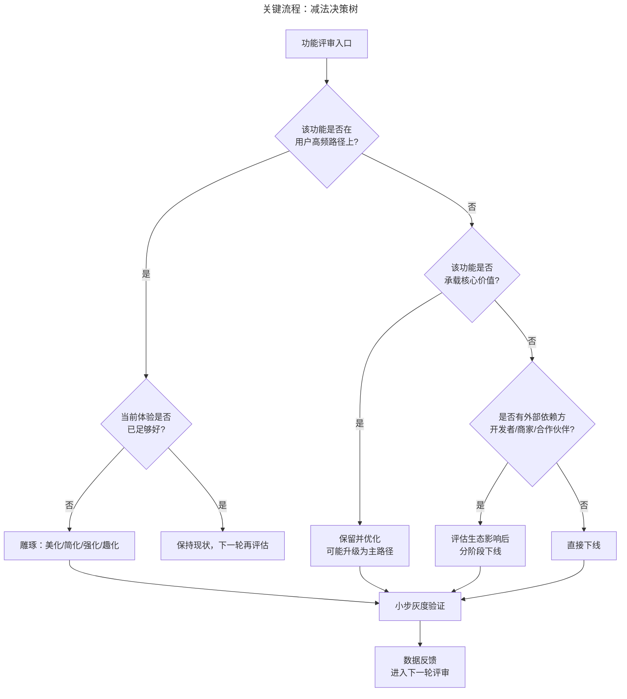
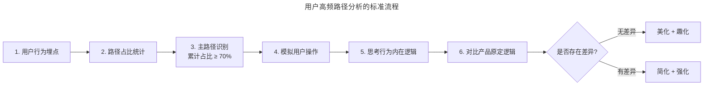

# 如何给你的产品做减法：高频路径分析与四法雕琢

> **适用范围**：负责产品迭代节奏与功能优先级的产品经理、产品负责人、需要控制产品复杂度的 To C / To B 团队
> **更新摘要**：v2 在原版"美化/简化/强化/趣化"四法基础上，新增 AI 时代"用完即走"理念的演化（小程序→AI Agent 调度入口）、2024–2026 年微信生态减法案例、减法决策树 Mermaid 图，并将"忘记减法的三个原因"重构为可识别的反模式清单。
> **版本**：v2 · 2026-08 更新

---

## 1. 导言

### 1.1 为什么必须做减法

移动互联网时代的根本约束是"屏幕面积 + 操作精度"——手机屏幕远小于电脑，手指触控面积至少 6mm × 6mm，远低于鼠标像素级精度。这两个约束叠加，使得 PC 时代"找块区域塞进去"的功能堆叠模式在移动端彻底失效。

进入 AI 时代，约束发生了迁移：不再是"屏幕面积不够"，而是"用户注意力不够"——生成式 AI 让功能生产成本趋近于零，功能供给从稀缺变为过剩，用户选择成本急剧上升。**减法不再是移动端的特殊要求，而是 AI 时代产品存活的通用要求。**

### 1.2 减法的三层含义

| 层次 | 含义 | 腾讯代表案例 |
| --- | --- | --- |
| 信息层减法 | 减少界面信息密度，突出主要内容 | 微信启动页蓝色弹珠 + 孤独小人 |
| 流程层减法 | 减少操作步骤，缩短高频路径 | 微信"您可能要发送的照片"提示 |
| 价值层减法 | 减少功能数量，聚焦核心价值 | 微信朋友圈默认只能发图片 |

### 1.3 适用范围

- 移动互联网产品的功能迭代与体验优化；
- AI 时代的产品复杂度治理（功能过剩场景）；
- 中长期产品规划中的优先级收敛。

---

## 2. 核心方法论

### 2.1 核心命题：减法的本质是"在用户高频路径上集中资源做雕琢"

减法不是机械地砍功能，而是通过用户高频路径分析（High-Frequency Path Analysis）找到团队应集中资源的路径，然后通过"美化/简化/强化/趣化"四法持续雕琢这条路径上的功能。

### 2.2 不做减法的三大危害

#### 2.2.1 危害一：功能交叉复杂化

QQ 早期只有"在线/离线"两个状态，后增加"隐身"状态，导致消息发送逻辑与好友状态显示逻辑都大幅复杂化。微信刻意规避这一复杂度——只有一个"在线"状态，退出登录即不接收消息，所有用户默认"随时在线"，反而简单。

#### 2.2.2 危害二：用户心理负担过载

QQ 音乐客户端提供摇滚、民谣、民族风、70 后、80 后、90 后等多种音乐分类，用户面对丰富选择反而放弃使用。直到上线"随便听听"功能，让用户先听再跳过，问题才解决——这是典型的"选择悖论"（Paradox of Choice）。

#### 2.2.3 危害三：沉没成本绑架决策

腾讯地图比百度地图晚发布三个月，团队一出手就做了街景功能，但市场反馈用户不在意街景。由于已在街景上投入庞大采集车队与数据处理团队，团队不敢掉头做行车导航这一核心功能，最终市场占有率持续走低。这是"沉没成本谬误"（Sunk Cost Fallacy）的典型案例。

### 2.3 忘记减法的三个原因（反模式）

| 反模式 | 表现 | 典型案例 |
| --- | --- | --- |
| 满足所有用户的需求 | 试图同时服务高端与小白用户，最终两边都不满意 | 手机管家同时做杀毒与清理，高端用户嫌杀毒弱、小白用户嫌清理复杂 |
| 喜欢做新功能而非优化老功能 | 新功能容易出成绩，老功能优化无人在意 | 2010 年手机搜索盲目增加搜小说/搜图，通用搜索能力长期无改进 |
| 应激式跟竞品节奏 | 跟进竞品功能而不思考用户价值 | 2011 年手机 QQ 跟进米聊图片涂鸦，使用率极低 |

### 2.4 边界条件

- **不适用场景**：产品早期 PMF（Product-Market Fit）尚未验证时，过早做减法可能误删验证假设的功能；
- **风险**：减法过度会破坏产品生态，例如砍掉长尾功能可能破坏开发者或商家依赖；
- **AI 时代校准**：生成式 AI 产品的减法不仅是"功能减法"，更是"模型能力减法"——AI 助手回答过多反而破坏体验，需要"克制式回答"设计。

### 2.5 关键术语对照

| 中文术语 | 英文对照 | 释义 |
| --- | --- | --- |
| 高频路径分析 | High-Frequency Path Analysis | 梳理用户行为占比，找到核心路径 |
| 选择悖论 | Paradox of Choice | 选项过多反而降低决策效率 |
| 沉没成本谬误 | Sunk Cost Fallacy | 已投入成本绑架未来决策 |
| 用完即走 | Use and Leave | 张小龙提出的产品理念，强调效率优先 |
| 美化/简化/强化/趣化 | Beautify/Simplify/Amplify/Gamify | 高频路径上的四法雕琢 |

---

## 3. 关键流程：减法决策树

下图给出一个可复用的"减法决策树"，用于在功能评审环节快速判断每个功能应做加法、做减法、还是做雕琢。

**图 3-1 解读**：决策树的关键节点是 B（是否在用户高频路径上）和 D（是否承载核心价值）。这两个节点的判断必须基于数据而非主观——B 节点依赖用户行为埋点统计，D 节点依赖用户研究与北极星指标对齐。决策树不是"砍或不砍"的二元判断，而是"雕琢/保留/分阶段下线/直接下线"的分级处理，避免了"一刀切"式的减法风险。

### 3.1 用户高频路径分析的标准流程

**图 3-2 解读**：高频路径分析的核心不是统计本身，而是"模拟—思考—对比"的认知过程。产品经理必须亲自按用户路径模拟操作一遍，思考用户行为的内在逻辑，再与产品原定逻辑对比——这个对比的差异点就是减法与雕琢的发力点。无差异的路径用美化和趣化改善，有差异的路径用简化和强化解决。

### 3.2 四法雕琢的定义

| 方法 | 定义 | 适用场景 |
| --- | --- | --- |
| 美化（Beautify） | 高频路径上的页面视觉与情感设计优化 | 用户每天都要看到的界面 |
| 简化（Simplify） | 高频路径上的操作步骤与认知负担降低 | 操作复杂、易误操作的场景 |
| 强化（Amplify） | 高频路径上的核心功能位次与权重提升 | 功能层级与重要性不匹配 |
| 趣化（Gamify） | 高频路径上的趣味性与仪式感设计 | 用户每天重复使用的功能 |

---

## 4. 工具与实战

### 4.1 经典案例：微信四法雕琢

#### 4.1.1 美化：微信启动页

微信启动页自 2011 年第一版以来只改动一次——从 NASA 1972 年"蓝色弹珠"照片（中心为非洲大陆）改为中国风云卫星拍摄的照片（中心为中国土地）。启动页的"孤独小人 + 长长背影"凸显人类孤独感，呼应"需要用微信沟通"的产品初心。**对每天都要看到的界面投入极致美化设计**，是美化的核心要义。

#### 4.1.2 简化：照片发送提示

微信发现每天有 20 亿张以上图片通过加号发送，其中很多是 5 秒内的新照片。于是上线"您可能要发送的照片"提示，使发送刚拍摄或截屏的图片效率大幅提升。简化的本质是"在用户高频路径上预判用户下一步"。

#### 4.1.3 强化：表情与文本同级

数据发现发送表情、语音、文本同等重要，但原设计中文本和语音突出、表情次一级。改版后三者位于同一层级，体现同等重要性。强化是"让最需要的功能变得强大"。

#### 4.1.4 趣化：群聊生日蛋糕

群聊中常见成员过生日的祝贺场景，微信设计"从天上往下掉蛋糕"的动效，让群里所有成员感受普天同庆。趣化是把"用户经常会做的有意义的事"变得更有趣、更有仪式感。

### 4.2 2024–2026 减法案例

#### 4.2.1 微信"用完即走"在 AI 时代的演化

张小龙 2016 年微信公开课提出"用完即走"（Use and Leave），核心是"高效完成用户任务，不强行延长用户停留时间"。这一理念在 AI 时代演化为更高阶的形态：

| 阶段 | 形态 | 减法体现 |
| --- | --- | --- |
| 小程序期（2017–2023） | 即用即走的轻量工具 | 减去 App 安装成本 |
| 视频号期（2020–2024） | 内容与交易的混合载体 | 减去中心化算法对用户注意力的劫持 |
| Agent 期（2025–2026） | 自然语言调度入口 | 减去功能导航的认知成本 |

Agent 期是"用完即走"的更高阶实现——用户用自然语言表达需求，AI Agent 调度小程序完成服务，用户无需在功能导航中寻找入口。这是"减去认知成本"的极致形态。

#### 4.2.2 视频号商业化的减法节奏

视频号商业化没有一次性叠加"广告 + 电商 + 直播 + 达人 + 品牌"全部模式，而是分阶段：

- 2022–2023：先做广告与直播基础设施；
- 2024：上线微信小店统一品牌，做交易闭环；
- 2025：达人分销与品牌自播双轨成熟。

每一步都保持单一主线，避免商业化叠加破坏用户体验。这是"价值层减法"在商业化的应用。

#### 4.2.3 混元 AI 助手的"克制式回答"

混元 AI 助手在腾讯会议、腾讯文档等产品中没有采用"全知全能"的回答策略，而是"克制式回答"——只回答用户当前场景下需要的问题，不主动扩展。这是 AI 时代的"回答减法"，避免 AI 助手变成"信息轰炸机"。

#### 4.2.4 企业微信/腾讯会议/腾讯文档的协同减法

腾讯在协同办公领域没有构建一个"超级应用"，而是保持三个独立产品通过"瑞士军刀式协作"组合：

- 企业微信：组织与通讯录；
- 腾讯会议：实时沟通；
- 腾讯文档：异步协作。

这种"分而治之"的设计本身就是减法——每个产品聚焦一个核心场景，避免功能堆叠。

### 4.3 工具清单

| 工具 | 用途 | 减法阶段 |
| --- | --- | --- |
| 用户行为埋点平台 | 路径占比统计 | 高频路径分析 |
| 用户访谈与客服听音 | 行为内在逻辑思考 | 路径分析—雕琢 |
| 灰度发布平台 | 雕琢效果验证 | 四法雕琢 |
| AB 实验平台 | 减法前后对比 | 决策验证 |
| 功能下线评估清单 | 生态影响评估 | 下线决策 |

---

## 5. 常见误区与避坑指南

### 误区 1：把"减法"等同于"砍功能"

减法的本质是"在用户高频路径上集中资源做雕琢"，机械砍功能会破坏产品生态与用户预期。腾讯地图砍掉街景做导航是减法，但如果在 PMF 未验证时砍掉验证假设的功能，则是误删。

**避坑建议**：建立"功能价值评估矩阵"，按"用户高频度 × 价值承载度"两个维度评估，避免一刀切。

### 误区 2：把"满足所有用户"当作产品目标

手机管家同时做杀毒与清理的结果是高端用户嫌杀毒弱、小白用户嫌清理复杂——试图满足所有用户最终谁都不满意。

**避坑建议**：明确目标用户分层，每个产品版本只服务一个分层，其他分层用独立产品或独立模式服务。

### 误区 3：把"做新功能"当作产品进步

新功能容易出成绩，老功能优化无人在意——这是产品团队的常见误区。2010 年手机搜索盲目增加搜小说/搜图，通用搜索能力长期无改进，最终市场占有率持续下降。

**避坑建议**：在产品 OKR 中为"常用功能优化"设置独立指标，与"新功能上线"平等考核。

### 误区 4：应激式跟竞品节奏

2011 年手机 QQ 跟进米聊图片涂鸦，使用率极低。应激式跟功能本质上是"被竞品节奏绑架"，而非"以用户价值为依归"。

**避坑建议**：建立"竞品功能跟进评审"机制，每个跟进需求必须回答"这在用户价值坐标系中处于什么位置"。

### 误区 5：AI 时代忽视"模型能力减法"

生成式 AI 产品的减法不仅是功能减法，更是模型能力减法。AI 助手回答过多、过于主动，会破坏用户体验。许多团队在 AI 产品中盲目叠加"AI 摘要 + AI 推荐 + AI 对话 + AI 写作"等能力，导致产品变成"AI 能力展示场"而非"用户价值解决场"。

**避坑建议**：AI 产品评审时必须回答"这个 AI 能力是否在用户高频路径上"，不在路径上的能力即使技术先进也应克制上线。

### 误区 6：减法后未做生态影响评估

砍掉长尾功能可能破坏开发者或商家依赖。微信小程序下线某个 API 时，往往需要 6–12 个月的迁移期，避免生态破坏。

**避坑建议**：功能下线前必须完成"生态依赖扫描"，对有外部依赖的功能采取分阶段下线策略。

---

## 6. 进阶延展与参考资料

### 6.1 减法与外部方法论的对照

| 外部方法论 | 共通点 | 差异点 |
| --- | --- | --- |
| 极简主义设计（Dieter Rams 十原则） | 少即是多 | 腾讯叠加了"高频路径分析"的数据驱动方法 |
| Jobs to be Done | 聚焦核心任务 | 腾讯更强调"四法雕琢"的具体动作 |
| Lean UX | 假设驱动设计 | 腾讯更强调"沿用户足迹"的观察式方法 |

### 6.2 延伸思考题

1. 如果你负责一款 AI 助手产品，如何用减法决策树判断"是否应该主动推送信息"？
2. 微信"用完即走"理念在小程序期、视频号期、Agent 期的演化，是初心的延续还是初心的偏移？
3. 视频号商业化"先广告后电商再达人"的节奏，是否可被其他内容产品复制？边界条件是什么？

### 6.3 参考资料

- 张小龙 2017/2019 年微信公开课演讲（关于"用完即走"与"初心"的公开阐释）；
- 公开报道：微信小程序生态数据（QuestMobile、微信公开课 2024–2025）、视频号商业化进展（2024–2025）；
- 配套阅读：本课程第 04 篇《小团队如何做进化式创新》将拆解"小而全团队 + 瑞士军刀协作"的组织减法。

---

> **下一篇**：第 04 篇《小团队如何做进化式创新》——以"小而全团队 + 瑞士军刀协作 + 特性终身负责制"为核心，并补充腾讯工作室制与独立团队案例。