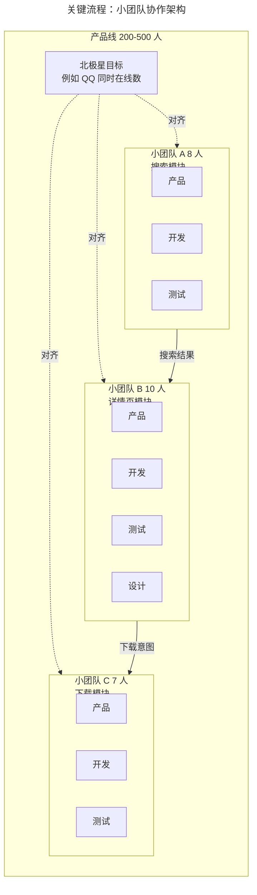
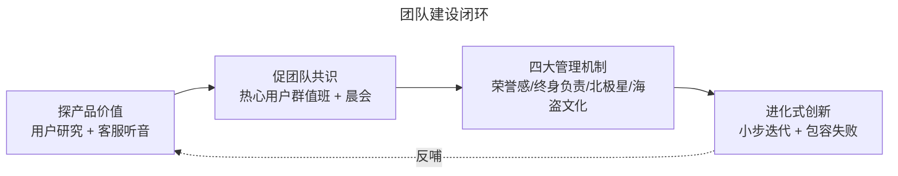

# 小团队如何做进化式创新：组织形态与管理机制

> **适用范围**：产研负责人、技术管理者、产品总监、需要设计高效产研组织的创业团队 Founder
> **更新摘要**：v2 在原版"小而全团队 + 瑞士军刀协作 + 四大管理机制"基础上，新增腾讯工作室制（IEG 工作室群）、微信事业群相对独立运作、天美/光子等独立团队 2024–2026 案例，并补充 AI 时代小团队的新挑战（AI 工程师与产品经理角色融合）。
> **版本**：v2 · 2026-08 更新

---

## 1. 导言

### 1.1 为什么是"小团队"

腾讯一个完整产品线往往需要几百人协同，但实战中真正高效的作战单元是 12 人以内的小团队。这背后的逻辑有三：

1. **决策效率**：小团队全权负责一个业务模块，无需跨组开会，可根据用户反馈与数据表现灵活决策；
2. **责任清晰**：团队全权负责，失败无法找借口、无法指责配合方，迫使团队直面问题；
3. **凝聚力**：12 人以内可围坐一桌吃饭，团队建设成本低、文化塑造效率高。

### 1.2 小团队大成就的三段论

本篇按"如何组建小而全团队 → 多个小团队如何协作 → 小团队如何取得大成就"三段论展开，并补充腾讯工作室制与独立团队案例。

### 1.3 适用范围

- 中大型产研组织的团队拆分与协作设计；
- 创业团队从 0 到 1 阶段的组织搭建；
- AI 时代小团队角色融合与协同机制设计。

---

## 2. 核心方法论

### 2.1 小而全团队的定义

"小而全"中的"小"指团队规模通常在 12 人以内；"全"指团队内拥有实现该产品模块所需的全部角色（产品经理、开发、运营、测试、设计师等）。

#### 2.1.1 与专业职能组的对比

| 维度 | 专业职能组（Function-based） | 小而全团队（Module-based） |
| --- | --- | --- |
| 组织方式 | 按产品经理组、开发组、测试组划分 | 按业务模块划分，每个团队全权负责一个模块 |
| 协作方式 | 跨组会议协调 | 团队内端到端决策 |
| 决策效率 | 低（需多方对齐） | 高（团队内自主） |
| 失败归因 | 容易互相推诿 | 无法推诿，必须直面问题 |

#### 2.1.2 为什么是 12 人

西方敏捷理论建议 5–9 人，国内因分工较细、全栈工程师稀缺，团队人数略多。12 人是国内绝大多数饭店圆桌的最大容量——超过这个数字团队建设时必须分两桌，对凝聚力不利。这是一个非常务实的判断标准。

### 2.2 瑞士军刀协作模型

多个小团队之间的协作模式被腾讯类比为"瑞士军刀"：每个小团队是瑞士军刀里一个独立的工具（大刀、小刀、开瓶器、剪刀等），用户在不同场景下使用不同工具，工具之间互补组合，应对日常情景。

**应用宝案例**：应用宝产研部门 200 多人拆成十几个小组，每个小组只负责产品的一个模块——A 小组负责搜索框，B 小组负责详情页。用户在搜索框输入关键词后，A 小组负责搜索结果相关性；用户点击 APP 进入详情页，B 小组负责详情页展示与下载转化。各小组功能独立又相互配合。

### 2.3 团队建设的两大目标

| 目标 | 含义 | 落地方法 |
| --- | --- | --- |
| 探产品价值 | 持续探索团队所负责产品/模块的用户价值 | 用户研究、客服听音、北极星指标对齐 |
| 促团队共识 | 团队对产品价值与方向形成共识，共同决策 | 热心用户群值班、客服听音、每日晨会 |

### 2.4 四大管理机制

1. **荣誉感强于责任感**：用荣誉感牵引团队前进，而非用责任感要求团队前进；
2. **特性终身负责制**：产品核心模块分配给一个小团队终身负责，提升荣誉感与责任闭环；
3. **北极星目标**：让全体成员拥有一个共同对齐的目标；
4. **海盗文化**：每个团队打造独有的文化，鼓励无畏与创新。

### 2.5 边界条件

- **不适用场景**：高度标准化的基础设施团队（如 SRE、DBA）难以按业务模块拆分；
- **组织前提**：需要授权文化，高度 KPI 驱动的组织难以复制；
- **AI 时代校准**：AI 工程师与产品经理的角色边界正在融合，小团队的"全"需要重新定义（详见第 5 节）。

### 2.6 关键术语对照

| 中文术语 | 英文对照 | 释义 |
| --- | --- | --- |
| 小而全团队 | Small Full-stack Team | 12 人内、全角色配齐的端到端团队 |
| 瑞士军刀协作 | Swiss Army Knife Collaboration | 多小团队功能独立又互补组合 |
| 特性终身负责制 | Feature Lifetime Ownership | 一个模块由一个团队终身负责 |
| 北极星指标 | North Star Metric | 团队共同对齐的核心指标 |
| 海盗文化 | Pirate Culture | 无畏与创新的组织文化 |

---

## 3. 关键流程：小团队协作架构

下图给出腾讯典型产品线的"小团队 + 瑞士军刀协作"组织架构，多个小团队通过模块边界清晰分工，通过北极星目标对齐方向。

**图 3-1 解读**：架构图的关键不是"小团队"本身，而是"模块边界 + 北极星对齐"的双重约束。模块边界保证各小团队功能独立、决策自主，避免跨组会议；北极星目标保证各小团队方向一致，避免局部最优。两者缺一——只有模块边界没有北极星，团队会各自为战；只有北极星没有模块边界，团队会陷入会议泥潭。

### 3.1 团队建设闭环

**图 3-2 解读**：团队建设不是一次性活动，而是"探价值—促共识—建机制—做创新"的闭环。闭环的关键反哺机制是"做创新"反哺"探价值"——每次创新尝试无论成败都会产生新的用户反馈，新的用户反馈又驱动团队重新探索产品价值。这个闭环一旦停滞（团队不再做创新或不再探价值），团队就会陷入官僚化。

---

## 4. 工具与实战

### 4.1 经典案例：QQ 邮箱 2000 项创新

QQ 邮箱团队分为十几个小团队，每个团队负责几个产品模块。2007 年全年累计完成约 1000 项产品创新，2008 年继续完成约 1000 项——平均每天三个创新。两年半时间，QQ 邮箱从默默无闻跃居中国电子邮箱头把交椅。

#### 4.1.1 附件提醒功能

用户在邮件正文中提及某个附件但忘记添加时，QQ 邮箱会主动提醒"是否忘记添加附件"，而不是立即发送。这是典型的小团队全权负责模块后产生的微创新——团队对"邮件发送"模块有完整决策权，可以快速上线这类人性化功能。

### 4.2 手机管家 vs 360 手机卫士：探产品价值的实战

360 手机卫士以杀毒起家，手机管家早期跟风首推病毒查杀。团队通过持续用户研究发现：2014 年安卓手机内存有限，用户的第一需求是垃圾清理而非杀毒。手机管家改版把垃圾清理作为第一功能，并用趣化方式把清理过程做成"小火箭发射"——用户非常喜欢，每天用好几次。最终手机管家战胜手机卫士夺得市场头筹。

### 4.3 微信语聊团队的特性终身负责制

2011 年 5 月微信发布语音聊天，但有一个硬伤：第一条语音用扬声器播放，紧接着下一条希望用听筒听，复杂切换让用户痛苦。初期临时方案是在"设置-通用"中增加"听筒模式"按钮。微信语聊团队持续打磨这个硬伤约一年半，直到 2012 年 12 月利用重力感应器与距离感应器准确识别用户语音播放意愿——手机摆在面前是扬声器播放，挪到耳朵上是听筒播放。**特性终身负责制使团队有动力持续打磨一个功能长达一年半。**

### 4.4 QQ 同时在线北极星目标

QQ 在 PC 时代发现"同时在线数"是提升活跃度与拉新效率的关键指标——同时在线数决定好友匹配效率与聊天及时回话率。2004 年推出"QQ 等级计划"（星星→月亮→太阳），用户挂机以提升等级，使同时在线数原定提升 25% 的目标最终提升 100% 以上。其他团队也围绕这个北极星目标配合——好友列表按等级排序、一个太阳可创建 2 个群等。最终 QQ 同时在线过亿，2010 年前稳居中国 IM 头把交椅。

### 4.5 腾讯工作室制与独立团队（2024–2026 补充）

#### 4.5.1 IEG 工作室群

腾讯互动娱乐事业群（IEG）采用工作室制，旗下天美（TiMi）、光子（Lightspeed）、魔方、北极光等工作室群相对独立运作。每个工作室群内部再拆分为多个工作室，工作室是真正的"小团队大成就"放大版：

- **天美工作室群**：王者荣耀、使命召唤手游等；
- **光子工作室群**：和平精英、PUBG Mobile 等；
- **独立性**：工作室在玩法设计、技术选型、运营节奏上有较高自主权；
- **2024–2026 案例**：天美持续打磨王者荣耀赛事生态与 AI 对手（基于混元），光子推出多款全球化手游，工作室制使各工作室能根据自身产品节奏独立决策。

#### 4.5.2 微信事业群的相对独立运作

微信事业群（WXG）在腾讯内部保持高度独立，张小龙直接向马化腾汇报。这种独立性使微信能够在过去 15 年保持"极简主义 + 用完即走"的产品哲学不被短期 KPI 干扰——视频号、小程序、搜一搜等新形态的孵化都依托这种独立性。

#### 4.5.3 视频号团队的小团队打法

视频号团队在 PCG 内部以小团队形式运作，独立于腾讯视频与微视，避免被既有内容业务惯性绑架。这种"赛马 + 独立"机制使视频号能够走通"社交关系链短视频"的差异化路径，而非复制抖音模式。

### 4.6 AI 时代的小团队新形态

#### 4.6.1 角色融合：AI 工程师与产品经理

传统小团队中"产品经理 + 开发 + 测试 + 设计"的角色边界，在 AI 时代正在融合：

| 新角色 | 职责 | 与传统角色关系 |
| --- | --- | --- |
| AI 产品经理 | Prompt 设计、模型能力评估、AI 体验设计 | 产品经理的进化 |
| AI 工程师 | 模型微调、Agent 编排、Evaluation 工程 | 开发 + 算法的融合 |
| AI 体验设计师 | AI 交互模式设计、幻觉控制、信任感设计 | 设计师的进化 |

#### 4.6.2 元宝 App 团队的小团队打法

腾讯元宝 App（AI 助手）以小团队形式独立运作，快速迭代 AI 体验。团队通过"客服听音 + 用户行为日志"双通道持续校准 AI 回答质量，是传统小团队方法在 AI 时代的延续。

### 4.7 工具清单

| 工具 | 用途 | 团队机制映射 |
| --- | --- | --- |
| TAPD / 企业微信 / 腾讯文档 | 小团队协同 | 小而全团队 |
| 客服听音系统 | 用户痛点捕捉 | 探产品价值 |
| 热心用户群 | 团队共识形成 | 促团队共识 |
| 微创新奖评奖系统 | 荣誉感激励 | 荣誉感强于责任感 |
| 北极星指标看板 | 团队方向对齐 | 北极星目标 |

---

## 5. 常见误区与避坑指南

### 误区 1：把"小团队"理解为"人数少就行"

小团队的本质是"全角色配齐 + 全权负责 + 失败无法推诿"。如果只是把大团队拆成小团队但保留跨组评审与外部依赖，决策效率反而会下降。

**避坑建议**：以"业务模块"而非"专业职能"划分团队，确保每个小团队具备端到端交付能力。

### 误区 2：把"特性终身负责制"理解为"模块永不调整"

特性终身负责制的本意是"团队对模块有长期责任"，而非"模块归属永不调整"。当团队士气低落或模块战略地位变化时，需要做组织调整。

**避坑建议**：每年至少做一次"模块战略评估"，对战略地位下降的模块做归属调整。

### 误区 3：把"北极星目标"理解为"KPI"

北极星目标是团队共同对齐的方向指标，而非强制 KPI。把北极星目标做成 KPI 会导致团队为了指标牺牲用户体验（如同时在线数指标可能导致鼓励挂机而非真实使用）。

**避坑建议**：北极星目标应与用户行为指标（如真实互动率）结合，而非纯业务指标。

### 误区 4：把"海盗文化"理解为"可以不守规矩"

海盗文化的本意是"无畏与创新"，而非"不守规矩"。QQ 邮箱的"每日闲聊文化"看似随意，实则有明确规则——不反对别人建议、以提出更吸引人的建议为目的。

**避坑建议**：海盗文化必须有明确的"创新规则"，否则会演变为无序。

### 误区 5：AI 时代仍沿用传统角色分工

AI 产品的开发节奏与传统互联网产品显著不同——Prompt 调整、模型微调、Evaluation 实验的迭代周期远短于传统开发。如果仍沿用"产品经理写 PRD + 开发实现 + 测试验证"的传统流程，会显著拖慢 AI 产品迭代。

**避坑建议**：AI 小团队应建立"Prompt 实验 + 模型评估 + 用户共测"的三轨迭代机制，产品经理与 AI 工程师共同参与 Prompt 设计。

### 误区 6：把"工作室制"等同于"独立王国"

工作室制的独立性是"产品决策独立"，而非"组织资源独立"。天美、光子等工作室在共享腾讯中台能力（混元大模型、腾讯云、用户增长平台）的前提下保持产品决策独立——这种"中台共享 + 前台独立"才是工作室制的正确形态。

**避坑建议**：工作室制必须配套强大的中台支持，否则各工作室重复造轮子。

---

## 6. 进阶延展与参考资料

### 6.1 小团队方法与外部方法论的对照

| 外部方法论 | 共通点 | 差异点 |
| --- | --- | --- |
| Amazon "Two-Pizza Team" | 团队规模小 | 腾讯叠加了"特性终身负责制" |
| Spotify Squad / Tribe | 模块化团队 | 腾讯更强调"北极星目标"对齐 |
| 微软 Hackathon 文化 | 鼓励创新 | 腾讯的"海盗文化"更常态化 |
| 字节跳动小前端 + 大中台 | 中台共享 + 前台独立 | 腾讯工作室制更强调长期归属 |

### 6.2 延伸思考题

1. 如果你是一个 50 人创业团队的 CTO，如何用"小而全团队 + 北极星目标"设计组织架构？
2. AI 时代小团队的角色融合（AI 产品经理 + AI 工程师 + AI 体验设计师）是否会破坏"全角色配齐"的小团队原则？还是更高阶的"全"？
3. 腾讯工作室制（天美、光子）与字节跳动小前端模式各有何优劣？在 AI 时代哪种更可持续？

### 6.3 参考资料

- 腾讯历年财报中关于 IEG 工作室群的披露；
- 公开报道：天美、光子工作室群 2024–2026 产品发布情况；
- 张小龙 2019 年微信公开课关于微信事业群独立性的公开阐释；
- 配套阅读：本课程第 05 篇《不懂人性何谈产品》将拆解人性洞察如何与产品创新结合。

---

> **下一篇**：第 05 篇《不懂人性何谈产品》——以佛教"贪嗔痴"为框架，以 Hook 模型为工具，并补充游戏化与社交心理在腾讯产品中的体现。