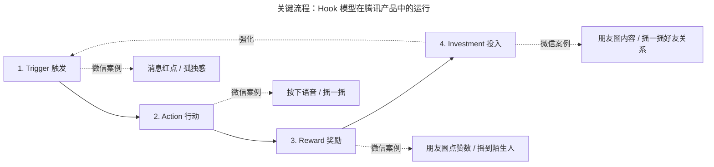
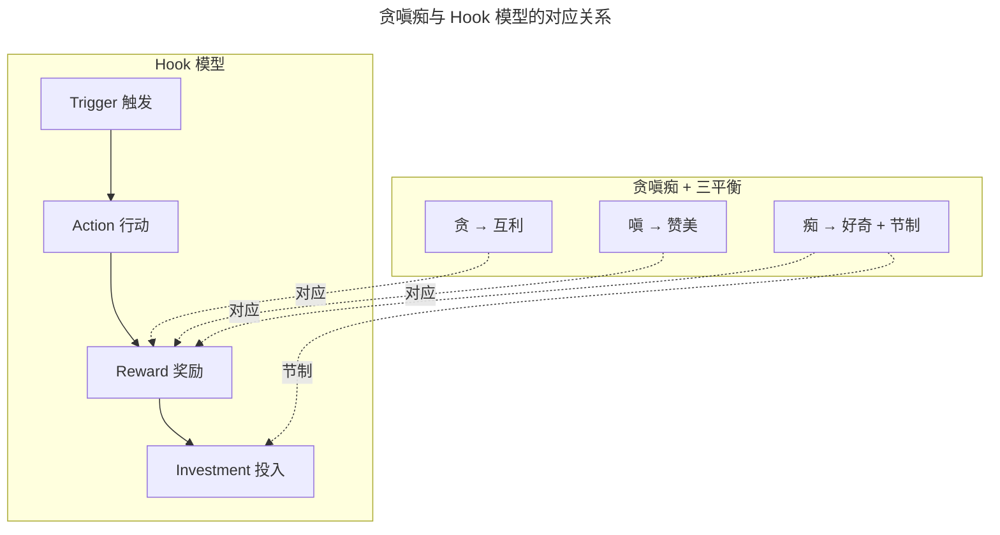

# 不懂人性何谈产品：贪嗔痴、Hook 模型与游戏化设计

> **适用范围**：消费互联网产品经理、社交/内容/游戏类产品负责人、AI 助手与 Agent 产品的体验设计师
> **更新摘要**：v2 在原版"贪嗔痴 + 三个腾讯思考"基础上，新增 Hook 模型（Nir Eyal）系统化解读、游戏化设计八大核心驱动力（Octalysis 框架）、2024–2026 年视频号/小程序/混元产品中的人性设计案例，并讨论 AI 时代上瘾模型的伦理边界。
> **版本**：v2 · 2026-08 更新

---

## 1. 导言

### 1.1 为什么要懂人性

张小龙说："产品终极是满足人性。"下半句是："人性就是贪嗔痴。"

这句话不是哲学修辞，而是产品方法论的核心命题。产品经理的使命是改善人类生活的品质，人性决定了一个人的行为特点——如果产品经理不懂人性，就无法预知用户如何使用产品，更无法设计出符合人性的功能。

### 1.2 本篇要回答的三个问题

1. 人性是否随技术与物质条件的进步而改变？答案是什么？
2. 如何用佛教"贪嗔痴"框架与 Hook 模型将人性洞察转化为产品设计动作？
3. 在 AI 时代，"满足人性"与"防止沉迷"的边界如何重新校准？

### 1.3 适用范围

- 消费互联网产品（社交、内容、游戏、电商）的功能设计；
- AI 助手与 Agent 产品的体验设计与伦理边界把控；
- 用户增长与留存的心理学机制设计。

---

## 2. 核心方法论

### 2.1 命题：人性不曾改变

19 世纪以来，人类社会从电力时代进入信息时代、AI 时代，物质条件发生巨大变化，但人性——贪、嗔、痴——并未改变。这一判断是产品方法论成立的基石：因为人性不变，所以基于人性的产品方法可以跨越时代复用。

### 2.2 佛教"贪嗔痴"框架

佛教将人性的三大毒归纳为贪、嗔、痴，与之对应的三美德是慷慨、感恩、节制。千百年来圣人与恶人都属于极少数，大部分普通人在三毒与三美德间摇摆。**产品经理的任务不是鼓励用户的恶，也不是苛求用户的善，而是在善恶之间寻找平衡点。**

| 三毒 | 含义 | 对应美德 | 产品平衡点 | 腾讯产品案例 |
| --- | --- | --- | --- | --- |
| 贪 | 妄图拥有或持续占有 | 慷慨 | 互利 | 微信"看一看"互惠内容分发 |
| 嗔 | 怨恨、不满、缺乏耐心 | 感恩、耐心 | 赞美 | 朋友圈只有点赞与评论、无负向评价 |
| 痴 | 痴迷、沉迷 | 节制 | 好奇 + 节制 | 漂流瓶每日限制捞取次数 |

### 2.3 Hook 模型：人性设计的工程化工具

Nir Eyal 在《Hooked: How to Build Habit-Forming Products》中提出的 Hook 模型（钩子模型）将上瘾机制工程化为四步循环，是"贪嗔痴"框架在产品层面的具体落地工具。

| 阶段 | 英文 | 含义 | 腾讯产品案例 |
| --- | --- | --- | --- |
| 触发 | Trigger | 内部或外部线索启动行为 | 微信消息红点（外部触发）、孤独感（内部触发） |
| 行动 | Action | 用户执行最简动作 | 按下语音按钮、摇一摇 |
| 奖励 | Reward | 给予变量奖励（多变、不确定） | 朋友圈点赞数量不确定、摇一摇摇到的人不确定 |
| 投入 | Investment | 用户留下数据/内容/关系，提升下次触发概率 | 朋友圈发的内容、摇一摇的好友关系 |

### 2.4 Octalysis 游戏化八大核心驱动力

Yu-kai Chou 的 Octalysis 框架进一步将游戏化设计拆解为八大核心驱动力，与"贪嗔痴"框架互补，可用于功能设计的精细化评估：

| 驱动力 | 含义 | 腾讯产品案例 |
| --- | --- | --- |
| 史诗意义与召唤 | 用户感到自己参与伟大事业 | 微信红包春节活动（连接亿万家庭） |
| 进度与成就 | 用户追求完成与里程碑 | QQ 等级（星星→月亮→太阳） |
| 创造力授权与反馈 | 用户自由表达并获得反馈 | 朋友圈、视频号创作 |
| 所有权与占有 | 用户对自己物品的占有欲 | QQ 秀、微信头像与昵称 |
| 社交影响与关联 | 用户之间的比较、认同、归属 | 微信运动排行榜、飞机大战排行榜 |
| 稀缺性与不耐 | 稀缺物引发追求 | 漂流瓶每日限制次数 |
| 不确定性与好奇 | 未知引发探索 | 摇一摇摇到陌生人 |
| 损失与避免 | 用户避免失去已有物 | 朋友圈三天可见触发用户主动发文 |

### 2.5 腾讯基于人性的三个平衡点

腾讯的人性设计哲学可被概括为三个平衡点：

1. **贪 → 互利**：通过互惠互利机制满足人性贪婪，避免单向索取；
2. **嗔 → 赞美**：通过只允许正向评价避免负向能量传播，营造良性社交氛围；
3. **痴 → 好奇 + 节制**：通过满足好奇心并设置节制机制（次数限制、时间限制）防止沉迷。

### 2.6 边界条件

- **不适用场景**：纯工具型产品（如计算器、文件管理器）不必强行套用人性框架；
- **伦理边界**：Hook 模型若被滥用会制造沉迷，需要产品经理主动设置节制机制（详见第 5 节）；
- **AI 时代校准**：AI 助手比传统产品更易触发"痴"——AI 回答的不确定性高度类似老虎机的变量奖励，需要更严格的节制设计。

### 2.7 关键术语对照

| 中文术语 | 英文对照 | 释义 |
| --- | --- | --- |
| 贪嗔痴 | Greed, Hatred, Delusion | 佛教人性三毒 |
| Hook 模型 | Hook Model | 触发-行动-奖励-投入的上瘾循环 |
| 变量奖励 | Variable Reward | 不确定性的奖励，最具上瘾性 |
| 游戏化 | Gamification | 将游戏机制应用于非游戏场景 |
| 上瘾模型 | Habit-Forming Loop | 促使用户形成习惯的产品机制 |

---

## 3. 关键流程：Hook 模型在腾讯产品中的运行

下图以 Hook 模型为骨架，标注腾讯代表产品在四个阶段的对应设计。

**图 3-1 解读**：Hook 模型的关键不在四个阶段本身，而在 **变量奖励**（Variable Reward）与 **投入**（Investment）两个阶段。变量奖励是上瘾性的核心——朋友圈点赞数不确定、摇一摇摇到的人不确定，这种不确定性比固定奖励更能驱动行为重复。投入阶段则是上瘾循环自我强化的关键——用户在朋友圈发的内容、摇一摇建立的好友关系都是沉没投入，这些投入会提升下次触发的概率。腾讯的人性设计哲学在于：**不消除变量奖励（保留产品吸引力），但通过节制机制（如漂流瓶次数限制、微信运动每天只算一次）控制投入节奏**。

### 3.1 贪嗔痴与 Hook 模型的对应关系

**图 3-2 解读**：贪嗔痴框架与 Hook 模型在"奖励"阶段高度重合——贪对应物质奖励、嗔对应社交认同奖励、痴对应探索不确定奖励。腾讯的方法论是在奖励阶段同时叠加"互利/赞美/好奇"的善性转化，并在投入阶段设置节制机制，避免痴走向沉迷。**这种"奖励阶段转化 + 投入阶段节制"的双重设计是腾讯人性设计的核心壁垒**。

---

## 4. 工具与实战

### 4.1 经典案例：微信 vs 米聊的语音聊天

2011 年 5 月米聊推出图片涂鸦功能，手机 QQ 一个月内跟进，微信始终没有跟进。微信基于人性判断：

- 图片涂鸦操作难度大，无论是否有美术功底都难以画得漂亮；
- 图片涂鸦不是刚需，仅是锦上添花；
- 微信转向研发语音聊天功能，因为语音聊天符合人性：说话比打字更自然、单位时间传递内容更多、操作简便（按下说话抬起发送）、专门做了流量优化。

#### 4.1.1 操作界面的极简对比

| 维度 | 微信 | 米聊 |
| --- | --- | --- |
| 操作行数 | 一排（按下说话，松开发送） | 两排（语音条与文字框相邻） |
| 误操作风险 | 低 | 高（移动场景易误触） |
| 语音时长限制 | 60 秒，只有播放/停止两状态 | 引入播放/停止按钮，视觉复杂 |
| 体验判断 | 简洁易于识别使用 | 复杂违背人性 |

最终微信胜利——用户的操作体验足够好，简单易于识别与使用。

### 4.2 朋友圈只有点赞：嗔 → 赞美的设计

朋友圈好友发送的内容只可以点赞或评论，没有"扔鸡蛋"等负向评价选项。这是基于人性的设计：

- 用户发的内容不好，好友可直接忽略；
- 用户发的内容好，好友可点赞表示认可；
- 增加负向评价会引发社交困境与争执，让好友之间增加误解。

中国所有匿名社交最后都失败了，症结在于匿名社交是负能量高度集中的地方，必然失去商业价值。微信朋友圈利用点赞功能发扬人性之善，营造充满正能量的社区。

### 4.3 看一看：贪 → 互利的设计

微信"看一看"通过互惠互利机制解决人性贪婪：

- 用户在朋友圈不会被淘宝/京东式的无尽列表淹没；
- 看一看展示的是朋友筛选过的优质内容；
- 用户既减少时间成本，又得到朋友认可；
- 不会像算法那样陷入极端——用户所交的朋友决定了能看到的内容。

### 4.4 漂流瓶与附近的人：痴 → 好奇 + 节制

#### 4.4.1 附近的人

打开附近的人，用户只能看到 100 米、200 米、500 米到 1000 米以内的人，再远距离的看不到——超过这个距离就不是"附近的人"的概念。通过这种限制设定帮助用户实现节制，同时满足好奇心。

#### 4.4.2 漂流瓶

QQ 邮箱漂流瓶满足用户好奇心，同时通过限制每天捞取漂流瓶的次数让用户学会节制。这是"好奇 + 节制"的典型设计。

### 4.5 2024–2026 人性设计案例

#### 4.5.1 视频号社交推荐：贪 → 互利在短视频的当代演绎

视频号不复制抖音的中心化算法分发，而是依托社交关系链——朋友点赞的内容会被推荐给好友。这种设计在人性层面的逻辑是：

- **贪 → 互利**：用户看到朋友筛选过的内容，减少选择成本；朋友获得点赞认同；
- **嗔 → 赞美**：视频号评论区整体偏向正向互动，与抖音评论区生态有差异；
- **痴 → 节制**：社交推荐的内容上限天然受朋友圈规模约束，避免算法式无尽沉浸。

#### 4.5.2 微信运动排行榜：嗔 → 赞美的当代延续

微信运动每天走步数最多的好友会霸占你的封面——这一设计与 2013 年飞机大战排行榜、QQ 等级星星月亮太阳的设计逻辑完全一致，都基于"社交比较 + 认同"的人性。**人性未曾改变**的判断在 2024–2026 年依然成立。

#### 4.5.3 小程序游戏化：Octalysis 框架的当代应用

2024–2025 年微信小程序游戏（如合成大西瓜、跳一跳等）的爆发性增长，验证了 Octalysis 框架的当代有效性：

- **进度与成就**：分数与排行榜；
- **社交影响**：好友排行榜、群分享挑战；
- **稀缺性**：每日挑战次数限制；
- **不确定性**：随机道具与关卡。

这些游戏化机制本质上仍是贪嗔痴与 Hook 模型的当代应用。

#### 4.5.4 混元 AI 助手：痴的新边界

AI 助手在人性层面引入了一个新问题：**AI 回答的不确定性比传统变量奖励更具上瘾性**——用户不知道 AI 这次会给出什么样的回答，这种不确定性高度类似老虎机。腾讯混元 AI 助手在产品设计中采取了几个节制措施：

- **场景化克制**：在腾讯会议、腾讯文档中只回答与当前场景相关的问题，不主动扩展；
- **回答边界**：在元宝 App 中明确告知用户 AI 的能力边界，避免用户产生"AI 全知全能"的痴迷；
- **使用频率提示**：在长时间连续对话后提示用户"适当休息"。

### 4.6 工具清单

| 工具 | 用途 | 人性设计阶段 |
| --- | --- | --- |
| Hook 模型画布 | 拆解产品的上瘾循环 | 触发-行动-奖励-投入 |
| Octalysis 评估表 | 评估八大驱动力覆盖度 | 游戏化设计 |
| 用户访谈与行为日志 | 识别内部触发 | 触发设计 |
| AB 实验平台 | 验证奖励机制有效性 | 奖励设计 |
| 节制机制清单 | 防止痴走向沉迷 | 投入节制 |

---

## 5. 常见误区与避坑指南

### 误区 1：把"满足人性"理解为"利用人性弱点"

满足人性是在善恶之间寻找平衡点，既顺应本性又帮助用户成长。利用人性弱点（如无限信息流、变量奖励滥用）制造沉迷，是产品经理的失职。

**避坑建议**：每个上瘾机制设计必须配套节制机制，如使用时长提醒、次数限制、内容质量过滤。

### 误区 2：把"贪嗔痴"理解为"必须三毒俱全"

不是每个产品都需要同时满足贪嗔痴。工具型产品可能只需"嗔 → 赞美"（如简洁的反馈），内容型产品可能更需"痴 → 好奇 + 节制"。

**避坑建议**：根据产品定位选择 1–2 个核心人性维度深度设计，避免生搬硬套。

### 误区 3：把"节制机制"理解为"伤害用户体验"

节制机制（如漂流瓶次数限制）不是伤害体验，而是保护用户长期体验。没有节制的产品会快速引发用户疲劳与道德焦虑，最终失去用户。

**避坑建议**：节制机制设计应"轻量化"——通过自然限制（如距离限制、次数限制）而非强制限制（如弹窗警告）实现。

### 误区 4：在 AI 时代忽视"痴"的新形态

AI 助手的变量奖励（不确定的回答）比传统产品更具上瘾性。许多团队在 AI 产品中盲目追求"用户停留时长"，反而制造了新型沉迷。

**避坑建议**：AI 产品应将"用户问题解决率"作为北极星指标，而非"用户对话轮数"或"用户停留时长"。

### 误区 5：把 Hook 模型当作"上瘾工具"

Hook 模型是用户习惯形成的工程化描述，其本意是"帮助用户形成有益习惯"，而非"制造沉迷"。Nir Eyal 在后续著作《Indistractable》中专门讨论了如何帮助用户掌控注意力、摆脱分心，即产品应帮助用户在不需要时离开。

**避坑建议**：Hook 模型设计应配套"反 Hook 机制"——让用户能够主动退出循环（如微信"退出登录"、视频号"休息提醒"）。

### 误区 6：把"朋友圈只有点赞"理解为"避免一切负反馈"

朋友圈只有点赞不等于避免一切负反馈——评论功能依然允许文字反馈，只是不提供"扔鸡蛋"这种单向负指标。负反馈的设计应该是"建设性、可对话"的，而非"破坏性、单向"的。

**避坑建议**：负反馈机制设计应配套对话能力，避免变成单向攻击。

---

## 6. 进阶延展与参考资料

### 6.1 人性设计与外部方法论的对照

| 外部方法论 | 共通点 | 差异点 |
| --- | --- | --- |
| Hook Model（Nir Eyal） | 上瘾循环工程化 | 腾讯叠加了"贪嗔痴 + 三平衡"的伦理框架 |
| Octalysis（Yu-kai Chou） | 游戏化八大驱动力 | 腾讯更强调"节制"对痴的平衡 |
| BJ Fogg 行为模型（B=MAP） | 行为 = 动机 × 能力 × 触发 | 腾讯更强调人性层面的动机分析 |
| 上瘾伦理学（Indistractable） | 防沉迷设计 | 腾讯的节制机制更前置（设计阶段） |

### 6.2 延伸思考题

1. 视频号社交推荐与抖音算法推荐，在人性层面的差异是什么？哪种更可持续？
2. AI 助手的变量奖励（不确定的回答）是否需要被监管？如何设计行业自律机制？
3. 微信"用完即走"理念与 Hook 模型是否矛盾？还是更高阶的 Hook？

### 6.3 参考资料

- 张小龙 2019 年微信公开课演讲（关于"人性"与"用完即走"的公开阐释）；
- Nir Eyal《Hooked: How to Build Habit-Forming Products》；
- Yu-kai Chou《Actionable Gamification》；
- 公开报道：视频号社交推荐机制（2024–2025）、混元 AI 助手节制设计（2025–2026）；
- 配套阅读：本课程第 06 篇《如何打造一款有温度的产品》将把人性洞察落到"超出预期"的需求设计（Kano 兴奋型需求）。

---

> **下一篇**：第 06 篇《如何打造一款有温度的产品》——以 Kano 模型识别"兴奋型需求"为核心，讨论如何在既有触点上释放善意，打造用户情感层面的超预期体验。