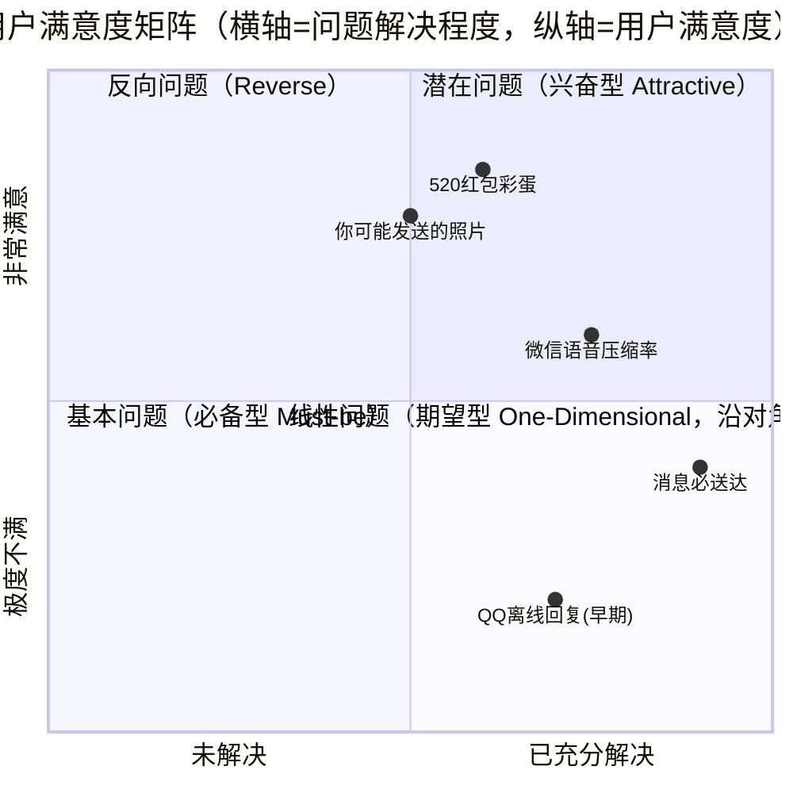
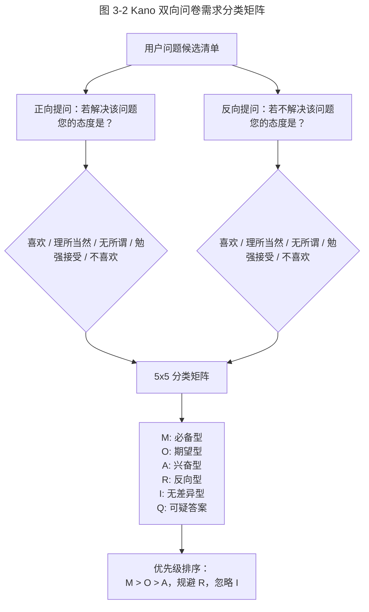
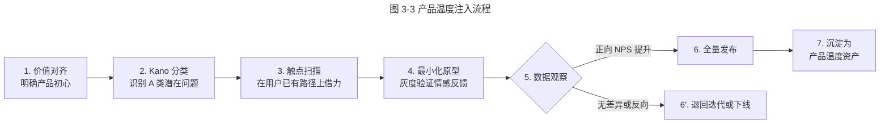

# 如何打造一款有温度的产品

> **适用范围**：面向 1–5 年经验的产品经理、产品运营、交互设计师与研发负责人，重点解决"功能完备但用户无感"的体验差异化问题。
> **更新摘要**：v2 在原"Kano 四类用户问题"基础上，扩充了潜在问题（兴奋型需求）的可操作识别矩阵，新增微信、腾讯公益、信息无障碍、未成年人保护、AI 助老等 2024–2026 实战案例；将原口语化叙述升级为方法论体；移除失效的 `/product-images/` 图片，改用 Mermaid 图与表格呈现。
> **版本**：v2 · 2026-08 更新

## 1. 导言

### 1.1 为什么"温度"成为产品差异化的关键

在功能同质化严重的移动互联网下半场，"功能可用"已成为准入门槛而非竞争优势。用户对一款产品的认同感，越来越取决于它在解决功能性问题之外，能否在情感层面"超出预期"。腾讯前 CTO 张志东（Tony）曾对 2009 年的 QQ 空间给出一句评语——"咱们这个产品什么都好，就是没有爱"——这句话成为腾讯产品方法论中"产品温度"概念的起点（该引语及《产品里要有爱》（2010）出处截至 2026-09-11 未检索到公开来源，存疑）。

### 1.2 本文要回答的三个问题（Why / What / 适用范围）

- **Why**：为什么同样的功能完备度，有的产品能让用户主动传播，有的却被冷落？
- **What**：什么是"产品温度"？它对应需求理论中的哪一类问题？如何用结构化方法识别和满足？
- **适用范围**：C 端高频消费产品、平台型社交产品、工具型产品。B 端 SaaS 与内部系统可借鉴方法论但不作为主要场景。

## 2. 核心方法论

### 2.1 定义

**产品温度**（Product Warmth）：产品在满足用户功能性预期之外，主动识别并解决"潜在问题"（兴奋型需求，Kano 模型中的 Attractive Quality），从而在用户心智中产生"被理解""被善待"等正向情感反馈的能力。它不是文案语气、不是 UI 配色，而是需求层次的升维。

### 2.2 设计原则

1. **回归初心**：产品设计初心是"解决用户问题"，而非"完成公司 KPI"。商业目标是结果，不是动机。
2. **超出预期优先于堆叠功能**：解决线性问题（One-Dimensional Quality）只能让满意度线性提升，而解决潜在问题可触发"惊喜—传播—留存"的非线性放大。
3. **借力而非造作**：温度不是过度情感化文案，而是借助产品既有触点自然释放善意（如 QQ 空间 404 公益寻人、微信红包 520 彩蛋）。
4. **可访问性是底线温度**：信息无障碍（Accessibility）与适老化不是"加分项"，而是现代产品的必备基础。

### 2.3 边界条件

| 边界 | 描述 | 典型反例 |
| --- | --- | --- |
| 行业边界 | 强监管行业（金融、医疗）的"温度"必须以合规为前提 | 理财产品为博好感减免风险提示 |
| 频次边界 | 极低频产品（如婚庆、二手车）不应过度投入日常温度建设，应聚焦关键决策时刻 | 极低频工具每天推送情感化文案 |
| 成本边界 | 温度设计须可规模化，不能依赖一次性人工关怀 | 仅靠客服人工"送温暖"无法规模化 |
| 隐私边界 | 借用户数据制造"惊喜"必须遵守最小必要原则 | 用私人照片做未经授权的生日祝福 |

### 2.4 关键术语对照

| 中文术语 | 英文对照 | 出处/提出者 |
| --- | --- | --- |
| 基本问题 / 必备型需求 | Must-be Quality | Kano 模型（狩野纪昭，1984） |
| 线性问题 / 期望型需求 | One-Dimensional Quality | Kano 模型 |
| 潜在问题 / 兴奋型需求 | Attractive Quality | Kano 模型 |
| 无差异问题 | Indifferent Quality | Kano 模型 |
| 反向问题 | Reverse Quality | Kano 模型 |
| 信息无障碍 | Accessibility | W3C WCAG 标准 |

## 3. 关键流程

### 3.1 用 Kano 模型识别四类用户问题

**图 3-1 解读**：四象限分布揭示了产品投入的优先级逻辑。基本问题不解决必遭差评，解决了用户也视为"应当"，不会产生情感加分；线性问题随解决程度线性提升满意度，是工程投入的"硬功夫"战场（如语音流量压缩、耗电优化）；潜在问题一旦解决即可触发超额满意度，是"产品温度"的主战场；反向问题做得越多用户越反感，必须主动规避。资源分配原则：先守住基本问题，持续优化线性问题，主动识别并选择性投入潜在问题。

### 3.2 双向问卷矩阵：从海量用户中识别潜在问题

**图 3-2 解读**：该矩阵通过对同一问题正反两次提问，将用户态度交叉成 5×5 的分类表，得出 M（Must-be，必备）、O（One-Dimensional，期望）、A（Attractive，兴奋）、R（Reverse，反向）、I（Indifferent，无差异）、Q（Questionable，可疑）六类标签。实操中，先做小样本（30–50 人）开放式访谈生成候选清单，再用 200–500 份问卷完成 Kano 量化分类，最后通过 Better/Worse 指数排序确定研发优先级。

### 3.3 产品温度注入的端到端流程

**图 3-3 解读**：温度注入不是一次性活动而是闭环。第 3 步"触点扫描"尤为关键——优秀的温度设计几乎都借助用户已有路径（如 404 页面、节日、生日、首次使用引导），而非另起炉灶。第 5 步必须以 NPS（Net Promoter Score，净推荐值）、自发传播率、留存率等情感性指标判断，而非单纯的点击率。

## 4. 工具与实战

### 4.1 QQ 空间 404 公益寻人：温度注入的经典案例（2012–2014）

QQ 空间每天有大量页面因链接失效或权限问题返回 404 错误页。原页面仅展示技术性提示信息。团队由员工志愿者发起，与"宝贝回家"寻子网等公益机构合作，将走失儿童信息替换至 404 页面（2013 年已帮助 18 名儿童回家，2014 年引入社交广告精准定位），借助 QQ 空间的海量访问自然传播寻人信息。这一改动几乎零开发成本，却在用户心智中种下"腾讯是有温度的公司"的认知， Pony 在微博亲自转发表扬（截至 2026-09-11 未检索到公开出处，存疑）。

**方法论价值**：典型"借力触点 + 解决潜在问题"。404 是用户既有的高频触点，寻人信息满足社会善意诉求，但用户从未预期一款社交产品会承载这类功能——超出预期，触发情感共振与自发传播。

### 4.2 微信 520 红包彩蛋：用约束制造惊喜

每年 5 月 20 日（"520"谐音"我爱你"），微信支付将单笔红包上限从 200 元临时提升至 520 元，仅当日 24 小时有效。这一彩蛋的设计精妙之处：

- **稀缺性**：仅 1 天有效，制造社交货币；
- **自传播性**：用户主动晒单，朋友圈自发形成传播；
- **低成本**：仅修改一个配置项，无需任何额外补贴；
- **品牌情感化**：将"520"语义与微信支付深度绑定。

2024 年 5 月 20 日，微信支付 520 红包当日发送量再创新高，成为情侣节日表达的固定仪式之一（截至 2026-09-11 未检索到公开出处，存疑）。

### 4.3 腾讯公益：把善意变成可运营的资产

腾讯公益慈善基金会是国内最早的互联网公益平台之一，2015 年发起"99 公益日"（每年 9 月 7–9 日），通过 1:1 配捐机制将公众捐款放大，并接入微信、QQ、微信支付等社交支付场景。

| 年份 | 99 公益日关键数据 | 里程碑意义 |
| --- | --- | --- |
| 2015 | 首届 99 公益日 | 行业首个全民公益节日 |
| 2019 | 募款超 17 亿元 | 调整为理性公益（单人单日最高获配捐 999 元，限制的是配捐而非捐款） |
| 2023 | 全面接入视频号直播公益 | 公益内容化、年轻化（该年份—事件对应截至 2026-09-11 未检索到公开出处，存疑） |
| 2024 | 强调"透明公益"与区块链溯源 | 捐赠链路全程上链可查（该年份—事件对应截至 2026-09-11 未检索到公开出处，存疑） |

**方法论价值**：腾讯将公益从"企业责任"升级为"产品能力"。捐款行为通过社交关系链裂变，本质是将潜在社会善意产品化。

### 4.4 信息无障碍与适老化：温度的工程化底线

腾讯是中国信息无障碍产品联盟（2013 年发起成立）的发起成员之一，推动微信、QQ、QQ 邮箱等核心产品接入读屏软件支持。

| 维度 | 微信实践 | 行业意义 |
| --- | --- | --- |
| 视障无障碍 | 聊天界面、朋友圈、小程序支持 VoiceOver / TalkBack | 国内最早接入读屏的主流社交 App |
| 听障辅助 | 语音转文字、视频通话实时字幕 | 约 2021 年微信上线视频通话实时字幕 |
| 适老化改造 | "关怀模式"：大字号、高对比度、简化导航 | 响应工信部 2021 年适老化改造要求 |
| 认知友好 | 关键操作提供二次确认与撤回 | 防诈骗设计 |

### 4.5 未成年人保护与青少年模式（2024–2026 升级）

青少年模式是腾讯产品温度在合规边界的最新体现：

- **微信青少年模式**：视频号/直播默认累计使用 40 分钟（需监护密码延长）、每日 22:00–6:00 禁用视频号服务，并提供青少年内容池（限制仅限视频号/直播，2021 年 8 月引入、2024 年 5 月升级）；
- **视频号青少年内容**：与教育部门合作白名单，过滤低质内容；
- **游戏防沉迷**：腾讯游戏实名认证与未成年人时段限制（仅周五六日及法定节假日 20:00–21:00），2024 年未成年人在腾讯本土市场游戏时长占比降至 0.2%（腾讯游戏 2025 年 2 月公布，创有记录以来年度新低；0.7% 为 2023 年口径）；
- **AI 内容审核**：2025 年微信接入 AI 生成内容标识，青少年模式下自动屏蔽未标识 AIGC（标识办法 2025-09-01 施行为真；"青少年模式下自动屏蔽未标识 AIGC"截至 2026-09-11 未检索到公开出处，存疑）。

### 4.6 AI 助老：温度的新战场（2025–2026）

2025 年，腾讯 SSV"银发科技伙伴计划"升级发布（其银发科技实验室约 2021 年成立），结合 AI 与数字化能力为老年人提供：

- **微信语音助手适老版**：方言识别、慢速语音播报、医疗问诊预问诊（截至 2026-09-11 未检索到公开出处，存疑）；
- **AI 防诈骗提醒**：基于通话内容实时识别诈骗话术并弹窗预警（截至 2026-09-11 未检索到公开出处，存疑）；
- **腾讯 SSV（可持续社会价值事业部，2021 年成立，下设银发科技实验室等）**：投入银发科技、科技助残、碳中和等长期议题。

这是"产品温度"从单一功能到平台级能力的跃迁。

## 5. 常见误区与避坑指南

| 误区 | 表现 | 避坑方法 |
| --- | --- | --- |
| **将温度等同文案包装** | 大量使用"亲爱的""暖心"等情感化措辞，但功能体验不变 | 温度是需求层级的升维，不是 UI 层的粉饰 |
| **过度创新脱离触点** | 为温度设计另起炉灶，导致用户根本走不到那个功能 | 必须在用户既有高频路径上借力释放 |
| **把潜在问题当基本问题** | 投入大量资源做用户没预期的功能，发现数据无反应 | 用 Kano 双向问卷先做分类，再决定投入 |
| **温度设计不可规模化** | 仅靠客服人工关怀，无法规模化复制 | 设计可配置、可自动化的机制（如配置化彩蛋） |
| **忽视隐私边界** | 利用用户隐私数据制造惊喜，引发反感 | 最小必要原则，敏感场景必须显式授权 |
| **温度设计一次性** | 节日彩蛋过后无沉淀 | 沉淀为产品资产（如青少年模式、无障碍能力） |

## 6. 进阶延展与参考资料

### 6.1 进阶延展

- **Kano 模型的扩展**：需求类别会随时间迁移——兴奋型需求随时间会衰减为期望型甚至必备型（Kano 本人在 2001 年《Life Cycle and Creation of Attractive Quality》中讨论过魅力质量生命周期，学界一般称 Dynamic Kano）；名为"Timed Kano"的变体及提出者"Hiroyuki Nagamichi（2020）"截至 2026-09-11 未检索到任何公开出处，存疑。例如，2015 年微信红包是兴奋型，2025 年已是必备型。
- **服务设计（Service Design）视角**：产品温度是用户旅程中关键时刻（Moments of Truth）的情感管理，参考 Marc Stickdorn《This is Service Design Thinking》。
- **行为经济学解释**：Kahneman 与 Tversky 的前景理论表明，等量损失带来的痛苦约为等量收益带来的快乐的 2 倍以上（损失厌恶）——这既说明超预期的"惊喜"（收益端峰值体验）能制造强烈的正向记忆，也提醒温度设计必须避免"惊喜落空"转化为加倍放大的负向体验。

### 6.2 参考资料

1. Kano, N., et al. (1984). *Attractive Quality and Must-Be Quality*. Journal of the Japanese Society for Quality Control.
2. 张志东（Tony）2010 内部讲话《产品里要有爱》（截至 2026-09-11 未检索到公开出处，存疑）。
3. 张小龙 2016 微信公开课《微信的产品价值观》（2016-01 微信公开课 PRO 演讲属实，讲题名截至 2026-09-11 未检索到公开出处，存疑）。
4. 中国信息无障碍产品联盟，《移动应用无障碍设计规范》（该规范名称截至 2026-09-11 未检索到公开出处，存疑）。
5. 腾讯研究院，《数字时代未成年人保护报告（2024）》（截至 2026-09-11 未检索到该报告的公开出处，存疑）。
6. 腾讯 SSV，《2025 可持续社会价值报告》（截至 2026-09-11 未检索到该版本报告的公开出处，存疑）。

---
