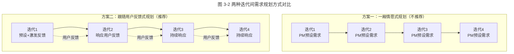
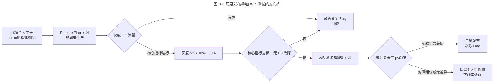

# 如何让产品小步快跑

> **适用范围**：面向互联网产品经理、研发负责人、测试负责人与项目经理，重点解决传统瀑布式研发在创新型业务中"延期、反复、用户无感"的困境。
> **更新摘要**：v2 在原 QQ 空间敏捷转型案例基础上，扩充腾讯灰度发布机制、A/B Testing 实践、可观测性建设，补 2024–2026 容器化与Feature Flag 工程实践；将原故事化叙述升级为方法论体；移除失效 `/product-images/` 图片，改用 Mermaid 图与表格。研发流程更系统的论述见《02-技术管理/研发流程与效率》（交叉引用）。
> **版本**：v2 · 2026-08 更新

## 1. 导言

### 1.1 为什么"小步快跑"在创新型业务中是必选项

移动互联网下半场，市场窗口缩短至 3–6 个月，传统"两月一版本、评审到测试串行"的瀑布研发模式（Waterfall Model）已无法响应。腾讯在 2006 年前后面临 QQ 空间"用户暴增—性能崩溃—团队互责"的恶性循环，最终通过敏捷转型（Agile Transformation）将"两个多月一版"压缩到"每周 80 次进化"，成为进化式产品创新（Evolutionary Product Innovation）的经典样本。

### 1.2 本文要回答的三个问题

- **Why**：为什么大步跑（Revolution）必然失败，小步跑（Evolution）才能持续给用户带来惊喜而非意外？
- **What**：什么是进化式产品创新？它需要哪些技术、组织、流程准备？
- **适用范围**：创新型 C 端产品、平台型业务；强合规或硬件产品需裁剪使用。

## 2. 核心方法论

### 2.1 定义

**小步快跑（Evolutionary Product Innovation）**：以短迭代周期（1–4 周）持续发布小颗粒度功能，通过快速验证与即时调整逼近真实用户需求的研发范式。其英文 Evolution 源自去掉 Revolution 的 "R"，寓意以连续进化替代一次性革新。

### 2.2 与传统瀑布模式的对比

| 维度 | 瀑布式（Revolution） | 进化式（Evolution） |
| --- | --- | --- |
| 发布周期 | 2–3 月/版 | 1–4 周/迭代，可日内多次发布 |
| 需求变更 | 评审后冻结，变更代价高 | 迭代内冻结、迭代外随时变更 |
| 风险暴露时点 | 上线前夕 | 每日 / 每周 |
| 团队结构 | 职能型（产品 / 研发 / 测试分立） | 特性团队（Feature Team，跨职能小团队） |
| 用户反馈 | 上线后收集 | 迭代内即可灰度验证 |
| 心理模型 | "完美交付" | "持续逼近真实需求" |

### 2.3 三大准备原则

1. **技术架构可独立部署**：业务模块解耦、API 契约稳定、基础数据统一存储。
2. **组织按业务模块切分**：每个特性小组覆盖产品 / 研发 / 测试 / 设计全栈能力。
3. **研发模式迭代化**：迭代周期短而稳定，迭代内需求冻结，迭代间根据用户反馈调整。

### 2.4 边界条件

| 边界 | 描述 | 适配建议 |
| --- | --- | --- |
| 强监管行业 | 金融支付核心、医疗影像等需前置审批 | 创新层做小步快跑，合规层做厚发布门 |
| 硬件产品 | 供应链周期长，无法周更 | 软件 OTA 周更 + 硬件年度大版本 |
| 极低频产品 | 用户访问频率低于月度 | 按版本周期对齐，不必追求周更 |
| 高危变更 | 涉及资金、隐私、安全的变更 | 全量灰度 + 紧急回滚预案 |

### 2.5 关键术语对照

| 中文术语 | 英文对照 | 说明 |
| --- | --- | --- |
| 灰度发布 | Grayscale Release / Canary Release | 按用户分批放量，逐步扩大覆盖 |
| A/B 测试 | A/B Testing | 同一时刻对流量分组对照实验 |
| 特性团队 | Feature Team / Cross-functional Team | 跨职能、长期负责某业务模块 |
| 迭代周期 | Iteration / Sprint | Scrum 中典型为 2 周 |
| 特性开关 | Feature Flag / Feature Toggle | 代码已部署但运行时开关控制可见性 |
| 持续集成 | Continuous Integration, CI | 代码提交即自动构建测试 |
| 持续部署 | Continuous Deployment, CD | 通过测试后自动部署到生产环境 |

## 3. 关键流程

### 3.1 双周迭代内团队协作节奏

```mermaid
---
title: 图 3-1 双周迭代内团队协作时序（参考 QQ 空间第十版迭代规划）
---
gantt
    title 双周迭代内团队协作时序
    dateFormat X
    axisFormat %s
    section 产品
    需求整理与规划       :a1, 0, 3
    需求评审会           :crit, a2, 3, 1
    验收与反馈           :a3, 8, 5
    section 研发
    架构拆解             :b1, 4, 1
    开发与每日提测       :b2, 5, 7
    发布支持             :b3, 12, 1
    section 测试
    用例编写             :c1, 4, 2
    每日提测与回归       :c2, 6, 6
    section 发布
    灰度与全量发布       :crit, d1, 12, 1
```

**图 3-1 解读**：迭代开始前一周的周三至周五，产品经理独立做需求收集与规划，可与上一迭代并行。第一周周一上午召开需求评审会，下午技术与测试并行做拆解与用例。第一周周二至第二周周四进入研发期——核心特征是"当日开发次日提测、第三日产品验收"，将传统"测试后置"改为"测试伴随开发"，问题暴露在 24 小时内而非上线前夕。第二周周五完成灰度与全量发布。运行 6–8 个迭代后，团队会形成稳定节奏，工时估算误差也因周期短而显著缩小。

### 3.2 迭代间需求规划：跟随用户反馈而非一厢情愿

**图 3-2 解读**：方案一完全按产品经理预设推进，用户反馈不被纳入；方案二在第一迭代主动设计"激发反馈"的钩子（如显式反馈入口、内测群、行为埋点），后续迭代以用户反馈为主轴。腾讯的实战经验表明，方案二的产品成功率显著高于方案一——产品经理的"想当然"在创新型业务中命中率有限。这与第 8 课《人人都是增长黑客》中"运营反哺产品"形成闭环。

### 3.3 灰度发布与 A/B 测试叠加流程

**图 3-3 解读**：现代发布门是"灰度 + A/B + Feature Flag"三件套叠加。Feature Flag 让代码合入与可见性解耦，可在代码已部署但功能未对用户开放的状态下安全驻留。灰度按 1% → 5% → 10% → 50% 阶梯放量，每档观察核心指标（崩溃率、性能、转化率）。灰度通过后进入 A/B 阶段，按 50/50 分流做统计显著性判断（通常要求 p<0.05 且样本量充足）。这一流程是 2024–2026 腾讯、字节、美团等大厂发布平台的标配，比单纯灰度更严谨。

## 4. 工具与实战

### 4.1 QQ 空间敏捷转型（2006–2009）：进化式创新的原型

QQ 空间在 2006 年被列入腾讯敏捷转型六支试点团队之一，从三个层面完成转型：

1. **技术架构调整**：将好友关系、用户资料、权限等基础数据统一存储，业务模块（相册、日志、留言、迷你屋、音乐）按 API 契约解耦，可独立开发与发布。框架模块专注性能与稳定性，应用模块聚焦创新。
2. **团队组织优化**：按业务模块切分特性小组，每个小组包含产品、研发、测试、设计全栈能力。决策在小组内闭环，无需跨部门请示。
3. **研发模式升级**：缩短研发周期至周更；引入自动发布系统，迭代周期与发布周期解耦；迭代内需求冻结、迭代外可随时变更。

最终 16 个业务模块每天可发布新版本，每周累计 80 次进化——用户几乎感受不到变化，但产品体验持续改善。这是"进化式创新"最直接的工程化证明。

### 4.2 腾讯灰度发布机制

腾讯灰度发布体系的核心能力：

| 能力 | 描述 |
| --- | --- |
| 用户分桶 | 按 QQ 号 / 微信 OpenID 哈希分桶，可精确到万分之一流量 |
| 多维度交叉 | 可按地域、机型、版本、网络环境、用户标签组合灰度 |
| 实时回滚 | Feature Flag 一键关闭，秒级回滚至上一版本 |
| 业务监控 | 灰度期间核心业务指标实时大盘，异常自动告警并熔断 |
| 白名单灰度 | 内部员工、种子用户、KOL 提前体验 |

### 4.3 A/B 测试平台实践

腾讯 A/B 测试平台（内部代号 Darwin）支持：

- **流量正交**：多个实验并行不互相干扰，单用户可同时参与多个实验；
- **分层实验**：UI 层、算法层、商业化层独立实验，避免实验污染；
- **统计显著性校验**：自动计算 p 值、置信区间、最小可检测效应（MDE）；
- **实验报告自动生成**：核心指标、次级指标、护栏指标（Guardrail Metrics，如崩溃率、留存）。

参考第 8 课《人人都是增长黑客》：微信"摇一摇"500 公里的神奇数字，本质就是一次长期 A/B 测试的产物——通过持续调整距离参数观察搭讪成功率，最终收敛到 500 公里以上的安全距离。

### 4.4 2024–2026 工程实践：Feature Flag + 容器化 + 可观测性

近年进化式创新在工程上的最新演进：

| 趋势 | 2024–2026 实践 | 价值 |
| --- | --- | --- |
| Feature Flag 平台化 | 与 GitLab / TAPD / COD 深度集成，Flag 全生命周期管理 | 代码与发布解耦，降低发布风险 |
| 容器化（K8s） | 微服务全部容器化，灰度即流量切分 | 灰度粒度从用户级到请求级 |
| 可观测性（Observability） | 日志、指标、链路追踪三件套（OpenTelemetry） | 灰度期间异常可在分钟级定位 |
| AI 辅助测试 | 大模型生成测试用例、自动回归 | 测试人力瓶颈缓解，迭代可更短 |
| 紧急回滚预案 | 蓝绿部署、金丝雀发布、流量镜像 | 故障爆炸半径可控 |

### 4.5 不同产品形态的迭代周期建议

| 产品形态 | 建议迭代周期 | 腾讯代表 |
| --- | --- | --- |
| PC 端软件 | 月度 | QQ PC 端（每年 4 大 8 小版本） |
| 手机 App | 双周 | 微信 App 早期、手机 QQ |
| Web 应用 | 周更 | QQ 空间（每周 80 次进化） |
| 小程序 / H5 | 周更甚至日更 | 视频号小程序、微信支付场景 |
| 后端服务 | 持续部署 | 腾讯云 TKE 容器化部署 |
| 强监管模块 | 月度 + 多重发布门 | 微信支付核心账务 |

## 5. 常见误区与避坑指南

| 误区 | 表现 | 避坑方法 |
| --- | --- | --- |
| **小步快跑等于赶进度** | 压缩测试与评审时间，质量塌方 | 短周期靠工程能力（自动化、灰度）支撑，不是靠加班 |
| **迭代内允许需求变更** | 迭代内频繁插需求，团队节奏被打乱 | 迭代内严格冻结，新需求进下一迭代池 |
| **灰度即万能** | 灰度上线后不做数据观察，等于没灰度 | 灰度必须配合核心指标大盘与回滚预案 |
| **A/B 测试样本不足** | 流量小且实验周期短，统计无显著性 | 提前计算 MDE，保证样本量与时长 |
| **Feature Flag 滥用** | Flag 上线后不清理，技术债累积 | 设定 Flag 过期时间，定期清理 |
| **小团队照搬大厂流程** | 中小团队强行套用复杂发布门 | 按团队规模裁剪，先做"迭代 + 灰度"，再叠加 A/B |
| **重工具轻文化** | 上线工具但敏捷文化未建立 | 工具是放大器，文化与组织不变则无效 |

## 6. 进阶延展与参考资料

### 6.1 进阶延展

- **DevOps 与研发效能**：进化式创新的工程底座是 DevOps。腾讯 2018 年成立的 TEch（腾讯工程效能）平台统一了代码托管、CI/CD、制品库、发布门。
- **DORA 四指标**：部署频率、变更前置时间、变更失败率、平均恢复时长——衡量进化式创新成熟度的国际标准（Google DORA 团队提出）。
- **Trunk-Based Development**：与 Feature Flag 配合的最佳主干开发模式，Google、Facebook、腾讯微信团队均采用。
- **与 02-技术管理/研发流程与效率的交叉引用**：本课聚焦产品迭代节奏与发布策略，更系统的研发流程、需求管理、技术评审请参见该分类下《游舒帆：高效研发流程那些事》《何世友：现代研发流程体系打造》等篇。

### 6.2 参考资料

1. Schwaber, K. & Sutherland, J. (2020). *The Scrum Guide*.
2. Humble, J. & Farley, D. (2010). *Continuous Delivery*. Addison-Wesley.
3. Forsgren, N., Humble, J. & Kim, G. (2018). *Accelerate*. IT Revolution.
4. 腾讯 CDC，《敏捷开发在 QQ 空间的实践（2009 内部分享）》。
5. 腾讯工程效能团队，《2024 研发效能白皮书》。
6. Google SRE Book（2014，第 8 章 Release Engineering）。

---
