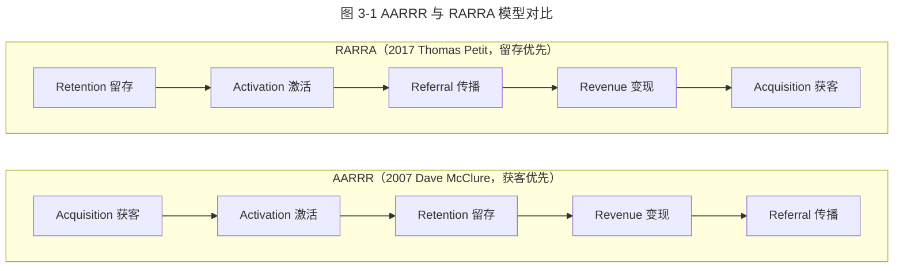
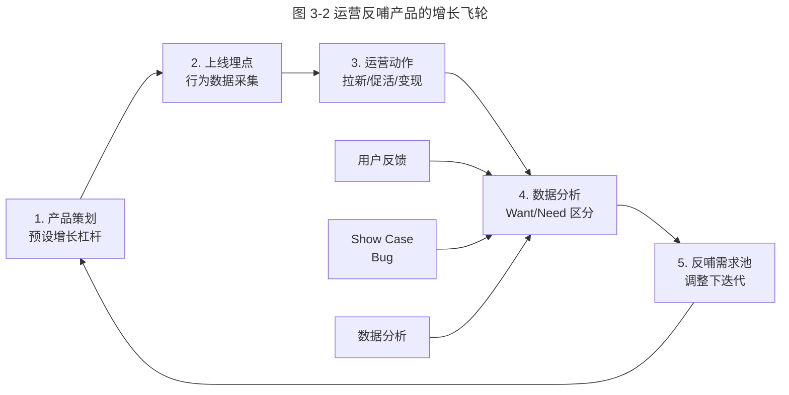
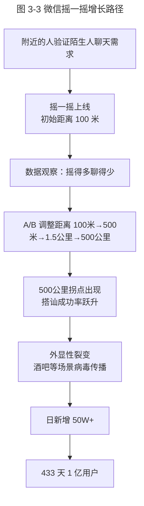

# 人人都是增长黑客

> **适用范围**：面向产品经理、产品运营、增长负责人、数据分析师，重点解决"用户从哪里来、如何留下、如何变现、如何传播"的全链路增长设计问题。
> **更新摘要**：v2 在原 AARRR 模型基础上，补 RARRA 演进（Retention First）、视频号 / 小程序增长案例、2024–2026 AI 增长与私域增长实践；将原口语化叙述升级为方法论体；移除失效 `/product-images/` 图片，改用 Mermaid 图与表格。
> **版本**：v2 · 2026-08 更新

## 1. 导言

### 1.1 增长黑客的本质

增长黑客（Growth Hacker）这一概念由 Sean Ellis 在 2010 年提出，核心是用工程化、数据化的方式驱动用户增长，而非依赖传统品牌广告的"砸钱换曝光"。其精神是"产品 + 运营 + 数据"三位一体，而非单纯运营动作的堆叠。

### 1.2 为什么"人人"都是增长黑客

传统认知中增长是运营的责任，但腾讯的实战表明，增长的杠杆点分布在产品功能、运营动作、数据分析、技术架构每个环节：

- **产品**：自带传播性的功能（如微信摇一摇外显性）本身就是增长引擎；
- **运营**：通过数据反馈持续修正产品方向（500 公里神奇数字）；
- **数据**：从海量 Want 中提取真实 Need，反哺产品迭代；
- **技术**：性能优化（语音压缩率提升 67%）直接影响留存。

任何一环脱节，增长都会卡壳。因此"人人都是增长黑客"不是口号，而是分工协同的方法论。

### 1.3 本文要回答的三个问题

- **Why**：为什么传统 AARRR 在 2017 年后向 RARRA 演进？留存为何成为新北极星？
- **What**：什么是 Want 与 Need 的区分？如何用运营反哺产品形成闭环？
- **适用范围**：C 端社交、内容、电商、工具类产品；B 端 SaaS 可裁剪借鉴。

## 2. 核心方法论

### 2.1 AARRR 模型：海盗指标（2007）

由 Dave McClure 在 2007 年提出，又称"海盗指标"（Pirate Metrics，因首字母谐音 A-A-R-R-R）：

| 阶段 | 英文 | 中文 | 关键指标 |
| --- | --- | --- | --- |
| Acquisition | 获客 | 用户从哪里来 | UV、新增用户数、CAC |
| Activation | 激活 | 用户是否体验到核心价值 | 首次价值时刻（Aha Moment）、激活率 |
| Retention | 留存 | 用户是否回来 | 次日 / 7 日 / 30 日留存 |
| Revenue | 变现 | 如何赚钱 | ARPU、LTV、GMV |
| Referral | 传播 | 用户是否推荐 | K 因子、NPS |

### 2.2 RARRA 演进：留存优先（2017）

由 Thomas Petit 与 Gabor Cselle 在 2017 年提出，针对移动互联网红利末期"获客成本飙升、留存成为瓶颈"的现状，将 AARRR 重新排序：

| 顺序 | 阶段 | 重新排序理由 |
| --- | --- | --- |
| 1 | **R**etention 留存 | 没有留存的获客是漏水桶 |
| 2 | **A**ctivation 激活 | 留存的前提是激活 |
| 3 | **R**eferral 传播 | 留存用户才可能传播 |
| 4 | **R**evenue 变现 | 留存与传播是变现的基础 |
| 5 | **A**cquisition 获客 | 在留存模型验证后再规模化获客 |

### 2.3 为什么从 AARRR 到 RARRA

| 时代背景 | AARRR 适用期（2010–2016） | RARRA 适用期（2017 至今） |
| --- | --- | --- |
| 流量成本 | CAC 低，可大规模获客 | CAC 高于 LTV 风险大 |
| 用户行为 | 红利期，新增即留存 | 用户成熟，留存决定生死 |
| 产品成熟度 | 探索期，需快速获客验证 | 成熟期，需精耕细作 |
| 典型代表 | 早期微信、Facebook、Twitter | 2020 后的微信视频号、小红书、字节跳动全系产品 |

### 2.4 Want 与 Need：用户语言与产品语言

乔布斯名言"用户永远说需要一匹很快的马，而不是一辆汽车"，揭示 Want（用户说要什么）与 Need（用户真正要解决什么）的差异。

| 维度 | Want | Need |
| --- | --- | --- |
| 来源 | 用户语言、显性表达 | 隐性、需挖掘 |
| 表现 | "我要一匹快马" | "我要快速从 A 到 B" |
| 解决方案 | 一种选项（马车 / 汽车 / 高铁） | 物理位移的本源需求 |
| 产品决策 | 不能直接采纳 | 决策依据 |

**关键判断**：用户成本（金钱、学习成本、习惯改变成本）与用户习惯决定了 Want 的可行性。最好的解决方案不一定是技术最优解，而是用户能承受并习惯的方案。例如，2003 年手机 QQ 取消"在线 / 离线 / 隐身"状态，产品经理认为"智能机时代 24 小时在线"是更优解，但用户十几年习惯无法接受——最终状态调整功能回归，仅放在设置四级目录，使用次数极少，验证了用户的真实使用强度并不高。

### 2.5 边界条件

| 边界 | 描述 |
| --- | --- |
| 数据基建门槛 | A/B 测试与归因分析需要埋点与数据平台，无基建则增长是黑盒 |
| 伦理边界 | 增长不可触碰诱导、欺诈、隐私侵犯；微信"看一看"坚持双向自愿 |
| 行业边界 | 强监管行业（金融、医疗）的获客与变现受合规约束 |

### 2.6 关键术语对照

| 中文术语 | 英文对照 | 说明 |
| --- | --- | --- |
| 获客成本 | Customer Acquisition Cost, CAC | 获取一个新用户的成本 |
| 用户生命周期价值 | Lifetime Value, LTV | 用户全生命周期贡献的价值 |
| 留存率 | Retention Rate | 次日 / 7 日 / 30 日留存比例 |
| 净推荐值 | Net Promoter Score, NPS | 推荐者比例减贬损者比例，取值 −100 到 +100 |
| K 因子 | Viral Coefficient, K | 每用户带来的新用户数 |
| 日活 / 月活 | DAU / MAU | Daily / Monthly Active Users |
| 商品交易总额 | Gross Merchandise Volume, GMV | 电商平台成交总额 |
| 北极星指标 | North Star Metric, NSM | 团队统一对齐的核心增长指标 |

## 3. 关键流程

### 3.1 AARRR 与 RARRA 对比

**图 3-1 解读**：两个模型包含相同的五个阶段，差异在于排序逻辑。AARRR 是流量红利期的"先获客后留存"，假设 funnel 足够大；RARRA 是红利末期的"先留存后获客"，假设漏桶不补则获客浪费。2020 年后腾讯、字节、阿里等大厂的增长团队普遍采用 RARRA 思路：先用最小可行产品验证留存，再决定是否大规模获客。视频号 2020 年内测期不做强运营推广，正是 RARRA 思路的典型应用。

### 3.2 运营与产品的闭环：增长飞轮

**图 3-2 解读**：腾讯研发模型强调"产品发布 → 运营收集反馈 → 数据分析 → 反哺需求池"的闭环。需求来源有五类：用户反馈、Show Case、数据分析、Bug、产品经理判断。前四类是外部输入，第五类才是产品经理主动判断——这意味着团队越大、用户越多，外部反馈占比越高，产品经理越要克制"我以为"的冲动。微信"摇一摇"500 公里的神奇数字正是这套闭环的产物：产品经理的初始逻辑（100 米附近的人）被运营数据证伪，持续调整距离到 500 公里后才出现搭讪成功率拐点。

### 3.3 微信摇一摇：从需求到增长的完整路径

**图 3-3 解读**：摇一摇是"产品点 × 运营调优 × 外显裂变"三力叠加的经典案例。500 公里不是产品经理拍脑袋得出的，而是通过运营数据持续调优发现的安全距离拐点——当天内无法到达的物理距离让陌生人交流有了心理安全感。外显性（剧烈动作引发围观）让摇一摇自带传播性，酒吧等线下场景的从众效应形成病毒裂变，最终使微信在 2012 年 3 月以 433 天达成 1 亿用户，比 QQ（10 年）、Facebook（5 年）、Twitter（4 年）都快。值得注意的是 QQ 给微信导流发生在 2011 年 6 月前，从数据看对微信用户增长的实际贡献有限，并非增长主因。

## 4. 工具与实战

### 4.1 微信打飞机：一次功能完成拉新、促活、变现三件事

微信 5.0 版本（2013 年）引导页内置"打飞机"小游戏，完成三个增长目标：

- **拉新**：每天 3 架飞机，分享给好友可获得新飞机——强制社交裂变；
- **促活**：本周飞机大战排行榜，激发好友间超越；
- **变现（间接）**：引导用户升级微信 5.0，开启后续商业化能力。

这是单一功能完成 AARRR 多目标的样板。

### 4.2 朋友圈广告：变现的情绪化设计（2015 至今）

| 阶段 | 关键动作 | 数据效果 |
| --- | --- | --- |
| 2015 上线 | 首批 BMW、可口可乐、vivo 投放 | 用户主动晒广告，话题效应远超预期 |
| 2018 互动广告 | 评论、点赞可见，广告主与用户双向互动 | CTR 显著高于行业平均 |
| 2021 视频号广告 | 朋友圈卡片跳转视频号 | 视频号冷启动流量来源 |
| 2024 AI 生成式广告 | AIGC 素材智能生成与多版本测试 | CPM 与转化率同步提升 |

朋友圈广告的成功在于"广告即内容"——用户看到的是同一广告但朋友互动不同，制造社交谈资。这与抖音信息流广告的纯算法分发逻辑有本质区别。

### 4.3 视频号：RARRA 模式的最新样本（2020–2026）

视频号是腾讯在短视频赛道对 RARRA 模式的典型应用：

| 阶段 | 策略 | 北极星指标 |
| --- | --- | --- |
| 2020 内测 | 不强运营推广，验证自然留存 | 次日留存、7 日留存 |
| 2021 直播电商 | 接入小程序、微信支付，闭环交易 | 直播 GMV |
| 2022 推荐算法升级 | 引入类似抖音的兴趣推荐 | 用户日均使用时长 |
| 2024 视频号小店升级 | 与小程序融合，统一店铺体系 | 商家 GMV |
| 2025 AI 内容生态 | AIGC 工具降低创作门槛 | 创作者数量与原创内容占比 |

**关键数据**（2024–2026 公开披露）：视频号 2024 年广告收入同比增长超 60%，直播电商 GMV 突破千亿级，成为腾讯新的增长引擎。

### 4.4 小程序：低门槛获客与场景化增长

小程序通过"无需下载、即用即走"的特性，重构了获客成本与场景匹配：

| 增长场景 | 实践 | 关键指标 |
| --- | --- | --- |
| 线下扫码获客 | 餐饮、零售、共享出行 | 单店获客成本下降 80%+ |
| 社交分享裂变 | 拼团、助力、抽奖 | K 因子达 1.2+ |
| 搜索 SEO | 微信搜一搜小程序直达 | 自然流量占比提升 |
| 私域沉淀 | 公众号 + 小程序 + 企微导流 | 复购率显著提升 |
| 2025 AI 小程序 | 自然语言对话即调用 | 交互成本降至最低 |

### 4.5 私域增长与企微（2024–2026）

企业微信 + 小程序 + 视频号 + 公众号的私域组合，是 RARRA 在中国市场的本土化演进：

- **留存**：将公域流量沉淀到企微，建立 1 对 1 长期关系；
- **激活**：通过朋友圈、社群、视频号多触点激活；
- **传播**：员工与客户的双向分享，K 因子杠杆放大；
- **变现**：小程序成交闭环，复购率提升；
- **获客**：私域用户裂变带新，CAC 大幅降低。

### 4.6 海量用户运营：用户画像四象限（2014 手机管家案例）

腾讯手机管家 2014 年用户增长迟滞，团队通过用户画像将用户分四象限：

| 类型 | 特征 | 运营策略 |
| --- | --- | --- |
| 蝌蚪 | 信任安全软件、轻度使用 | 一键深度清理、傻瓜式操作 |
| 穿山甲 | 信任安全软件、重度使用 | 个性化选项、深度定制 |
| 考拉 | 不信任安全软件、轻度使用 | 安全感教育、轻量入口 |
| 河马 | 不信任安全软件、重度使用 | 极客功能、专业用户社区 |

将蝌蚪（数量最多）转化为穿山甲，是突破增长迟滞的关键——围绕蝌蚪做一键深度清理与骚扰拦截，转化后顺势拿下手机安全市场第一。

## 5. 常见误区与避坑指南

| 误区 | 表现 | 避坑方法 |
| --- | --- | --- |
| **将 AARRR 当线性流程** | 严格按顺序执行，留存滞后处理 | RARRA 视角：留存与获客并行设计 |
| **拉新优先于留存** | 大规模投放但留存差，CAC > LTV | 先验证留存模型再放量 |
| **混淆 Want 与 Need** | 直接采纳用户表达的 Want | 用 5 Why / 用户访谈挖掘 Need |
| **数据驱动变数据奴役** | 只看短期指标，忽视长期价值 | 设置护栏指标（崩溃率、NPS、客诉） |
| **增长不可复制** | 一时爆款，无法持续 | 沉淀增长机制，而非依赖单次活动 |
| **忽视伦理边界** | 诱导分享、过度推送 | 增长必须遵守产品价值观（详见第 9 课） |
| **A/B 测试滥用** | 同时跑多个互相干扰的实验 | 流量正交分层，避免污染 |

## 6. 进阶延展与参考资料

### 6.1 进阶延展

- **北极星指标（North Star Metric）**：Sean Ellis 提出的团队统一对齐指标，例如 Facebook 早期是"月活用户数"，Airbnb 是"夜晚预订数"，微信早期是"同时在线用户数"。
- **PLG（Product-Led Growth）**：OpenView 提出，以产品自身驱动获客、扩张、留存，与"人人都是增长黑客"理念高度契合。Slack、Figma、Notion、腾讯文档都是 PLG 典型。
- **AI 时代的增长**：2024–2026 大模型驱动的增长新范式：AI 自动生成实验方案、AI 用户分群、AI 内容生成降低创作门槛。
- **与第 7 课的交叉引用**：增长飞轮的工程基础是灰度发布与 A/B 测试，详见《07-如何让产品小步快跑》第 3.3 节。

### 6.2 参考资料

1. McClure, D. (2007). *Startup Metrics for Pirates*.
2. Ellis, S. (2010). *Find Your Growth Hacker*.
3. Petit, T. & Cselle, G. (2017). *RARRA: Retention is the new Acquisition*.
4. 张小龙 2016 微信公开课《微信的产品价值观》。
5. 腾讯 2024 Q4 财报视频号相关披露。
6. Sean Ellis & Morgan Brown (2017). *Hacking Growth*. Crown Business.

---
