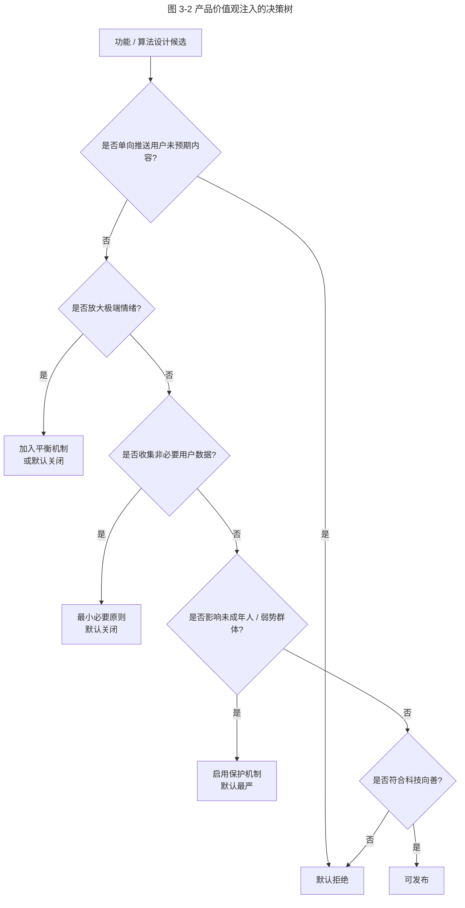
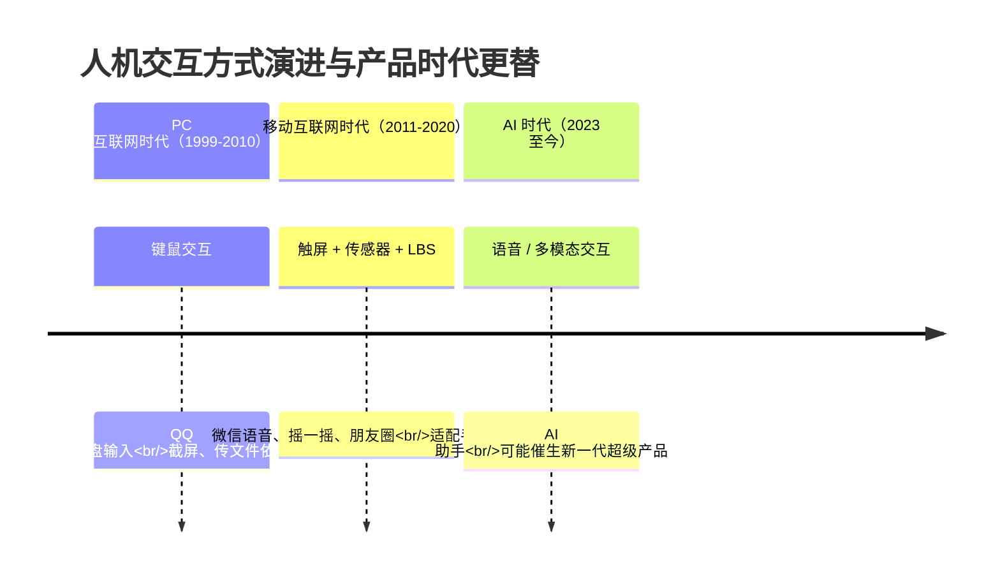

# 如何给产品注入你的价值观

> **适用范围**：面向产品负责人、产品经理、设计负责人与企业决策层，重点解决"产品价值观如何从口号落到功能设计"的问题。
> **更新摘要**：v2 在原"微信善良 / 抖音聪明 / 何时微信被取代"框架基础上，扩充腾讯科技向善（Tech for Good）的产品化体现、未成年人保护、数据隐私、AI 伦理等 2024–2026 主题；将原故事化叙述升级为方法论体；移除失效 `/product-images/` 图片，改用 Mermaid 图与表格。
> **版本**：v2 · 2026-08 更新

## 1. 导言

### 1.1 为什么价值观是产品的底色

功能决定产品能做什么，价值观决定产品"不该做什么"。在 AI 时代，算法与数据的杠杆被放大到前所未有的量级——一个推荐机制的微小调整可能影响数亿用户的信息摄入。这时，产品的价值观不再是"软素养"，而是决定产品长期社会价值与商业可持续性的硬约束。

2018 年腾讯年会上，张小龙引用贝索斯在普林斯顿大学毕业典礼的演讲："聪明是一种天赋，善良是一种选择，后者往往更难"。腾讯随后将公司使命升级为"用户为本，科技向善"——这是中国互联网大厂首次将价值观正式纳入公司战略层。

### 1.2 本文要回答的三个问题

- **Why**：为什么 AI 越聪明，"善良"越稀缺且重要？
- **What**：产品价值观如何通过功能设计落地？去中心化、人性平衡、双向自愿等原则如何转译为可执行的设计规范？
- **适用范围**：社交、内容、电商、AI、平台型产品；任何有用户杠杆的场景。

## 2. 核心方法论

### 2.1 定义

**产品价值观**（Product Values）：产品在功能取舍、用户互动机制、数据使用边界等设计决策中持续体现的价值偏好。它不是文案口号，而是嵌入到每个功能开关、每个推荐权重、每个数据收集字段中的隐性规则。

### 2.2 三大设计原则

#### 2.2.1 去中心化（Decentralization）

通过模仿线下人与人之间的社会关系处理逻辑，让信息自然浮现，而非通过中心化算法统一分配。

| 机制 | 微信实现 | 中心化对照 |
| --- | --- | --- |
| 信息分发 | "在看" → 看一看 → 好友可见 | 抖音算法推荐 |
| 商品推荐 | 好物圈好友主动推荐 | 拼多多算法瀑布流 |
| 关系建立 | 双向自愿加好友 | 微博单向关注 |
| 退出机制 | 附近的人随时清位置退出 | 抖音历史无法擦除 |

#### 2.2.2 人性平衡（Balance of Human Nature）

不放大单一极端情绪，保留善与恶的张力与平衡。

- 朋友圈仅设"赞"，不设"踩"——传播正向，规避恶意；
- 附近的人双向可见，不单方面窥探；
- 视频号评论默认折叠负面，可选展开。

#### 2.2.3 双向自愿（Mutual Consent）

任何信息流动都需要双方知情且同意，反对单向推送与数据滥用。

### 2.3 善良比聪明更难：贝索斯命题

2010 年贝索斯在普林斯顿大学毕业典礼分享其 10 岁时的故事：他用吸烟减少寿命的算术向祖母炫耀，结果祖母哭泣，祖父让他下车说"杰夫，有一天你会明白，善良比聪明更难"。

| 维度 | 聪明（Clever） | 善良（Kind） |
| --- | --- | --- |
| 性质 | 天赋、能力 | 选择 |
| 获取方式 | 训练可得 | 主动选择 |
| AI 是否可替代 | AlphaGo 已证明可超越人类 | 当前 AI 无善良属性 |
| 在产品中的表现 | 算法效率最大化 | 主动让渡部分效率换用户长期价值 |

### 2.4 AI 无法善良的命题

2017 年 AlphaGo 击败柯洁，证明 AI 在"聪明"维度已超越人类。但善良作为一种主动选择，AI 目前无法具备——它没有价值观，只有目标函数。这恰是 AI 时代人类产品经理的核心价值：为 AI 设定价值观边界，而非让其自由优化任何单一指标。

### 2.5 边界条件

| 边界 | 描述 |
| --- | --- |
| 商业可持续 | 价值观不等于放弃商业模式，腾讯仍以广告、游戏、支付为主要收入 |
| 合规底线 | 价值观高于合规底线，但不可低于合规 |
| 价值观多元 | 不将单一价值观强加用户，提供退出选项 |
| 价值观演进 | 价值观随时代演进，需定期审视 |

### 2.6 关键术语对照

| 中文术语 | 英文对照 | 说明 |
| --- | --- | --- |
| 科技向善 | Tech for Good | 腾讯 2019 年升级的公司使命 |
| 去中心化 | Decentralization | 反对算法垄断分发 |
| 信息茧房 | Filter Bubble / Echo Chamber | Eli Pariser 2011 提出 |
| 丛林法则 | Law of the Jungle | 抖音中心化算法被批评的特征 |
| 数据最小必要 | Data Minimization | GDPR / 个保法核心原则 |
| AI 伦理 | AI Ethics | 公平、透明、可解释、可问责 |

## 3. 关键流程

### 3.1 微信与抖音的价值观对比

```mermaid
---
title: 图 3-1 微信去中心化 vs 抖音中心化算法的价值观对比
---
flowchart LR
    subgraph A["微信：去中心化（Decentralized）"]
        direction TB
        A1[用户主动点击"在看"] --> A2[仅好友可见]
        A2 --> A3[信息自然浮现]
        A3 --> A4[健康传播链路]
    end
    subgraph B["抖音：中心化算法（Centralized）"]
        direction TB
        B1[系统分配基准播放量 1000] --> B2[算法判断用户反应]
        B2 --> B3[达标则放大曝光]
        B3 --> B4[信息茧房风险]
    end
```

**图 3-1 解读**：微信通过"用户主动行为 → 好友可见 → 自然浮现"的去中心化链路，让信息传播依赖真实社交关系，传播效率较低但健康度高（部分公众号文章阅读来源中"在看"渠道可达 67%）；抖音通过"系统初始分配 → 算法放大"的中心化链路，传播效率高但易产生信息茧房与丛林法则——内容创作者持续被算法鞭笞，平台却永远有新鲜内容。两种模式无绝对优劣，但腾讯选择了"善良优先于聪明"的路径。

### 3.2 产品价值观注入的决策流程



**图 3-2 解读**：产品价值观决策树将抽象原则转译为可执行判断节点。每个关键设计候选都需走完五个判断——单向推送、情绪放大、数据收集、弱势群体影响、向善总体判断——任一节点触发即默认拒绝或加保护。这是腾讯 2020 年后将"科技向善"工程化的核心机制，对应产品评审流程中的"价值观评审"环节。

### 3.3 人机交互方式与产品时代的演进



**图 3-3 解读**：决定产品时代更替的不是计算能力或网络速度，而是人机交互方式（Human-Computer Interaction, HCI）。键盘鼠标时代 QQ 胜出，因聊天、截屏、传文件完美适配键鼠；触屏 + 传感器 + LBS 时代微信胜出，因语音、摇一摇、朋友圈完美适配手机特性。子弹短信、聊天宝、马桶等试图在交互方式未改变时挑战微信，均告失败。未来若语音交互或多模态交互成熟，"无需掏手机即可与好友沟通"成为主流，则下一代超级产品可能出现。

## 4. 工具与实战

### 4.1 科技向善：从口号到工程化

腾讯 2019 年正式将"科技向善"纳入公司愿景与使命，并于 2021 年 4 月成立 SSV（可持续社会价值）事业部，将其作为独立业务线投入资源。

| 主题 | 腾讯实践（2020–2026） |
| --- | --- |
| 公益数字化 | 99 公益日、公益透明化与区块链溯源 |
| 未成年人保护 | 青少年模式、游戏防沉迷（详见 4.2） |
| 无障碍 | 微信 / QQ 全系产品读屏支持（详见第 6 课 4.4） |
| 数字适老 | 微信关怀模式、QQ 适老版 |
| 数字文化保护 | 数字长城、数字敦煌、数字中轴线 |
| 应急救灾 | 河南暴雨、土耳其地震等危机响应 |
| 银发科技 | SSV 银发科技平台（详见第 6 课 4.6） |

### 4.2 未成年人保护：价值观的工程化体现

| 维度 | 微信 / 腾讯实践 | 数据效果 |
| --- | --- | --- |
| 青少年模式 | 默认 40 分钟 / 日，22:00–6:00 禁用 | 2024 年覆盖微信、QQ、视频号、游戏 |
| 游戏防沉迷 | 实名认证 + 时段限制（周五六日及节假日 20:00–21:00） | 2024 年未成年游戏时长占比降至 0.7% 以下 |
| 内容过滤 | 教育白名单内容池 | 视频号青少年内容 |
| AI 内容标识 | 2025 微信接入 AIGC 标识 | 青少年模式默认屏蔽未标识 AIGC |
| 充值管控 | 未成年人单次 / 月度充值上限 | 按年龄段分级限制 |

### 4.3 数据隐私与最小必要原则

腾讯在《个人信息保护法》（2021 年实施）与 GDPR 框架下的产品改造：

| 主题 | 实践 |
| --- | --- |
| 最小必要 | 微信"附近的人"位置数据使用后即清，不留存原始坐标 |
| 用户授权 | 数据使用前显式弹窗授权，可随时撤回 |
| 数据可携权 | 用户可申请导出个人数据（GDPR 标准） |
| 数据可删除权 | 账号注销后数据处理流程合规 |
| 第三方 SDK 治理 | 小程序第三方 SDK 备案与白名单 |
| 2024 AI 训练数据 | AI 训练数据合规审计，用户可拒绝参与模型训练 |

### 4.4 微信的去中心化实践

| 功能 | 去中心化机制 | 价值取向 |
| --- | --- | --- |
| 看一看 | 用户主动"在看" + 好友可见 | 信息自然浮现，反对算法垄断 |
| 好物圈 | 用户主动推荐 + 好友讨论 | 反对推荐诱导消费 |
| 朋友圈广告 | 限量投放 + 朋友互动可见 | 广告即内容，反对纯算法分发 |
| 公众号 | 订阅制 + 用户主动关注 | 反对平台强制推送 |
| 视频号推荐 | 半熟人推荐 + 算法辅助 | 平衡去中心化与效率 |

### 4.5 AI 时代的科技向善（2024–2026）

| 议题 | 腾讯实践 |
| --- | --- |
| AI 内容标识 | 微信、QQ、视频号对 AIGC 内容强制标识 |
| 模型价值观对齐 | 混元大模型价值观对齐训练 |
| AI 防诈骗 | 微信实时识别诈骗话术并预警 |
| AI 适老 | 方言识别、慢速播报、医疗预问诊 |
| AI 安全 | 深伪内容识别与拦截 |
| 算法透明度 | 推荐算法说明书公开（2024 年起按监管要求） |

### 4.6 善良与聪明的辩证：从对立到协同

腾讯 2018 年提出"科技向善"时，外界一度解读为"放弃效率换道德"。但 2024–2026 的实践表明，善良与聪明并非零和：

- **善良降低长期风险**：去中心化机制让微信规避了"算法茧房"舆情，长期看降低了政策与品牌风险；
- **善良提升用户信任**：双向自愿与数据最小必要提升了用户对产品的信任度，是高 LTV 的基础；
- **善良驱动创新**：适老化、无障碍、未成年保护催生了新的产品形态与市场（银发科技市场）；
- **聪明放大善良**：AI 防诈骗、AI 适老是用聪明工具放大善良意图的典型。

## 5. 常见误区与避坑指南

| 误区 | 表现 | 避坑方法 |
| --- | --- | --- |
| **价值观等于口号** | 公司使命挂墙但功能设计无变化 | 价值观评审纳入产品决策流程 |
| **善良等于低效** | 误以为必须牺牲效率换道德 | 善良与聪明可协同，长期价值更大 |
| **价值观强加用户** | "为你好"式家长主义 | 提供退出选项，让用户选择 |
| **价值观一成不变** | 时代演进但产品价值观僵化 | 定期审视，与时代对齐 |
| **AI 价值观真空** | 让 AI 自由优化单一指标 | 必须由人类设定价值观边界 |
| **去中心化绝对化** | 否定所有算法与中心化 | 平衡去中心化与效率，非零和 |
| **数据收集最大化** | "先收集再说" | 最小必要原则，按需收集 |

## 6. 进阶延展与参考资料

### 6.1 进阶延展

- **科技向善的中国语境**：科技向善不是 CSR（企业社会责任）的翻版，而是把社会价值嵌入产品设计的核心环节。参考腾讯主要创始人陈一丹 2019 年提出的企业价值观四象限。
- **算法治理的监管框架**：2022 年《互联网信息服务算法推荐管理规定》要求算法备案、用户可选择关闭推荐、未成年人保护。这是产品价值观落地的合规底线。
- **AI Alignment**：OpenAI、Anthropic、DeepMind 主导的"AI 价值对齐"研究，本质是"如何让 AI 善良"的工程化探索。腾讯混元、智谱 GLM、阿里通义都在 2024 年强化了价值观对齐训练。
- **下一代交互方式**：语音、AR/VR、脑机接口（BCI）等新型交互方式可能催生超越微信的超级产品。腾讯混元大模型团队与 XR 等探索性业务（2022 年设立、2023 年一度收缩）正在为这一未来布局。
- **与第 8 课的交叉引用**：增长黑客的伦理边界由产品价值观决定，详见《08-人人都是增长黑客》第 2.5 节边界条件。

### 6.2 参考资料

1. Bezos, J. (2010). *We Are What We Choose*. Princeton Commencement.
2. 张小龙 2018 腾讯年会讲话。
3. Pariser, E. (2011). *The Filter Bubble*. Penguin.
4. 腾讯公司，《科技向善：腾讯可持续发展社会价值报告（2024）》。
5. 全国人大常委会，《个人信息保护法》（2021）。
6. 网信办，《互联网信息服务算法推荐管理规定》（2022）。
7. 腾讯研究院，《AI 伦理与治理白皮书（2024）》。

---
