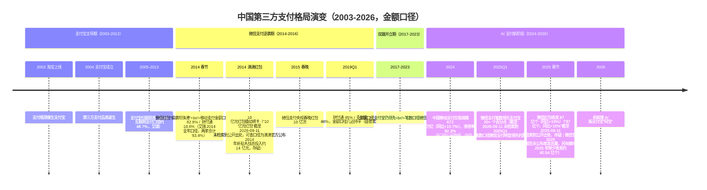
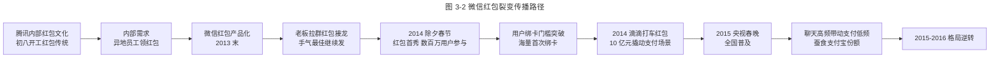
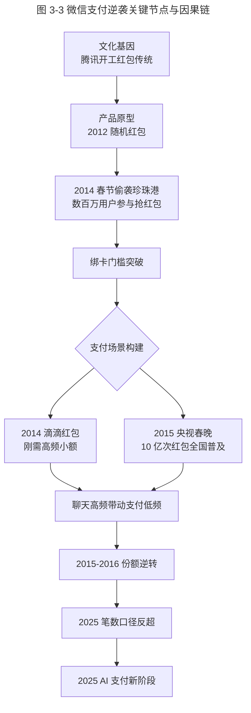
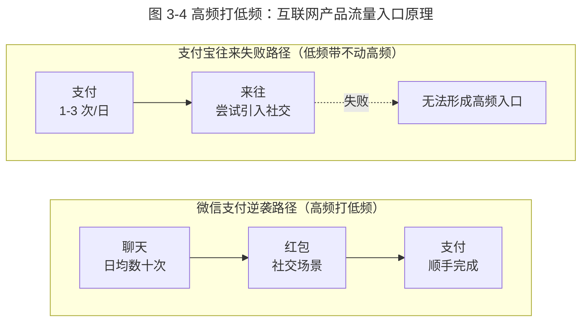

# 微信红包改变支付格局的始末

> **适用范围**：面向支付产品经理、运营负责人、平台战略与竞争分析人员，重点解析第三方支付格局逆转的因果关系与可复用方法论。
> **更新摘要**：v2 在原腾讯红包文化与微信支付崛起故事基础上，扩充 2014 春节"偷袭珍珠港"、2014 支付宝 82.8%/财付通 10.6%、2024 中国移动支付交易规模 672 万亿、2025Q1 微信支付笔数领先支付宝 20+ 个百分点（存疑）、2025 春节微信红包情况（总量口径未回源，存疑）、2025 AI 支付新阶段等关键数据；**特别强调不同口径（交易金额/交易笔数/用户数）份额差异显著，须明确标注**；将原口语化叙述升级为方法论体；移除失效 `/product-images/` 图片，改用 Mermaid 图与表格。
> **版本**：v2 · 2026-08 更新
> **数据时点说明**：本文所有份额数据均标注统计时点与口径；2003–2015 数据来源于第三方支付综合市场份额口径，2014 后区分移动支付金额口径与笔数口径，2024 后区分交易规模与渗透率。

## 1. 导言

### 1.1 一场连马云与马化腾都未预料到的逆袭

中国第三方支付格局在 2014–2016 年间完成了一次历史性逆转：支付宝从近乎垄断（2005–2013 年长期占据第三方支付份额首位）的绝对龙头，被微信支付通过红包场景在两年内拉至势均力敌；至 2025 年，微信支付在移动支付交易**笔数**口径上已反超支付宝 20 个百分点以上（截至 2026-09-11 未检索到 2025Q1 该口径公开数据，存疑；笔数口径微信支付明显领先的方向有多家机构口径佐证）。这场逆袭的起点并非宏大的战略规划，而是腾讯内部"红包文化"的副产品——一个原本为解决"员工无法到场领老板红包"的内部工具，最终撬动了万亿级的支付市场。

### 1.2 本文要回答的三个问题

- **Why**：为什么拥有淘宝、天猫等天然支付场景的支付宝，会被缺乏支付场景的微信支付逆袭？
- **What**：红包文化、刚需高频小额支付场景、绑卡门槛突破，哪个才是真正决定格局的关键变量？
- **适用范围**：支付行业、平台型产品战略、社交与商业结合场景；对高频打低频规律有普适参考价值。

### 1.3 数据口径声明（务必先读）

由于不同机构与媒体报道的支付份额数据口径差异巨大，本文对所有份额数据严格标注：

| 口径类型 | 含义 | 典型差异 |
| --- | --- | --- |
| 综合第三方支付市场份额 | 含互联网支付 + 移动支付 + 其他，按交易金额计 | 早期口径，支付宝份额最高 |
| 移动支付交易金额份额 | 仅移动端，按金额计 | 2014 支付宝 82.8% / 财付通 10.6%（艾瑞 2014 全年口径，两家合计 93.4%） |
| 移动支付交易笔数份额 | 仅移动端，按笔数计 | 2025Q1 微信支付反超支付宝 20+ 个百分点（截至 2026-09-11 未检索到 2025Q1 该口径公开数据，存疑；笔数口径微信支付明显领先的方向有多家机构口径佐证） |
| 用户数口径 | 月活用户 / 绑卡用户 | 微信支付 ≈ 微信月活，支付宝月活公开口径约 7.11 亿（2020 年 6 月招股书）/7.81 亿（2021 年 11 月，QuestMobile），此后未披露；"超 10 亿"为全球用户数口径 |
| 渗透率口径 | 移动支付占社会零售总额比例（该定义截至 2026-09-11 未检索到公开出处，协会报告 92.3% 的计算口径未明示，存疑） | 2024 中国渗透率 92.3% |

**关键提示**：金额份额、笔数份额、用户数份额是三个不同维度，不可混用。微信支付的逆袭在**笔数口径**上表现最显著，在**金额口径**上仍与支付宝胶着。

## 2. 核心方法论

### 2.1 高频打低频：互联网产品铁律

在互联网做产品一定要懂得高频打低频。高频是大流量入口，低频不是。这一规律解释了为什么美团外卖不挣钱也一定要做——团购一周一次属高频，外卖一周三次属日常，外卖比团购更高频，因此美团外卖必须做。

**支付格局中的应用**：

| 维度 | 微信支付（高频） | 支付宝（低频） |
| --- | --- | --- |
| 主要场景 | 聊天、红包、转账、扫码 | 电商、理财、生活缴费 |
| 用户日均打开次数 | 数十次 | 1–3 次 |
| 主动打开意愿 | 社交驱动，自然进入 | 任务驱动，目的性强 |
| 转化路径 | 聊天高频 → 顺手支付 | 需用户主动唤起支付宝 |

高频可以打低频，但低频往往带不动高频——这是支付宝做"来往"失败的根因，社交是高频，支付是低频，再强的执行力也无法违背客观规律。

### 2.2 刚需、高频、小额：支付场景三要素

微信支付逆袭过程中的关键场景（如滴滴打车红包）具备三个共同特征：

| 要素 | 描述 | 滴滴打车场景 |
| --- | --- | --- |
| 刚需 | 几乎所有用户都有此需求 | 几乎所有人都打过车 |
| 高频 | 用户反复发生 | 上下班、出差、日常出行 |
| 小额 | 单次金额不大，决策门槛低 | 一般 15–30 元，红包抵 10 元即可感知优惠 |

三要素叠加，使得可用极低成本撬动极高的绑卡转化。微信支付 2014 年与滴滴合作派发约 10 亿元红包，换回了与支付宝数量级接近的绑卡用户——单用户获客成本远低于行业（"10 亿元红包"截至 2026-09-11 未检索到公开出处，可查口径为滴滴官方公布 2014 年补贴大战总投入约 14 亿元，存疑）。

### 2.3 绑卡门槛：支付市场真正的护城河

支付市场最难突破的不是支付动作本身，而是"绑卡"——用户将银行卡与第三方支付账户绑定。绑卡流程的门槛：

- 16 位银行卡号 + 11 位手机号 + 6 位验证码，共 33 位数字；
- 任一数字输错即失败；
- 用户对隐私与安全的天然戒备。

**结论**：一旦用户完成绑卡，后续使用门槛极低。微信红包的真正战略价值，是用"红包社交场景"完成了海量用户的首次绑卡——而首次绑卡一旦完成，用户便自然成为微信支付的长期用户。

### 2.4 边界条件

| 边界 | 描述 |
| --- | --- |
| 监管边界 | 支付受央行监管，备付金集中交存、费率受指导 |
| 风控边界 | 反洗钱、反诈骗是支付产品的合规底线 |
| 商业边界 | 支付本身毛利低，需通过金融、广告、商户服务变现 |
| 生态边界 | 微信支付与支付宝的份额差异在不同口径下显著不同 |

### 2.5 关键术语对照

| 中文术语 | 英文对照 | 说明 |
| --- | --- | --- |
| 第三方支付 | Third-Party Payment | 持牌支付机构 |
| 移动支付 | Mobile Payment | 基于移动端的支付 |
| 绑卡 | Card Binding | 银行卡与支付账户关联 |
| 备付金 | Client Funds | 支付机构代收待付的资金 |
| 渗透率 | Penetration Rate | 移动支付占社会零售比例（该定义截至 2026-09-11 未检索到公开出处，协会报告 92.3% 的计算口径未明示，存疑） |
| 月活用户 | MAU | Monthly Active Users |
| 商品交易总额 | GMV | Gross Merchandise Volume |

## 3. 关键流程

### 3.1 中国第三方支付格局演变（2003–2026）

**图 3-1 解读**：时间线揭示了格局演变的三个阶段。**关键时点标注**：

- **2005–2013 年**：支付宝长期位居第三方支付份额首位，但"综合口径约 80%"未检索到公开出处；可查口径为 2013 年第三方互联网支付交易规模份额 支付宝约 48.7%、财付通约 19.4%（艾瑞），约 80% 的份额更接近同期移动支付口径。
- **2014 年**：移动支付金额口径下，支付宝 82.8%、财付通（含微信支付）10.6%（来源：易观、艾瑞等第三方机构；艾瑞 2014 全年口径，两家合计 93.4%）。2014 年除夕春节，微信红包上线首秀，数百万用户参与抢红包，被马云称为"偷袭珍珠港"。
- **2019Q1**：以移动支付交易金额计，财付通约 45%、支付宝约 46%，几近持平（益普索《2019 第一季度第三方移动支付用户研究报告》）；"2015–2016 年综合口径 45%/46%"未检索到公开出处。
- **2024 年**：中国移动支付交易规模达 672 万亿元，同比增长 16.7%，移动支付渗透率 92.3%。
- **2025Q1**：移动支付交易**笔数**口径下，微信支付领先支付宝 20+ 个百分点（截至 2026-09-11 未检索到 2025Q1 该口径公开数据，存疑；笔数口径微信支付明显领先的方向有多家机构口径佐证）。注意：在交易**金额**口径下，双方仍胶着，份额差异显著小于笔数口径。

### 3.2 微信红包传播路径

**图 3-2 解读**：微信红包的传播并非顶层战略驱动，而是从企业内部文化长出的副产品。腾讯初八开工日的红包传统自 2003 年延续至今，2012 年演化为"随机红包"原型，2013 年末产品化为微信红包，2014 年春节完成"偷袭珍珠港"——数百万用户参与抢红包并完成首次绑卡。一旦绑卡门槛突破，微信支付借助聊天高频场景持续蚕食支付份额，滴滴打车红包的"刚需、高频、小额"场景完成了从社交红包到真实支付场景的迁移。这条路径的本质是"文化 → 工具 → 场景 → 份额"的四段式跃迁。

### 3.3 微信支付逆袭的关键节点

**图 3-3 解读**：逆袭的关键节点构成完整因果链。文化基因提供产品原型灵感，2014 春节完成用户绑卡的关键一跃，2014–2015 年通过滴滴与春晚两个外部场景将绑卡用户转化为真实支付用户，最终在 2015–2016 年完成份额逆转。**真正的关键变量不是红包本身，而是红包完成了"绑卡门槛突破"这一支付市场最难动作**。马云在支付宝年会上质问高管"支付宝为什么不做红包"，但高管反问"你在支付宝和淘宝，发过红包吗？"——这恰恰揭示了支付宝缺乏红包生长的社交土壤（该段对话截至 2026-09-11 未检索到公开出处，存疑）。

### 3.4 高频打低频的杠杆原理

**图 3-4 解读**：高频打低频是互联网产品的铁律。微信支付通过"聊天→红包→支付"的高频路径，让支付成为社交的顺带动作；支付宝反向通过支付引入社交（来往），却因支付本身低频无法带动社交高频，最终失败。这一规律解释了为什么美团外卖、拼多多、抖音电商等以高频内容/社交为入口的产品，可以反向切入电商支付场景；而纯支付工具向社交扩张则困难重重。

## 4. 工具与实战

### 4.1 腾讯红包文化：企业文化的产品化价值

| 年份 | 关键事件 |
| --- | --- |
| 2003 | 腾讯初八开工日红包传统形成，未婚员工向已婚员工讨红包 |
| 2006 | 马化腾亲手发放红包，金额 50 元；副总 20 元；总经理 10 元；总监 5 元 |
| 2012 | 大年初八红包金额不足以匹配时，员工随机放入 50/100 元"试运气"——成为微信随机红包的原型 |
| 2013 末 | 微信支付产品化红包功能，老板拉群红包接龙 |
| 2014 至今 | 初八开工红包传统延续，每年发两万多个 |

（表中 2003 年起点、2006 年金额规则、"每年发两万多个"等细节截至 2026-09-11 未检索到公开出处，存疑）

**方法论价值**：企业文化是产品创新的隐形土壤。看似与业务无关的红包传统，最终成为撬动支付格局的杠杆。这给产品团队的启示是——文化仪式、内部工具、员工习惯中可能蕴含着产品化的金矿，需要产品经理有"内部视角"的敏锐度。

### 4.2 2014 春节"偷袭珍珠港"

| 维度 | 数据 |
| --- | --- |
| 时间 | 2014 年 1 月 30 日除夕至 2 月 2 日春节假期 |
| 关键事件 | 微信红包上线 |
| 参与规模 | 除夕至初八累计超 800 万用户参与红包收发 |
| 参与人数 | 数百万用户首次绑定银行卡（截至 2026-09-11 未检索到官方精确数，存疑） |
| 历史意义 | 马云内部称为"偷袭珍珠港" |
| 市场反应 | 移动支付金额口径：2014 支付宝 82.8% / 财付通 10.6%（艾瑞 2014 全年口径，两家合计 93.4%） |

**关键数据**：2014 年移动支付交易**金额**口径下，支付宝仍占 82.8%，财付通（含微信支付）仅 10.6%（艾瑞 2014 全年口径，两家合计 93.4%）。但红包完成了数百万用户的首次绑卡，这是后续所有支付场景迁移的前提（截至 2026-09-11 未检索到官方精确数，存疑）。

### 4.3 2014 滴滴打车红包：刚需高频小额场景的杠杆

2014 年微信支付与滴滴打车联合派发约 10 亿元红包（"10 亿元红包"截至 2026-09-11 未检索到公开出处，可查口径为滴滴官方公布 2014 年补贴大战总投入约 14 亿元，存疑）。该场景的完美性：

- **刚需**：几乎所有微信用户都打过车；
- **高频**：上下班、出差、日常出行，每周多次；
- **小额**：15–30 元客单价，红包抵 10 元即可感知优惠；
- **绑卡转化**：用户为使用红包必须绑卡，首次绑卡后留存。

这一场景以极低成本完成了支付宝用十年积累的绑卡用户规模。

### 4.4 2015 央视春晚红包：全国普及

| 维度 | 数据 |
| --- | --- |
| 时间 | 2015 年除夕夜 |
| 合作方 | 微信支付 × 央视春晚 |
| 发放量 | 10 亿次红包 |
| 历史意义 | 全国用户首次大规模使用微信支付 |
| 后续效应 | 微信支付用户基础从此建立 |

### 4.5 2024–2026 现状：格局反转与 AI 支付新阶段

| 时点 | 关键数据 | 口径说明 |
| --- | --- | --- |
| 2024 全年 | 中国移动支付交易规模 672 万亿元，同比 +16.7% | 移动支付总规模 |
| 2024 全年 | 移动支付渗透率 92.3% | 占社会零售总额比例（该定义截至 2026-09-11 未检索到公开出处，协会报告 92.3% 的计算口径未明示，存疑） |
| 2025Q1 | 微信支付交易**笔数**领先支付宝 20+ 个百分点（截至 2026-09-11 未检索到 2025Q1 该口径公开数据，存疑；笔数口径微信支付明显领先的方向有多家机构口径佐证） | **笔数口径**，金额口径双方仍胶着 |
| 2025 春节 | 微信红包收发 87 亿个，同比 +15% | 春节期间红包总量（"87 亿个、同比+15%"截至 2026-09-11 未检索到公开出处，存疑；微信官方 2025 春节报告未公布收发总量，另有媒体转述 2025 年除夕收发约 40.54 亿个） |
| 2026 | 蚂蚁推出 AI 版支付宝"阿宝"（2026 年 6 月随支付宝 12 版本上线） | AI 支付新阶段 |
| 2025 | 微信支付推出 AI 专属卡（截至 2026-09-11 未检索到公开出处，存疑） | AI 支付新阶段 |

**关键提示**：2025Q1 微信支付笔数口径反超 20+ 个百分点是格局反转的标志性事件（截至 2026-09-11 未检索到 2025Q1 该口径公开数据，存疑；笔数口径微信支付明显领先的方向有多家机构口径佐证），但需注意：

- **笔数口径**：微信支付显著领先（社交红包、转账等小额高频场景占优）；
- **金额口径**：双方仍胶着，支付宝在大额电商、理财场景仍占优；
- **用户数口径**：微信支付 ≈ 微信月活（约 13 亿+），支付宝月活公开口径约 7.11 亿（2020 年 6 月招股书）/7.81 亿（2021 年 11 月，QuestMobile），此后未披露；"超 10 亿"为全球用户数口径。

### 4.6 2025 AI 支付新阶段

（"阿宝"实为 2026 年 6 月上线；"2025 年成为支付行业 AI 化元年"为作者概括）

2025 年成为支付行业 AI 化元年：

| 玩家 | AI 支付布局 |
| --- | --- |
| 蚂蚁集团 | AI 版支付宝"阿宝"——对话式支付、AI 理财顾问 |
| 微信支付 | AI 专属卡——基于用户行为的智能支付推荐（截至 2026-09-11 未检索到公开出处，存疑） |
| 字节跳动 | 抖音支付 AI 化，结合内容场景 |
| 美团 | 美团支付 + AI 生活助手 |

AI 支付的竞争焦点从"覆盖场景"转向"理解用户意图"，可能成为下一轮格局变动的变量。

## 5. 常见误区与避坑指南

| 误区 | 表现 | 避坑方法 |
| --- | --- | --- |
| **口径混淆** | 笔数份额与金额份额混用 | 严格标注口径类型与时点 |
| **归因单一** | 将逆袭完全归因于红包 | 红包是绑卡门槛突破的杠杆，滴滴场景、春晚普及均不可少 |
| **忽视文化基因** | 仅看产品功能，忽视腾讯红包文化的土壤 | 企业文化是创新的隐形杠杆 |
| **照搬场景** | 其他支付产品复制红包场景 | 微信红包成功依赖社交高频土壤，无社交则失效 |
| **金额份额崇拜** | 仅看金额份额判断格局 | 应综合笔数、用户数、场景多元评估 |
| **短期数据决定论** | 单季数据判断长期格局 | 支付格局受监管、AI、国际化等多变量影响 |
| **忽视监管边界** | 复制补贴玩法 | 备付金、费率、反洗钱等监管约束不可突破 |

## 6. 进阶延展与参考资料

### 6.1 进阶延展

- **跨境支付与国际化的新战场**：2024–2026 微信支付与支付宝在东南亚、欧洲、中东的本地化钱包投资与跨境支付合作，是格局演变的新变量。
- **数字人民币（e-CNY）的影响**：央行数字货币对第三方支付的冲击与协同，2024 年起试点扩大，可能重塑支付底层结构。
- **AI 时代的支付重构**：AI 支付助手、对话式支付、意图识别支付可能成为下一代支付入口，重新洗牌"高频打低频"的入口。
- **场景金融的延伸**：支付作为场景金融的入口，延伸至信贷、理财、保险，腾讯金融科技业务在 2024 年已成为腾讯第二大收入来源。
- **与第 9 课的交叉引用**：支付格局背后的"科技向善"约束——反诈骗、未成年人保护、数据隐私——决定了支付产品的合规边界，详见《09-如何给产品注入你的价值观》。

### 6.2 参考资料

1. 中国人民银行，《2024 年支付体系运行总体情况》；正文"672 万亿元、渗透率 92.3%"数据实际出处为中国支付清算协会《中国移动支付发展报告》（2025 年发布）。
2. 艾瑞咨询，《2024 年中国移动支付市场研究报告》。
3. 易观分析，《2025Q1 中国第三方支付市场季度监测》（截至 2026-09-11 未检索到该期报告的公开出处，存疑）。
4. 腾讯控股有限公司，《2024 年年报》（金融科技与支付业务披露）。
5. 蚂蚁集团，《2024 年可持续发展报告》。
6. 张志东（Tony）2014 内部讲话《红包、文化与支付》。
7. 马云 2014 年 2 月在"来往"发表的对微信红包的评价（"确实厉害！此次珍珠港偷袭计划和执行完美"，经媒体广泛报道）。

---
