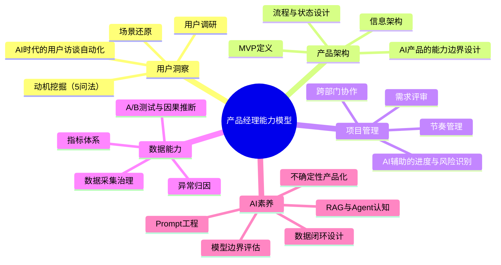
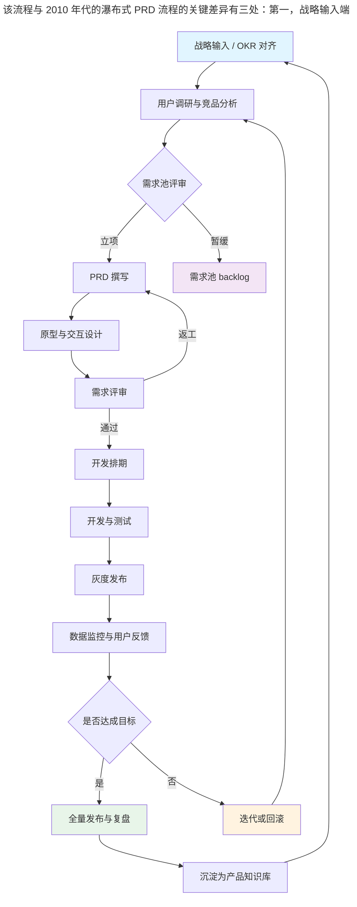
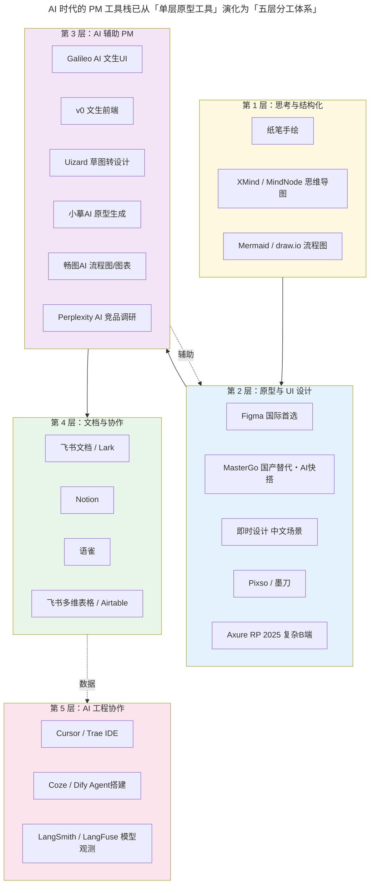

# 产品经理专业修炼手册

> **适用范围**：0–5 年经验的产品经理（Product Manager，PM）、向 AI 产品经理（AI PM）转型的传统 PM、需要在 AI 时代重建工作流的资深 PM。
>
> **更新摘要（v2 · 2026-08 更新）**：
> 1. 工具章节完全重写：原文停留在 Axure / OmniGraffle / Sketch / 墨刀 / POP 时代，本次重写为 2025-2026 工具格局，覆盖 Figma 退出中国市场后的国产替代（MasterGo、即时设计、Pixso）、AI 辅助 PM 工具栈（Galileo AI、v0、Uizard、小摹 AI、畅图 AI、Perplexity 等）以及文档协作栈（飞书 / Notion / 语雀）。
> 2. 新增 AI 时代 PM 能力模型：从传统 PM 到 AI PM 的演进路径，覆盖 RAG、Agent、Prompt 工程、模型边界评估等新能力维度。
> 3. 新增 3 张 Mermaid 图：PM 能力模型 mindmap、PM 工作流程 flowchart、AI 时代 PM 工具栈分层图，每图必跟解读段。
> 4. 重写「需求变更」「产品规划」「迭代节奏」三节，引入 2024-2026 流行的小步快跑、OKR 对齐、AI 辅助需求拆解实践。
> 5. 全文术语首现处给出英文对照。

---

## 1. 导言

### 1.1 为什么需要这本手册

产品与技术不同：技术问题通常有对错，产品问题往往只有成败。微信头像是方的、QQ 头像是圆的，钉钉有已读回执、微信没有，Twitter 下拉刷新停在当前位置、微博下拉刷新停在最新——这些设计无所谓对错，只在「是否在特定场景下成立」。这种「无标准答案」的领域特征，决定了产品经理的成长高度依赖系统化的方法论沉淀与持续的场景化训练。

2024-2026 年，大语言模型（Large Language Model，LLM）的工业化落地让产品经理的工作方式发生结构性变化：需求文档可由 AI 协助起草、原型可由文生 UI 工具一键生成、竞品调研可由 AI 搜索实时完成、用户访谈可由语音转写加摘要自动化。这意味着传统 PM 的「执行型工作」正在被快速压缩，而「判断型工作」（什么值得做、做到什么程度、如何度量）的权重急剧上升。本手册即在这一背景下重写。

### 1.2 这本手册解决什么问题

- **工具过载焦虑**：Figma 退出中国市场后，国产替代百花齐放，PM 不知道如何选型。
- **AI 焦虑**：传统 PM 不清楚自己是否要学算法、是否要写代码、如何与 AI 工程师协作。
- **需求变更污名化**：团队把需求变更视为 PM 的原罪，建立对抗性流程，最终拖垮节奏。
- **规划形式化**：Roadmap 沦为功能发布计划，缺乏战略对齐与留白。
- **节奏失控**：要么过度规划、要么过度敏捷，缺乏稳定律动。

### 1.3 适用范围与读者画像

| 读者类型 | 推荐重点章节 |
| :--- | :--- |
| 0–1 年新人 PM | 第 2、3、4 章 |
| 1–3 年成长期 PM | 第 3、5、6 章 |
| 3–5 年资深 PM | 第 2、5、6 章 |
| 向 AI PM 转型的 PM | 第 2 章 AI PM 子节、第 4 章 AI 工具栈 |
| 内部产品 / 中台 PM | 第 5 章避坑指南、配套《03-内部产品的产品经理》 |

---

## 2. 核心方法论

### 2.1 产品经理的定义与职责边界

产品经理（Product Manager，PM）是对「产品价值实现」负总责的角色，其核心职责可概括为四个动词：**发现**（Discover）、**定义**（Define）、**设计**（Design）、**交付**（Deliver）。在 AI 时代还需追加第五个动词：**度量**（Measure）——因为 AI 产品的效果具有概率性，没有度量就无法判断是否成立。

职责边界需特别澄清两点：

- PM 不是项目经理（Project Manager）：前者对「做什么、为什么做」负责，后者对「何时做、怎么做」负责。在中小公司常由一人兼任，但职责区分不可模糊。
- PM 不是功能经理（Feature Manager）：功能经理被动接需求、只关心功能逻辑；PM 主动挖掘动机、对投入产出比（Return on Investment，ROI）负责。

### 2.2 PM 能力模型（含 AI 时代演进）

传统 PM 能力模型通常分为三层：用户洞察、产品架构、项目管理。AI 时代需扩展为四层，新增「AI 素养」层，并将「数据能力」从附属提升为独立支柱。

**解读**：能力模型从「三层」扩展为「五层」并非简单加法。AI 素养层不是孤立模块，而是渗透到其他四层——例如「用户洞察」中需掌握 AI 辅助访谈工具，「数据能力」中需理解模型评估指标（F1、Precision、Recall）而不仅仅是业务指标，「产品架构」中需把「模型能力边界」当作一类新的约束条件。传统 PM 转型 AI PM 的最大障碍不是学不会算法，而是无法接受「确定性逻辑 → 概率性输出」的思维切换。

### 2.3 五条核心原则

1. **价值优先于功能**：先回答「为谁解决什么问题」，再回答「做什么功能」。
2. **场景优先于功能**：功能脱离场景等于零；AI 时代场景颗粒度更细，需细化到「在什么情境下、用户期待什么、模型能给什么」。
3. **数据优先于直觉**：直觉用于提出假设，数据用于验证假设；AI 产品的数据还需区分训练集、验证集、线上集的分布一致性。
4. **节奏优先于完美**：80 分先上线、边做边迭代，比 100 分憋半年更可取。
5. **协作优先于个人英雄主义**：PM 的产出 = 团队产出，非权力性影响力（Influence without Authority）是核心能力。

### 2.4 边界条件

本手册的方法论在以下条件下成立：

- 团队规模 5–500 人之间的互联网或互联网化公司；
- 产品形态为 App / Web / SaaS / AI Agent / 内部工具；
- 组织文化允许试错、有基本的数据基建。

超出该边界（如强监管行业、纯硬件产品、超大型组织）时，需结合具体约束调整。

---

## 3. 关键流程

### 3.1 PM 工作全流程

**解读**：该流程与 2010 年代的瀑布式 PRD 流程的关键差异有三处：第一，战略输入端必须与公司 OKR（Objectives and Key Results）显式对齐，而非依赖 PM 个人判断；第二，灰度发布（Grayscale Release）成为标准节点，AI 产品尤其需要小流量验证模型线上表现；第三，闭环回到战略输入，形成「季度 OKR → 月度复盘 → 双周迭代」的三层节奏。流程图中的「数据监控与用户反馈」节点在 AI 时代被赋予了新内涵——不仅要监控业务指标，还要监控模型漂移（Model Drift）、提示词命中率（Prompt Hit Rate）等 AI 专属指标。

### 3.2 需求调研与挖掘

需求调研的核心不是「收集用户提出的功能」，而是「挖掘用户行为背后的动机」。原文提出的「5 问法」（连续追问 5 个为什么）至今仍是成本最低、效果最好的工具。

经典案例：用户提出「订单列表需要按修改时间排序」。直接实现是功能经理思维；追问后发现真实动机是「订单太多审核不完，怕过期」；再追问发现大量审核可自动化；最终落地的是「自动审核 + 异常订单人工介入」，彻底解决问题。

AI 时代可借助工具放大该流程：

- **用户访谈自动化**：使用飞书妙记 / Otter.ai 转写访谈录音，再用 LLM 提取「痛点 → 动机 → 场景」三元组；
- **竞品调研自动化**：Perplexity、Felo、ThinkAny 等 AI 搜索工具可实时拉取竞品最新动态；
- **需求聚类**：将工单系统、客服录音、应用商店评论统一灌入 LLM，按场景聚类生成需求池。

需警惕：LLM 的聚类结果可能放大高频噪音、淹没低频真需求，必须配合人工抽样校验。

### 3.3 需求评审

需求评审（Requirement Review）的本质是把「PM 脑中的方案」转化为「团队共识的方案」。原文批评大多数评审会「过场化」——大家玩手机、PM 对着文档念一遍——这一现象在 2026 年并未改善，反而因远程办公普及而加剧。

改进方向：

- **方案具体化**：关键特性必须有可交互的 Demo，数据可假、架构可假，但体验要保真。AI 时代可用 v0、Galileo AI 等工具在 10 分钟内生成可点击原型，成本远低于 2010 年代的 Axure 动态面板。
- **场景化叙事**：评审时不要从功能列表开始，而要从「用户故事」开始——「现在我是一个从朋友圈打开 XX 的用户，我看到……」。
- **预读机制**：PRD 提前 24 小时发出，评审会只讨论异议项，不逐字朗读。
- **决策记录**：评审结论（采纳 / 拒绝 / 待定 + 责任人 + 截止日）当场记录到飞书文档或 Notion，避免事后争议。

### 3.4 需求变更管理

需求变更是 PM 职业的「原罪指控」第一名。但变更本身是中性的，问题出在变更的时机与方式。

**变更的本质**：需求变更 ≠ 用户需求变化，而是「实现方式的调整」。用户说「需要更快的马」，本质需求是「更快到达目的地」，实现方式从马变为汽车——需求未变，手段调整。

**变更时机选择策略**：

| 阶段 | 变更成本 | 推荐策略 |
| :--- | :--- | :--- |
| 需求分析阶段 | 极低 | 内部反复推敲，自由变更 |
| PRD 完成后 | 低 | 修改仅影响分析进度，伤害小 |
| 开发阶段（小变更） | 中 | 立即提出并更新文档 |
| 开发阶段（大变更） | 高 | 与开发沟通优先级和成本，必要时推翻 |
| 临近发布 | 极高 | 能不变就不变，先上线后迭代 |

**反对「需求基线」制度**：部分公司引入甲乙方式的「需求冻结 + 高管审批」流程，结果是大家互相推诿、文档变得庞杂、发现问题也不愿提，节奏越来越慢。这套本意用于限制甲乙方权责的流程不应在互联网公司内部采用。

### 3.5 产品规划与节奏

产品规划（Product Planning）的核心目的有二：自上而下传递战略方向、自下而上汇聚一线洞察。推荐的结合方式是「先自上而下、再自下而上」——管理层明确战略框架，各部门基于框架细化策略。

**规划 ≠ 功能发布计划**：传统规划常聚焦「做什么、何时做」，忽略「为什么、怎么做」。正确做法是从战略出发，先明确目标（如「提升内容生产力」），再拆解关键举措（如「增加创作者激励」），最后设定可衡量的成功标准。

**留白原则**：

- **空间留白**：规划时避免过度细化。如支付功能不限定「支持 VISA 和 MasterCard」，而是明确目标「增加支付渠道」，由执行团队灵活选择方案。
- **时间留白**：避免精确日期，用「Q4 完成」替代「11 月 20 日上线」，预留调整空间。

**节奏感**：建立可预期的发布周期（如双周迭代），单次迭代聚焦单一目标（留存提升阶段避免并行拉新）。前期谨慎规划、中期果断执行、避免完美主义。

---

## 4. 工具与实战

### 4.1 工具栈总览

**解读**：AI 时代的 PM 工具栈已从「单层原型工具」演化为「五层分工体系」。第 1 层思考工具永远不可替代——纸笔的沉浸感与「横不平竖不直」带来的去细节化效应，至今仍是早期方向探索的最佳选择；第 2 层原型工具在 Figma 退出中国市场后形成「国际 Figma + 国产 MasterGo / 即时设计 / Pixso」的并行格局；第 3 层是 2024-2026 新增的 AI 辅助层，显著降低了 PM 从「想法」到「可点击 Demo」的转化成本；第 4 层文档协作向多维表格化演进，飞书多维表格已成为需求池与 OKR 跟踪的事实标准；第 5 层是 AI PM 必须熟悉的新疆域，PM 不一定要写代码，但必须能看懂 Agent 配置面板与模型观测看板。

### 4.2 原型与 UI 设计工具

#### 4.2.1 国际首选：Figma

Figma 是 2020 年代以来全球事实标准的多端协作设计工具，支持实时多人编辑、组件库（Design System）、自动布局（Auto Layout）、Dev Mode 开发交付。其生态完善度（插件、社区资源、Figma AI 功能）仍是国产工具短期内难以追赶的护城河。

**重要变更**：**Figma 于 2025 年退出中国市场**，中国大陆用户访问需通过国际网络环境，企业账号合规性成为问题。这一事件直接催生了国产替代工具的爆发式增长。

#### 4.2.2 国产替代首选：MasterGo

MasterGo 是国产设计工具中 AI 能力最激进的代表，2025-2026 年的核心特性包括：

- **AI 快搭**：通过自然语言描述生成可编辑的设计稿，适合 PM 快速产出 Demo；
- **设计转代码**：直接输出 React / Vue / 小程序代码，缩短设计到开发链路；
- **MCP 协议（Model Context Protocol）支持**：可与 Cursor、Trae 等 AI IDE 联动，让 AI 编程助手直接读取设计稿上下文；
- **企业级协作**：权限管理、设计规范库、跨团队共享。

适合中国大陆团队作为 Figma 的平替主力工具。

#### 4.2.3 即时设计

即时设计在中文场景打磨上更深，主要特性：

- **中文 AI 局部重绘**：选中区域 + 中文描述即可生成局部设计，比 Figma AI 在中文语境下更准确；
- **本土化组件生态**：覆盖国内主流设计规范（如 Ant Design、Arco Design、TDesign）；
- **插件生态**：与国内协作工具（飞书、企业微信、钉钉）深度集成。

适合重度依赖中文设计资源的团队。

#### 4.2.4 其他工具

- **Pixso**：国产一体化设计工具，功能与 MasterGo / 即时设计接近，企业版价格友好；
- **墨刀**：移动端原型起家，2025 年保留轻量级快速验证场景，配合「小摹 AI」实现原型生成；
- **Axure RP 2025**：云端协作版仍存活于复杂逻辑 / 金融 B 端场景，其动态面板、变量、条件逻辑在金融级表单与多角色权限演示中无可替代，但学习曲线陡峭，不推荐新人首选。

#### 4.2.5 已不推荐作为主力的工具

- **OmniGraffle**：Mac 专属、价格昂贵、协作能力弱，仅适合个人静态逻辑图；
- **Sketch**：订阅制、Mac 限定、协作依赖第三方（如 Abstract），生态被 Figma 蚕食严重；
- **POP**：早期拍照热区串联原型的轻量工具，已被 AI 文生 UI 工具全面替代。

### 4.3 AI 辅助 PM 工具栈

这是 2024-2026 新增的工具类别，显著改变了 PM 的工作方式。

| 工具 | 类型 | 核心能力 | 适用场景 |
| :--- | :--- | :--- | :--- |
| Galileo AI | 文生 UI | 自然语言描述 → 高保真 UI 设计稿（2025 年被 Google 收购，能力并入 Stitch） | 早期 Demo、风格探索 |
| v0（Vercel） | 文生前端 | 自然语言描述 → 可运行 React/Next.js 页面 | 前端 Demo、交互验证 |
| Uizard | 草图转设计 | 手绘草图 → 数字化设计稿 | 纸笔原型数字化 |
| 小摹 AI | 原型生成 | 描述 → 可交互原型 | 快速原型评审 |
| 畅图 AI | 流程图/图表 | 描述 → Mermaid / 流程图 / 思维导图 | 文档配图、流程梳理 |
| MasterGo AI | 设计生成 | 文生设计 + 设计转代码 | 端到端设计交付 |
| 即时 AI | 局部重绘 | 选中区域 + 描述 → 生成 | 设计微调 |
| Perplexity | AI 搜索 | 实时联网搜索 + 引用 | 竞品调研、行业研究 |

**实战建议**：

1. **不要被工具捆绑**：选 1–2 款主力工具深耕，其余作为补充。工具玩得再溜也成不了产品专家。
2. **看教程而非自己摸索**：花 1 小时看官方教程，远胜于 10 小时对着菜单瞎点。
3. **AI 生成必校验**：LLM 生成的 PRD、流程图、竞品分析必须人工校对事实性内容，防止幻觉（Hallucination）。

### 4.4 文档与协作工具

- **飞书文档 / Lark**：国内 PM 事实标准，多维表格（Bitable）可直接搭建需求池、OKR 跟踪、产品知识库；2026 年深度集成 AI（飞书智能伙伴）后可实现文档摘要、行动项提取、会议纪要自动生成。
- **Notion**：国际化团队首选，Database 视图灵活，适合知识管理。
- **语雀**：阿里系团队常用，文档结构化能力突出，适合技术文档沉淀。
- **飞书多维表格 / Airtable**：低代码数据库，可作为轻量级需求管理系统。

### 4.5 流程图与思维导图工具

- **Mermaid**：纯文本生成流程图、时序图、甘特图，可嵌入 Markdown / 飞书文档 / GitHub，是工程师与 PM 共同友好的格式，2026 年已成为文档配图事实标准。
- **draw.io（diagrams.net）**：免费在线作图，支持 UML、架构图、BPMN，复杂场景备选。
- **畅图 AI**：自然语言生成流程图，适合快速产出。
- **XMind / MindNode**：思维导图，避免自动布局干扰逻辑，善用快捷键（回车 = 同级节点、Tab = 下级节点）。

### 4.6 UML 与概念建模

UML（Unified Modeling Language，统一建模语言）虽源于面向对象技术，但其中用例图、状态图、活动图、时序图非常适合 PM 做概念模型与流程设计。AI 时代，时序图常用于描述「用户 → Agent → 工具 → 模型」的调用链路，是 AI PM 必备能力。

工具推荐：StarUML（Windows 轻量）、LucidChart / ProcessOn（在线协作）、Mermaid（文本化、可版本控制）。

---

## 5. 常见误区与避坑指南

### 5.1 工具崇拜

**误区**：花大量时间研究工具菜单、收藏插件、对比评测，期望「工具选对了产品就成了」。

**避坑**：工具是放大器，不是乘数。100 分的方法论配 60 分的工具，胜过 60 分的方法论配 100 分的工具。每周给工具学习设定时间预算（建议 ≤ 2 小时）。

### 5.2 把 AI 当万能解

**误区**：2025-2026 年最常见的误区是把 LLM 当作可解决一切问题的银弹，需求文档让 AI 写、原型让 AI 生成、决策让 AI 给建议，PM 退化为「AI 操作员」。

**避坑**：AI 是放大 PM 判断力的工具，不是替代判断力的工具。AI 写的 PRD 必须人工校验场景完整性，AI 生成的原型必须人工验证交互合理性，AI 给的决策建议必须人工对齐业务上下文。判断力 = 业务理解 × 用户洞察 × 数据素养，这部分无法外包给 AI。

### 5.3 需求变更污名化

**误区**：团队建立「需求基线 + 高管审批」制度对抗变更，结果是大家都不愿提变更，问题憋到上线爆发。

**避坑**：变更管理的目标是「让变更在合适的时机发生」，而非「杜绝变更」。建立分级变更机制：小变更走轻量流程、大变更走评审流程、临近发布走风险控制流程。

### 5.4 把规划当功能发布计划

**误区**：Roadmap 列满功能名 + 上线日期，团队沦为执行工具，缺乏全局视角。

**避坑**：规划从战略出发，先答「为什么做」，再答「做什么」，最后才答「何时做」。时间用模糊区间（如「Q4 完成」），为执行层留白。

### 5.5 过度承诺

**误区**：为了向上汇报好看，承诺「11 月 20 日上线」这种精确日期，结果无法兑现损害信誉。

**避坑**：宁可留有余地，也不要过度承诺。用「11 月下旬至 12 月上旬」替代精确日期，预留调整空间。

### 5.6 把内部产品当低价值产品

**误区**：认为内部产品 PM 没有出头之日，消极应付，沦为功能经理。

**避坑**：内部产品是练基本功的最佳试验场——用户离得近、反馈成本低、可深入业务数据。详见配套《03-内部产品的产品经理》。

### 5.7 抄袭与借鉴混淆

**误区**：要么「不屑于借鉴」、要么「像素级抄袭」。

**避坑**：借鉴 ≠ 抄袭。借鉴的原则是：脑子里带着自己的问题、追本溯源知其所以然、跨领域寻找创意、对灵感来源致敬或付费。固定模式页面（如登录页）相似合理，核心业务逻辑需谨慎借鉴。

### 5.8 应对被抄袭

被抄说明产品有亮点，行业模仿能加速标准建立（如 iPhone 推动手机设计统一）。抄不走的是「气质」——表面抄袭只能模仿界面和交互（What / How），底层逻辑（Why）和团队 DNA 难以复制。

**护城河不在「脸上」**：界面、功能易被抄袭，真正的壁垒是规模优势、技术壁垒、行业资源、网络效应。做有积累效应的事情——用户投资（绑定邮箱、标记收藏）、网络效应（社交关系链、信用记录），让用户或数据沉淀，提升迁移成本。

---

## 6. 进阶延展与参考资料

### 6.1 从传统 PM 到 AI PM 的演进路径

AI 产品经理（AI Product Manager，AI PM）是 2024-2026 年最热门的细分方向。其与传统 PM 的核心差异不在「会不会写代码」，而在以下三点：

1. **接纳不确定性**：传统产品的逻辑是确定性的（点击按钮必然触发动作），AI 产品的输出是概率性的（同样的输入可能产生不同输出）。AI PM 需通过产品设计消化不确定性——例如反欺诈模型误判时提供申诉流程、内容审核模型不确定时转人工复核。
2. **数据闭环设计**：AI 产品的效果依赖数据持续迭代。AI PM 需在产品架构中预留数据回流机制——用户反馈（点赞 / 举报 / 修改）、隐式行为（停留时长 / 滑动深度）都可作为新的训练信号。
3. **模型边界评估**：AI PM 必须理解模型的能力边界——什么场景下模型表现好、什么场景下会失效。这不需要会写算法代码，但需要理解 RAG（Retrieval-Augmented Generation，检索增强生成）、Agent（智能体）、Embedding（向量嵌入）、Fine-tuning（微调）等概念的工作原理与适用范围。

### 6.2 AI PM 五大实践原则（整合自原文）

1. **算法与产品的结合粒度要小**：拆解大颗粒算法需求，聚焦可产品化的中间环节。如 Readhub.me 从命名实体识别（NER）中提取分词功能，包装为初级人机交互引导产品。
2. **重视工程的力量**：完全端到端算法在工业界效果有限，需通过工程手段（数据清洗、降维、数据增强）优化输入输出。60 分算法 + 工程可达 70 分。
3. **最大化算法和工程的产出结果**：匹配算法能力与场景需求。自动驾驶 L4 技术用于田间地头无方向盘的车会失败，用于传统汽车模式则浪费技术能力。
4. **做好数据规划**：规划数据收集、清洗、标注及分布，保证训练集与场景一致。数据质量比数量更重要（"8 分靠数据"），需设计数据闭环，盲目扩大数据量无用，需保证多样性。
5. **接纳算法的不确定性**：算法存在概率性（反欺诈、垃圾邮件监测），需通过产品设计消化不确定性（申诉流程、提醒机制）。评价算法需从宏观（整体效果）而非微观（单条数据）视角出发。

### 6.3 是否需要学算法

**必要性**：必须了解算法以理解 AI 能力边界，避免依赖工程师单向沟通。

**学习目标**：掌握原理、机制和边界，而非工程实现细节。具体而言，AI PM 应能回答：

- 这个问题适合用规则、传统机器学习还是大模型解决？
- RAG、Fine-tuning、Prompt Engineering 各自的适用场景与成本？
- 模型的 Precision、Recall、F1 各代表什么？业务上更怕误判还是漏判？
- 什么是模型漂移？线上效果下降时如何定位？

### 6.4 是否需要写代码

- **有工程背景**：建议尝试用成熟框架（Scikit-Learn、LangChain、LlamaIndex）跑简单实验（聚类、NER、RAG 问答），建立对工程难度的体感。
- **无工程背景**：优先理解算法原理，通过可视化工具或工程师协助观察结果。核心目标是掌握算法逻辑而非实现细节，便于与工程师协作。

### 6.5 推荐学习路径

1. **第 1 阶段（基础）**：本手册 + 《03-内部产品的产品经理》+ 《02-案例分析》；
2. **第 2 阶段（实战）**：完成一个 AI 产品 MVP（可用 Coze / Dify 搭建 Agent，无需写代码）；
3. **第 3 阶段（进阶）**：阅读《产品管理/02-产品案例分析》系列，系统学习优秀产品的设计哲学；
4. **第 4 阶段（AI 深化）**：阅读《产品管理/01-产品方法论/12-如何当好AI时代的产品经理（学习篇）》与《16-如何当好AI时代的产品经理（实践篇）》。

### 6.6 参考资料

- 本仓库《产品管理/01-产品方法论》系列文档；
- 本仓库《产品管理/02-产品案例分析》系列文档；
- MasterGo 官方文档与 AI 功能更新日志；
- Figma 官方博客与 Dev Mode 文档；
- 飞书智能伙伴产品文档；
- Vercel v0 官方文档；
- LangChain / LlamaIndex 官方教程（理解 AI 工程协作层）。

---

> **本手册版本**：v2 · 2026-08 更新
> **下一版预告**：v2.1 计划补充「AI Agent 产品设计专章」，覆盖工具调用（Tool Use）、记忆机制（Memory）、规划能力（Planning）的产品化设计模式。