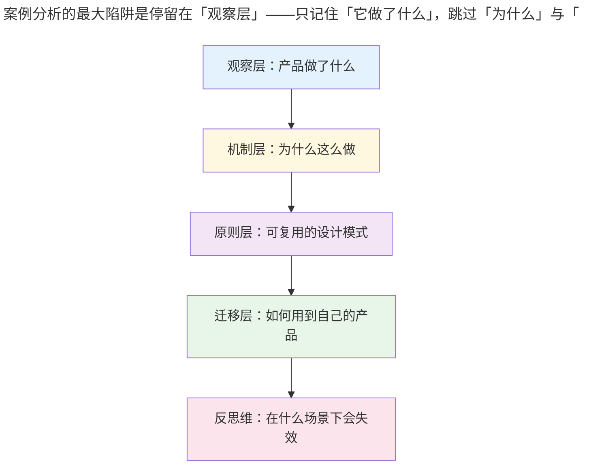
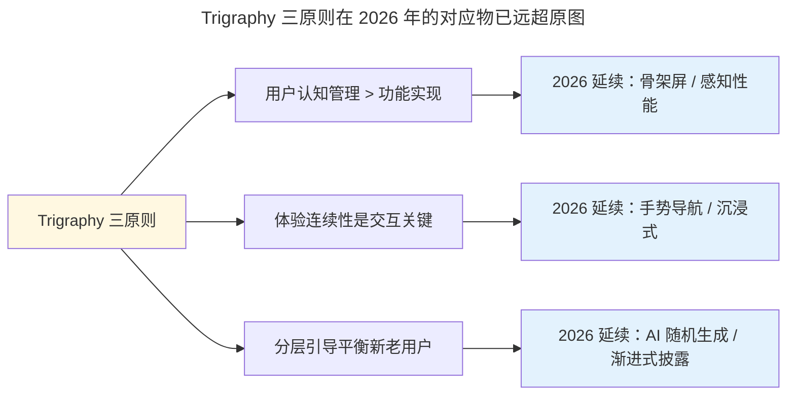
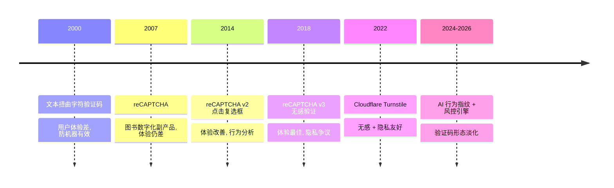

# 案例分析

> **适用范围**：0–5 年产品经理、需要建立产品设计语感的设计师、希望从经典案例中提取可复用设计原则的从业者。
>
> **更新摘要（v2 · 2026-08 更新）**：
> 1. **图片本地化处理**：原文外链图片 `zhangzhengyang.oss-cn-beijing.aliyuncs.com` 易失效，本次重写全部移除 OSS 外链，改用 Mermaid 流程图、表格、文字描述承载视觉信息，避免链接腐烂（Link Rot）。
> 2. **案例现状核对**：核对 Trigraphy、The Guardian App、LabRdr、Mimo、Learn Python、验证码（CAPTCHA）在 2026 年的现状，标注已下线 / 仍活跃 / 演进形态。
> 3. **与 02-产品案例分析 去重与交叉引用**：本仓库《管理/01-产品/产品管理/02-产品案例分析》目录下已有 Trigraphy、The Guardian、LabRdr、Mimo 与 Learn Python、Hopper 等案例的详细分析。本文作为「精炼版导览」，每节末尾标注交叉引用，详细分析请参阅对应文档，避免重复。
> 4. **新增 3 张 Mermaid 图**：产品设计三原则关系图、用户认知管理流程图、CAPTCHA 演进时间线，每图必跟解读。
> 5. 术语首现处给出英文对照。

---

## 1. 导言

### 1.1 为什么要做案例分析

产品经理的成长高度依赖「案例积累」。理论框架告诉你「应该怎样」，案例告诉你「实际怎样」。本手册选取五个在产品设计史上有代表性的案例，提炼可复用的设计原则。这些案例的产品本身有的已下线、有的已演进，但其设计思想在 2026 年的 AI 时代依然具有强参考价值——正如建筑学仍会研究已倒塌的古典建筑。

### 1.2 案例选取标准

- **代表性**：该案例在设计哲学上具有独特主张，非平庸之作；
- **可复用性**：设计原则可抽象为模式，迁移到其他产品；
- **时效性核对**：标注 2026 年现状，避免读者照搬已失效的产品形态。

### 1.3 与本仓库其他案例分析的关系

本仓库《管理/01-产品/产品管理/02-产品案例分析》目录已有 16+ 篇详细案例分析，覆盖 Trigraphy、The Guardian、Hopper、LabRdr、Mimo 与 Learn Python、WWF Together、Fabulous、Path Source、Quartz & Hooked、Primer、Arts & Culture、知识星球、SeatGeek、Unread、Chartistic 等。本文是这些案例的「精读导览版」，每节末尾标注交叉引用，详细分析请参阅对应文档。

---

## 2. 核心方法论

### 2.1 案例分析的三个抽象层次

**解读**：案例分析的最大陷阱是停留在「观察层」——只记住「它做了什么」，跳过「为什么」与「可复用原则」。优秀的案例分析必须穿透到「原则层」并完成「迁移层」的转化，最后用「反思维」界定原则的失效边界。本文每个案例都按这五层结构组织。

### 2.2 设计原则的复用边界

任何设计原则都有适用边界。Trigraphy 的「随机效果引导」在艺术类产品中是优点，在金融产品中可能是灾难；The Guardian 的「手势导航」在沉浸式阅读场景中是优点，在工具型场景中可能造成误触。读者在借鉴时必须带着自己的产品场景判断，而非照搬。

### 2.3 案例时效性声明

本文案例的「现状核对」基于 2026 年 8 月公开信息。产品可能随时调整，建议读者在做关键决策前到 App Store / Google Play / 官网核实最新状态。

---

## 3. 关键流程：五个案例的精读

### 3.1 Trigraphy：管理用户认知的设计哲学

#### 3.1.1 案例现状

Trigraphy 是一款以艺术风格化为核心的图片处理应用，定位与美图秀秀不同——不做磨皮美白瘦脸，而是把照片转化为强烈风格化的艺术作品。截至 2026 年 8 月，Trigraphy 在 App Store 仍可下载但更新频率极低，其设计思想在 Prisma、Lensa、Midjourney Mobile 等新一代 AI 图像应用中得到延续与升华。

#### 3.1.2 三大设计原则

| 设计原则 | 具体做法 | 底层机制 |
| :--- | :--- | :--- |
| 管理用户对进度的认知 | 启动屏显示三个占位框 + 加载动效 | 用视觉反馈营造「可控感」 |
| 平滑连接不同目的的页面 | 主界面向上滑动动画切换为信息流 | 消除传统跳转的割裂感 |
| 随机效果引导用户分层体验 | 新用户筛子随机生成效果，熟练用户手动调参 | 降低新手门槛 + 保留深度空间 |

#### 3.1.3 原则层提炼

**解读**：Trigraphy 三原则在 2026 年的对应物已远超原图。骨架屏（Skeleton Screen）成为 Facebook、LinkedIn、YouTube 标配；手势导航在 TikTok、小红书的沉浸式信息流中演化出更复杂的形态；AI 随机生成在 Midjourney、Lensa 中成为产品核心机制——用户描述随机生成多张候选图，由用户选择再细化，本质上仍是 Trigraphy 的「筛子」机制。这说明好的设计原则具有跨时代生命力。

#### 3.1.4 反思维

Trigraphy 的「向上滑动切换页面」在艺术类应用中成立，但在工具型应用中会造成误触——用户想滑动内容却触发了页面切换。借鉴时必须区分「沉浸式场景」与「工具型场景」。

> **交叉引用**：详细分析见《管理/01-产品/产品管理/02-产品案例分析/01-产品案例分析·Trigraphy的设计哲学.md》

### 3.2 The Guardian：文本之美与卡片设计

#### 3.2.1 案例现状

The Guardian（卫报）是英国主流媒体，其移动客户端在 2017–2019 年的一次重大设计更新中确立了「卡片化 + 手势导航 + 嵌入式扩展阅读」的设计语言。截至 2026 年，卫报 App 仍在运营并多次改版，但当年的设计哲学已成为新闻类应用的范式参考。

#### 3.2.2 三大设计要点

**卡片设计体系**：

| 卡片类型 | 特点 | 适用场景 |
| :--- | :--- | :--- |
| 焦点图组合卡片 | 图文结合 + 横向滑动 | 头条新闻展示 |
| 小型图卡片 | 多图并排 | 节省版面 |
| 纯文字卡片 | 颜色 / 底色 / 图标区分 | 短讯、评论 |
| 特制化卡片 | 针对内容定制 | 专题、长报道 |

**扩展阅读功能**：在文章中嵌入延伸阅读、问答、Twitter 推文等组件，以文章为中心串联上下文与背景信息，提升用户探索体验。

**手势导航设计**：

| 场景 | 中间滑动 | 边缘滑动 |
| :--- | :--- | :--- |
| 列表页 → 文章页 | 切换文章详情 | 右滑返回列表 |
| 文章内跳转 | 左滑无操作（防误触） | 右滑打开导航抽屉 |

#### 3.2.3 原则层提炼

- **版面整齐与多样性可兼得**：通过卡片体系统一规范，同时用特制化卡片承载特殊内容；
- **以内容为中心串联上下文**：文章不是孤岛，应嵌入关联信息提升深度；
- **手势贴合用户路径**：减少迷失感，但同一手势在不同场景下反应不同需谨慎评估。

#### 3.2.4 反思维

卫报的手势导航存在争议——同一手势在不同场景下反应不同可能造成混淆。这一设计在「沉浸式阅读」场景中可接受，在「快速检索」场景中会成为负担。2026 年主流新闻应用（如 Apple News、今日头条）大多回归更明确的导航结构，仅在高沉浸场景保留手势。

> **交叉引用**：详细分析见《管理/01-产品/产品管理/02-产品案例分析/02-产品案例分析·TheGuardian的文本之美.md》

### 3.3 LabRdr：实验性设计的三条原则

#### 3.3.1 案例现状

LabRdr 是卫报移动创新实验室（Guardian Mobile Innovation Lab）开发的实验性新闻阅读应用。该实验室已于 2019 年前后停止运营，LabRdr 也已下线，但其设计思想在 2026 年的 AI 个性化推荐产品中仍被反复引用。

#### 3.3.2 三大设计理念

| 理念 | 具体做法 | 底层逻辑 |
| :--- | :--- | :--- |
| 从用户场景出发 | 询问通勤时间，推送适合通勤长度的文章 | 场景化设计 > 功能堆砌 |
| 用户数据透明化 | 公开阅读数据日志，告知推荐依据 | 解决推荐算法黑箱问题 |
| 产品与用户的「交易」思维 | 用户了解推送价值后才请求权限 | 价值感知 > 成本时交易才成立 |

#### 3.3.3 原则层提炼

- **场景化设计**：从用户实际需求出发，而非功能堆砌（如通勤场景下的精准推送）；
- **数据透明与控制**：通过开放推荐逻辑，提升用户信任感；
- **价值驱动交互**：产品需清晰传递功能价值，降低用户决策成本。

#### 3.3.4 反思维

LabRdr 的「数据透明」在 2018 年是激进主张，在 2026 年已成为监管要求（如欧盟 AI Act、中国算法推荐管理规定）。但「透明」不等于「可理解」——给用户看一堆日志不如给用户一个「为什么推荐这个」的自然语言解释。AI 时代的产品经理需把「透明」升级为「可理解的透明」。

> **交叉引用**：详细分析见《管理/01-产品/产品管理/02-产品案例分析/04-产品案例分析：LabRdr的设计实验.md》

### 3.4 Mimo 与 Learn Python：导学产品的两条路径

#### 3.4.1 案例现状

Mimo 与 Learn Python（Sololearn 系列）均是面向基础 IT 教育的移动应用。截至 2026 年，Mimo 仍在 App Store 活跃更新并扩展到 Python / JavaScript / SQL / HTML 等多语言；Sololearn 同样活跃并加入了 AI 辅助学习功能。两款产品的设计哲学对比在 2026 年依然有效。

#### 3.4.2 两条路径对比

| 维度 | Mimo | Learn Python（Sololearn） |
| :--- | :--- | :--- |
| 学习方式 | 引导式题目 + 即时反馈 | 社区互动 + 多功能交流平台 |
| 成就系统 | 系统勋章 + 自定义目标 | Leader Board + 社交激励 |
| 社交属性 | 较弱 | 强（评论、Play Ground、好友挑战） |
| 应用设计 | 综合性 IT 学习 | 按语言分类的独立应用 |
| 心理学原理 | 承诺一致性 | 社交比较 + 竞争激励 |

#### 3.4.3 原则层提炼

- **引导式路径**：Mimo 通过内容讲解 + 互动提问让用户紧跟节奏，避免分心；从易到难逐步提升；
- **社区驱动路径**：Learn Python 通过 Play Ground 共享代码、讨论区、Leader Board、好友挑战构建持续学习氛围；
- **成就系统的双刃**：系统勋章提升短期动力，自定义目标利用「承诺一致性」提升长期黏性，社交比较提升参与度但可能引发焦虑。

#### 3.4.4 反思维

Mimo 的引导式路径适合「零基础 + 低自驱力」用户，Learn Python 的社区路径适合「有基础 + 高自驱力」用户。2026 年 AI 辅助学习（如 Sololearn AI、ChatGPT 学习模式）正在模糊两条路径——AI 可同时承担引导与社区角色，但需警惕 AI 过度辅助导致用户「不思考」。

> **交叉引用**：详细分析见《管理/01-产品/产品管理/02-产品案例分析/05-产品案例分析：Mimo与LearnPython的导学之趣.md》

### 3.5 验证码：价值争议与演进

#### 3.5.1 案例现状

验证码（CAPTCHA，Completely Automated Public Turing test to tell Computers and Humans Apart，全自动公开图灵测试）是互联网最普遍的「防机器」机制。2026 年，传统字符验证码已基本退出主流，被行为验证、滑动验证、Google reCAPTCHA v3（无感验证）、Cloudflare Turnstile 等替代。但其「在用户体验与工程成本间权衡」的核心命题依然存在。

#### 3.5.2 设计争议

**解读**：验证码的演进史是「不要把责任推给用户」这一设计原则的最佳注脚。早期字符验证码把防机器的成本完全转嫁给用户；reCAPTCHA v2 用「点击复选框 + 行为分析」部分归还用户体验；v3 与 Turnstile 实现了「无感验证」，把判定完全交给后台风控引擎。2024-2026 年随着 AI 行为指纹技术成熟，验证码作为显式交互正在淡化，但「用户体验 vs 安全成本」的权衡命题在新场景（如免密支付、无人超市）中反复出现。

#### 3.5.3 原则层提炼

- **不要把责任推卸给用户**：理想方案应通过技术（如静默监测）替代用户操作，而非依赖用户付出；
- **方案选择是动态平衡**：攻击高峰期可牺牲体验（复杂验证码）以快速止损，常态期应回归无感验证；
- **机器学习应用方向**：通过用户行为数据智能区分人与机器，减少对显式验证的依赖；
- **延伸启发**：免密支付、无人超市等场景可借鉴此思路，重构传统流程以提升体验。

#### 3.5.4 反思维

完全消除验证码可能导致风控失效。2026 年的现实是「分层风控」——低风险场景无感验证、中风险场景滑动验证、高风险场景叠加人工审核。产品经理需根据业务风险等级配置验证强度，而非一刀切追求「无感」。

> **交叉引用**：本仓库《管理/01-产品/产品管理/01-产品方法论/03-验证码是个好设计吗.md》有更深入的设计伦理讨论。

---

## 4. 工具与实战

### 4.1 案例分析的工具栈

| 工具类别 | 推荐工具 | 适用场景 |
| :--- | :--- | :--- |
| 体验记录 | 飞书文档 / Notion | 边用边记，截图 + 文字 |
| 流程还原图 | Mermaid / draw.io | 还原产品关键流程 |
| 截图归档 | Eagle / 飞书云空间 | 建立个人案例库 |
| AI 辅助分析 | Perplexity / ChatGPT | 查询产品背景、设计沿革 |
| 竞品对比 | 飞书多维表格 | 多维度结构化对比 |

### 4.2 建立个人案例库的建议

1. **每日一例**：每天花 15 分钟深度体验一个产品，记录「它做了什么 + 为什么这么做 + 可复用原则」；
2. **分类归档**：按场景（启动、引导、支付、分享、AI 交互等）分类，而非按产品名分类；
3. **定期复盘**：每季度回看案例库，淘汰失效案例，提炼跨案例的共性原则；
4. **迁移实践**：每季度至少把 1 个案例原则迁移到自己的产品中，验证可复用性。

### 4.3 AI 时代的案例分析新方法

2024-2026 年，AI 工具显著降低了案例分析的成本：

- **AI 搜索**：Perplexity、Felo 可实时查询产品背景、设计沿革、用户评价；
- **AI 截图分析**：把产品截图喂给多模态 LLM，可快速获得设计要素拆解；
- **AI 流程还原**：描述产品交互，让 AI 生成 Mermaid 流程图作为分析底稿；
- **AI 原则提炼**：把观察记录喂给 AI，让 AI 帮助抽象为可复用原则。

需警惕：AI 分析可能产生「看起来很专业但缺乏洞察」的输出，必须配合 PM 自己的判断与体感。

---

## 5. 常见误区与避坑指南

### 5.1 案例崇拜

**误区**：把案例当圣经，照搬每一个细节，忽略场景差异。

**避坑**：案例是「启发」而非「模板」。每个案例都有其时代背景、用户群体、业务约束，照搬必失效。借鉴前先问「我的产品场景与该案例的关键差异是什么」。

### 5.2 只看不做

**误区**：读了几十个案例，但自己的产品设计毫无改进。

**避坑**：案例分析的价值在于「迁移实践」。每读一个案例，强制自己回答「这个原则能用到我产品的哪个场景」，并在下一周迭代中尝试。

### 5.3 忽视时效性

**误区**：照搬 5 年前的案例设计，忽视产品已演进或已下线。

**避坑**：案例分析前先核对产品现状。已下线的产品仍可借鉴设计思想，但需明确「为什么下线」——可能是设计问题，也可能是商业模式问题，不能一概而论。

### 5.4 重观察轻原则

**误区**：案例分析停留在「它做了什么」，未穿透到「为什么这么做」与「可复用原则」。

**避坑**：用本文第 2.1 节的「五层结构」（观察—机制—原则—迁移—反思）组织案例分析，强制穿透到原则层与迁移层。

### 5.5 忽视反面案例

**误区**：只分析成功案例，忽视失败案例。

**避坑**：失败案例往往比成功案例更有教育意义。本仓库《管理/01-产品/产品管理/02-产品案例分析/08-产品案例分析：PathSource的混乱与直观.md》就是一个「设计过度」的反面案例，建议配合阅读。

---

## 6. 进阶延展与参考资料

### 6.1 进阶案例库推荐

本仓库《管理/01-产品/产品管理/02-产品案例分析》目录下的完整案例库（按编号递增）：

| 编号 | 案例 | 核心设计哲学 |
| :--- | :--- | :--- |
| 03 | Trigraphy | 管理用户认知、平滑连接、分层引导 |
| 06 | The Guardian | 卡片体系、扩展阅读、手势导航 |
| 09 | Hopper | 场景化设计、向技术索要人情味 |
| 12 | LabRdr | 场景驱动、数据透明、交易思维 |
| 15 | Mimo 与 Learn Python | 引导式 vs 社区驱动两条路径 |
| 18 | WWF Together | 情怀设计、沉浸式叙事 |
| 21 | Fabulous | 精致养成、行为设计 |
| 24 | Path Source | 混乱与直观的边界（反面案例） |
| 27 | Quartz & Hooked | 对话式交互 |
| 30 | Primer | 扑克牌交互 |
| 33 | Arts & Culture | 架构之美 |
| 36 | 知识星球 | 社区产品设计 |
| 39 | SeatGeek | 订票设计 |
| 42 | Unread | 阅读体验 |
| 43 | 从游戏设计中学习 | 游戏化迁移 |
| 45 | Chartistic | 复杂图表设计 |

### 6.2 推荐外部案例库

- **Mobbin**：移动端设计案例库，按场景与模式分类；
- **Page Flows**：记录产品关键流程的截图序列；
- **Godly**：精选高水准 Web 设计；
- **Dribbble / Behance**：设计师作品集，注意区分「概念设计」与「上线产品」。

### 6.3 案例分析的能力跃迁

| 阶段 | 能力特征 | 衡量标准 |
| :--- | :--- | :--- |
| 入门 | 能描述案例做了什么 | 复述准确 |
| 初级 | 能解释为什么这么做 | 说出设计动机 |
| 中级 | 能提炼可复用原则 | 抽象为模式 |
| 高级 | 能迁移到自己产品 | 落地验证 |
| 资深 | 能识别原则失效边界 | 反思维 |

### 6.4 与本仓库其他文档的关系

- **《01-产品经理专业修炼手册（v2）》**：本文是手册第 4 章「工具与实战」的设计案例补充；
- **《03-内部产品的产品经理（v2）》**：本文案例偏对外产品，内部产品 PM 可重点关注「认知管理」「分层引导」等通用原则；
- **《产品管理/01-产品方法论》系列**：提供产品设计的方法论基础，本文是方法论的案例印证；
- **《产品管理/02-产品案例分析》系列**：本文是详细案例库的精读导览，详细分析请参阅对应文档。

---

> **本手册版本**：v2 · 2026-08 更新
> **配套阅读**：《01-产品经理专业修炼手册（v2）》、《03-内部产品的产品经理（v2）》
> **下一版预告**：v2.1 计划补充「AI 原生产品案例分析专章」，覆盖 ChatGPT、Cursor、Perplexity、v0 等 AI 时代原生产品的设计哲学。