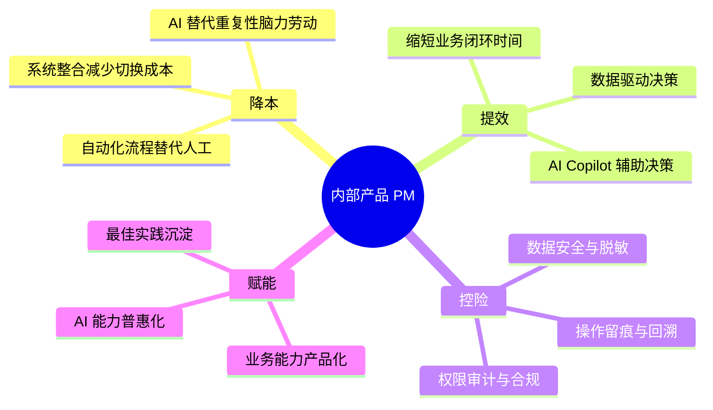
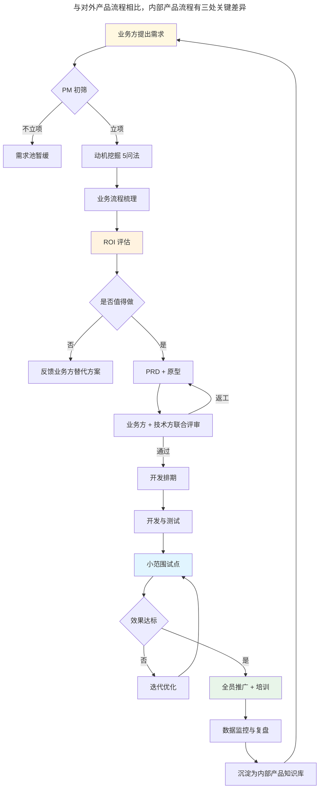
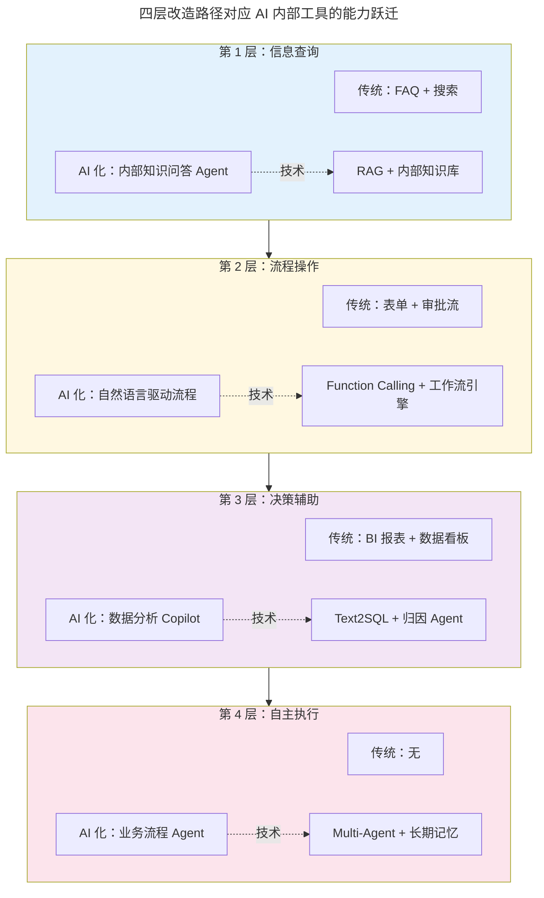

# 内部产品的产品经理

> **适用范围**：内部产品 PM（含 CRM / ERP / OA / 数据中台 / AI 内部工具 PM）、从中后台转向 AI 内部工具的 PM、需要评估内部产品 ROI 的技术管理者。
>
> **更新摘要（v2 · 2026-08 更新）**：
> 1. 原文仅约 600 字，本次完全重写，扩充 5 倍以上篇幅，补齐方法论、流程、工具、避坑、案例六大模块。
> 2. 新增 AI / 协同工具变化对内部产品 PM 的影响章节：覆盖飞书智能伙伴、企业微信 AI、钉钉 AI 助理对内部产品形态的重塑。
> 3. 新增 2024-2026 内部产品实践：ToB SaaS 化中台、AI 内部工具（内部知识问答 Agent、销售 Copilot、运营数据分析 Agent）的产品设计要点。
> 4. 新增 3 张 Mermaid 图：内部产品 PM 价值定位图、内部产品研发流程图、AI 内部工具能力分层图，每图必跟解读。
> 5. 术语首现处给出英文对照。

---

## 1. 导言

### 1.1 为什么内部产品 PM 值得做

大部分产品经理不太愿意做内部产品，普遍认知是「受气还没有出头之日」——对外不可见、对内被业务方压需求、技术资源永远紧张、产品成就感低。但这是一个被严重低估的赛道。

内部产品（Internal Product）指公司内部员工使用的产品，如 CRM（Customer Relationship Management，客户关系管理）、ERP（Enterprise Resource Planning，企业资源计划）、OA（Office Automation，办公自动化）、数据中台、AI 内部工具等。开发方式包括自研、采购（如 Salesforce、SAP）、基于开源框架二次开发。

做内部产品的三大隐性红利：

- **基本功扎实**：内部产品对交互和用研要求相对低，PM 可专注于业务逻辑、数据流、权限模型等「内功」；
- **心性磨炼**：用户就在隔壁工位，PM 必须学会在「需求方压力」与「产品长期价值」之间保持理性，这是对外产品 PM 难以获得的训练；
- **业务理解深度**：内部产品天然贴近业务一线，PM 可积累深厚的行业 know-how，为后续转岗业务产品、商业化产品或 ToB 创业打下基础。

### 1.2 AI 时代的新机遇

2024-2026 年，内部产品 PM 迎来了过去十年最大的机遇窗口。大模型让原本需要数月开发的功能（如自然语言查询数据库、自动生成报表、智能客服辅助）可在数周内交付，且使用门槛大幅降低。同时，飞书、钉钉、企业微信等协同平台深度集成 AI 能力，使得「内部产品 + AI」成为公司降本增效的关键抓手。

这一窗口期对内部产品 PM 的能力提出新要求：不仅要懂业务流程，还要懂 AI 能力边界、Agent 编排、数据治理。能抓住这一窗口的内部产品 PM，往往能在 2–3 年内完成从「功能经理」到「AI 产品负责人」的跃迁。

### 1.3 适用范围

- 公司规模 50 人以上、有内部系统建设需求；
- 内部产品形态：传统中后台（CRM/ERP/OA）、数据中台、AI 内部工具（知识问答 Agent、销售 Copilot、运营分析 Agent）；
- PM 角色定位：自研团队 PM、采购系统的二次开发 PM、AI 内部工具 0–1 负责人。

---

## 2. 核心方法论

### 2.1 内部产品的定义与边界

内部产品与对外产品的根本差异在于「付费方式」：对外产品由用户用钱包或注意力投票，内部产品由公司用预算与人力投票。这一差异决定了内部产品 PM 必须用 ROI（Return on Investment，投入产出比）语言而非 GMV / DAU 语言与利益相关方沟通。

边界条件：

- 内部产品的「用户」是员工，「客户」是业务负责人 / 高管，二者诉求可能冲突；
- 内部产品不直接产生收入，其价值通过「降本」「提效」「控险」间接体现；
- 内部产品生命周期受公司战略影响大，业务调整可能直接导致产品下线。

### 2.2 内部产品 PM 的价值定位

**解读**：传统认知把内部产品 PM 局限在「降本」象限（替代人工），这是价值被低估的根源。实际上，2024-2026 年 AI 内部工具的最大价值在「赋能」象限——把高级业务专家的判断能力沉淀为 AI Agent，让初级员工也能调用。例如销售 Copilot 让新销售也能像资深销售一样准备客户调研、生成提案；运营分析 Agent 让一线运营也能像数据分析师一样做归因分析。这一象限的内部产品往往能撬动 10 倍以上的杠杆效应，是 AI 时代内部产品 PM 的核心机会。

### 2.3 三条核心原则

1. **业务收益 = 技术成本 + 业务成本**：内部产品 PM 不能只算技术投入，要把业务方学习成本、流程切换成本、数据迁移成本一并计入。如果业务总成本为正，技术再先进也不该立项。
2. **统一战线**：把技术团队收益与业务团队收益绑定。技术团队做内部产品的收益是「技术能力沉淀 + 业务理解深度」，业务团队的收益是「降本提效」，PM 需把双方收益显性化并定期复盘。
3. **数据是攻击型武器**：内部产品有大量流程与业务数据，PM 应主动分析数据、提供数据洞察和数据产品，帮助业务部门决策，从被动接需求转为主动给方案。

### 2.4 与对外产品 PM 的能力差异

| 能力维度 | 对外产品 PM | 内部产品 PM |
| :--- | :--- | :--- |
| 用户研究 | 大量定性定量研究 | 用户就在隔壁，访谈成本低 |
| 商业模式 | 核心能力 | 弱相关（不直接收费） |
| ROI 论证 | 通过 GMV / LTV 衡量 | 通过降本人天 / 提效时长衡量 |
| 利益相关方 | 主要是用户 | 业务方 / 高管 / 技术方 / 合规方 |
| 发布节奏 | 灰度 → 全量 | 全员或分角色发布 |
| 失败成本 | 用户流失 | 业务停摆 |
| AI 时代新能力 | AI 产品边界设计 | AI Agent 编排 + 内部数据治理 |

---

## 3. 关键流程

### 3.1 内部产品研发流程

**解读**：与对外产品流程相比，内部产品流程有三处关键差异。第一，立项前必须做 ROI 评估并显式记录——这是内部产品最容易被业务方「拍脑袋」立项的环节，PM 必须用「节省人天 × 单人成本」或「缩短时长 × 业务收益」量化论证，否则后期价值无法证明。第二，评审必须是「业务方 + 技术方联合」，避免单边妥协；AI 内部工具还需追加「数据合规方」参与。第三，全员推广前必须有「小范围试点」——内部产品的失败往往不是因为功能不对，而是因为全员上线后业务停摆的风险无法承受，必须先在 1–2 个业务单元验证。

### 3.2 用户离得近：双刃剑

内部产品 PM 与用户距离近，是优势也是陷阱。

**优势**：用户就在公司内部，调研成本低、反馈快、可用性测试效率高，是练习用户研究的最佳试验场。

**陷阱**：业务方可能随时提出需求，PM 难以拒绝，易融入对方立场而失去理性；高频被打断导致 PM 沦为需求转译机器，无暇思考长期价值。

**应对方法**：

- **资源显性化**：将技术资源（人力、架构原理、排期）公开透明，让业务部门了解情况，避免不必要压力和对立；
- **项目流程化**：需求收集与确认周期化，如两周或一个月一次集中评审，合理管理预期；
- **需求分级**：按 ROI 与紧急度建立 P0 / P1 / P2 分级，P0 当周响应、P1 进迭代规划、P2 进需求池待评估。

### 3.3 容易成为功能经理

需求铺天盖地，PM 易消极应付，成为只关注功能逻辑的「功能经理」。

**应对方法**：

- **跳过方案，寻找背后的动机和诉求**：从用户提出的方案式需求中，通过追问「为什么」挖掘背后真正的动机。如业务方说「订单列表加个按修改时间排序」，背后动机可能是「订单审核不完怕过期」，再深挖可能发现大量审核可自动化。
- **统一战线，成本收益一致**：将技术成本并入业务成本，把业务收益和技术团队收益绑定，深入了解业务，从业务角度考虑投入产出比，变被动为主动。
- **发挥强项，用技术帮助业务**：内部产品有大量流程和业务数据，PM 应主动分析数据、提供数据洞察和数据产品，帮助业务部门决策，成为「攻击型选手」。

---

## 4. 工具与实战

### 4.1 内部产品的 AI 化改造路径

2024-2026 年，内部产品的最大变量是 AI 化。改造路径分四层：

**解读**：四层改造路径对应 AI 内部工具的能力跃迁。第 1 层信息查询是最易入手的 AI 化场景，RAG（Retrieval-Augmented Generation）+ 内部知识库即可让员工用自然语言查询制度文档、产品手册、历史决策，2–4 周可落地。第 2 层流程操作需要 Function Calling 与现有工作流引擎打通，复杂度上升一个量级。第 3 层决策辅助是 2025-2026 年最热赛道——Text2SQL 让业务方用自然语言查数据、归因 Agent 自动解释指标波动，是数据中台 PM 的核心机会。第 4 层自主执行是终极形态，Multi-Agent + 长期记忆让 Agent 可自主完成跨系统任务（如「跟进这个客户的全流程」），目前仍在早期探索。PM 需根据团队 AI 工程能力选择合适的切入层级，避免一上来就做第 4 层导致项目失败。

### 4.2 AI 内部工具的产品设计要点

1. **数据治理优先**：AI 内部工具的效果取决于内部数据质量。立项前必须评估数据完整性、准确性、权限分级。脏数据 + 大模型 = 高质量胡说八道。
2. **权限与合规**：内部数据涉及商业秘密，Agent 调用必须遵循最小权限原则，对话日志需留痕审计，敏感字段需脱敏后才能进入模型上下文。
3. **效果度量**：AI 内部工具的 ROI 度量要分两层——使用层（活跃率、调用次数、满意度）与业务层（节省人天、缩短时长、决策准确率提升）。只看使用层会陷入「热闹但不挣钱」陷阱。
4. **降级方案**：AI 输出有概率性，必须设计降级路径——Agent 不确定时转人工、模型不可用时回退到传统表单、关键决策必须人工确认。
5. **持续迭代机制**：建立用户反馈回流通道（点赞 / 举报 / 修改），把负面 case 转为评测集，持续优化 Prompt 与 RAG 召回。

### 4.3 协同平台 AI 能力的利用

2025-2026 年，主流协同平台都深度集成了 AI 能力，内部产品 PM 应优先利用平台能力而非自建：

- **飞书智能伙伴**：可在飞书文档、多维表格、IM 中调用 AI，支持自定义 Agent（如「销售复盘伙伴」「招聘助手」），适合中小团队快速落地；
- **钉钉 AI 助理**：与钉钉 OA、审批流深度集成，适合重流程型企业；
- **企业微信 + 微信云开发 AI**：适合 ToB 销售型组织，可直接对接客户微信数据；
- **Microsoft 365 Copilot**：适合外企与 Office 重度用户。

平台能力的优势是落地快、合规风险低；劣势是定制化受限、数据出域问题需评估。

### 4.4 内部产品 PM 的工具栈

| 工具类别 | 推荐工具 | 适用场景 |
| :--- | :--- | :--- |
| 需求池管理 | 飞书多维表格 / Notion Database | 需求收集、ROI 评分、优先级排期 |
| 业务流程梳理 | Mermaid / draw.io / 畅图 AI | 现状流程图、To-Be 流程图 |
| 原型设计 | MasterGo / 即时设计 / Axure RP | 中后台原型、复杂表单 |
| 数据分析 | 飞书多维表格 / SQL / Metabase | 内部数据洞察、ROI 量化 |
| AI 工具搭建 | Coze / Dify / 扣子 | 内部 Agent 快速搭建 |
| 模型观测 | LangSmith / LangFuse | AI 内部工具效果监控 |
| 文档协作 | 飞书文档 / 语雀 | PRD、SOP、知识库 |

### 4.5 ROI 评估实战

内部产品立项必须做 ROI 评估，推荐公式：

- **降本型**：节省人天 × 单人日成本 ÷ 项目总投入 = ROI 倍数（目标 ≥ 3）；
- **提效型**：缩短时长 × 时长对应的业务收益 ÷ 项目总投入 = ROI 倍数（目标 ≥ 2）；
- **控险型**：风险事件年发生概率 × 单次损失 ÷ 项目总投入 = ROI 倍数（目标 ≥ 5，因概率估计不确定）；
- **赋能型**：业务杠杆效应 ÷ 项目总投入 = ROI 倍数（赋能型难以精确量化，建议用定性 + 关键案例证明）。

实操建议：ROI 评估必须在立项时显式记录，上线后 3–6 个月复盘实际值，形成「评估—实测—校准」闭环。

---

## 5. 常见误区与避坑指南

### 5.1 把内部产品当低价值产品

**误区**：认为内部产品没有用户量、没有曝光、没有成就感，消极应付。

**避坑**：内部产品的价值不在于曝光，在于杠杆。一个优秀的销售 Copilot 可能让全公司销售人效提升 20%，这种杠杆效应是对外产品难以企及的。把「降本提效赋能控险」作为价值语言，而非用对外产品的「DAU / GMV」语言自我衡量。

### 5.2 把业务方当客户而无条件妥协

**误区**：业务方提出需求就接，PM 沦为需求转译机器，最终产品变成业务方的「外包工具」。

**避坑**：业务方是利益相关方，不是产品决策者。PM 必须基于 ROI 与产品长期价值做判断，敢于拒绝低价值需求并给出替代方案。建立分级需求池与周期化评审机制，避免被业务方随时打断。

### 5.3 忽视数据治理直接上 AI

**误区**：看到别家上 AI Agent 就跟风，不做数据治理直接灌入大模型，结果输出质量差、合规风险高。

**避坑**：AI 内部工具的效果 = 数据质量 × 模型能力 × Prompt 工程。三者中数据质量是基础，必须先做数据清洗、权限分级、敏感字段脱敏，再上 AI。建议立项前做「数据就绪度评估」，未达标的先治数据。

### 5.4 全员上线无试点

**误区**：追求快速见效，跳过试点直接全员推广，结果 bug 全员可见、业务停摆风险高。

**避坑**：内部产品的失败成本是「业务停摆」，必须先在 1–2 个业务单元试点，验证效果与稳定性后再推广。试点周期建议 2–4 周，覆盖完整业务闭环。

### 5.5 重功能轻培训

**误区**：功能上线就以为大功告成，不投入培训与运营，结果 adoption 极低、业务方抱怨「没人用」。

**避坑**：内部产品的「上线」只是开始，培训、SOP、关键用户培养、数据复盘才是推广期的重点。建议每个产品配备 1–2 名「关键用户」（业务线内部种子），由其带动团队 adoption。

### 5.6 用对外产品思维做内部产品

**误区**：套用对外产品的设计语言（强引导、强视觉、强情感化），结果员工觉得「花哨不实用」。

**避坑**：内部产品用户是「拿工资干活」的员工，不是「为体验买单」的用户。设计原则应是「效率优先、稳定优先、可学习性优先」，而非「体验优先、惊喜感优先」。

---

## 6. 进阶延展与参考资料

### 6.1 从内部产品 PM 到 AI 产品负责人的跃迁路径

1. **第 1 阶段（0–1 年）**：负责一个传统内部产品模块（如 CRM 客户列表、OA 审批流），打扎实业务流程梳理与 PRD 撰写基本功；
2. **第 2 阶段（1–2 年）**：负责一个完整内部产品线，建立 ROI 评估与数据驱动决策能力；
3. **第 3 阶段（2–3 年）**：主导一个 AI 内部工具 0–1（如内部知识问答 Agent、销售 Copilot），积累 AI 产品边界设计与 Agent 编排经验；
4. **第 4 阶段（3–5 年）**：负责公司级 AI 内部工具平台或中台，统筹多个 AI Agent 与数据治理体系，完成从 PM 到 AI 产品负责人的跃迁。

### 6.2 内部产品 PM 的能力模型演进

| 阶段 | 核心能力 | 衡量标准 |
| :--- | :--- | :--- |
| 功能经理 | 需求转译、PRD、流程图 | 按时交付 |
| 产品经理 | 动机挖掘、ROI 评估、数据洞察 | 业务方满意度、ROI 达成 |
| AI 产品经理 | AI 能力边界、Agent 编排、数据治理 | AI 工具 adoption、业务杠杆 |
| AI 产品负责人 | 平台化、多 Agent 编排、组织变革 | 公司级降本提效指标 |

### 6.3 推荐参考资料

- 本仓库《管理/01-产品/产品经理/01-产品经理专业修炼手册（v2）》；
- 本仓库《管理/01-产品/产品管理/01-产品方法论/38-在内部产品中找到产品经理的价值》；
- 本仓库《管理/01-产品/产品管理/01-产品方法论/12-如何当好AI时代的产品经理（学习篇）》与《16-如何当好AI时代的产品经理（实践篇）》；
- 飞书智能伙伴官方文档；
- Coze / Dify 官方教程（Agent 搭建实战）；
- LangSmith / LangFuse 官方文档（模型观测）。

### 6.4 内部产品 PM 的职业出口

- **纵向**：内部产品 PM → AI 产品经理 → AI 产品负责人 → CTO / CIO 路线；
- **横向**：内部产品 PM → ToB SaaS 产品经理（中台经验可复用）→ ToB 创业；
- **跨界**：内部产品 PM → 业务运营负责人（业务理解深度可复用）→ 业务一号位。

---

> **本手册版本**：v2 · 2026-08 更新
> **配套阅读**：《01-产品经理专业修炼手册（v2）》、《02-案例分析（v2）》
> **下一版预告**：v2.1 计划补充「AI 内部工具评测体系专章」，覆盖内部 Agent 的离线评测集、在线 A/B、人工抽检三层质量保障体系。