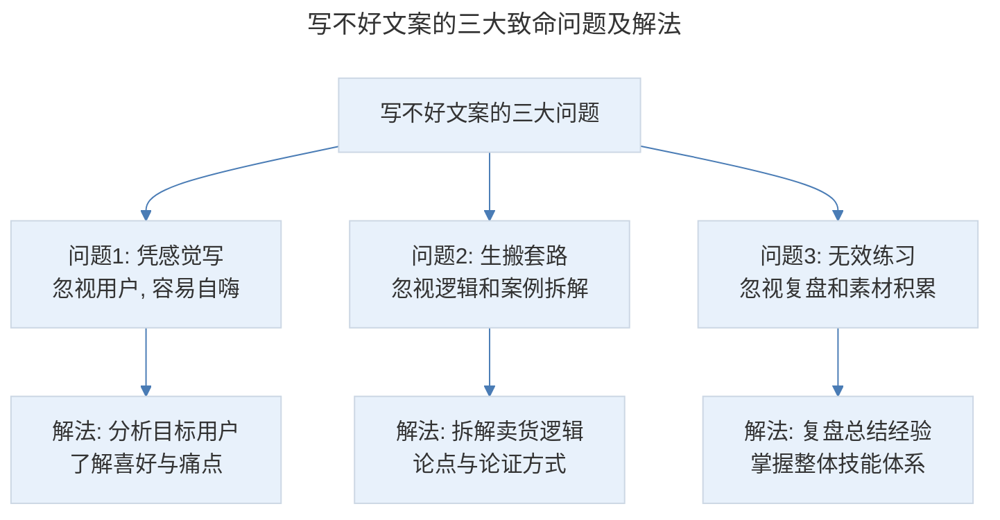
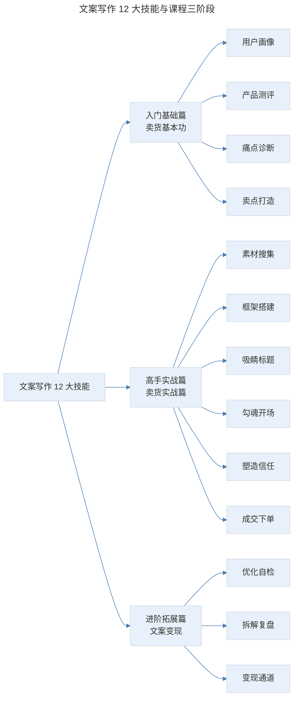

# 从小白到文案高手，手把手教你写出爆款文案

## 1. 导言

**如今的新媒体时代，文案已然成为纸上销售员。文案写作能力已经成了媒体人的基本能力，并且已经发展成为重要的销售模式。**

但是，在和大家交流以及学员的反馈中我发现，文案写作者无论在入行之初还是从业几年后，普遍存在这样那样的苦恼和困惑。试想一下，你是否也面临过这些情况：

- 上了很多文案写作课，套路学了一堆，上课一听就懂，自己一写就懵？不知从何处下笔？
- 几天时间好不容易写出的"满意"文案，老板却说你"不走心""没灵魂"，一句话就打回去重来？
- 别人写文案，你也写文案，为啥他的转化率就高出几倍、几十倍？你的转化订单却寥寥无几，粉丝不买账，成本都收不回来？
- 工作了好几年，文案写了不老少，为什么自身能力却感觉没有明显提升？

在我看来，很多人不会或者写不好文案，主要存在以下 **3 大致命问题**。

## 2. 核心概念：写不好文案的三大致命问题

**问题 1：凭感觉写文案，忽视用户，容易自嗨。**

很多人写文案，总是讲这个产品多好，罗列出 123456 很多个卖点，却忽略用户感受。

其实，写文案不仅要了解产品的核心卖点，还要会分析目标用户，了解他们的喜好和痛点，以及在购买过程中容易受哪些因素影响。只有真正了解目标用户的痛点和需求，才能写出走心的文案。

**问题 2：生搬文字套路，忽视逻辑和案例拆解。**

很多人写文案喜欢模仿照抄一些爆文句式放在自己的文章里，结果转化很惨！为什么？因为你的产品和用户不一样。

模仿不仅是生搬文字套路，而是你要拆解它的卖货逻辑。论点是什么？如何论证的？这样相当于你间接操盘了一遍，才能事半功倍。

**问题 3：每天无效练习，忽视复盘和素材积累。**

有的人误把重复劳动当努力。写文案非常用功，埋头苦练一两个月，却发现没啥进步。

重要的不是你写了多少篇，而是每次练习有没有复盘和总结经验、素材。**真正有效的文案训练方式**是什么呢？那就是：**要掌握和研究这个体系的整体技能。**

> 写不好文案的三大致命问题及解法：问题 1 凭感觉写（忽视用户容易自嗨）→ 分析目标用户了解喜好与痛点；问题 2 生搬套路（忽视逻辑和案例拆解）→ 拆解卖货逻辑与论证方式；问题 3 无效练习（忽视复盘和素材积累）→ 复盘总结经验、掌握整体技能体系。

## 3. 关键方法：文案写作的核心方法论

**你为什么要学习这门文案课？**

曾经有学员对我说："兔妈，以前我其实上过很多文案写作课，但没想到听了你的文案课，这次终于开悟了！"

欣慰之余，其实我并不感到奇怪。之所以我能教会那么多 0 基础的人写出高转化、高销量的文案，是因为我就是从零基础的新人一步步实战过来的，所有的经验都是我亲身实践过，并且可以被复制的。

我的起点并不高，学的也不是文案相关专业，毕业后转做文字编辑时月薪只有 800 块。当时我写一个 300 字的广告文案，改了 20 多次领导还是不满意。第一次写卖货的推文，还被客户骂了半小时，说没法用，害他们错过推广黄金期。

**但是，我这个人喜欢死磕，我拆解了市面上日化、护肤、食品、教育、服饰、养生、黑科技等各领域的爆文，通过产品、市场以及对消费者的洞察，总结出了自己的一套方法论。现在看来，很多学员用这套方法，也快速做出了自己的爆款文案。**

我曾经在半年内帮助多个平台的商家打造了 5 个爆款案例，涉及饮食、美妆、酒酿等多种产品类型。

2018 年 9 月，我帮客户写了一篇产品推文，刚开始发布在粉丝数很少的小号上，在只有 500 阅读数的情况下，卖了 91 单，阅读下单转化率达 18.2%。5 天后，客户花了 17 万广告费投了某大号的头条，还是用的这篇推文，结果在客单价 99 元的情况下，销售额达到了 130 多万。

我相信，我可以，你同样也可以。很多人说，现在市面上有很多文案写作课，但是学了这么多文案套路，拿到产品还是不知道如何下手，生搬硬套出来的文案转化率不稳定，这正是我写作这门课程的初衷，希望能切实帮你解决这些问题，提升文案能力。

在这门课程里面，我会教你**拆解文案写作逻辑**，找到论点是什么？如何论证？讲透原理和底层逻辑，相当于带你实践操作了一遍，让你在实战中真正掌握文案写作的方法。

我还把打造爆款文案细分成了 **12 个技能**，包括**用户画像、产品测评、痛点诊断、卖点打造、素材搜集、框架搭建、吸睛标题、勾魂开场、塑造信任、成交下单、优化自检、拆解复盘。**

我想说的是，要想写出一篇好文案，你需要有意识地培养习惯：首先，要清楚从哪一步开始；然后，根据这个流程，把它拆分成细小的项目，分项目针对性练习；最后，做整合训练。我就是通过这样的方法，短时间从小白逆袭成为一个文案高手。

## 4. 实践落地：课程设计与技能体系

**我是如何设计这个课程的？**

本课程共 18 节，内容由浅入深，有理论、有案例、有实战，具体分为：

- **入门基础篇：卖货基本功，** 手把手教你从 0 开始写出第 1 篇爆文。
- **高手实战篇：卖货实战篇，** 5 个步骤，0 基础小白也能写出 90 分卖货爆文。
- **进阶拓展篇：** 打通文案变现的 4 大通道，小白也能轻松赚到钱。

我们的课程内容涵盖公众号推文、朋友圈、海报、社群、接单、涨薪等多个场景，每节课都配有一张知识卡片总结和作业练习，可以帮助你更好地消化吸收课程内容。

我还给出了 108 个超实用转化知识点，让你告别传统"套路写作"，换个产品，还是不会写的魔咒。相关内容从产品测评、顾客分析，到素材搜集，框架搭建，再到成文、改稿、接单，环环相扣。

此外，152 个爆品转化实操案例解析以及 12 大文案写作技能，着重培养你打造爆款文案的底层逻辑能力，包括美妆、数码、服饰、美食、母婴、日化、课程等数十个领域，力求让你学完即可轻松驾驭各种品类。

总之，在专栏中，**我会把这些年的实战经验和打造爆款文案的方法通通教给你，让你学了就能用。**

我还想告诉你一个好消息，专栏课程是我全程出镜录制的视频课程，花费的物力、人力是普通音频课、录屏课的 4~5 倍，但为了给你提供更好的学习体验，我觉得一切都值得。

> 文案写作 12 大技能与课程三阶段：入门基础篇（用户画像、产品测评、痛点诊断、卖点打造）、高手实战篇（素材搜集、框架搭建、吸睛标题、勾魂开场、塑造信任、成交下单）、进阶拓展篇（优化自检、拆解复盘、变现通道）。

## 5. 实践指南：你将获得什么

首先，这套方法可以帮你提升文案技能：

- 如果你是文案新人，可以掌握卖货文案的整个操作流程，并给你 10 万+ 标题、勾魂开场、引导转化的爆文套路，帮你快速入门。
- 如果你是刚入门的新媒体写作者，可以带你完成从入门到高手的进阶，更快提升。
- 如果你是商家，让你知道普通文案和卖货千万文案的区别，找出转化率增长的关键点。

此外，这套方法也可以帮你实现副业变现：

- 会写文案，可以提升你的职场竞争力，实现升职加薪；
- 会写文案，可以轻松写出爆款，打造出个人影响力，早日实现时间和财务自由。

## 6. 进阶延展：学习寄语与核心要点回顾

### 6.1 学习寄语

其实，写文案这事儿，也没想象得那么难。有天赋的人确实发展快一些。但也有很多普通人，通过正确的方法，达到了很高的成就。

这些内容对你的技能要求不高，只要你渴望学习文案写作，选这门课一定没错。像我这样从零基础开始学习文案的小白都能写出高转化的爆款文案，相信优秀的你一定也可以！比我更幸运的是，你不需要从头摸索，只需按照这套市场验证有效的方法去操作就可以。

现在行动，永远都不晚。祝你早日成为真正意义上的"文案高手"。

### 6.2 核心要点回顾

新媒体时代，文案已成为"纸上销售员"。写不好文案的三大致命问题是：凭感觉写（忽视用户容易自嗨）、生搬套路（忽视逻辑和案例拆解）、无效练习（忽视复盘和素材积累）。有效的文案训练方式是掌握整体技能体系，包括 12 大技能：用户画像、产品测评、痛点诊断、卖点打造、素材搜集、框架搭建、吸睛标题、勾魂开场、塑造信任、成交下单、优化自检、拆解复盘。课程按入门基础篇、高手实战篇、进阶拓展篇三阶段设计，涵盖公众号推文、朋友圈、海报、社群、接单、涨薪等多个场景，帮助零基础新手通过实战方法快速写出高转化爆款文案。

---

## 参考资料

- 本案例内容来源于"极客时间"文案高手专栏开篇导言。