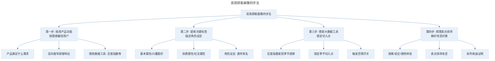

# 用户画像：如何对你的目标顾客群做精准分析？

## 1. 导言

本节知识点：1 个技巧，3 个步骤教你迅速摸透顾客狂卖货。

要想成功把产品卖给顾客，这其中有 2 个重要元素：一个是你的产品，另一个就是你的顾客。文案高手就像一个优秀的猎头，既要了解产品的优劣，更要了解顾客的喜恶，只有这样才能把产品卖给顾客。

## 2. 核心概念：什么是用户画像

**首先，大家需要了解，到底什么是用户画像？**

用户画像是根据目标顾客的社会属性、生活习惯和其他行为等信息，抽象出的一个标签化的用户模型。听起来比较抽象，我来给你讲小案例，你就明白了。

原来我给一个养生店做文案顾问，有 2 个实习生，每天给他们同样的任务，发 200 张引流传单。但一个人的传单到店率总比另一个人高 25% 左右。问他怎么做的？他说：只给 50 岁以上，穿戴整齐，最好戴着眼镜，走路也不匆忙的人发。这些人有养生需求，而且一般是退休职工，有钱、有时间。而另一个人则是逢人就发。有钱有时间的 50 岁以上退休职工，就是养生店的顾客画像。

**然后，我们要明白，为什么要做用户画像？**

写卖货文案的时候，用户画像能帮你摸透用户心理和需求，了解用户的痛点和渴望，以及影响他们购买决策的因素有哪些，这样你才能找准切入点，引发共鸣来卖货。

这里需要注意的是，用户画像应该是单个人，而不是一群人。你要揣摩购买者在想什么、在做什么，经常去哪些场合，他对什么词、什么仪式有着高度的敏感。只有是单个人，你才能够清晰地看到他、了解他。

举个例子，你的目标群体是新中产女性，你就可以描述：Lily 是一位 30 岁的白领，211 大学毕业，现在在一家新媒体公司做主编，月入 2 万，居住在北京四环。一手托娃，一手工作的职场宝妈。这说明了她的年龄、学历、职业、收入水平和生活状态。

她把"妈妈是孩子的榜样"作为座右铭。喜欢阅读，渴望有更大的提升。平时她会和闺蜜逛商场，也会参加一些成长社群，去国外旅游。这句表明了她经常出入的场所，以及兴趣和价值观。

她对新事物充满好奇，愿意尝试。但有自己的判断原则，比如，性价比，让自己体现更好生活水准的东西都会毫不犹豫。她不愿意随大流，却容易被身边优秀的人影响。这句说明了她的消费观念和购物决策因素。

通过角色设定，你能了解到这个人对哪个仪式和场景敏感，影响她购买决策的因素有哪些等，从而揣摩她对这些词、场景所产生的心理活动，这样更容易与她对话，你也会比针对一群人更有办法。如果你能把产品卖给她，也更容易卖给她代表的这个群体。

**做用户画像时，大部分人容易踩中这 2 个常见误区。**

- **误区一：笼统不具体**

举个例子，我们卖面膜，锁定的是想要变美的女性，如果要推一个"成为会员就可以 2 折买面膜"的活动，报名的用户很有可能寥寥无几。

是用户不想占便宜吗？是女性不想变美吗？肯定不是，问题出在哪里？就是"没有清晰的用户画像"。

比如，20 岁左右的小女生，她们渴望变白、去痘，对价格接受度偏中低端；30 岁白领，经常熬夜加班，想要去黑眼圈，预防皱纹；而宝妈生育后有了妊娠斑、暗哑松弛，更想祛斑、变紧致，因为有稳定的收入，对品牌也有更高的要求。

所以，不要臆测你的目标用户是"所有女性"这个大分类，要做精准分析，具体是什么年龄段、什么工作、消费能力在哪个范围内，等等。

- **误区二：不会分析数据**

调研数据非常详细，各个百分比也很精确，但数据找来后就放在那里。写文案时还是没有方向，不知道用户有哪些需求，get 不到用户的痛点和爽点。

## 3. 关键方法：如何高效做顾客画像

接下来，我们来讲本文的重点：如何高效做顾客画像，并巧妙用在你的推文中？我帮你总结了 4 个步骤，下面我会结合案例，给你详细讲解。

这是一款鼻炎喷雾，当时市面上鼻炎产品非常多，至少有二三十种，为何我能做到 3 个月卖破 10 万多单，销售额 1000 多万呢？其中，最重要的一点就是，我把这个群体的用户摸透了。具体我是怎么做的呢？

> 高效顾客画像四步法：搞清产品功能按图索骥找用户（产品满足什么需求、反向推导顾客特征、借助数据工具）→ 提炼关键标签描述角色设定（基本属性、兴趣爱好、消费属性、社交属性、角色设定直呼其名）→ 借助大数据工具锁定切入点（百度指数发现季节规律、锁定季节切入点、触发恐惧开关）→ 梳理卖点排序做好攻坚对策（效果/安全/使用体验、卖点排序攻坚、系列收益证明）。

**第一步：搞清产品功能，按图索骥找用户**

做用户画像的目的是卖货，所以，分析顾客也应该先从产品入手，考虑清楚产品满足客户什么需求，反向推导出顾客有哪些特征。

比如，鼻喷的特色功能是疏通鼻塞、缓解鼻炎。那我就可以反向推导出哪些人是鼻塞、鼻炎的高发人群，他们有什么样的特征。也许你会问了：兔妈，如果对这个群体不了解怎么办？答案是：借助数据工具。

这里常用的工具有：百度指数、微信指数、生意参谋、互联网数据资讯中心等。

以百度指数为例，你在百度搜索栏输入"百度指数"，就会出来百度指数的数据查询界面。然后输入你要查询的关键词"鼻炎""鼻塞"等，并点击菜单栏的"人物画像"，就会查到鼻炎这个群体的相关信息，包括性别比例，年龄分布、地域分布、兴趣分布等。

这样你就有了一个大概轮廓。然后，再根据数据最集中的信息，对应到身边某个鼻炎患者，比如老公、同事，这样你就看到了一个活生生的人。

**第二步：提炼关键标签，描述角色设定**

抽取顾客群的典型特征，提炼出关键标签，可以包括这么几大类：

- 基本属性：身高、性别、教育程度、体型、子女、文化、婚姻等。
- 兴趣爱好：运动爱好、旅游爱好、电影爱好等。
- 消费属性：差旅人群，境外游人群，3C 控，母婴用户，理财人群等。
- 社交属性：经常出现的社交场所、日常动态等。

产品不同，敏感标签也不同。例如，美容行业对身高并不敏感，理财行业对身高、体质都不敏感。所以，在顾客分析过程中要把握颗粒度，不能太小也不能太大。要具体问题具体分析，不需要面面俱到，只需提炼关键标签。

针对鼻炎顾客群我就提炼了：角色设定的名字、年龄、性别、职业、生活状态、消费观念、爱好以及经常出现的场合等几个维度的标签。

但这时候你会发现，面对这些冷冰冰的基础数据是没有任何感觉的，怎么办？就要通过"角色设定"的方法，赋予顾客具体的角色，为你的顾客设定角色，不再说"顾客"，而是直呼其名。让其鲜活、立体起来。

我描述的角色设定就是：林子是一位 31 岁的白领，现在在一家互联网公司做销售主管，月薪 12000 元，居住在广州四环，每天挤地铁上下班。她正处于打拼事业的关键期，对身体的小状况抱着"能忍就忍"的心态。

关于角色设定要注意的是，产品的顾客群体不同，可能会有 2-4 个角色原型，你只需把最有代表性的 2、3 个描述出来就可以了。

**第三步：借助大数据工具，锁定切入点**

鼻炎是很痛苦，但用户画像了解到，这个目标群普遍是"能拖就拖"的心态，如何让他们采取行动呢？这时就要借助大数据，找到切入点，刺激他立马行动。否则，鼻炎的痛苦没有被激活，永远只是潜在需求。

通过百度指数发现，每年的 2、3 月和 9、10 月份，鼻炎都有明显增长。为什么？2、3 月份入春，柳絮满天飞。9、10 月份入秋，降温降雨，而这 2 点都是诱发鼻炎的重要因素。而我接这个案子恰好是入秋。

所以，我就锁定"入秋"这个切入点，触发顾客群对鼻炎的恐惧开关，让潜在需求成为不得不解决的刚需。

其中，"同事林子""部门开会""上班挤地铁"等，就是通过角色设定找到的灵感。而且它是目标群的综合原型，也更容易引发共鸣。

**第四步：梳理卖点排序，做好攻坚对策，让他只买你的**

用户画像是为卖货服务的，但这里就有个问题：顾客有了共鸣就一定会买你的产品吗？不一定！他还有其他替代方案，比如鼻炎膏、生理盐水等。

根据顾客画像，我了解到目标人群主要关注 3 类问题：

- 效果：担心产品没效果。
- 安全：担心产品有激素。
- 使用体验：担心用起来麻烦、痛苦。

针对以上顾客分析，就可以制定出卖点排序的攻坚对策，通过系列收益证明，逐一解决他的担心，引导成交。

最后的卖点排序就是：功效佐证 > 权威背书 > 安全性 > 使用体验 > 产品原料 > 产品价格（性价比）。

## 4. 实践落地：鼻炎喷雾案例

在本案例中，用户画像的四个步骤完整落地：

| 步骤 | 执行内容 | 产出 |
|------|----------|------|
| 第一步：按图索骥 | 借助百度指数分析鼻炎人群 | 性别、年龄、地域、兴趣分布 |
| 第二步：角色设定 | 提炼关键标签，描述角色"林子" | 鲜活立体的目标用户原型 |
| 第三步：锁定切入点 | 百度指数发现 2/3 月、9/10 月鼻炎高发 | 锁定"入秋"切入点，触发恐惧 |
| 第四步：卖点排序 | 针对效果/安全/体验担忧攻坚 | 功效佐证>权威背书>安全性>使用体验>原料>价格 |

通过这四个步骤，最终实现了 3 个月卖破 10 万多单、销售额 1000 多万的成绩。

## 5. 实践指南：总结与知识卡片

好，以上就是我们本文的学习内容，现在来总结一下重点。

**知识点一：什么是用户画像？**

用户画像是根据目标顾客的社会属性、生活习惯和其他行为等信息，抽象出的一个标签化的用户模型。

**知识点二：为什么要做用户画像？**

写卖货文案的时候，用户画像帮你摸透用户心理和需求，痛点和渴望。让你的文案能找准切入点，引发共鸣来卖货。

**知识点三：做用户画像的 2 个常见误区**

- 笼统不具体。
- 停留在数据和工具层面。

**知识点四：高效做好顾客画像和应用的 4 个步骤**

- 搞清产品功能，按图索骥找用户。
- 提炼关键标签，描述角色设定。
- 借助大数据工具，锁定切入点。
- 梳理卖点排序，做好攻坚对策。

我把这节课的重点内容做成一张知识卡片，你可以保存下来方便复习。

最后，给大家留了一个练习作业，题目是：**请用顾客分析的方法，为一条售价 799 元的围巾，确定推文的切入点。**

## 6. 进阶延展：核心要点回顾

### 6.1 核心要点回顾

用户画像是根据目标顾客的社会属性、生活习惯和其他行为等信息抽象出的标签化用户模型，其核心目的是帮文案写作者摸透用户心理和需求，找准切入点引发共鸣来卖货。做用户画像需避免两大误区（笼统不具体、停留在数据和工具层面），并通过四步法高效落地：搞清产品功能按图索骥找用户（借助百度指数等数据工具）、提炼关键标签描述角色设定（直呼其名让用户鲜活立体）、借助大数据工具锁定切入点（如鼻炎案例锁定"入秋"触发恐惧开关）、梳理卖点排序做好攻坚对策（功效佐证>权威背书>安全性>使用体验>原料>价格）。

### 6.2 延伸思考

- 如何针对不同产品类型（快消品、耐用品、服务）选择不同的用户画像标签维度？
- 用户画像如何与后续的痛点诊断、卖点打造、标题写作等环节衔接？

---

## 参考资料

- 本案例内容来源于"极客时间"文案高手专栏第 01 节。